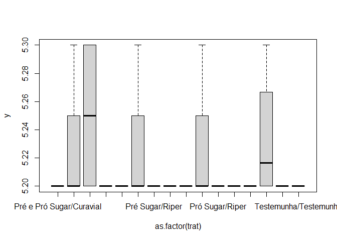
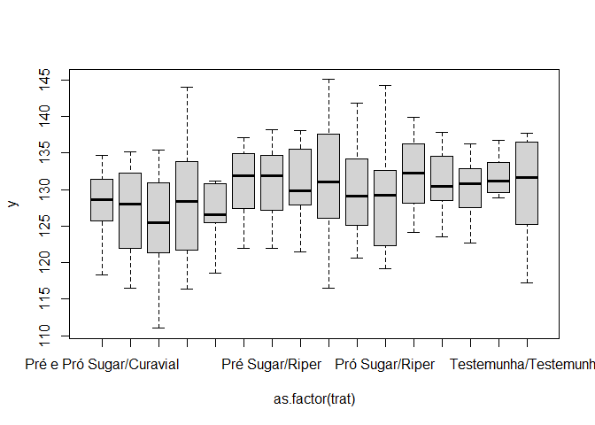
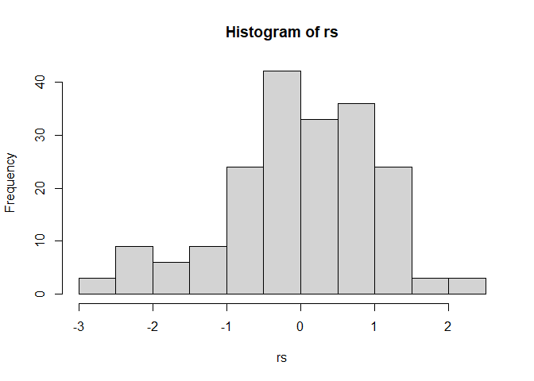
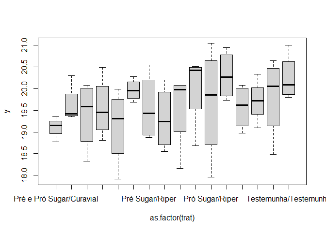
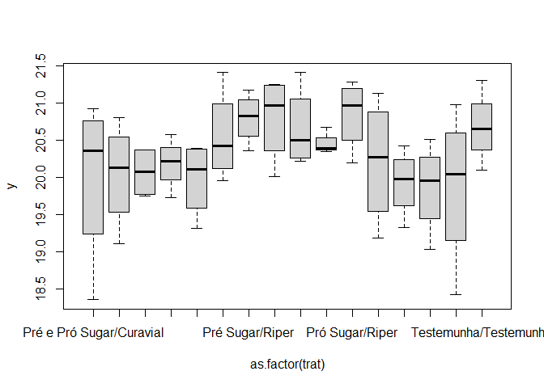
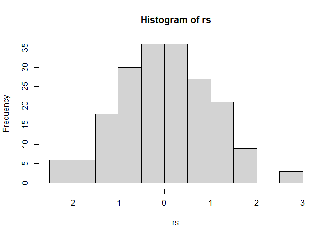
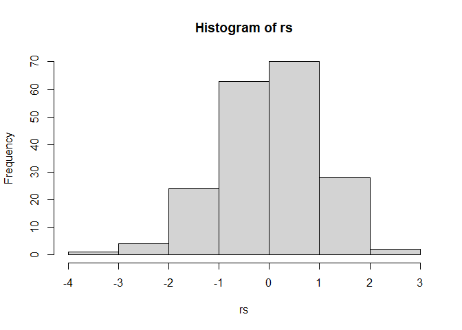

<!-- README.md is generated from README.Rmd. Please edit that file -->

# nilceu-maturador-nutri

## Carregando Pacotes

``` r
library(readxl)
library(ExpDes.pt)
library(tidyverse)
```

## Leitura do banco de dados

``` r
dados <- read_excel("data/Outlyers.xlsx") %>% 
  janitor::clean_names() %>% 
  drop_na()
dados %>%  glimpse()
#> Rows: 1,152
#> Columns: 27
#> $ unidade          <chr> "SLO", "SLO", "SLO", "SLO", "SLO", "SLO", "SLO", "SLO~
#> $ data             <dttm> 2021-03-16, 2021-03-16, 2021-03-16, 2021-03-16, 2021~
#> $ ano              <dbl> 2021, 2021, 2021, 2021, 2021, 2021, 2021, 2021, 2021,~
#> $ mes              <dbl> 3, 3, 3, 3, 3, 3, 3, 3, 3, 3, 3, 3, 3, 3, 3, 3, 3, 3,~
#> $ dia              <dbl> 16, 16, 16, 16, 16, 16, 16, 16, 16, 16, 16, 16, 16, 1~
#> $ momento          <dbl> -31, -31, -31, -31, -31, -31, -31, -31, -31, -31, -31~
#> $ bloco_7          <chr> "A", "A", "A", "A", "A", "A", "A", "A", "A", "A", "A"~
#> $ number           <dbl> 2, 2, 2, 1, 1, 1, 4, 4, 4, 3, 3, 3, 2, 2, 2, 1, 1, 1,~
#> $ repeticao        <dbl> 1, 2, 3, 1, 2, 3, 1, 2, 3, 1, 2, 3, 1, 2, 3, 1, 2, 3,~
#> $ number_bloco_r   <chr> "A21", "A22", "A23", "A11", "A12", "A13", "A41", "A42~
#> $ bloco_11         <chr> "I", "I", "I", "I", "I", "I", "I", "I", "I", "I", "I"~
#> $ nutricao         <chr> "Pró Sugar", "Pró Sugar", "Pró Sugar", "Pró Sugar", "~
#> $ maturador        <chr> "Curavial", "Curavial", "Curavial", "Moddus", "Moddus~
#> $ tratamento_final <chr> "Pró Sugar/Curavial", "Pró Sugar/Curavial", "Pró Suga~
#> $ peso_10_colmos   <dbl> 24.57, 24.57, 24.57, 19.66, 19.66, 19.66, 19.62, 19.6~
#> $ peso_cana        <dbl> 2.457, 2.457, 2.457, 1.966, 1.966, 1.966, 1.962, 1.96~
#> $ ph               <dbl> 5.2, 5.2, 5.2, 5.3, 5.3, 5.3, 5.2, 5.2, 5.2, 5.2, 5.2~
#> $ brix             <dbl> 14.60, 14.60, 14.60, 16.52, 16.52, 16.52, 15.82, 15.8~
#> $ pol              <dbl> 10.78, 10.78, 10.78, 13.15, 13.15, 13.15, 12.17, 12.1~
#> $ pureza           <dbl> 73.84, 73.84, 73.84, 79.60, 79.60, 79.60, 76.93, 76.9~
#> $ ar               <dbl> 1.11, 1.11, 1.11, 0.91, 0.91, 0.91, 1.00, 1.00, 1.00,~
#> $ pc               <dbl> 9.2033, 9.2033, 9.2033, 11.1106, 11.1106, 11.1106, 10~
#> $ ar_atr           <dbl> 0.95, 0.95, 0.95, 0.77, 0.77, 0.77, 0.84, 0.84, 0.84,~
#> $ fibra            <dbl> 11.53, 11.53, 11.53, 12.13, 12.13, 12.13, 12.35, 12.3~
#> $ agio             <dbl> -17.91, -17.91, -17.91, -3.81, -3.81, -3.81, -10.31, ~
#> $ atr              <dbl> 97.34, 97.34, 97.34, 114.06, 114.06, 114.06, 106.35, ~
#> $ tch              <dbl> 180.1890, 180.1890, 180.1890, 144.1805, 144.1805, 144~
```

## Gráficos temporais

### Boxplots

``` r
for(i in 15:length(dados)){
  variavel <- names(dados[i])
  df <- dados %>% select(data, nutricao, maturador, variavel)
  names(df) <- c("data", "nutricao", "maturador", "y")
  pt <- df %>% 
    ggplot(aes(x=as.factor(data),y=y,fill=maturador)) +
    geom_boxplot()+
    facet_wrap(~nutricao)+
    theme_classic() +
    labs(x="Data", y=variavel, fill="Maturador") +
    theme(axis.text.x = element_text(angle = 90, vjust = 0.5, hjust=1),
          legend.position = "bottom")
  print(pt)
}
```

<!-- --><!-- --><!-- --><!-- --><!-- --><!-- --><!-- --><!-- --><!-- --><!-- --><!-- --><!-- --><!-- -->
\### Gráficos de linhas

``` r
for(i in 15:length(dados)){
  variavel <- names(dados[i])
  df <- dados %>% select(data, nutricao, maturador, variavel)
  names(df) <- c("data", "nutricao", "maturador", "y")
  pt <- df %>%
    group_by(data, nutricao, maturador) %>% 
    summarise(
      y= mean(y,na.rm=TRUE)
    ) %>% 
    ggplot(aes(x=data,y=y,color=maturador)) +
    geom_line()+
    facet_wrap(~nutricao)+geom_point() +
    theme_classic() +
    labs(x="Data", y=variavel, fill="Maturador") +
    theme(axis.text.x = element_text(angle = 90, vjust = 0.5, hjust=1),
          legend.position = "bottom")
  print(pt)
}
```

<!-- --><!-- --><!-- --><!-- --><!-- --><!-- --><!-- --><!-- --><!-- --><!-- --><!-- --><!-- --><!-- -->
\### Análise de variância

``` r
datas <- dados %>% pull(data) %>% unique()
for(j in seq_along(datas)){
  for(i in  15:length(dados)){
    variavel <- names(dados[i])
    print("************ Análise de Variância ***************")
    print(paste0( datas[j],"; ",variavel))
    print("*************************************************")
    
    df <- dados %>% 
      select(data, nutricao, maturador, tratamento_final, bloco_11, variavel) %>% 
      filter(data == datas[j])
    names(df) <- c("data", "nutricao", "maturador", "trat","bloco", "y")
    # print("--------Análise de resíduos---------")
    trat <- df %>%  pull(trat)
    y <- df %>%  pull(y)
    mod <- aov(y~as.factor(trat))
    rs<-rstudent(mod)
    hist(rs)
    print(shapiro.test(rs))
    
    plot(y ~ as.factor(trat))
    print(lawstat::levene.test(y,trat))
    
    print("---------Teste F da ANOVA - DBC -----------")
    bloco <- df %>% pull(bloco)
    nutri <- df %>% pull(nutricao)
    matu <- df %>% pull(maturador)
    psub2.dbc(nutri,matu,bloco,y,
              fac.names = c("Nutri","Maturador"))
  }
}
#> [1] "************ Análise de Variância ***************"
#> [1] "2021-03-16; peso_10_colmos"
#> [1] "*************************************************"
```

<!-- -->

    #> 
    #>  Shapiro-Wilk normality test
    #> 
    #> data:  rs
    #> W = 0.98208, p-value = 0.01477

<!-- -->

    #> 
    #>  Modified robust Brown-Forsythe Levene-type test based on the absolute
    #>  deviations from the median
    #> 
    #> data:  y
    #> Test Statistic = 3.3082, p-value = 6.907e-05
    #> 
    #> [1] "---------Teste F da ANOVA - DBC -----------"
    #> ------------------------------------------------------------------------
    #> Legenda:
    #> FATOR 1 (parcela):  Nutri 
    #> FATOR 2 (subparcela):  Maturador 
    #> ------------------------------------------------------------------------
    #> 
    #> ------------------------------------------------------------------------
    #> Quadro da analise de variancia
    #> ------------------------------------------------------------------------
    #>                  GL     SQ      QM     Fc  Pr(>Fc)    
    #> Nutri             3  53.40 17.8009 3.0858 0.082694 .  
    #> Bloco             3   2.82  0.9395 0.1629 0.918685    
    #> Erro a            9  51.92  5.7687                    
    #> Maturador         3  58.67 19.5566 5.4707 0.001313 ** 
    #> Nutri*Maturador   9 171.65 19.0724 5.3353    2e-06 ***
    #> Erro b          164 586.27  3.5748                    
    #> Total           191 924.73                            
    #> ---
    #> Signif. codes:  0 '***' 0.001 '**' 0.01 '*' 0.05 '.' 0.1 ' ' 1
    #> ------------------------------------------------------------------------
    #> CV 1 = 11.83806 %
    #> CV 2 = 9.318927 %
    #> 
    #> 
    #> 
    #> Interacao significativa: desdobrando a interacao
    #> ------------------------------------------------------------------------
    #> 
    #> Desdobrando  Nutri  dentro de cada nivel de  Maturador 
    #> ------------------------------------------------------------------------
    #>                                     GL        SQ        QM        Fc  valor.p
    #> Nutri : Maturador Curavial     3.00000  26.69547  8.898492   2.15811 0.101989
    #> Nutri : Maturador Moddus       3.00000 149.06136 49.687119 12.050385    3e-06
    #> Nutri : Maturador Riper        3.00000  35.42766 11.809219  2.864035 0.043808
    #> Nutri : Maturador Testemunha   3.00000  13.87035  4.623450  1.121304 0.347393
    #> Erro combinado                61.83916 254.98018  4.123280                   
    #> ------------------------------------------------------------------------
    #> 
    #> 
    #>  Nutri dentro de Maturador Curavial
    #> ------------------------------------------------------------------------
    #> De acordo com o teste F, as medias desse fator sao estatisticamente iguais.
    #> ------------------------------------------------------------------------
    #>            Niveis   Medias
    #> 1 Pré e Pró Sugar 21.12750
    #> 2       Pré Sugar 20.22750
    #> 3       Pró Sugar 21.32000
    #> 4      Testemunha 19.45667
    #> ------------------------------------------------------------------------
    #> 
    #>  Nutri dentro de Maturador Moddus
    #> ------------------------------------------------------------------------
    #> Teste de Tukey
    #> ------------------------------------------------------------------------
    #> Grupos Tratamentos Medias
    #> a     Pró Sugar   22.255 
    #> a     Pré e Pró Sugar     21.7625 
    #> a     Pré Sugar   20.805 
    #>  b    Testemunha      17.72 
    #> ------------------------------------------------------------------------
    #> 
    #>  Nutri dentro de Maturador Riper
    #> ------------------------------------------------------------------------
    #> Teste de Tukey
    #> ------------------------------------------------------------------------
    #> Grupos Tratamentos Medias
    #> a     Testemunha      20.72667 
    #> a     Pré e Pró Sugar     19.3625 
    #> a     Pré Sugar   18.6825 
    #> a     Pró Sugar   18.5675 
    #> ------------------------------------------------------------------------
    #> 
    #>  Nutri dentro de Maturador Testemunha
    #> ------------------------------------------------------------------------
    #> De acordo com o teste F, as medias desse fator sao estatisticamente iguais.
    #> ------------------------------------------------------------------------
    #>            Niveis  Medias
    #> 1 Pré e Pró Sugar 20.1975
    #> 2       Pré Sugar 20.7675
    #> 3       Pró Sugar 21.4850
    #> 4      Testemunha 20.1600
    #> ------------------------------------------------------------------------
    #> 
    #> 
    #> Desdobrando  Maturador  dentro de cada nivel de  Nutri 
    #> ------------------------------------------------------------------------
    #>                                     GL        SQ        QM       Fc  valor.p
    #> Maturador : Nutri Pré e Pró Sugar    3  39.86940 13.289800 3.717638 0.012724
    #> Maturador : Nutri Pré Sugar          3  35.59731 11.865769 3.319285  0.02133
    #> Maturador : Nutri Pró Sugar          3  93.54021 31.180069 8.722193  2.1e-05
    #> Maturador : Nutri Testemunha         3  61.31503 20.438344 5.717344 0.000956
    #> Erro b                             164 586.26664  3.574797                  
    #> ------------------------------------------------------------------------
    #> 
    #> 
    #>  Maturador dentro de Nutri Pré e Pró Sugar
    #> ------------------------------------------------------------------------
    #> Teste de Tukey
    #> ------------------------------------------------------------------------
    #> Grupos Tratamentos Medias
    #> a     Moddus      21.7625 
    #> ab    Curavial    21.1275 
    #> ab    Testemunha      20.1975 
    #>  b    Riper   19.3625 
    #> ------------------------------------------------------------------------
    #> ------------------------------------------------------------------------
    #> 
    #> 
    #>  Maturador dentro de Nutri Pré Sugar
    #> ------------------------------------------------------------------------
    #> Teste de Tukey
    #> ------------------------------------------------------------------------
    #> Grupos Tratamentos Medias
    #> a     Moddus      20.805 
    #> a     Testemunha      20.7675 
    #> ab    Curavial    20.2275 
    #>  b    Riper   18.6825 
    #> ------------------------------------------------------------------------
    #> ------------------------------------------------------------------------
    #> 
    #> 
    #>  Maturador dentro de Nutri Pró Sugar
    #> ------------------------------------------------------------------------
    #> Teste de Tukey
    #> ------------------------------------------------------------------------
    #> Grupos Tratamentos Medias
    #> a     Moddus      22.255 
    #> a     Testemunha      21.485 
    #> a     Curavial    21.32 
    #>  b    Riper   18.5675 
    #> ------------------------------------------------------------------------
    #> ------------------------------------------------------------------------
    #> 
    #> 
    #>  Maturador dentro de Nutri Testemunha
    #> ------------------------------------------------------------------------
    #> Teste de Tukey
    #> ------------------------------------------------------------------------
    #> Grupos Tratamentos Medias
    #> a     Riper   20.72667 
    #> a     Testemunha      20.16 
    #> ab    Curavial    19.45667 
    #>  b    Moddus      17.72 
    #> ------------------------------------------------------------------------
    #> ------------------------------------------------------------------------
    #> 
    #> [1] "************ Análise de Variância ***************"
    #> [1] "2021-03-16; peso_cana"
    #> [1] "*************************************************"

<!-- -->

    #> 
    #>  Shapiro-Wilk normality test
    #> 
    #> data:  rs
    #> W = 0.98208, p-value = 0.01477

<!-- -->

    #> 
    #>  Modified robust Brown-Forsythe Levene-type test based on the absolute
    #>  deviations from the median
    #> 
    #> data:  y
    #> Test Statistic = 3.3082, p-value = 6.907e-05
    #> 
    #> [1] "---------Teste F da ANOVA - DBC -----------"
    #> ------------------------------------------------------------------------
    #> Legenda:
    #> FATOR 1 (parcela):  Nutri 
    #> FATOR 2 (subparcela):  Maturador 
    #> ------------------------------------------------------------------------
    #> 
    #> ------------------------------------------------------------------------
    #> Quadro da analise de variancia
    #> ------------------------------------------------------------------------
    #>                  GL     SQ       QM     Fc  Pr(>Fc)    
    #> Nutri             3 0.5340 0.178009 3.0858 0.082694 .  
    #> Bloco             3 0.0282 0.009395 0.1629 0.918685    
    #> Erro a            9 0.5192 0.057687                    
    #> Maturador         3 0.5867 0.195566 5.4707 0.001313 ** 
    #> Nutri*Maturador   9 1.7165 0.190724 5.3353    2e-06 ***
    #> Erro b          164 5.8627 0.035748                    
    #> Total           191 9.2473                             
    #> ---
    #> Signif. codes:  0 '***' 0.001 '**' 0.01 '*' 0.05 '.' 0.1 ' ' 1
    #> ------------------------------------------------------------------------
    #> CV 1 = 11.83806 %
    #> CV 2 = 9.318927 %
    #> 
    #> 
    #> 
    #> Interacao significativa: desdobrando a interacao
    #> ------------------------------------------------------------------------
    #> 
    #> Desdobrando  Nutri  dentro de cada nivel de  Maturador 
    #> ------------------------------------------------------------------------
    #>                                     GL       SQ       QM        Fc  valor.p
    #> Nutri : Maturador Curavial     3.00000 0.266955 0.088985  2.158113 0.101989
    #> Nutri : Maturador Moddus       3.00000 1.490614 0.496871 12.050401    3e-06
    #> Nutri : Maturador Riper        3.00000 0.354277 0.118092  2.864039 0.043807
    #> Nutri : Maturador Testemunha   3.00000 0.138704 0.046235  1.121305 0.347392
    #> Erro combinado                61.83954 2.549830 0.041233                   
    #> ------------------------------------------------------------------------
    #> 
    #> 
    #>  Nutri dentro de Maturador Curavial
    #> ------------------------------------------------------------------------
    #> De acordo com o teste F, as medias desse fator sao estatisticamente iguais.
    #> ------------------------------------------------------------------------
    #>            Niveis   Medias
    #> 1 Pré e Pró Sugar 2.112750
    #> 2       Pré Sugar 2.022750
    #> 3       Pró Sugar 2.132000
    #> 4      Testemunha 1.945667
    #> ------------------------------------------------------------------------
    #> 
    #>  Nutri dentro de Maturador Moddus
    #> ------------------------------------------------------------------------
    #> Teste de Tukey
    #> ------------------------------------------------------------------------
    #> Grupos Tratamentos Medias
    #> a     Pró Sugar   2.2255 
    #> a     Pré e Pró Sugar     2.17625 
    #> a     Pré Sugar   2.0805 
    #>  b    Testemunha      1.772 
    #> ------------------------------------------------------------------------
    #> 
    #>  Nutri dentro de Maturador Riper
    #> ------------------------------------------------------------------------
    #> Teste de Tukey
    #> ------------------------------------------------------------------------
    #> Grupos Tratamentos Medias
    #> a     Testemunha      2.072667 
    #> a     Pré e Pró Sugar     1.93625 
    #> a     Pré Sugar   1.86825 
    #> a     Pró Sugar   1.85675 
    #> ------------------------------------------------------------------------
    #> 
    #>  Nutri dentro de Maturador Testemunha
    #> ------------------------------------------------------------------------
    #> De acordo com o teste F, as medias desse fator sao estatisticamente iguais.
    #> ------------------------------------------------------------------------
    #>            Niveis  Medias
    #> 1 Pré e Pró Sugar 2.01975
    #> 2       Pré Sugar 2.07675
    #> 3       Pró Sugar 2.14850
    #> 4      Testemunha 2.01600
    #> ------------------------------------------------------------------------
    #> 
    #> 
    #> Desdobrando  Maturador  dentro de cada nivel de  Nutri 
    #> ------------------------------------------------------------------------
    #>                                     GL       SQ       QM       Fc  valor.p
    #> Maturador : Nutri Pré e Pró Sugar    3 0.398694 0.132898 3.717635 0.012724
    #> Maturador : Nutri Pré Sugar          3 0.355973 0.118658 3.319282  0.02133
    #> Maturador : Nutri Pró Sugar          3 0.935402 0.311801 8.722186  2.1e-05
    #> Maturador : Nutri Testemunha         3 0.613150 0.204383 5.717339 0.000956
    #> Erro b                             164 5.862666 0.035748                  
    #> ------------------------------------------------------------------------
    #> 
    #> 
    #>  Maturador dentro de Nutri Pré e Pró Sugar
    #> ------------------------------------------------------------------------
    #> Teste de Tukey
    #> ------------------------------------------------------------------------
    #> Grupos Tratamentos Medias
    #> a     Moddus      2.17625 
    #> ab    Curavial    2.11275 
    #> ab    Testemunha      2.01975 
    #>  b    Riper   1.93625 
    #> ------------------------------------------------------------------------
    #> ------------------------------------------------------------------------
    #> 
    #> 
    #>  Maturador dentro de Nutri Pré Sugar
    #> ------------------------------------------------------------------------
    #> Teste de Tukey
    #> ------------------------------------------------------------------------
    #> Grupos Tratamentos Medias
    #> a     Moddus      2.0805 
    #> a     Testemunha      2.07675 
    #> ab    Curavial    2.02275 
    #>  b    Riper   1.86825 
    #> ------------------------------------------------------------------------
    #> ------------------------------------------------------------------------
    #> 
    #> 
    #>  Maturador dentro de Nutri Pró Sugar
    #> ------------------------------------------------------------------------
    #> Teste de Tukey
    #> ------------------------------------------------------------------------
    #> Grupos Tratamentos Medias
    #> a     Moddus      2.2255 
    #> a     Testemunha      2.1485 
    #> a     Curavial    2.132 
    #>  b    Riper   1.85675 
    #> ------------------------------------------------------------------------
    #> ------------------------------------------------------------------------
    #> 
    #> 
    #>  Maturador dentro de Nutri Testemunha
    #> ------------------------------------------------------------------------
    #> Teste de Tukey
    #> ------------------------------------------------------------------------
    #> Grupos Tratamentos Medias
    #> a     Riper   2.072667 
    #> a     Testemunha      2.016 
    #> ab    Curavial    1.945667 
    #>  b    Moddus      1.772 
    #> ------------------------------------------------------------------------
    #> ------------------------------------------------------------------------
    #> 
    #> [1] "************ Análise de Variância ***************"
    #> [1] "2021-03-16; ph"
    #> [1] "*************************************************"

<!-- -->

    #> 
    #>  Shapiro-Wilk normality test
    #> 
    #> data:  rs
    #> W = 0.68366, p-value < 2.2e-16

<!-- -->

    #> 
    #>  Modified robust Brown-Forsythe Levene-type test based on the absolute
    #>  deviations from the median
    #> 
    #> data:  y
    #> Test Statistic = 7.1204, p-value = 4.612e-12
    #> 
    #> [1] "---------Teste F da ANOVA - DBC -----------"
    #> ------------------------------------------------------------------------
    #> Legenda:
    #> FATOR 1 (parcela):  Nutri 
    #> FATOR 2 (subparcela):  Maturador 
    #> ------------------------------------------------------------------------
    #> 
    #> ------------------------------------------------------------------------
    #> Quadro da analise de variancia
    #> ------------------------------------------------------------------------
    #>                  GL       SQ       QM      Fc   Pr(>Fc)    
    #> Nutri             3 0.005156 0.001719  0.7122  0.568855    
    #> Bloco             3 0.015156 0.005052  2.0935  0.171377    
    #> Erro a            9 0.021719 0.002413                      
    #> Maturador         3 0.023906 0.007969 16.2093 < 2.2e-16 ***
    #> Nutri*Maturador   9 0.017969 0.001997  4.0612  0.000101 ***
    #> Erro b          164 0.080625 0.000492                      
    #> Total           191 0.164531                               
    #> ---
    #> Signif. codes:  0 '***' 0.001 '**' 0.01 '*' 0.05 '.' 0.1 ' ' 1
    #> ------------------------------------------------------------------------
    #> CV 1 = 0.9429032 %
    #> CV 2 = 0.4255826 %
    #> 
    #> 
    #> 
    #> Interacao significativa: desdobrando a interacao
    #> ------------------------------------------------------------------------
    #> 
    #> Desdobrando  Nutri  dentro de cada nivel de  Maturador 
    #> ------------------------------------------------------------------------
    #>                                     GL         SQ       QM       Fc  valor.p
    #> Nutri : Maturador Curavial     3.00000 0.00000000 0.000000        0        1
    #> Nutri : Maturador Moddus       3.00000 0.00062500 0.000208  0.21428 0.885467
    #> Nutri : Maturador Riper        3.00000 0.02250000 0.007500 7.714065 0.000976
    #> Nutri : Maturador Testemunha   3.00000 0.00000000 0.000000        0        1
    #> Erro combinado                22.90744 0.02226603 0.000972                  
    #> ------------------------------------------------------------------------
    #> 
    #> 
    #>  Nutri dentro de Maturador Curavial
    #> ------------------------------------------------------------------------
    #> De acordo com o teste F, as medias desse fator sao estatisticamente iguais.
    #> ------------------------------------------------------------------------
    #>            Niveis Medias
    #> 1 Pré e Pró Sugar    5.2
    #> 2       Pré Sugar    5.2
    #> 3       Pró Sugar    5.2
    #> 4      Testemunha    5.2
    #> ------------------------------------------------------------------------
    #> 
    #>  Nutri dentro de Maturador Moddus
    #> ------------------------------------------------------------------------
    #> De acordo com o teste F, as medias desse fator sao estatisticamente iguais.
    #> ------------------------------------------------------------------------
    #>            Niveis   Medias
    #> 1 Pré e Pró Sugar 5.225000
    #> 2       Pré Sugar 5.225000
    #> 3       Pró Sugar 5.225000
    #> 4      Testemunha 5.233333
    #> ------------------------------------------------------------------------
    #> 
    #>  Nutri dentro de Maturador Riper
    #> ------------------------------------------------------------------------
    #> Teste de Tukey
    #> ------------------------------------------------------------------------
    #> Grupos Tratamentos Medias
    #> a     Pré e Pró Sugar     5.25 
    #>  b    Pré Sugar   5.2 
    #>  b    Pró Sugar   5.2 
    #>  b    Testemunha      5.2 
    #> ------------------------------------------------------------------------
    #> 
    #>  Nutri dentro de Maturador Testemunha
    #> ------------------------------------------------------------------------
    #> De acordo com o teste F, as medias desse fator sao estatisticamente iguais.
    #> ------------------------------------------------------------------------
    #>            Niveis Medias
    #> 1 Pré e Pró Sugar    5.2
    #> 2       Pré Sugar    5.2
    #> 3       Pró Sugar    5.2
    #> 4      Testemunha    5.2
    #> ------------------------------------------------------------------------
    #> 
    #> 
    #> Desdobrando  Maturador  dentro de cada nivel de  Nutri 
    #> ------------------------------------------------------------------------
    #>                                     GL       SQ       QM        Fc  valor.p
    #> Maturador : Nutri Pré e Pró Sugar    3 0.020625 0.006875 13.973577        0
    #> Maturador : Nutri Pré Sugar          3 0.005625 0.001875  3.810976 0.011273
    #> Maturador : Nutri Pró Sugar          3 0.005625 0.001875  3.810976 0.011273
    #> Maturador : Nutri Testemunha         3 0.010000 0.003333  6.775068 0.000246
    #> Erro b                             164 0.080625 0.000492                   
    #> ------------------------------------------------------------------------
    #> 
    #> 
    #>  Maturador dentro de Nutri Pré e Pró Sugar
    #> ------------------------------------------------------------------------
    #> Teste de Tukey
    #> ------------------------------------------------------------------------
    #> Grupos Tratamentos Medias
    #> a     Riper   5.25 
    #>  b    Moddus      5.225 
    #>   c   Curavial    5.2 
    #>   c   Testemunha      5.2 
    #> ------------------------------------------------------------------------
    #> ------------------------------------------------------------------------
    #> 
    #> 
    #>  Maturador dentro de Nutri Pré Sugar
    #> ------------------------------------------------------------------------
    #> Teste de Tukey
    #> ------------------------------------------------------------------------
    #> Grupos Tratamentos Medias
    #> a     Moddus      5.225 
    #>  b    Curavial    5.2 
    #>  b    Riper   5.2 
    #>  b    Testemunha      5.2 
    #> ------------------------------------------------------------------------
    #> ------------------------------------------------------------------------
    #> 
    #> 
    #>  Maturador dentro de Nutri Pró Sugar
    #> ------------------------------------------------------------------------
    #> Teste de Tukey
    #> ------------------------------------------------------------------------
    #> Grupos Tratamentos Medias
    #> a     Moddus      5.225 
    #>  b    Curavial    5.2 
    #>  b    Riper   5.2 
    #>  b    Testemunha      5.2 
    #> ------------------------------------------------------------------------
    #> ------------------------------------------------------------------------
    #> 
    #> 
    #>  Maturador dentro de Nutri Testemunha
    #> ------------------------------------------------------------------------
    #> Teste de Tukey
    #> ------------------------------------------------------------------------
    #> Grupos Tratamentos Medias
    #> a     Moddus      5.233333 
    #>  b    Curavial    5.2 
    #>  b    Riper   5.2 
    #>  b    Testemunha      5.2 
    #> ------------------------------------------------------------------------
    #> ------------------------------------------------------------------------
    #> 
    #> [1] "************ Análise de Variância ***************"
    #> [1] "2021-03-16; brix"
    #> [1] "*************************************************"

<!-- -->

    #> 
    #>  Shapiro-Wilk normality test
    #> 
    #> data:  rs
    #> W = 0.97688, p-value = 0.002875

<!-- -->

    #> 
    #>  Modified robust Brown-Forsythe Levene-type test based on the absolute
    #>  deviations from the median
    #> 
    #> data:  y
    #> Test Statistic = 6.1191, p-value = 3.055e-10
    #> 
    #> [1] "---------Teste F da ANOVA - DBC -----------"
    #> ------------------------------------------------------------------------
    #> Legenda:
    #> FATOR 1 (parcela):  Nutri 
    #> FATOR 2 (subparcela):  Maturador 
    #> ------------------------------------------------------------------------
    #> 
    #> ------------------------------------------------------------------------
    #> Quadro da analise de variancia
    #> ------------------------------------------------------------------------
    #>                  GL      SQ      QM     Fc Pr(>Fc)  
    #> Nutri             3   1.428 0.47605 0.2831 0.83641  
    #> Bloco             3   1.579 0.52649 0.3131 0.81563  
    #> Erro a            9  15.132 1.68139                 
    #> Maturador         3   4.534 1.51143 3.4986 0.01691 *
    #> Nutri*Maturador   9   9.434 1.04820 2.4264 0.01296 *
    #> Erro b          164  70.849 0.43200                 
    #> Total           191 102.957                         
    #> ---
    #> Signif. codes:  0 '***' 0.001 '**' 0.01 '*' 0.05 '.' 0.1 ' ' 1
    #> ------------------------------------------------------------------------
    #> CV 1 = 8.297331 %
    #> CV 2 = 4.205806 %
    #> 
    #> 
    #> 
    #> Interacao significativa: desdobrando a interacao
    #> ------------------------------------------------------------------------
    #> 
    #> Desdobrando  Nutri  dentro de cada nivel de  Maturador 
    #> ------------------------------------------------------------------------
    #>                                     GL        SQ       QM       Fc  valor.p
    #> Nutri : Maturador Curavial     3.00000  2.698256 0.899419 1.208327  0.32538
    #> Nutri : Maturador Moddus       3.00000  1.805706 0.601902 0.808628 0.500037
    #> Nutri : Maturador Riper        3.00000  2.265506 0.755169 1.014534 0.401396
    #> Nutri : Maturador Testemunha   3.00000  4.092506 1.364169 1.832697 0.164727
    #> Erro combinado                27.33053 20.343482 0.744350                  
    #> ------------------------------------------------------------------------
    #> 
    #> 
    #>  Nutri dentro de Maturador Curavial
    #> ------------------------------------------------------------------------
    #> De acordo com o teste F, as medias desse fator sao estatisticamente iguais.
    #> ------------------------------------------------------------------------
    #>            Niveis  Medias
    #> 1 Pré e Pró Sugar 15.0500
    #> 2       Pré Sugar 15.2500
    #> 3       Pró Sugar 15.5200
    #> 4      Testemunha 15.6625
    #> ------------------------------------------------------------------------
    #> 
    #>  Nutri dentro de Maturador Moddus
    #> ------------------------------------------------------------------------
    #> De acordo com o teste F, as medias desse fator sao estatisticamente iguais.
    #> ------------------------------------------------------------------------
    #>            Niveis   Medias
    #> 1 Pré e Pró Sugar 15.53000
    #> 2       Pré Sugar 15.94750
    #> 3       Pró Sugar 15.43500
    #> 4      Testemunha 15.68667
    #> ------------------------------------------------------------------------
    #> 
    #>  Nutri dentro de Maturador Riper
    #> ------------------------------------------------------------------------
    #> De acordo com o teste F, as medias desse fator sao estatisticamente iguais.
    #> ------------------------------------------------------------------------
    #>            Niveis   Medias
    #> 1 Pré e Pró Sugar 16.10000
    #> 2       Pré Sugar 15.66500
    #> 3       Pró Sugar 15.53250
    #> 4      Testemunha 15.63667
    #> ------------------------------------------------------------------------
    #> 
    #>  Nutri dentro de Maturador Testemunha
    #> ------------------------------------------------------------------------
    #> De acordo com o teste F, as medias desse fator sao estatisticamente iguais.
    #> ------------------------------------------------------------------------
    #>            Niveis  Medias
    #> 1 Pré e Pró Sugar 16.1300
    #> 2       Pré Sugar 15.3525
    #> 3       Pró Sugar 15.6350
    #> 4      Testemunha 15.9100
    #> ------------------------------------------------------------------------
    #> 
    #> 
    #> Desdobrando  Maturador  dentro de cada nivel de  Nutri 
    #> ------------------------------------------------------------------------
    #>                                     GL        SQ       QM       Fc  valor.p
    #> Maturador : Nutri Pré e Pró Sugar    3  9.555300 3.185100 7.372831 0.000115
    #> Maturador : Nutri Pré Sugar          3  3.602175 1.200725 2.779424  0.04286
    #> Maturador : Nutri Pró Sugar          3  0.241856 0.080619 0.186615 0.905392
    #> Maturador : Nutri Testemunha         3  0.568790 0.189597 0.438876  0.72549
    #> Erro b                             164 70.848862 0.432005                  
    #> ------------------------------------------------------------------------
    #> 
    #> 
    #>  Maturador dentro de Nutri Pré e Pró Sugar
    #> ------------------------------------------------------------------------
    #> Teste de Tukey
    #> ------------------------------------------------------------------------
    #> Grupos Tratamentos Medias
    #> a     Testemunha      16.13 
    #> a     Riper   16.1 
    #> ab    Moddus      15.53 
    #>  b    Curavial    15.05 
    #> ------------------------------------------------------------------------
    #> ------------------------------------------------------------------------
    #> 
    #> 
    #>  Maturador dentro de Nutri Pré Sugar
    #> ------------------------------------------------------------------------
    #> Teste de Tukey
    #> ------------------------------------------------------------------------
    #> Grupos Tratamentos Medias
    #> a     Moddus      15.9475 
    #> ab    Riper   15.665 
    #> ab    Testemunha      15.3525 
    #>  b    Curavial    15.25 
    #> ------------------------------------------------------------------------
    #> ------------------------------------------------------------------------
    #> 
    #> 
    #>  Maturador dentro de Nutri Pró Sugar
    #> ------------------------------------------------------------------------
    #> De acordo com o teste F, as medias desse fator sao estatisticamente iguais.
    #> ------------------------------------------------------------------------
    #>       Niveis  Medias
    #> 1   Curavial 15.5200
    #> 2     Moddus 15.4350
    #> 3      Riper 15.5325
    #> 4 Testemunha 15.6350
    #> ------------------------------------------------------------------------
    #> 
    #>  Maturador dentro de Nutri Testemunha
    #> ------------------------------------------------------------------------
    #> De acordo com o teste F, as medias desse fator sao estatisticamente iguais.
    #> ------------------------------------------------------------------------
    #>       Niveis   Medias
    #> 1   Curavial 15.66250
    #> 2     Moddus 15.68667
    #> 3      Riper 15.63667
    #> 4 Testemunha 15.91000
    #> ------------------------------------------------------------------------
    #> [1] "************ Análise de Variância ***************"
    #> [1] "2021-03-16; pol"
    #> [1] "*************************************************"

<!-- -->

    #> 
    #>  Shapiro-Wilk normality test
    #> 
    #> data:  rs
    #> W = 0.98029, p-value = 0.008299

<!-- -->

    #> 
    #>  Modified robust Brown-Forsythe Levene-type test based on the absolute
    #>  deviations from the median
    #> 
    #> data:  y
    #> Test Statistic = 4.61, p-value = 2.151e-07
    #> 
    #> [1] "---------Teste F da ANOVA - DBC -----------"
    #> ------------------------------------------------------------------------
    #> Legenda:
    #> FATOR 1 (parcela):  Nutri 
    #> FATOR 2 (subparcela):  Maturador 
    #> ------------------------------------------------------------------------
    #> 
    #> ------------------------------------------------------------------------
    #> Quadro da analise de variancia
    #> ------------------------------------------------------------------------
    #>                  GL      SQ      QM      Fc  Pr(>Fc)   
    #> Nutri             3   1.788 0.59594 0.24278 0.864391   
    #> Bloco             3   1.898 0.63259 0.25771 0.854045   
    #> Erro a            9  22.092 2.45462                    
    #> Maturador         3   5.021 1.67362 2.81388 0.040998 * 
    #> Nutri*Maturador   9  14.105 1.56720 2.63496 0.007124 **
    #> Erro b          164  97.543 0.59477                    
    #> Total           191 142.446                            
    #> ---
    #> Signif. codes:  0 '***' 0.001 '**' 0.01 '*' 0.05 '.' 0.1 ' ' 1
    #> ------------------------------------------------------------------------
    #> CV 1 = 13.00613 %
    #> CV 2 = 6.402229 %
    #> 
    #> 
    #> 
    #> Interacao significativa: desdobrando a interacao
    #> ------------------------------------------------------------------------
    #> 
    #> Desdobrando  Nutri  dentro de cada nivel de  Maturador 
    #> ------------------------------------------------------------------------
    #>                                     GL        SQ       QM       Fc  valor.p
    #> Nutri : Maturador Curavial     3.00000  4.743450 1.581150 1.492024 0.239874
    #> Nutri : Maturador Moddus       3.00000  0.971906 0.323969 0.305707 0.821004
    #> Nutri : Maturador Riper        3.00000  4.185606 1.395202 1.316557 0.290191
    #> Nutri : Maturador Testemunha   3.00000  5.991675 1.997225 1.884645 0.156889
    #> Erro combinado                26.08395 27.642071 1.059735                  
    #> ------------------------------------------------------------------------
    #> 
    #> 
    #>  Nutri dentro de Maturador Curavial
    #> ------------------------------------------------------------------------
    #> De acordo com o teste F, as medias desse fator sao estatisticamente iguais.
    #> ------------------------------------------------------------------------
    #>            Niveis   Medias
    #> 1 Pré e Pró Sugar 11.30750
    #> 2       Pré Sugar 11.78250
    #> 3       Pró Sugar 11.88500
    #> 4      Testemunha 12.18167
    #> ------------------------------------------------------------------------
    #> 
    #>  Nutri dentro de Maturador Moddus
    #> ------------------------------------------------------------------------
    #> De acordo com o teste F, as medias desse fator sao estatisticamente iguais.
    #> ------------------------------------------------------------------------
    #>            Niveis  Medias
    #> 1 Pré e Pró Sugar 11.9325
    #> 2       Pré Sugar 12.2775
    #> 3       Pró Sugar 11.9375
    #> 4      Testemunha 12.1100
    #> ------------------------------------------------------------------------
    #> 
    #>  Nutri dentro de Maturador Riper
    #> ------------------------------------------------------------------------
    #> De acordo com o teste F, as medias desse fator sao estatisticamente iguais.
    #> ------------------------------------------------------------------------
    #>            Niveis   Medias
    #> 1 Pré e Pró Sugar 12.60500
    #> 2       Pré Sugar 11.96000
    #> 3       Pró Sugar 11.89250
    #> 4      Testemunha 11.92333
    #> ------------------------------------------------------------------------
    #> 
    #>  Nutri dentro de Maturador Testemunha
    #> ------------------------------------------------------------------------
    #> De acordo com o teste F, as medias desse fator sao estatisticamente iguais.
    #> ------------------------------------------------------------------------
    #>            Niveis   Medias
    #> 1 Pré e Pró Sugar 12.70000
    #> 2       Pré Sugar 11.73250
    #> 3       Pró Sugar 12.13250
    #> 4      Testemunha 12.37667
    #> ------------------------------------------------------------------------
    #> 
    #> 
    #> Desdobrando  Maturador  dentro de cada nivel de  Nutri 
    #> ------------------------------------------------------------------------
    #>                                     GL        SQ       QM       Fc  valor.p
    #> Maturador : Nutri Pré e Pró Sugar    3 15.190575 5.063525 8.513374  2.7e-05
    #> Maturador : Nutri Pré Sugar          3  2.185856 0.728619 1.225037 0.302367
    #> Maturador : Nutri Pró Sugar          3  0.485156 0.161719   0.2719   0.8456
    #> Maturador : Nutri Testemunha         3  1.264092 0.421364 0.708445 0.548261
    #> Erro b                             164 97.542737 0.594773                  
    #> ------------------------------------------------------------------------
    #> 
    #> 
    #>  Maturador dentro de Nutri Pré e Pró Sugar
    #> ------------------------------------------------------------------------
    #> Teste de Tukey
    #> ------------------------------------------------------------------------
    #> Grupos Tratamentos Medias
    #> a     Testemunha      12.7 
    #> a     Riper   12.605 
    #> ab    Moddus      11.9325 
    #>  b    Curavial    11.3075 
    #> ------------------------------------------------------------------------
    #> ------------------------------------------------------------------------
    #> 
    #> 
    #>  Maturador dentro de Nutri Pré Sugar
    #> ------------------------------------------------------------------------
    #> De acordo com o teste F, as medias desse fator sao estatisticamente iguais.
    #> ------------------------------------------------------------------------
    #>       Niveis  Medias
    #> 1   Curavial 11.7825
    #> 2     Moddus 12.2775
    #> 3      Riper 11.9600
    #> 4 Testemunha 11.7325
    #> ------------------------------------------------------------------------
    #> 
    #>  Maturador dentro de Nutri Pró Sugar
    #> ------------------------------------------------------------------------
    #> De acordo com o teste F, as medias desse fator sao estatisticamente iguais.
    #> ------------------------------------------------------------------------
    #>       Niveis  Medias
    #> 1   Curavial 11.8850
    #> 2     Moddus 11.9375
    #> 3      Riper 11.8925
    #> 4 Testemunha 12.1325
    #> ------------------------------------------------------------------------
    #> 
    #>  Maturador dentro de Nutri Testemunha
    #> ------------------------------------------------------------------------
    #> De acordo com o teste F, as medias desse fator sao estatisticamente iguais.
    #> ------------------------------------------------------------------------
    #>       Niveis   Medias
    #> 1   Curavial 12.18167
    #> 2     Moddus 12.11000
    #> 3      Riper 11.92333
    #> 4 Testemunha 12.37667
    #> ------------------------------------------------------------------------
    #> [1] "************ Análise de Variância ***************"
    #> [1] "2021-03-16; pureza"
    #> [1] "*************************************************"

<!-- -->

    #> 
    #>  Shapiro-Wilk normality test
    #> 
    #> data:  rs
    #> W = 0.99065, p-value = 0.2476

<!-- -->

    #> 
    #>  Modified robust Brown-Forsythe Levene-type test based on the absolute
    #>  deviations from the median
    #> 
    #> data:  y
    #> Test Statistic = 3.2374, p-value = 9.435e-05
    #> 
    #> [1] "---------Teste F da ANOVA - DBC -----------"
    #> ------------------------------------------------------------------------
    #> Legenda:
    #> FATOR 1 (parcela):  Nutri 
    #> FATOR 2 (subparcela):  Maturador 
    #> ------------------------------------------------------------------------
    #> 
    #> ------------------------------------------------------------------------
    #> Quadro da analise de variancia
    #> ------------------------------------------------------------------------
    #>                  GL     SQ      QM     Fc  Pr(>Fc)    
    #> Nutri             3   8.46  2.8187 0.2133 0.884701    
    #> Bloco             3   8.29  2.7628 0.2091 0.887593    
    #> Erro a            9 118.93 13.2141                    
    #> Maturador         3  25.01  8.3361 2.5695 0.056149 .  
    #> Nutri*Maturador   9 107.70 11.9662 3.6883 0.000313 ***
    #> Erro b          164 532.07  3.2443                    
    #> Total           191 800.44                            
    #> ---
    #> Signif. codes:  0 '***' 0.001 '**' 0.01 '*' 0.05 '.' 0.1 ' ' 1
    #> ------------------------------------------------------------------------
    #> CV 1 = 4.721406 %
    #> CV 2 = 2.339456 %
    #> 
    #> 
    #> 
    #> Interacao significativa: desdobrando a interacao
    #> ------------------------------------------------------------------------
    #> 
    #> Desdobrando  Nutri  dentro de cada nivel de  Maturador 
    #> ------------------------------------------------------------------------
    #>                                     GL         SQ        QM       Fc  valor.p
    #> Nutri : Maturador Curavial     3.00000  46.634750 15.544917 2.709705 0.065362
    #> Nutri : Maturador Moddus       3.00000   1.302056  0.434019 0.075656  0.97257
    #> Nutri : Maturador Riper        3.00000  35.630406 11.876802 2.070299 0.128303
    #> Nutri : Maturador Testemunha   3.00000  32.584106 10.861369 1.893294 0.155167
    #> Erro combinado                26.35609 151.198512  5.736757                  
    #> ------------------------------------------------------------------------
    #> 
    #> 
    #>  Nutri dentro de Maturador Curavial
    #> ------------------------------------------------------------------------
    #> De acordo com o teste F, as medias desse fator sao estatisticamente iguais.
    #> ------------------------------------------------------------------------
    #>            Niveis   Medias
    #> 1 Pré e Pró Sugar 75.10500
    #> 2       Pré Sugar 77.24750
    #> 3       Pró Sugar 76.52000
    #> 4      Testemunha 77.71083
    #> ------------------------------------------------------------------------
    #> 
    #>  Nutri dentro de Maturador Moddus
    #> ------------------------------------------------------------------------
    #> De acordo com o teste F, as medias desse fator sao estatisticamente iguais.
    #> ------------------------------------------------------------------------
    #>            Niveis  Medias
    #> 1 Pré e Pró Sugar 76.8000
    #> 2       Pré Sugar 76.9400
    #> 3       Pró Sugar 77.2375
    #> 4      Testemunha 77.1000
    #> ------------------------------------------------------------------------
    #> 
    #>  Nutri dentro de Maturador Riper
    #> ------------------------------------------------------------------------
    #> De acordo com o teste F, as medias desse fator sao estatisticamente iguais.
    #> ------------------------------------------------------------------------
    #>            Niveis   Medias
    #> 1 Pré e Pró Sugar 78.21750
    #> 2       Pré Sugar 76.21250
    #> 3       Pró Sugar 76.38250
    #> 4      Testemunha 76.12333
    #> ------------------------------------------------------------------------
    #> 
    #>  Nutri dentro de Maturador Testemunha
    #> ------------------------------------------------------------------------
    #> De acordo com o teste F, as medias desse fator sao estatisticamente iguais.
    #> ------------------------------------------------------------------------
    #>            Niveis   Medias
    #> 1 Pré e Pró Sugar 78.68750
    #> 2       Pré Sugar 76.38500
    #> 3       Pró Sugar 77.43000
    #> 4      Testemunha 77.77667
    #> ------------------------------------------------------------------------
    #> 
    #> 
    #> Desdobrando  Maturador  dentro de cada nivel de  Nutri 
    #> ------------------------------------------------------------------------
    #>                                     GL         SQ        QM       Fc  valor.p
    #> Maturador : Nutri Pré e Pró Sugar    3  93.563550 31.187850 9.613062    7e-06
    #> Maturador : Nutri Pré Sugar          3   8.330175  2.776725 0.855873 0.465351
    #> Maturador : Nutri Pró Sugar          3   9.681450  3.227150 0.994708 0.396854
    #> Maturador : Nutri Testemunha         3  21.128623  7.042874 2.170832 0.093449
    #> Erro b                             164 532.068494  3.244320                  
    #> ------------------------------------------------------------------------
    #> 
    #> 
    #>  Maturador dentro de Nutri Pré e Pró Sugar
    #> ------------------------------------------------------------------------
    #> Teste de Tukey
    #> ------------------------------------------------------------------------
    #> Grupos Tratamentos Medias
    #> a     Testemunha      78.6875 
    #> a     Riper   78.2175 
    #> ab    Moddus      76.8 
    #>  b    Curavial    75.105 
    #> ------------------------------------------------------------------------
    #> ------------------------------------------------------------------------
    #> 
    #> 
    #>  Maturador dentro de Nutri Pré Sugar
    #> ------------------------------------------------------------------------
    #> De acordo com o teste F, as medias desse fator sao estatisticamente iguais.
    #> ------------------------------------------------------------------------
    #>       Niveis  Medias
    #> 1   Curavial 77.2475
    #> 2     Moddus 76.9400
    #> 3      Riper 76.2125
    #> 4 Testemunha 76.3850
    #> ------------------------------------------------------------------------
    #> 
    #>  Maturador dentro de Nutri Pró Sugar
    #> ------------------------------------------------------------------------
    #> De acordo com o teste F, as medias desse fator sao estatisticamente iguais.
    #> ------------------------------------------------------------------------
    #>       Niveis  Medias
    #> 1   Curavial 76.5200
    #> 2     Moddus 77.2375
    #> 3      Riper 76.3825
    #> 4 Testemunha 77.4300
    #> ------------------------------------------------------------------------
    #> 
    #>  Maturador dentro de Nutri Testemunha
    #> ------------------------------------------------------------------------
    #> De acordo com o teste F, as medias desse fator sao estatisticamente iguais.
    #> ------------------------------------------------------------------------
    #>       Niveis   Medias
    #> 1   Curavial 77.71083
    #> 2     Moddus 77.10000
    #> 3      Riper 76.12333
    #> 4 Testemunha 77.77667
    #> ------------------------------------------------------------------------
    #> [1] "************ Análise de Variância ***************"
    #> [1] "2021-03-16; ar"
    #> [1] "*************************************************"

<!-- -->

    #> 
    #>  Shapiro-Wilk normality test
    #> 
    #> data:  rs
    #> W = 0.98963, p-value = 0.1787

<!-- -->

    #> 
    #>  Modified robust Brown-Forsythe Levene-type test based on the absolute
    #>  deviations from the median
    #> 
    #> data:  y
    #> Test Statistic = 3.3529, p-value = 5.671e-05
    #> 
    #> [1] "---------Teste F da ANOVA - DBC -----------"
    #> ------------------------------------------------------------------------
    #> Legenda:
    #> FATOR 1 (parcela):  Nutri 
    #> FATOR 2 (subparcela):  Maturador 
    #> ------------------------------------------------------------------------
    #> 
    #> ------------------------------------------------------------------------
    #> Quadro da analise de variancia
    #> ------------------------------------------------------------------------
    #>                  GL      SQ       QM     Fc  Pr(>Fc)    
    #> Nutri             3 0.01059 0.003530 0.2165 0.882511    
    #> Bloco             3 0.00924 0.003080 0.1889 0.901311    
    #> Erro a            9 0.14673 0.016303                    
    #> Maturador         3 0.02911 0.009705 2.5479 0.057723 .  
    #> Nutri*Maturador   9 0.12510 0.013901 3.6495 0.000352 ***
    #> Erro b          164 0.62466 0.003809                    
    #> Total           191 0.94543                             
    #> ---
    #> Signif. codes:  0 '***' 0.001 '**' 0.01 '*' 0.05 '.' 0.1 ' ' 1
    #> ------------------------------------------------------------------------
    #> CV 1 = 12.7691 %
    #> CV 2 = 6.171934 %
    #> 
    #> 
    #> 
    #> Interacao significativa: desdobrando a interacao
    #> ------------------------------------------------------------------------
    #> 
    #> Desdobrando  Nutri  dentro de cada nivel de  Maturador 
    #> ------------------------------------------------------------------------
    #>                                     GL        SQ       QM       Fc  valor.p
    #> Nutri : Maturador Curavial     3.00000 0.0524060 0.017469 2.519834 0.080607
    #> Nutri : Maturador Moddus       3.00000 0.0019060 0.000635 0.091658 0.963966
    #> Nutri : Maturador Riper        3.00000 0.0444750 0.014825 2.138478 0.120289
    #> Nutri : Maturador Testemunha   3.00000 0.0369060 0.012302 1.774552 0.177396
    #> Erro combinado                25.35441 0.1757821 0.006933                  
    #> ------------------------------------------------------------------------
    #> 
    #> 
    #>  Nutri dentro de Maturador Curavial
    #> ------------------------------------------------------------------------
    #> De acordo com o teste F, as medias desse fator sao estatisticamente iguais.
    #> ------------------------------------------------------------------------
    #>            Niveis    Medias
    #> 1 Pré e Pró Sugar 1.0625000
    #> 2       Pré Sugar 0.9925000
    #> 3       Pró Sugar 1.0150000
    #> 4      Testemunha 0.9741667
    #> ------------------------------------------------------------------------
    #> 
    #>  Nutri dentro de Maturador Moddus
    #> ------------------------------------------------------------------------
    #> De acordo com o teste F, as medias desse fator sao estatisticamente iguais.
    #> ------------------------------------------------------------------------
    #>            Niveis    Medias
    #> 1 Pré e Pró Sugar 1.0075000
    #> 2       Pré Sugar 1.0025000
    #> 3       Pró Sugar 0.9925000
    #> 4      Testemunha 0.9933333
    #> ------------------------------------------------------------------------
    #> 
    #>  Nutri dentro de Maturador Riper
    #> ------------------------------------------------------------------------
    #> De acordo com o teste F, as medias desse fator sao estatisticamente iguais.
    #> ------------------------------------------------------------------------
    #>            Niveis   Medias
    #> 1 Pré e Pró Sugar 0.957500
    #> 2       Pré Sugar 1.027500
    #> 3       Pró Sugar 1.020000
    #> 4      Testemunha 1.033333
    #> ------------------------------------------------------------------------
    #> 
    #>  Nutri dentro de Maturador Testemunha
    #> ------------------------------------------------------------------------
    #> De acordo com o teste F, as medias desse fator sao estatisticamente iguais.
    #> ------------------------------------------------------------------------
    #>            Niveis    Medias
    #> 1 Pré e Pró Sugar 0.9425000
    #> 2       Pré Sugar 1.0200000
    #> 3       Pró Sugar 0.9850000
    #> 4      Testemunha 0.9733333
    #> ------------------------------------------------------------------------
    #> 
    #> 
    #> Desdobrando  Maturador  dentro de cada nivel de  Nutri 
    #> ------------------------------------------------------------------------
    #>                                     GL       SQ       QM       Fc  valor.p
    #> Maturador : Nutri Pré e Pró Sugar    3 0.106200 0.035400 9.293778    1e-05
    #> Maturador : Nutri Pré Sugar          3 0.009206 0.003069 0.805658 0.492403
    #> Maturador : Nutri Pró Sugar          3 0.010406 0.003469 0.910672 0.437221
    #> Maturador : Nutri Testemunha         3 0.028406 0.009469 2.485889 0.062503
    #> Erro b                             164 0.624656 0.003809                  
    #> ------------------------------------------------------------------------
    #> 
    #> 
    #>  Maturador dentro de Nutri Pré e Pró Sugar
    #> ------------------------------------------------------------------------
    #> Teste de Tukey
    #> ------------------------------------------------------------------------
    #> Grupos Tratamentos Medias
    #> a     Curavial    1.0625 
    #> ab    Moddus      1.0075 
    #>  b    Riper   0.9575 
    #>  b    Testemunha      0.9425 
    #> ------------------------------------------------------------------------
    #> ------------------------------------------------------------------------
    #> 
    #> 
    #>  Maturador dentro de Nutri Pré Sugar
    #> ------------------------------------------------------------------------
    #> De acordo com o teste F, as medias desse fator sao estatisticamente iguais.
    #> ------------------------------------------------------------------------
    #>       Niveis Medias
    #> 1   Curavial 0.9925
    #> 2     Moddus 1.0025
    #> 3      Riper 1.0275
    #> 4 Testemunha 1.0200
    #> ------------------------------------------------------------------------
    #> 
    #>  Maturador dentro de Nutri Pró Sugar
    #> ------------------------------------------------------------------------
    #> De acordo com o teste F, as medias desse fator sao estatisticamente iguais.
    #> ------------------------------------------------------------------------
    #>       Niveis Medias
    #> 1   Curavial 1.0150
    #> 2     Moddus 0.9925
    #> 3      Riper 1.0200
    #> 4 Testemunha 0.9850
    #> ------------------------------------------------------------------------
    #> 
    #>  Maturador dentro de Nutri Testemunha
    #> ------------------------------------------------------------------------
    #> De acordo com o teste F, as medias desse fator sao estatisticamente iguais.
    #> ------------------------------------------------------------------------
    #>       Niveis    Medias
    #> 1   Curavial 0.9741667
    #> 2     Moddus 0.9933333
    #> 3      Riper 1.0333333
    #> 4 Testemunha 0.9733333
    #> ------------------------------------------------------------------------
    #> [1] "************ Análise de Variância ***************"
    #> [1] "2021-03-16; pc"
    #> [1] "*************************************************"

<!-- -->

    #> 
    #>  Shapiro-Wilk normality test
    #> 
    #> data:  rs
    #> W = 0.97945, p-value = 0.006376

<!-- -->

    #> 
    #>  Modified robust Brown-Forsythe Levene-type test based on the absolute
    #>  deviations from the median
    #> 
    #> data:  y
    #> Test Statistic = 4.2269, p-value = 1.174e-06
    #> 
    #> [1] "---------Teste F da ANOVA - DBC -----------"
    #> ------------------------------------------------------------------------
    #> Legenda:
    #> FATOR 1 (parcela):  Nutri 
    #> FATOR 2 (subparcela):  Maturador 
    #> ------------------------------------------------------------------------
    #> 
    #> ------------------------------------------------------------------------
    #> Quadro da analise de variancia
    #> ------------------------------------------------------------------------
    #>                  GL     SQ      QM      Fc  Pr(>Fc)   
    #> Nutri             3  1.621 0.54025 0.34515 0.793592   
    #> Bloco             3  1.432 0.47733 0.30495 0.821282   
    #> Erro a            9 14.088 1.56528                    
    #> Maturador         3  3.241 1.08047 2.98649 0.032811 * 
    #> Nutri*Maturador   9  8.518 0.94648 2.61615 0.007522 **
    #> Erro b          164 59.333 0.36179                    
    #> Total           191 88.233                            
    #> ---
    #> Signif. codes:  0 '***' 0.001 '**' 0.01 '*' 0.05 '.' 0.1 ' ' 1
    #> ------------------------------------------------------------------------
    #> CV 1 = 12.18137 %
    #> CV 2 = 5.856332 %
    #> 
    #> 
    #> 
    #> Interacao significativa: desdobrando a interacao
    #> ------------------------------------------------------------------------
    #> 
    #> Desdobrando  Nutri  dentro de cada nivel de  Maturador 
    #> ------------------------------------------------------------------------
    #>                                    GL        SQ       QM       Fc  valor.p
    #> Nutri : Maturador Curavial     3.0000  2.494370 0.831457 1.254729 0.311096
    #> Nutri : Maturador Moddus       3.0000  0.813130 0.271043 0.409024 0.747873
    #> Nutri : Maturador Riper        3.0000  3.276847 1.092282 1.648334 0.203427
    #> Nutri : Maturador Testemunha   3.0000  3.554753 1.184918 1.788127 0.175049
    #> Erro combinado                25.1448 16.662428 0.662659                  
    #> ------------------------------------------------------------------------
    #> 
    #> 
    #>  Nutri dentro de Maturador Curavial
    #> ------------------------------------------------------------------------
    #> De acordo com o teste F, as medias desse fator sao estatisticamente iguais.
    #> ------------------------------------------------------------------------
    #>            Niveis    Medias
    #> 1 Pré e Pró Sugar  9.734925
    #> 2       Pré Sugar 10.102100
    #> 3       Pró Sugar 10.062925
    #> 4      Testemunha 10.377425
    #> ------------------------------------------------------------------------
    #> 
    #>  Nutri dentro de Maturador Moddus
    #> ------------------------------------------------------------------------
    #> De acordo com o teste F, as medias desse fator sao estatisticamente iguais.
    #> ------------------------------------------------------------------------
    #>            Niveis   Medias
    #> 1 Pré e Pró Sugar 10.13595
    #> 2       Pré Sugar 10.43737
    #> 3       Pró Sugar 10.13260
    #> 4      Testemunha 10.32847
    #> ------------------------------------------------------------------------
    #> 
    #>  Nutri dentro de Maturador Riper
    #> ------------------------------------------------------------------------
    #> De acordo com o teste F, as medias desse fator sao estatisticamente iguais.
    #> ------------------------------------------------------------------------
    #>            Niveis   Medias
    #> 1 Pré e Pró Sugar 10.78195
    #> 2       Pré Sugar 10.19700
    #> 3       Pró Sugar 10.13498
    #> 4      Testemunha 10.21550
    #> ------------------------------------------------------------------------
    #> 
    #>  Nutri dentro de Maturador Testemunha
    #> ------------------------------------------------------------------------
    #> De acordo com o teste F, as medias desse fator sao estatisticamente iguais.
    #> ------------------------------------------------------------------------
    #>            Niveis   Medias
    #> 1 Pré e Pró Sugar 10.78967
    #> 2       Pré Sugar 10.04917
    #> 3       Pró Sugar 10.32060
    #> 4      Testemunha 10.53047
    #> ------------------------------------------------------------------------
    #> 
    #> 
    #> Desdobrando  Maturador  dentro de cada nivel de  Nutri 
    #> ------------------------------------------------------------------------
    #>                                     GL        SQ       QM       Fc  valor.p
    #> Maturador : Nutri Pré e Pró Sugar    3  9.642936 3.214312 8.884592  1.7e-05
    #> Maturador : Nutri Pré Sugar          3  1.063644 0.354548 0.979996 0.403682
    #> Maturador : Nutri Pró Sugar          3  0.438745 0.146248 0.404241 0.750143
    #> Maturador : Nutri Testemunha         3  0.614424 0.204808 0.566104  0.63811
    #> Erro b                             164 59.332790 0.361785                  
    #> ------------------------------------------------------------------------
    #> 
    #> 
    #>  Maturador dentro de Nutri Pré e Pró Sugar
    #> ------------------------------------------------------------------------
    #> Teste de Tukey
    #> ------------------------------------------------------------------------
    #> Grupos Tratamentos Medias
    #> a     Testemunha      10.78967 
    #> a     Riper   10.78195 
    #>  b    Moddus      10.13595 
    #>  b    Curavial    9.734925 
    #> ------------------------------------------------------------------------
    #> ------------------------------------------------------------------------
    #> 
    #> 
    #>  Maturador dentro de Nutri Pré Sugar
    #> ------------------------------------------------------------------------
    #> De acordo com o teste F, as medias desse fator sao estatisticamente iguais.
    #> ------------------------------------------------------------------------
    #>       Niveis   Medias
    #> 1   Curavial 10.10210
    #> 2     Moddus 10.43737
    #> 3      Riper 10.19700
    #> 4 Testemunha 10.04917
    #> ------------------------------------------------------------------------
    #> 
    #>  Maturador dentro de Nutri Pró Sugar
    #> ------------------------------------------------------------------------
    #> De acordo com o teste F, as medias desse fator sao estatisticamente iguais.
    #> ------------------------------------------------------------------------
    #>       Niveis   Medias
    #> 1   Curavial 10.06292
    #> 2     Moddus 10.13260
    #> 3      Riper 10.13498
    #> 4 Testemunha 10.32060
    #> ------------------------------------------------------------------------
    #> 
    #>  Maturador dentro de Nutri Testemunha
    #> ------------------------------------------------------------------------
    #> De acordo com o teste F, as medias desse fator sao estatisticamente iguais.
    #> ------------------------------------------------------------------------
    #>       Niveis   Medias
    #> 1   Curavial 10.37742
    #> 2     Moddus 10.32847
    #> 3      Riper 10.21550
    #> 4 Testemunha 10.53047
    #> ------------------------------------------------------------------------
    #> [1] "************ Análise de Variância ***************"
    #> [1] "2021-03-16; ar_atr"
    #> [1] "*************************************************"

<!-- -->

    #> 
    #>  Shapiro-Wilk normality test
    #> 
    #> data:  rs
    #> W = 0.98579, p-value = 0.0501

<!-- -->

    #> 
    #>  Modified robust Brown-Forsythe Levene-type test based on the absolute
    #>  deviations from the median
    #> 
    #> data:  y
    #> Test Statistic = 3.6963, p-value = 1.239e-05
    #> 
    #> [1] "---------Teste F da ANOVA - DBC -----------"
    #> ------------------------------------------------------------------------
    #> Legenda:
    #> FATOR 1 (parcela):  Nutri 
    #> FATOR 2 (subparcela):  Maturador 
    #> ------------------------------------------------------------------------
    #> 
    #> ------------------------------------------------------------------------
    #> Quadro da analise de variancia
    #> ------------------------------------------------------------------------
    #>                  GL      SQ       QM     Fc  Pr(>Fc)    
    #> Nutri             3 0.00736 0.002455 0.1789 0.908024    
    #> Bloco             3 0.00628 0.002092 0.1525 0.925467    
    #> Erro a            9 0.12348 0.013720                    
    #> Maturador         3 0.02343 0.007810 2.3286 0.076436 .  
    #> Nutri*Maturador   9 0.11159 0.012399 3.6967 0.000305 ***
    #> Erro b          164 0.55007 0.003354                    
    #> Total           191 0.82221                             
    #> ---
    #> Signif. codes:  0 '***' 0.001 '**' 0.01 '*' 0.05 '.' 0.1 ' ' 1
    #> ------------------------------------------------------------------------
    #> CV 1 = 13.71555 %
    #> CV 2 = 6.781463 %
    #> 
    #> 
    #> 
    #> Interacao significativa: desdobrando a interacao
    #> ------------------------------------------------------------------------
    #> 
    #> Desdobrando  Nutri  dentro de cada nivel de  Maturador 
    #> ------------------------------------------------------------------------
    #>                                     GL        SQ       QM       Fc  valor.p
    #> Nutri : Maturador Curavial     3.00000 0.0500750 0.016692 2.807445 0.059147
    #> Nutri : Maturador Moddus       3.00000 0.0011750 0.000392 0.065876 0.977496
    #> Nutri : Maturador Riper        3.00000 0.0351560 0.011719 1.971029 0.142805
    #> Nutri : Maturador Testemunha   3.00000 0.0325500 0.010850  1.82491 0.167133
    #> Erro combinado                26.26624 0.1561791 0.005946                  
    #> ------------------------------------------------------------------------
    #> 
    #> 
    #>  Nutri dentro de Maturador Curavial
    #> ------------------------------------------------------------------------
    #> De acordo com o teste F, as medias desse fator sao estatisticamente iguais.
    #> ------------------------------------------------------------------------
    #>            Niveis    Medias
    #> 1 Pré e Pró Sugar 0.9175000
    #> 2       Pré Sugar 0.8500000
    #> 3       Pró Sugar 0.8600000
    #> 4      Testemunha 0.8308333
    #> ------------------------------------------------------------------------
    #> 
    #>  Nutri dentro de Maturador Moddus
    #> ------------------------------------------------------------------------
    #> De acordo com o teste F, as medias desse fator sao estatisticamente iguais.
    #> ------------------------------------------------------------------------
    #>            Niveis    Medias
    #> 1 Pré e Pró Sugar 0.8575000
    #> 2       Pré Sugar 0.8525000
    #> 3       Pró Sugar 0.8450000
    #> 4      Testemunha 0.8466667
    #> ------------------------------------------------------------------------
    #> 
    #>  Nutri dentro de Maturador Riper
    #> ------------------------------------------------------------------------
    #> De acordo com o teste F, as medias desse fator sao estatisticamente iguais.
    #> ------------------------------------------------------------------------
    #>            Niveis    Medias
    #> 1 Pré e Pró Sugar 0.8175000
    #> 2       Pré Sugar 0.8775000
    #> 3       Pró Sugar 0.8725000
    #> 4      Testemunha 0.8866667
    #> ------------------------------------------------------------------------
    #> 
    #>  Nutri dentro de Maturador Testemunha
    #> ------------------------------------------------------------------------
    #> De acordo com o teste F, as medias desse fator sao estatisticamente iguais.
    #> ------------------------------------------------------------------------
    #>            Niveis Medias
    #> 1 Pré e Pró Sugar 0.8025
    #> 2       Pré Sugar 0.8750
    #> 3       Pró Sugar 0.8425
    #> 4      Testemunha 0.8300
    #> ------------------------------------------------------------------------
    #> 
    #> 
    #> Desdobrando  Maturador  dentro de cada nivel de  Nutri 
    #> ------------------------------------------------------------------------
    #>                                     GL       SQ       QM       Fc  valor.p
    #> Maturador : Nutri Pré e Pró Sugar    3 0.095025 0.031675 9.443948    9e-06
    #> Maturador : Nutri Pré Sugar          3 0.007575 0.002525 0.752832 0.522186
    #> Maturador : Nutri Pró Sugar          3 0.007050 0.002350 0.700656 0.552934
    #> Maturador : Nutri Testemunha         3 0.025373 0.008458 2.521657 0.059701
    #> Erro b                             164 0.550069 0.003354                  
    #> ------------------------------------------------------------------------
    #> 
    #> 
    #>  Maturador dentro de Nutri Pré e Pró Sugar
    #> ------------------------------------------------------------------------
    #> Teste de Tukey
    #> ------------------------------------------------------------------------
    #> Grupos Tratamentos Medias
    #> a     Curavial    0.9175 
    #> ab    Moddus      0.8575 
    #>  b    Riper   0.8175 
    #>  b    Testemunha      0.8025 
    #> ------------------------------------------------------------------------
    #> ------------------------------------------------------------------------
    #> 
    #> 
    #>  Maturador dentro de Nutri Pré Sugar
    #> ------------------------------------------------------------------------
    #> De acordo com o teste F, as medias desse fator sao estatisticamente iguais.
    #> ------------------------------------------------------------------------
    #>       Niveis Medias
    #> 1   Curavial 0.8500
    #> 2     Moddus 0.8525
    #> 3      Riper 0.8775
    #> 4 Testemunha 0.8750
    #> ------------------------------------------------------------------------
    #> 
    #>  Maturador dentro de Nutri Pró Sugar
    #> ------------------------------------------------------------------------
    #> De acordo com o teste F, as medias desse fator sao estatisticamente iguais.
    #> ------------------------------------------------------------------------
    #>       Niveis Medias
    #> 1   Curavial 0.8600
    #> 2     Moddus 0.8450
    #> 3      Riper 0.8725
    #> 4 Testemunha 0.8425
    #> ------------------------------------------------------------------------
    #> 
    #>  Maturador dentro de Nutri Testemunha
    #> ------------------------------------------------------------------------
    #> De acordo com o teste F, as medias desse fator sao estatisticamente iguais.
    #> ------------------------------------------------------------------------
    #>       Niveis    Medias
    #> 1   Curavial 0.8308333
    #> 2     Moddus 0.8466667
    #> 3      Riper 0.8866667
    #> 4 Testemunha 0.8300000
    #> ------------------------------------------------------------------------
    #> [1] "************ Análise de Variância ***************"
    #> [1] "2021-03-16; fibra"
    #> [1] "*************************************************"

<!-- -->

    #> 
    #>  Shapiro-Wilk normality test
    #> 
    #> data:  rs
    #> W = 0.97602, p-value = 0.002222

<!-- -->

    #> 
    #>  Modified robust Brown-Forsythe Levene-type test based on the absolute
    #>  deviations from the median
    #> 
    #> data:  y
    #> Test Statistic = 3.0195, p-value = 0.0002453
    #> 
    #> [1] "---------Teste F da ANOVA - DBC -----------"
    #> ------------------------------------------------------------------------
    #> Legenda:
    #> FATOR 1 (parcela):  Nutri 
    #> FATOR 2 (subparcela):  Maturador 
    #> ------------------------------------------------------------------------
    #> 
    #> ------------------------------------------------------------------------
    #> Quadro da analise de variancia
    #> ------------------------------------------------------------------------
    #>                  GL     SQ      QM      Fc  Pr(>Fc)   
    #> Nutri             3  2.512 0.83723 2.32147 0.143582   
    #> Bloco             3  0.589 0.19634 0.54441 0.664069   
    #> Erro a            9  3.246 0.36064                    
    #> Maturador         3  2.286 0.76192 3.03661 0.030753 * 
    #> Nutri*Maturador   9  6.456 0.71735 2.85900 0.003708 **
    #> Erro b          164 41.149 0.25091                    
    #> Total           191 56.238                            
    #> ---
    #> Signif. codes:  0 '***' 0.001 '**' 0.01 '*' 0.05 '.' 0.1 ' ' 1
    #> ------------------------------------------------------------------------
    #> CV 1 = 5.185124 %
    #> CV 2 = 4.324927 %
    #> 
    #> 
    #> 
    #> Interacao significativa: desdobrando a interacao
    #> ------------------------------------------------------------------------
    #> 
    #> Desdobrando  Nutri  dentro de cada nivel de  Maturador 
    #> ------------------------------------------------------------------------
    #>                                     GL        SQ       QM       Fc  valor.p
    #> Nutri : Maturador Curavial     3.00000  6.274475 2.091492  7.51404 0.000201
    #> Nutri : Maturador Moddus       3.00000  0.575475 0.191825 0.689164 0.561723
    #> Nutri : Maturador Riper        3.00000  0.466556 0.155519 0.558728 0.644054
    #> Nutri : Maturador Testemunha   3.00000  1.651350 0.550450 1.977585 0.125361
    #> Erro combinado                69.22659 19.268806 0.278344                  
    #> ------------------------------------------------------------------------
    #> 
    #> 
    #>  Nutri dentro de Maturador Curavial
    #> ------------------------------------------------------------------------
    #> Teste de Tukey
    #> ------------------------------------------------------------------------
    #> Grupos Tratamentos Medias
    #> a     Pró Sugar   11.9975 
    #> ab    Testemunha      11.62333 
    #>  bc   Pré Sugar   11.2775 
    #>   c   Pré e Pró Sugar     11.04 
    #> ------------------------------------------------------------------------
    #> 
    #>  Nutri dentro de Maturador Moddus
    #> ------------------------------------------------------------------------
    #> De acordo com o teste F, as medias desse fator sao estatisticamente iguais.
    #> ------------------------------------------------------------------------
    #>            Niveis   Medias
    #> 1 Pré e Pró Sugar 11.80750
    #> 2       Pré Sugar 11.77000
    #> 3       Pró Sugar 11.82750
    #> 4      Testemunha 11.55333
    #> ------------------------------------------------------------------------
    #> 
    #>  Nutri dentro de Maturador Riper
    #> ------------------------------------------------------------------------
    #> De acordo com o teste F, as medias desse fator sao estatisticamente iguais.
    #> ------------------------------------------------------------------------
    #>            Niveis   Medias
    #> 1 Pré e Pró Sugar 11.40250
    #> 2       Pré Sugar 11.55500
    #> 3       Pró Sugar 11.59000
    #> 4      Testemunha 11.35667
    #> ------------------------------------------------------------------------
    #> 
    #>  Nutri dentro de Maturador Testemunha
    #> ------------------------------------------------------------------------
    #> De acordo com o teste F, as medias desse fator sao estatisticamente iguais.
    #> ------------------------------------------------------------------------
    #>            Niveis  Medias
    #> 1 Pré e Pró Sugar 11.7975
    #> 2       Pré Sugar 11.3150
    #> 3       Pró Sugar 11.6775
    #> 4      Testemunha 11.7200
    #> ------------------------------------------------------------------------
    #> 
    #> 
    #> Desdobrando  Maturador  dentro de cada nivel de  Nutri 
    #> ------------------------------------------------------------------------
    #>                                     GL        SQ       QM       Fc  valor.p
    #> Maturador : Nutri Pré e Pró Sugar    3  4.843256 1.614419 6.434229 0.000381
    #> Maturador : Nutri Pré Sugar          3  1.895456 0.631819 2.518099 0.059974
    #> Maturador : Nutri Pró Sugar          3  1.151756 0.383919 1.530099 0.208665
    #> Maturador : Nutri Testemunha         3  0.851467 0.283822 1.131167 0.338145
    #> Erro b                             164 41.149356 0.250911                  
    #> ------------------------------------------------------------------------
    #> 
    #> 
    #>  Maturador dentro de Nutri Pré e Pró Sugar
    #> ------------------------------------------------------------------------
    #> Teste de Tukey
    #> ------------------------------------------------------------------------
    #> Grupos Tratamentos Medias
    #> a     Moddus      11.8075 
    #> a     Testemunha      11.7975 
    #> ab    Riper   11.4025 
    #>  b    Curavial    11.04 
    #> ------------------------------------------------------------------------
    #> ------------------------------------------------------------------------
    #> 
    #> 
    #>  Maturador dentro de Nutri Pré Sugar
    #> ------------------------------------------------------------------------
    #> De acordo com o teste F, as medias desse fator sao estatisticamente iguais.
    #> ------------------------------------------------------------------------
    #>       Niveis  Medias
    #> 1   Curavial 11.2775
    #> 2     Moddus 11.7700
    #> 3      Riper 11.5550
    #> 4 Testemunha 11.3150
    #> ------------------------------------------------------------------------
    #> 
    #>  Maturador dentro de Nutri Pró Sugar
    #> ------------------------------------------------------------------------
    #> De acordo com o teste F, as medias desse fator sao estatisticamente iguais.
    #> ------------------------------------------------------------------------
    #>       Niveis  Medias
    #> 1   Curavial 11.9975
    #> 2     Moddus 11.8275
    #> 3      Riper 11.5900
    #> 4 Testemunha 11.6775
    #> ------------------------------------------------------------------------
    #> 
    #>  Maturador dentro de Nutri Testemunha
    #> ------------------------------------------------------------------------
    #> De acordo com o teste F, as medias desse fator sao estatisticamente iguais.
    #> ------------------------------------------------------------------------
    #>       Niveis   Medias
    #> 1   Curavial 11.62333
    #> 2     Moddus 11.55333
    #> 3      Riper 11.35667
    #> 4 Testemunha 11.72000
    #> ------------------------------------------------------------------------
    #> [1] "************ Análise de Variância ***************"
    #> [1] "2021-03-16; agio"
    #> [1] "*************************************************"

<!-- -->

    #> 
    #>  Shapiro-Wilk normality test
    #> 
    #> data:  rs
    #> W = 0.97857, p-value = 0.004847

<!-- -->

    #> 
    #>  Modified robust Brown-Forsythe Levene-type test based on the absolute
    #>  deviations from the median
    #> 
    #> data:  y
    #> Test Statistic = 4.3149, p-value = 7.944e-07
    #> 
    #> [1] "---------Teste F da ANOVA - DBC -----------"
    #> ------------------------------------------------------------------------
    #> Legenda:
    #> FATOR 1 (parcela):  Nutri 
    #> FATOR 2 (subparcela):  Maturador 
    #> ------------------------------------------------------------------------
    #> 
    #> ------------------------------------------------------------------------
    #> Quadro da analise de variancia
    #> ------------------------------------------------------------------------
    #>                  GL     SQ     QM     Fc  Pr(>Fc)   
    #> Nutri             3   96.4 32.135 0.3730 0.774620   
    #> Bloco             3   82.9 27.648 0.3209 0.810247   
    #> Erro a            9  775.4 86.153                   
    #> Maturador         3  191.2 63.741 3.2038 0.024770 * 
    #> Nutri*Maturador   9  453.5 50.384 2.5325 0.009571 **
    #> Erro b          164 3262.8 19.895                   
    #> Total           191 4862.2                          
    #> ---
    #> Signif. codes:  0 '***' 0.001 '**' 0.01 '*' 0.05 '.' 0.1 ' ' 1
    #> ------------------------------------------------------------------------
    #> CV 1 = -92.93981 %
    #> CV 2 = -44.6622 %
    #> 
    #> 
    #> 
    #> Interacao significativa: desdobrando a interacao
    #> ------------------------------------------------------------------------
    #> 
    #> Desdobrando  Nutri  dentro de cada nivel de  Maturador 
    #> ------------------------------------------------------------------------
    #>                                     GL       SQ       QM       Fc  valor.p
    #> Nutri : Maturador Curavial     3.00000 124.7947 41.59822 1.140936 0.351693
    #> Nutri : Maturador Moddus       3.00000  53.6223 17.87410 0.490242 0.692197
    #> Nutri : Maturador Riper        3.00000 177.2202 59.07340 1.620237 0.209694
    #> Nutri : Maturador Testemunha   3.00000 194.2228 64.74095 1.775684  0.17742
    #> Erro combinado                25.12783 916.1538 36.45973                  
    #> ------------------------------------------------------------------------
    #> 
    #> 
    #>  Nutri dentro de Maturador Curavial
    #> ------------------------------------------------------------------------
    #> De acordo com o teste F, as medias desse fator sao estatisticamente iguais.
    #> ------------------------------------------------------------------------
    #>            Niveis     Medias
    #> 1 Pré e Pró Sugar -13.850000
    #> 2       Pré Sugar -11.387500
    #> 3       Pró Sugar -11.627500
    #> 4      Testemunha  -9.296667
    #> ------------------------------------------------------------------------
    #> 
    #>  Nutri dentro de Maturador Moddus
    #> ------------------------------------------------------------------------
    #> De acordo com o teste F, as medias desse fator sao estatisticamente iguais.
    #> ------------------------------------------------------------------------
    #>            Niveis     Medias
    #> 1 Pré e Pró Sugar -11.055000
    #> 2       Pré Sugar  -8.645000
    #> 3       Pró Sugar -11.180000
    #> 4      Testemunha  -9.576667
    #> ------------------------------------------------------------------------
    #> 
    #>  Nutri dentro de Maturador Riper
    #> ------------------------------------------------------------------------
    #> De acordo com o teste F, as medias desse fator sao estatisticamente iguais.
    #> ------------------------------------------------------------------------
    #>            Niveis    Medias
    #> 1 Pré e Pró Sugar  -6.12000
    #> 2       Pré Sugar -10.40500
    #> 3       Pró Sugar -10.94500
    #> 4      Testemunha -10.18333
    #> ------------------------------------------------------------------------
    #> 
    #>  Nutri dentro de Maturador Testemunha
    #> ------------------------------------------------------------------------
    #> De acordo com o teste F, as medias desse fator sao estatisticamente iguais.
    #> ------------------------------------------------------------------------
    #>            Niveis   Medias
    #> 1 Pré e Pró Sugar  -6.1675
    #> 2       Pré Sugar -11.6250
    #> 3       Pró Sugar  -9.6675
    #> 4      Testemunha  -8.0600
    #> ------------------------------------------------------------------------
    #> 
    #> 
    #> Desdobrando  Maturador  dentro de cada nivel de  Nutri 
    #> ------------------------------------------------------------------------
    #>                                     GL         SQ         QM       Fc  valor.p
    #> Maturador : Nutri Pré e Pró Sugar    3  524.48961 174.829869 8.787536  1.9e-05
    #> Maturador : Nutri Pré Sugar          3   66.02826  22.009419 1.106267  0.34825
    #> Maturador : Nutri Pró Sugar          3   25.44765   8.482550 0.426361 0.734365
    #> Maturador : Nutri Testemunha         3   28.71237   9.570789  0.48106 0.695898
    #> Erro b                             164 3262.81424  19.895209                  
    #> ------------------------------------------------------------------------
    #> 
    #> 
    #>  Maturador dentro de Nutri Pré e Pró Sugar
    #> ------------------------------------------------------------------------
    #> Teste de Tukey
    #> ------------------------------------------------------------------------
    #> Grupos Tratamentos Medias
    #> a     Riper   -6.12 
    #> a     Testemunha      -6.1675 
    #>  b    Moddus      -11.055 
    #>  b    Curavial    -13.85 
    #> ------------------------------------------------------------------------
    #> ------------------------------------------------------------------------
    #> 
    #> 
    #>  Maturador dentro de Nutri Pré Sugar
    #> ------------------------------------------------------------------------
    #> De acordo com o teste F, as medias desse fator sao estatisticamente iguais.
    #> ------------------------------------------------------------------------
    #>       Niveis   Medias
    #> 1   Curavial -11.3875
    #> 2     Moddus  -8.6450
    #> 3      Riper -10.4050
    #> 4 Testemunha -11.6250
    #> ------------------------------------------------------------------------
    #> 
    #>  Maturador dentro de Nutri Pró Sugar
    #> ------------------------------------------------------------------------
    #> De acordo com o teste F, as medias desse fator sao estatisticamente iguais.
    #> ------------------------------------------------------------------------
    #>       Niveis   Medias
    #> 1   Curavial -11.6275
    #> 2     Moddus -11.1800
    #> 3      Riper -10.9450
    #> 4 Testemunha  -9.6675
    #> ------------------------------------------------------------------------
    #> 
    #>  Maturador dentro de Nutri Testemunha
    #> ------------------------------------------------------------------------
    #> De acordo com o teste F, as medias desse fator sao estatisticamente iguais.
    #> ------------------------------------------------------------------------
    #>       Niveis     Medias
    #> 1   Curavial  -9.296667
    #> 2     Moddus  -9.576667
    #> 3      Riper -10.183333
    #> 4 Testemunha  -8.060000
    #> ------------------------------------------------------------------------
    #> [1] "************ Análise de Variância ***************"
    #> [1] "2021-03-16; atr"
    #> [1] "*************************************************"

<!-- -->

    #> 
    #>  Shapiro-Wilk normality test
    #> 
    #> data:  rs
    #> W = 0.97854, p-value = 0.004799

<!-- -->

    #> 
    #>  Modified robust Brown-Forsythe Levene-type test based on the absolute
    #>  deviations from the median
    #> 
    #> data:  y
    #> Test Statistic = 4.3112, p-value = 8.074e-07
    #> 
    #> [1] "---------Teste F da ANOVA - DBC -----------"
    #> ------------------------------------------------------------------------
    #> Legenda:
    #> FATOR 1 (parcela):  Nutri 
    #> FATOR 2 (subparcela):  Maturador 
    #> ------------------------------------------------------------------------
    #> 
    #> ------------------------------------------------------------------------
    #> Quadro da analise de variancia
    #> ------------------------------------------------------------------------
    #>                  GL     SQ      QM     Fc Pr(>Fc)   
    #> Nutri             3  135.5  45.181 0.3729 0.77466   
    #> Bloco             3  116.8  38.935 0.3214 0.80993   
    #> Erro a            9 1090.3 121.148                  
    #> Maturador         3  268.7  89.570 3.2024 0.02482 * 
    #> Nutri*Maturador   9  637.2  70.804 2.5314 0.00960 **
    #> Erro b          164 4587.1  27.970                  
    #> Total           191 6835.7                          
    #> ---
    #> Signif. codes:  0 '***' 0.001 '**' 0.01 '*' 0.05 '.' 0.1 ' ' 1
    #> ------------------------------------------------------------------------
    #> CV 1 = 10.31199 %
    #> CV 2 = 4.954844 %
    #> 
    #> 
    #> 
    #> Interacao significativa: desdobrando a interacao
    #> ------------------------------------------------------------------------
    #> 
    #> Desdobrando  Nutri  dentro de cada nivel de  Maturador 
    #> ------------------------------------------------------------------------
    #>                                     GL         SQ       QM       Fc  valor.p
    #> Nutri : Maturador Curavial     3.00000  175.25346 58.41782 1.139539 0.352226
    #> Nutri : Maturador Moddus       3.00000   75.34616 25.11538 0.489918 0.692415
    #> Nutri : Maturador Riper        3.00000  249.22146 83.07382 1.620497  0.20964
    #> Nutri : Maturador Testemunha   3.00000  272.95643 90.98547 1.774827 0.177588
    #> Erro combinado                25.12332 1287.93217 51.26442                  
    #> ------------------------------------------------------------------------
    #> 
    #> 
    #>  Nutri dentro de Maturador Curavial
    #> ------------------------------------------------------------------------
    #> De acordo com o teste F, as medias desse fator sao estatisticamente iguais.
    #> ------------------------------------------------------------------------
    #>            Niveis   Medias
    #> 1 Pré e Pró Sugar 102.1575
    #> 2       Pré Sugar 105.0775
    #> 3       Pró Sugar 104.7925
    #> 4      Testemunha 107.5533
    #> ------------------------------------------------------------------------
    #> 
    #>  Nutri dentro de Maturador Moddus
    #> ------------------------------------------------------------------------
    #> De acordo com o teste F, as medias desse fator sao estatisticamente iguais.
    #> ------------------------------------------------------------------------
    #>            Niveis   Medias
    #> 1 Pré e Pró Sugar 105.4700
    #> 2       Pré Sugar 108.3275
    #> 3       Pró Sugar 105.3250
    #> 4      Testemunha 107.2267
    #> ------------------------------------------------------------------------
    #> 
    #>  Nutri dentro de Maturador Riper
    #> ------------------------------------------------------------------------
    #> De acordo com o teste F, as medias desse fator sao estatisticamente iguais.
    #> ------------------------------------------------------------------------
    #>            Niveis   Medias
    #> 1 Pré e Pró Sugar 111.3225
    #> 2       Pré Sugar 106.2400
    #> 3       Pró Sugar 105.6000
    #> 4      Testemunha 106.5067
    #> ------------------------------------------------------------------------
    #> 
    #>  Nutri dentro de Maturador Testemunha
    #> ------------------------------------------------------------------------
    #> De acordo com o teste F, as medias desse fator sao estatisticamente iguais.
    #> ------------------------------------------------------------------------
    #>            Niveis  Medias
    #> 1 Pré e Pró Sugar 111.265
    #> 2       Pré Sugar 104.795
    #> 3       Pró Sugar 107.115
    #> 4      Testemunha 109.020
    #> ------------------------------------------------------------------------
    #> 
    #> 
    #> Desdobrando  Maturador  dentro de cada nivel de  Nutri 
    #> ------------------------------------------------------------------------
    #>                                     GL         SQ        QM       Fc  valor.p
    #> Maturador : Nutri Pré e Pró Sugar    3  737.26058 245.75352 8.786354  1.9e-05
    #> Maturador : Nutri Pré Sugar          3   92.75385  30.91795   1.1054 0.348606
    #> Maturador : Nutri Pró Sugar          3   35.71371  11.90457 0.425621 0.734892
    #> Maturador : Nutri Testemunha         3   40.21387  13.40462 0.479252 0.697156
    #> Erro b                             164 4587.06509  27.96991                  
    #> ------------------------------------------------------------------------
    #> 
    #> 
    #>  Maturador dentro de Nutri Pré e Pró Sugar
    #> ------------------------------------------------------------------------
    #> Teste de Tukey
    #> ------------------------------------------------------------------------
    #> Grupos Tratamentos Medias
    #> a     Riper   111.3225 
    #> a     Testemunha      111.265 
    #>  b    Moddus      105.47 
    #>  b    Curavial    102.1575 
    #> ------------------------------------------------------------------------
    #> ------------------------------------------------------------------------
    #> 
    #> 
    #>  Maturador dentro de Nutri Pré Sugar
    #> ------------------------------------------------------------------------
    #> De acordo com o teste F, as medias desse fator sao estatisticamente iguais.
    #> ------------------------------------------------------------------------
    #>       Niveis   Medias
    #> 1   Curavial 105.0775
    #> 2     Moddus 108.3275
    #> 3      Riper 106.2400
    #> 4 Testemunha 104.7950
    #> ------------------------------------------------------------------------
    #> 
    #>  Maturador dentro de Nutri Pró Sugar
    #> ------------------------------------------------------------------------
    #> De acordo com o teste F, as medias desse fator sao estatisticamente iguais.
    #> ------------------------------------------------------------------------
    #>       Niveis   Medias
    #> 1   Curavial 104.7925
    #> 2     Moddus 105.3250
    #> 3      Riper 105.6000
    #> 4 Testemunha 107.1150
    #> ------------------------------------------------------------------------
    #> 
    #>  Maturador dentro de Nutri Testemunha
    #> ------------------------------------------------------------------------
    #> De acordo com o teste F, as medias desse fator sao estatisticamente iguais.
    #> ------------------------------------------------------------------------
    #>       Niveis   Medias
    #> 1   Curavial 107.5533
    #> 2     Moddus 107.2267
    #> 3      Riper 106.5067
    #> 4 Testemunha 109.0200
    #> ------------------------------------------------------------------------
    #> [1] "************ Análise de Variância ***************"
    #> [1] "2021-03-16; tch"
    #> [1] "*************************************************"

<!-- -->

    #> 
    #>  Shapiro-Wilk normality test
    #> 
    #> data:  rs
    #> W = 0.98208, p-value = 0.01477

<!-- -->

    #> 
    #>  Modified robust Brown-Forsythe Levene-type test based on the absolute
    #>  deviations from the median
    #> 
    #> data:  y
    #> Test Statistic = 3.3082, p-value = 6.907e-05
    #> 
    #> [1] "---------Teste F da ANOVA - DBC -----------"
    #> ------------------------------------------------------------------------
    #> Legenda:
    #> FATOR 1 (parcela):  Nutri 
    #> FATOR 2 (subparcela):  Maturador 
    #> ------------------------------------------------------------------------
    #> 
    #> ------------------------------------------------------------------------
    #> Quadro da analise de variancia
    #> ------------------------------------------------------------------------
    #>                  GL    SQ      QM     Fc  Pr(>Fc)    
    #> Nutri             3  2872  957.39 3.0858 0.082694 .  
    #> Bloco             3   152   50.53 0.1629 0.918685    
    #> Erro a            9  2792  310.26                    
    #> Maturador         3  3155 1051.82 5.4707 0.001313 ** 
    #> Nutri*Maturador   9  9232 1025.78 5.3353    2e-06 ***
    #> Erro b          164 31531  192.26                    
    #> Total           191 49735                            
    #> ---
    #> Signif. codes:  0 '***' 0.001 '**' 0.01 '*' 0.05 '.' 0.1 ' ' 1
    #> ------------------------------------------------------------------------
    #> CV 1 = 11.83806 %
    #> CV 2 = 9.318927 %
    #> 
    #> 
    #> 
    #> Interacao significativa: desdobrando a interacao
    #> ------------------------------------------------------------------------
    #> 
    #> Desdobrando  Nutri  dentro de cada nivel de  Maturador 
    #> ------------------------------------------------------------------------
    #>                                     GL         SQ        QM        Fc  valor.p
    #> Nutri : Maturador Curavial     3.00000  1435.7669  478.5890   2.15811 0.101989
    #> Nutri : Maturador Moddus       3.00000  8016.9901 2672.3300 12.050387    3e-06
    #> Nutri : Maturador Riper        3.00000  1905.4112  635.1371  2.864035 0.043808
    #> Nutri : Maturador Testemunha   3.00000   745.9912  248.6637  1.121304 0.347393
    #> Erro combinado                61.83916 13713.6385  221.7630                   
    #> ------------------------------------------------------------------------
    #> 
    #> 
    #>  Nutri dentro de Maturador Curavial
    #> ------------------------------------------------------------------------
    #> De acordo com o teste F, as medias desse fator sao estatisticamente iguais.
    #> ------------------------------------------------------------------------
    #>            Niveis   Medias
    #> 1 Pré e Pró Sugar 154.9427
    #> 2       Pré Sugar 148.3424
    #> 3       Pró Sugar 156.3545
    #> 4      Testemunha 142.6894
    #> ------------------------------------------------------------------------
    #> 
    #>  Nutri dentro de Maturador Moddus
    #> ------------------------------------------------------------------------
    #> Teste de Tukey
    #> ------------------------------------------------------------------------
    #> Grupos Tratamentos Medias
    #> a     Pró Sugar   163.2115 
    #> a     Pré e Pró Sugar     159.5996 
    #> a     Pré Sugar   152.5776 
    #>  b    Testemunha      129.9532 
    #> ------------------------------------------------------------------------
    #> 
    #>  Nutri dentro de Maturador Riper
    #> ------------------------------------------------------------------------
    #> Teste de Tukey
    #> ------------------------------------------------------------------------
    #> Grupos Tratamentos Medias
    #> a     Testemunha      152.0032 
    #> a     Pré e Pró Sugar     141.9988 
    #> a     Pré Sugar   137.0119 
    #> a     Pró Sugar   136.1685 
    #> ------------------------------------------------------------------------
    #> 
    #>  Nutri dentro de Maturador Testemunha
    #> ------------------------------------------------------------------------
    #> De acordo com o teste F, as medias desse fator sao estatisticamente iguais.
    #> ------------------------------------------------------------------------
    #>            Niveis   Medias
    #> 1 Pré e Pró Sugar 148.1224
    #> 2       Pré Sugar 152.3026
    #> 3       Pró Sugar 157.5645
    #> 4      Testemunha 147.8474
    #> ------------------------------------------------------------------------
    #> 
    #> 
    #> Desdobrando  Maturador  dentro de cada nivel de  Nutri 
    #> ------------------------------------------------------------------------
    #>                                     GL        SQ        QM       Fc  valor.p
    #> Maturador : Nutri Pré e Pró Sugar    3  2144.302  714.7674 3.717638 0.012724
    #> Maturador : Nutri Pré Sugar          3  1914.535  638.1785 3.319285  0.02133
    #> Maturador : Nutri Pró Sugar          3  5030.887 1676.9625 8.722194  2.1e-05
    #> Maturador : Nutri Testemunha         3  3297.716 1099.2387 5.717345 0.000956
    #> Erro b                             164 31531.270  192.2638                  
    #> ------------------------------------------------------------------------
    #> 
    #> 
    #>  Maturador dentro de Nutri Pré e Pró Sugar
    #> ------------------------------------------------------------------------
    #> Teste de Tukey
    #> ------------------------------------------------------------------------
    #> Grupos Tratamentos Medias
    #> a     Moddus      159.5996 
    #> ab    Curavial    154.9427 
    #> ab    Testemunha      148.1224 
    #>  b    Riper   141.9988 
    #> ------------------------------------------------------------------------
    #> ------------------------------------------------------------------------
    #> 
    #> 
    #>  Maturador dentro de Nutri Pré Sugar
    #> ------------------------------------------------------------------------
    #> Teste de Tukey
    #> ------------------------------------------------------------------------
    #> Grupos Tratamentos Medias
    #> a     Moddus      152.5776 
    #> a     Testemunha      152.3026 
    #> ab    Curavial    148.3424 
    #>  b    Riper   137.0119 
    #> ------------------------------------------------------------------------
    #> ------------------------------------------------------------------------
    #> 
    #> 
    #>  Maturador dentro de Nutri Pró Sugar
    #> ------------------------------------------------------------------------
    #> Teste de Tukey
    #> ------------------------------------------------------------------------
    #> Grupos Tratamentos Medias
    #> a     Moddus      163.2115 
    #> a     Testemunha      157.5645 
    #> a     Curavial    156.3545 
    #>  b    Riper   136.1685 
    #> ------------------------------------------------------------------------
    #> ------------------------------------------------------------------------
    #> 
    #> 
    #>  Maturador dentro de Nutri Testemunha
    #> ------------------------------------------------------------------------
    #> Teste de Tukey
    #> ------------------------------------------------------------------------
    #> Grupos Tratamentos Medias
    #> a     Riper   152.0032 
    #> a     Testemunha      147.8474 
    #> ab    Curavial    142.6894 
    #>  b    Moddus      129.9532 
    #> ------------------------------------------------------------------------
    #> ------------------------------------------------------------------------
    #> 
    #> [1] "************ Análise de Variância ***************"
    #> [1] "2021-04-16; peso_10_colmos"
    #> [1] "*************************************************"

<!-- -->

    #> 
    #>  Shapiro-Wilk normality test
    #> 
    #> data:  rs
    #> W = 0.99804, p-value = 0.9982

<!-- -->

    #> 
    #>  Modified robust Brown-Forsythe Levene-type test based on the absolute
    #>  deviations from the median
    #> 
    #> data:  y
    #> Test Statistic = 0.76867, p-value = 0.7109
    #> 
    #> [1] "---------Teste F da ANOVA - DBC -----------"
    #> ------------------------------------------------------------------------
    #> Legenda:
    #> FATOR 1 (parcela):  Nutri 
    #> FATOR 2 (subparcela):  Maturador 
    #> ------------------------------------------------------------------------
    #> 
    #> ------------------------------------------------------------------------
    #> Quadro da analise de variancia
    #> ------------------------------------------------------------------------
    #>                  GL      SQ     QM      Fc Pr(>Fc)
    #> Nutri             3    3.39 1.1314 0.20343  0.8914
    #> Bloco             3   15.94 5.3143 0.95554  0.4544
    #> Erro a            9   50.05 5.5616                
    #> Maturador         3   21.18 7.0584 0.99364  0.3973
    #> Nutri*Maturador   9   67.75 7.5277 1.05972  0.3954
    #> Erro b          164 1164.98 7.1035                
    #> Total           191 1323.29                       
    #> ------------------------------------------------------------------------
    #> CV 1 = 10.74011 %
    #> CV 2 = 12.138 %
    #> 
    #> Interacao nao significativa: analisando os efeitos simples
    #> ------------------------------------------------------------------------
    #> Nutri
    #> De acordo com o teste F, as medias desse fator sao estatisticamente iguais.
    #> ------------------------------------------------------------------------
    #>            Niveis   Medias
    #> 1 Pré e Pró Sugar 21.90813
    #> 2       Pré Sugar 21.77313
    #> 3       Pró Sugar 22.13271
    #> 4      Testemunha 22.01736
    #> ------------------------------------------------------------------------
    #> Maturador
    #> De acordo com o teste F, as medias desse fator sao estatisticamente iguais.
    #> ------------------------------------------------------------------------
    #>       Niveis   Medias
    #> 1   Curavial 21.75979
    #> 2     Moddus 21.84576
    #> 3      Riper 22.52597
    #> 4 Testemunha 21.69979
    #> ------------------------------------------------------------------------
    #> [1] "************ Análise de Variância ***************"
    #> [1] "2021-04-16; peso_cana"
    #> [1] "*************************************************"

<!-- -->

    #> 
    #>  Shapiro-Wilk normality test
    #> 
    #> data:  rs
    #> W = 0.99804, p-value = 0.9982

<!-- -->

    #> 
    #>  Modified robust Brown-Forsythe Levene-type test based on the absolute
    #>  deviations from the median
    #> 
    #> data:  y
    #> Test Statistic = 0.76867, p-value = 0.7109
    #> 
    #> [1] "---------Teste F da ANOVA - DBC -----------"
    #> ------------------------------------------------------------------------
    #> Legenda:
    #> FATOR 1 (parcela):  Nutri 
    #> FATOR 2 (subparcela):  Maturador 
    #> ------------------------------------------------------------------------
    #> 
    #> ------------------------------------------------------------------------
    #> Quadro da analise de variancia
    #> ------------------------------------------------------------------------
    #>                  GL      SQ       QM      Fc Pr(>Fc)
    #> Nutri             3  0.0339 0.011314 0.20343  0.8914
    #> Bloco             3  0.1594 0.053143 0.95554  0.4544
    #> Erro a            9  0.5005 0.055616                
    #> Maturador         3  0.2118 0.070584 0.99364  0.3973
    #> Nutri*Maturador   9  0.6775 0.075277 1.05972  0.3954
    #> Erro b          164 11.6498 0.071035                
    #> Total           191 13.2329                         
    #> ------------------------------------------------------------------------
    #> CV 1 = 10.74011 %
    #> CV 2 = 12.138 %
    #> 
    #> Interacao nao significativa: analisando os efeitos simples
    #> ------------------------------------------------------------------------
    #> Nutri
    #> De acordo com o teste F, as medias desse fator sao estatisticamente iguais.
    #> ------------------------------------------------------------------------
    #>            Niveis   Medias
    #> 1 Pré e Pró Sugar 2.190813
    #> 2       Pré Sugar 2.177313
    #> 3       Pró Sugar 2.213271
    #> 4      Testemunha 2.201736
    #> ------------------------------------------------------------------------
    #> Maturador
    #> De acordo com o teste F, as medias desse fator sao estatisticamente iguais.
    #> ------------------------------------------------------------------------
    #>       Niveis   Medias
    #> 1   Curavial 2.175979
    #> 2     Moddus 2.184576
    #> 3      Riper 2.252597
    #> 4 Testemunha 2.169979
    #> ------------------------------------------------------------------------
    #> [1] "************ Análise de Variância ***************"
    #> [1] "2021-04-16; ph"
    #> [1] "*************************************************"

<!-- -->

    #> 
    #>  Shapiro-Wilk normality test
    #> 
    #> data:  rs
    #> W = 0.8823, p-value = 4.066e-11

<!-- -->

    #> 
    #>  Modified robust Brown-Forsythe Levene-type test based on the absolute
    #>  deviations from the median
    #> 
    #> data:  y
    #> Test Statistic = 1.471, p-value = 0.1204
    #> 
    #> [1] "---------Teste F da ANOVA - DBC -----------"
    #> ------------------------------------------------------------------------
    #> Legenda:
    #> FATOR 1 (parcela):  Nutri 
    #> FATOR 2 (subparcela):  Maturador 
    #> ------------------------------------------------------------------------
    #> 
    #> ------------------------------------------------------------------------
    #> Quadro da analise de variancia
    #> ------------------------------------------------------------------------
    #>                  GL      SQ       QM      Fc Pr(>Fc)
    #> Nutri             3 0.02537 0.008457 2.21706  0.1556
    #> Bloco             3 0.02151 0.007169 1.87942  0.2035
    #> Erro a            9 0.03433 0.003814                
    #> Maturador         3 0.00317 0.001056 0.59426  0.6196
    #> Nutri*Maturador   9 0.02255 0.002505 1.40966  0.1877
    #> Erro b          164 0.29148 0.001777                
    #> Total           191 0.39840                         
    #> ------------------------------------------------------------------------
    #> CV 1 = 1.181169 %
    #> CV 2 = 0.8062787 %
    #> 
    #> Interacao nao significativa: analisando os efeitos simples
    #> ------------------------------------------------------------------------
    #> Nutri
    #> De acordo com o teste F, as medias desse fator sao estatisticamente iguais.
    #> ------------------------------------------------------------------------
    #>            Niveis   Medias
    #> 1 Pré e Pró Sugar 5.214583
    #> 2       Pré Sugar 5.223295
    #> 3       Pró Sugar 5.231250
    #> 4      Testemunha 5.245833
    #> ------------------------------------------------------------------------
    #> Maturador
    #> De acordo com o teste F, as medias desse fator sao estatisticamente iguais.
    #> ------------------------------------------------------------------------
    #>       Niveis   Medias
    #> 1   Curavial 5.229167
    #> 2     Moddus 5.230240
    #> 3      Riper 5.233333
    #> 4 Testemunha 5.222222
    #> ------------------------------------------------------------------------
    #> [1] "************ Análise de Variância ***************"
    #> [1] "2021-04-16; brix"
    #> [1] "*************************************************"

<!-- -->

    #> 
    #>  Shapiro-Wilk normality test
    #> 
    #> data:  rs
    #> W = 0.69941, p-value < 2.2e-16

<!-- -->

    #> 
    #>  Modified robust Brown-Forsythe Levene-type test based on the absolute
    #>  deviations from the median
    #> 
    #> data:  y
    #> Test Statistic = 2.8721, p-value = 0.0004658
    #> 
    #> [1] "---------Teste F da ANOVA - DBC -----------"
    #> ------------------------------------------------------------------------
    #> Legenda:
    #> FATOR 1 (parcela):  Nutri 
    #> FATOR 2 (subparcela):  Maturador 
    #> ------------------------------------------------------------------------
    #> 
    #> ------------------------------------------------------------------------
    #> Quadro da analise de variancia
    #> ------------------------------------------------------------------------
    #>                  GL      SQ     QM     Fc Pr(>Fc)    
    #> Nutri             3   1.656 0.5519 0.1858 0.90341    
    #> Bloco             3   4.615 1.5382 0.5178 0.68042    
    #> Erro a            9  26.737 2.9707                   
    #> Maturador         3  19.208 6.4028 8.2610 3.8e-05 ***
    #> Nutri*Maturador   9  17.123 1.9025 2.4547 0.01196 *  
    #> Erro b          164 127.110 0.7751                   
    #> Total           191 196.449                          
    #> ---
    #> Signif. codes:  0 '***' 0.001 '**' 0.01 '*' 0.05 '.' 0.1 ' ' 1
    #> ------------------------------------------------------------------------
    #> CV 1 = 10.18401 %
    #> CV 2 = 5.201814 %
    #> 
    #> 
    #> 
    #> Interacao significativa: desdobrando a interacao
    #> ------------------------------------------------------------------------
    #> 
    #> Desdobrando  Nutri  dentro de cada nivel de  Maturador 
    #> ------------------------------------------------------------------------
    #>                                     GL        SQ       QM       Fc  valor.p
    #> Nutri : Maturador Curavial     3.00000  2.939773 0.979924 0.740134  0.53717
    #> Nutri : Maturador Moddus       3.00000  5.164733 1.721578 1.300302   0.2941
    #> Nutri : Maturador Riper        3.00000 10.248373 3.416124 2.580187   0.0737
    #> Nutri : Maturador Testemunha   3.00000  0.425823 0.141941 0.107208 0.955172
    #> Erro combinado                27.67175 36.636929 1.323983                  
    #> ------------------------------------------------------------------------
    #> 
    #> 
    #>  Nutri dentro de Maturador Curavial
    #> ------------------------------------------------------------------------
    #> De acordo com o teste F, as medias desse fator sao estatisticamente iguais.
    #> ------------------------------------------------------------------------
    #>            Niveis   Medias
    #> 1 Pré e Pró Sugar 16.70917
    #> 2       Pré Sugar 16.39000
    #> 3       Pró Sugar 17.08583
    #> 4      Testemunha 16.67250
    #> ------------------------------------------------------------------------
    #> 
    #>  Nutri dentro de Maturador Moddus
    #> ------------------------------------------------------------------------
    #> De acordo com o teste F, as medias desse fator sao estatisticamente iguais.
    #> ------------------------------------------------------------------------
    #>            Niveis   Medias
    #> 1 Pré e Pró Sugar 16.36250
    #> 2       Pré Sugar 16.95371
    #> 3       Pró Sugar 17.25000
    #> 4      Testemunha 17.02694
    #> ------------------------------------------------------------------------
    #> 
    #>  Nutri dentro de Maturador Riper
    #> ------------------------------------------------------------------------
    #> De acordo com o teste F, as medias desse fator sao estatisticamente iguais.
    #> ------------------------------------------------------------------------
    #>            Niveis   Medias
    #> 1 Pré e Pró Sugar 18.22583
    #> 2       Pré Sugar 17.25917
    #> 3       Pró Sugar 17.01417
    #> 4      Testemunha 17.28944
    #> ------------------------------------------------------------------------
    #> 
    #>  Nutri dentro de Maturador Testemunha
    #> ------------------------------------------------------------------------
    #> De acordo com o teste F, as medias desse fator sao estatisticamente iguais.
    #> ------------------------------------------------------------------------
    #>            Niveis   Medias
    #> 1 Pré e Pró Sugar 16.77667
    #> 2       Pré Sugar 16.56917
    #> 3       Pró Sugar 16.67000
    #> 4      Testemunha 16.53556
    #> ------------------------------------------------------------------------
    #> 
    #> 
    #> Desdobrando  Maturador  dentro de cada nivel de  Nutri 
    #> ------------------------------------------------------------------------
    #>                                     GL         SQ       QM        Fc  valor.p
    #> Maturador : Nutri Pré e Pró Sugar    3  24.505923 8.168641 10.539325    2e-06
    #> Maturador : Nutri Pré Sugar          3   5.467801 1.822600  2.351551 0.074226
    #> Maturador : Nutri Pró Sugar          3   2.146417 0.715472  0.923115 0.431034
    #> Maturador : Nutri Testemunha         3   4.211169 1.403723  1.811108 0.147163
    #> Erro b                             164 127.110337 0.775063                   
    #> ------------------------------------------------------------------------
    #> 
    #> 
    #>  Maturador dentro de Nutri Pré e Pró Sugar
    #> ------------------------------------------------------------------------
    #> Teste de Tukey
    #> ------------------------------------------------------------------------
    #> Grupos Tratamentos Medias
    #> a     Riper   18.22583 
    #>  b    Testemunha      16.77667 
    #>  b    Curavial    16.70917 
    #>  b    Moddus      16.3625 
    #> ------------------------------------------------------------------------
    #> ------------------------------------------------------------------------
    #> 
    #> 
    #>  Maturador dentro de Nutri Pré Sugar
    #> ------------------------------------------------------------------------
    #> De acordo com o teste F, as medias desse fator sao estatisticamente iguais.
    #> ------------------------------------------------------------------------
    #>       Niveis   Medias
    #> 1   Curavial 16.39000
    #> 2     Moddus 16.95371
    #> 3      Riper 17.25917
    #> 4 Testemunha 16.56917
    #> ------------------------------------------------------------------------
    #> 
    #>  Maturador dentro de Nutri Pró Sugar
    #> ------------------------------------------------------------------------
    #> De acordo com o teste F, as medias desse fator sao estatisticamente iguais.
    #> ------------------------------------------------------------------------
    #>       Niveis   Medias
    #> 1   Curavial 17.08583
    #> 2     Moddus 17.25000
    #> 3      Riper 17.01417
    #> 4 Testemunha 16.67000
    #> ------------------------------------------------------------------------
    #> 
    #>  Maturador dentro de Nutri Testemunha
    #> ------------------------------------------------------------------------
    #> De acordo com o teste F, as medias desse fator sao estatisticamente iguais.
    #> ------------------------------------------------------------------------
    #>       Niveis   Medias
    #> 1   Curavial 16.67250
    #> 2     Moddus 17.02694
    #> 3      Riper 17.28944
    #> 4 Testemunha 16.53556
    #> ------------------------------------------------------------------------
    #> [1] "************ Análise de Variância ***************"
    #> [1] "2021-04-16; pol"
    #> [1] "*************************************************"

<!-- -->

    #> 
    #>  Shapiro-Wilk normality test
    #> 
    #> data:  rs
    #> W = 0.9947, p-value = 0.7325

<!-- -->

    #> 
    #>  Modified robust Brown-Forsythe Levene-type test based on the absolute
    #>  deviations from the median
    #> 
    #> data:  y
    #> Test Statistic = 1.0554, p-value = 0.4015
    #> 
    #> [1] "---------Teste F da ANOVA - DBC -----------"
    #> ------------------------------------------------------------------------
    #> Legenda:
    #> FATOR 1 (parcela):  Nutri 
    #> FATOR 2 (subparcela):  Maturador 
    #> ------------------------------------------------------------------------
    #> 
    #> ------------------------------------------------------------------------
    #> Quadro da analise de variancia
    #> ------------------------------------------------------------------------
    #>                  GL      SQ      QM     Fc Pr(>Fc)  
    #> Nutri             3   3.094 1.03148 1.3094 0.33029  
    #> Bloco             3   8.284 2.76141 3.5055 0.06260 .
    #> Erro a            9   7.090 0.78774                 
    #> Maturador         3   5.217 1.73901 3.4247 0.01861 *
    #> Nutri*Maturador   9   8.462 0.94024 1.8516 0.06271 .
    #> Erro b          164  83.277 0.50779                 
    #> Total           191 115.424                         
    #> ---
    #> Signif. codes:  0 '***' 0.001 '**' 0.01 '*' 0.05 '.' 0.1 ' ' 1
    #> ------------------------------------------------------------------------
    #> CV 1 = 6.747939 %
    #> CV 2 = 5.417764 %
    #> 
    #> Interacao nao significativa: analisando os efeitos simples
    #> ------------------------------------------------------------------------
    #> Nutri
    #> De acordo com o teste F, as medias desse fator sao estatisticamente iguais.
    #> ------------------------------------------------------------------------
    #>            Niveis   Medias
    #> 1 Pré e Pró Sugar 12.97396
    #> 2       Pré Sugar 13.09261
    #> 3       Pró Sugar 13.28333
    #> 4      Testemunha 13.26153
    #> ------------------------------------------------------------------------
    #> Maturador
    #> Teste de Tukey
    #> ------------------------------------------------------------------------
    #> Grupos Tratamentos Medias
    #> a     Riper   13.43069 
    #> ab    Moddus      13.11866 
    #>  b    Curavial    13.04903 
    #>  b    Testemunha      13.01306 
    #> ------------------------------------------------------------------------
    #> 
    #> [1] "************ Análise de Variância ***************"
    #> [1] "2021-04-16; pureza"
    #> [1] "*************************************************"

<!-- -->

    #> 
    #>  Shapiro-Wilk normality test
    #> 
    #> data:  rs
    #> W = 0.98906, p-value = 0.1483

<!-- -->

    #> 
    #>  Modified robust Brown-Forsythe Levene-type test based on the absolute
    #>  deviations from the median
    #> 
    #> data:  y
    #> Test Statistic = 0.73374, p-value = 0.748
    #> 
    #> [1] "---------Teste F da ANOVA - DBC -----------"
    #> ------------------------------------------------------------------------
    #> Legenda:
    #> FATOR 1 (parcela):  Nutri 
    #> FATOR 2 (subparcela):  Maturador 
    #> ------------------------------------------------------------------------
    #> 
    #> ------------------------------------------------------------------------
    #> Quadro da analise de variancia
    #> ------------------------------------------------------------------------
    #>                  GL     SQ     QM     Fc Pr(>Fc)   
    #> Nutri             3  12.05  4.017 1.0534 0.41554   
    #> Bloco             3  96.78 32.260 8.4593 0.00551 **
    #> Erro a            9  34.32  3.814                  
    #> Maturador         3  26.44  8.812 2.6342 0.05167 . 
    #> Nutri*Maturador   9  30.28  3.364 1.0056 0.43768   
    #> Erro b          164 548.64  3.345                  
    #> Total           191 748.50                         
    #> ---
    #> Signif. codes:  0 '***' 0.001 '**' 0.01 '*' 0.05 '.' 0.1 ' ' 1
    #> ------------------------------------------------------------------------
    #> CV 1 = 2.500731 %
    #> CV 2 = 2.342206 %
    #> 
    #> Interacao nao significativa: analisando os efeitos simples
    #> ------------------------------------------------------------------------
    #> Nutri
    #> De acordo com o teste F, as medias desse fator sao estatisticamente iguais.
    #> ------------------------------------------------------------------------
    #>            Niveis   Medias
    #> 1 Pré e Pró Sugar 77.86271
    #> 2       Pré Sugar 77.92833
    #> 3       Pró Sugar 78.06333
    #> 4      Testemunha 78.50542
    #> ------------------------------------------------------------------------
    #> Maturador
    #> De acordo com o teste F, as medias desse fator sao estatisticamente iguais.
    #> ------------------------------------------------------------------------
    #>       Niveis   Medias
    #> 1   Curavial 78.03312
    #> 2     Moddus 77.56486
    #> 3      Riper 78.60729
    #> 4 Testemunha 78.15451
    #> ------------------------------------------------------------------------
    #> [1] "************ Análise de Variância ***************"
    #> [1] "2021-04-16; ar"
    #> [1] "*************************************************"

<!-- -->

    #> 
    #>  Shapiro-Wilk normality test
    #> 
    #> data:  rs
    #> W = 0.99029, p-value = 0.2207

<!-- -->

    #> 
    #>  Modified robust Brown-Forsythe Levene-type test based on the absolute
    #>  deviations from the median
    #> 
    #> data:  y
    #> Test Statistic = 0.77455, p-value = 0.7045
    #> 
    #> [1] "---------Teste F da ANOVA - DBC -----------"
    #> ------------------------------------------------------------------------
    #> Legenda:
    #> FATOR 1 (parcela):  Nutri 
    #> FATOR 2 (subparcela):  Maturador 
    #> ------------------------------------------------------------------------
    #> 
    #> ------------------------------------------------------------------------
    #> Quadro da analise de variancia
    #> ------------------------------------------------------------------------
    #>                  GL      SQ       QM     Fc  Pr(>Fc)   
    #> Nutri             3 0.01404 0.004679 1.0320 0.423719   
    #> Bloco             3 0.11089 0.036963 8.1536 0.006199 **
    #> Erro a            9 0.04080 0.004533                   
    #> Maturador         3 0.03195 0.010650 2.7103 0.046851 * 
    #> Nutri*Maturador   9 0.03528 0.003920 0.9976 0.444118   
    #> Erro b          164 0.64443 0.003929                   
    #> Total           191 0.87738                            
    #> ---
    #> Signif. codes:  0 '***' 0.001 '**' 0.01 '*' 0.05 '.' 0.1 ' ' 1
    #> ------------------------------------------------------------------------
    #> CV 1 = 6.997144 %
    #> CV 2 = 6.51442 %
    #> 
    #> Interacao nao significativa: analisando os efeitos simples
    #> ------------------------------------------------------------------------
    #> Nutri
    #> De acordo com o teste F, as medias desse fator sao estatisticamente iguais.
    #> ------------------------------------------------------------------------
    #>            Niveis    Medias
    #> 1 Pré e Pró Sugar 0.9704167
    #> 2       Pré Sugar 0.9666477
    #> 3       Pró Sugar 0.9639583
    #> 4      Testemunha 0.9479861
    #> ------------------------------------------------------------------------
    #> Maturador
    #> Teste de Tukey
    #> ------------------------------------------------------------------------
    #> Grupos Tratamentos Medias
    #> a     Moddus      0.9803977 
    #> ab    Curavial    0.964375 
    #> ab    Testemunha      0.9600694 
    #>  b    Riper   0.9441667 
    #> ------------------------------------------------------------------------
    #> 
    #> [1] "************ Análise de Variância ***************"
    #> [1] "2021-04-16; pc"
    #> [1] "*************************************************"

<!-- -->

    #> 
    #>  Shapiro-Wilk normality test
    #> 
    #> data:  rs
    #> W = 0.99291, p-value = 0.4815

<!-- -->

    #> 
    #>  Modified robust Brown-Forsythe Levene-type test based on the absolute
    #>  deviations from the median
    #> 
    #> data:  y
    #> Test Statistic = 1.1708, p-value = 0.2984
    #> 
    #> [1] "---------Teste F da ANOVA - DBC -----------"
    #> ------------------------------------------------------------------------
    #> Legenda:
    #> FATOR 1 (parcela):  Nutri 
    #> FATOR 2 (subparcela):  Maturador 
    #> ------------------------------------------------------------------------
    #> 
    #> ------------------------------------------------------------------------
    #> Quadro da analise de variancia
    #> ------------------------------------------------------------------------
    #>                  GL     SQ      QM     Fc Pr(>Fc)  
    #> Nutri             3  2.078 0.69275 1.1886 0.36778  
    #> Bloco             3  6.178 2.05927 3.5333 0.06149 .
    #> Erro a            9  5.245 0.58281                 
    #> Maturador         3  2.481 0.82686 2.5284 0.05919 .
    #> Nutri*Maturador   9  6.263 0.69584 2.1278 0.02987 *
    #> Erro b          164 53.632 0.32703                 
    #> Total           191 75.877                         
    #> ---
    #> Signif. codes:  0 '***' 0.001 '**' 0.01 '*' 0.05 '.' 0.1 ' ' 1
    #> ------------------------------------------------------------------------
    #> CV 1 = 6.847102 %
    #> CV 2 = 5.129014 %
    #> 
    #> 
    #> 
    #> Interacao significativa: desdobrando a interacao
    #> ------------------------------------------------------------------------
    #> 
    #> Desdobrando  Nutri  dentro de cada nivel de  Maturador 
    #> ------------------------------------------------------------------------
    #>                                     GL        SQ       QM       Fc  valor.p
    #> Nutri : Maturador Curavial     3.00000  1.163703 0.387901 0.992141 0.403226
    #> Nutri : Maturador Moddus       3.00000  4.202018 1.400673 3.582523 0.019271
    #> Nutri : Maturador Riper        3.00000  2.320523 0.773508 1.978413 0.127639
    #> Nutri : Maturador Testemunha   3.00000  0.654585 0.218195 0.558081 0.644899
    #> Erro combinado                56.08224 21.926698 0.390974                  
    #> ------------------------------------------------------------------------
    #> 
    #> 
    #>  Nutri dentro de Maturador Curavial
    #> ------------------------------------------------------------------------
    #> De acordo com o teste F, as medias desse fator sao estatisticamente iguais.
    #> ------------------------------------------------------------------------
    #>            Niveis   Medias
    #> 1 Pré e Pró Sugar 11.09347
    #> 2       Pré Sugar 10.87741
    #> 3       Pró Sugar 11.31510
    #> 4      Testemunha 11.05561
    #> ------------------------------------------------------------------------
    #> 
    #>  Nutri dentro de Maturador Moddus
    #> ------------------------------------------------------------------------
    #> Teste de Tukey
    #> ------------------------------------------------------------------------
    #> Grupos Tratamentos Medias
    #> a     Pró Sugar   11.40472 
    #> ab    Testemunha      11.30213 
    #> ab    Pré Sugar   11.1031 
    #>  b    Pré e Pró Sugar     10.63423 
    #> ------------------------------------------------------------------------
    #> 
    #>  Nutri dentro de Maturador Riper
    #> ------------------------------------------------------------------------
    #> De acordo com o teste F, as medias desse fator sao estatisticamente iguais.
    #> ------------------------------------------------------------------------
    #>            Niveis   Medias
    #> 1 Pré e Pró Sugar 11.02628
    #> 2       Pré Sugar 11.50577
    #> 3       Pró Sugar 11.25678
    #> 4      Testemunha 11.58618
    #> ------------------------------------------------------------------------
    #> 
    #>  Nutri dentro de Maturador Testemunha
    #> ------------------------------------------------------------------------
    #> De acordo com o teste F, as medias desse fator sao estatisticamente iguais.
    #> ------------------------------------------------------------------------
    #>            Niveis   Medias
    #> 1 Pré e Pró Sugar 11.24490
    #> 2       Pré Sugar 10.93497
    #> 3       Pró Sugar 10.99115
    #> 4      Testemunha 11.06133
    #> ------------------------------------------------------------------------
    #> 
    #> 
    #> Desdobrando  Maturador  dentro de cada nivel de  Nutri 
    #> ------------------------------------------------------------------------
    #>                                     GL        SQ       QM       Fc  valor.p
    #> Maturador : Nutri Pré e Pró Sugar    3  2.438248 0.812749 2.485267 0.062552
    #> Maturador : Nutri Pré Sugar          3  2.895997 0.965332 2.951843 0.034312
    #> Maturador : Nutri Pró Sugar          3  1.139575 0.379858  1.16155  0.32617
    #> Maturador : Nutri Testemunha         3  2.269335 0.756445 2.313097 0.077962
    #> Erro b                             164 53.632483 0.327027                  
    #> ------------------------------------------------------------------------
    #> 
    #> 
    #>  Maturador dentro de Nutri Pré e Pró Sugar
    #> ------------------------------------------------------------------------
    #> De acordo com o teste F, as medias desse fator sao estatisticamente iguais.
    #> ------------------------------------------------------------------------
    #>       Niveis   Medias
    #> 1   Curavial 11.09347
    #> 2     Moddus 10.63423
    #> 3      Riper 11.02628
    #> 4 Testemunha 11.24490
    #> ------------------------------------------------------------------------
    #> 
    #>  Maturador dentro de Nutri Pré Sugar
    #> ------------------------------------------------------------------------
    #> Teste de Tukey
    #> ------------------------------------------------------------------------
    #> Grupos Tratamentos Medias
    #> a     Riper   11.50577 
    #> ab    Moddus      11.1031 
    #> ab    Testemunha      10.93497 
    #>  b    Curavial    10.87741 
    #> ------------------------------------------------------------------------
    #> ------------------------------------------------------------------------
    #> 
    #> 
    #>  Maturador dentro de Nutri Pró Sugar
    #> ------------------------------------------------------------------------
    #> De acordo com o teste F, as medias desse fator sao estatisticamente iguais.
    #> ------------------------------------------------------------------------
    #>       Niveis   Medias
    #> 1   Curavial 11.31510
    #> 2     Moddus 11.40472
    #> 3      Riper 11.25678
    #> 4 Testemunha 10.99115
    #> ------------------------------------------------------------------------
    #> 
    #>  Maturador dentro de Nutri Testemunha
    #> ------------------------------------------------------------------------
    #> De acordo com o teste F, as medias desse fator sao estatisticamente iguais.
    #> ------------------------------------------------------------------------
    #>       Niveis   Medias
    #> 1   Curavial 11.05561
    #> 2     Moddus 11.30213
    #> 3      Riper 11.58618
    #> 4 Testemunha 11.06133
    #> ------------------------------------------------------------------------
    #> [1] "************ Análise de Variância ***************"
    #> [1] "2021-04-16; ar_atr"
    #> [1] "*************************************************"

<!-- -->

    #> 
    #>  Shapiro-Wilk normality test
    #> 
    #> data:  rs
    #> W = 0.99176, p-value = 0.3478

<!-- -->

    #> 
    #>  Modified robust Brown-Forsythe Levene-type test based on the absolute
    #>  deviations from the median
    #> 
    #> data:  y
    #> Test Statistic = 0.70353, p-value = 0.7789
    #> 
    #> [1] "---------Teste F da ANOVA - DBC -----------"
    #> ------------------------------------------------------------------------
    #> Legenda:
    #> FATOR 1 (parcela):  Nutri 
    #> FATOR 2 (subparcela):  Maturador 
    #> ------------------------------------------------------------------------
    #> 
    #> ------------------------------------------------------------------------
    #> Quadro da analise de variancia
    #> ------------------------------------------------------------------------
    #>                  GL      SQ       QM     Fc  Pr(>Fc)   
    #> Nutri             3 0.00956 0.003187 0.9694 0.448659   
    #> Bloco             3 0.07372 0.024575 7.4754 0.008145 **
    #> Erro a            9 0.02959 0.003287                   
    #> Maturador         3 0.02703 0.009011 2.8879 0.037267 * 
    #> Nutri*Maturador   9 0.02665 0.002961 0.9489 0.484546   
    #> Erro b          164 0.51171 0.003120                   
    #> Total           191 0.67826                            
    #> ---
    #> Signif. codes:  0 '***' 0.001 '**' 0.01 '*' 0.05 '.' 0.1 ' ' 1
    #> ------------------------------------------------------------------------
    #> CV 1 = 7.025814 %
    #> CV 2 = 6.844788 %
    #> 
    #> Interacao nao significativa: analisando os efeitos simples
    #> ------------------------------------------------------------------------
    #> Nutri
    #> De acordo com o teste F, as medias desse fator sao estatisticamente iguais.
    #> ------------------------------------------------------------------------
    #>            Niveis    Medias
    #> 1 Pré e Pró Sugar 0.8233333
    #> 2       Pré Sugar 0.8200758
    #> 3       Pró Sugar 0.8162500
    #> 4      Testemunha 0.8046528
    #> ------------------------------------------------------------------------
    #> Maturador
    #> Teste de Tukey
    #> ------------------------------------------------------------------------
    #> Grupos Tratamentos Medias
    #> a     Moddus      0.8304924 
    #> ab    Curavial    0.82 
    #> ab    Testemunha      0.8161806 
    #>  b    Riper   0.7976389 
    #> ------------------------------------------------------------------------
    #> 
    #> [1] "************ Análise de Variância ***************"
    #> [1] "2021-04-16; fibra"
    #> [1] "*************************************************"

<!-- -->

    #> 
    #>  Shapiro-Wilk normality test
    #> 
    #> data:  rs
    #> W = 0.99301, p-value = 0.4946

<!-- -->

    #> 
    #>  Modified robust Brown-Forsythe Levene-type test based on the absolute
    #>  deviations from the median
    #> 
    #> data:  y
    #> Test Statistic = 1.1551, p-value = 0.3114
    #> 
    #> [1] "---------Teste F da ANOVA - DBC -----------"
    #> ------------------------------------------------------------------------
    #> Legenda:
    #> FATOR 1 (parcela):  Nutri 
    #> FATOR 2 (subparcela):  Maturador 
    #> ------------------------------------------------------------------------
    #> 
    #> ------------------------------------------------------------------------
    #> Quadro da analise de variancia
    #> ------------------------------------------------------------------------
    #>                  GL     SQ      QM     Fc  Pr(>Fc)   
    #> Nutri             3  0.658 0.21924 0.7875 0.530548   
    #> Bloco             3  0.755 0.25165 0.9039 0.476484   
    #> Erro a            9  2.506 0.27840                   
    #> Maturador         3  3.835 1.27817 4.7332 0.003408 **
    #> Nutri*Maturador   9  2.388 0.26537 0.9827 0.456330   
    #> Erro b          164 44.287 0.27005                   
    #> Total           191 54.429                           
    #> ---
    #> Signif. codes:  0 '***' 0.001 '**' 0.01 '*' 0.05 '.' 0.1 ' ' 1
    #> ------------------------------------------------------------------------
    #> CV 1 = 4.422473 %
    #> CV 2 = 4.355647 %
    #> 
    #> Interacao nao significativa: analisando os efeitos simples
    #> ------------------------------------------------------------------------
    #> Nutri
    #> De acordo com o teste F, as medias desse fator sao estatisticamente iguais.
    #> ------------------------------------------------------------------------
    #>            Niveis   Medias
    #> 1 Pré e Pró Sugar 11.92146
    #> 2       Pré Sugar 11.89591
    #> 3       Pró Sugar 12.02833
    #> 4      Testemunha 11.87708
    #> ------------------------------------------------------------------------
    #> Maturador
    #> Teste de Tukey
    #> ------------------------------------------------------------------------
    #> Grupos Tratamentos Medias
    #> a     Riper   12.13542 
    #> ab    Moddus      11.98883 
    #>  b    Curavial    11.80431 
    #>  b    Testemunha      11.79424 
    #> ------------------------------------------------------------------------
    #> 
    #> [1] "************ Análise de Variância ***************"
    #> [1] "2021-04-16; agio"
    #> [1] "*************************************************"

<!-- -->

    #> 
    #>  Shapiro-Wilk normality test
    #> 
    #> data:  rs
    #> W = 0.99363, p-value = 0.5784

<!-- -->

    #> 
    #>  Modified robust Brown-Forsythe Levene-type test based on the absolute
    #>  deviations from the median
    #> 
    #> data:  y
    #> Test Statistic = 1.1463, p-value = 0.3187
    #> 
    #> [1] "---------Teste F da ANOVA - DBC -----------"
    #> ------------------------------------------------------------------------
    #> Legenda:
    #> FATOR 1 (parcela):  Nutri 
    #> FATOR 2 (subparcela):  Maturador 
    #> ------------------------------------------------------------------------
    #> 
    #> ------------------------------------------------------------------------
    #> Quadro da analise de variancia
    #> ------------------------------------------------------------------------
    #>                  GL     SQ      QM     Fc Pr(>Fc)  
    #> Nutri             3  123.1  41.044 1.1926 0.36647  
    #> Bloco             3  339.6 113.200 3.2893 0.07211 .
    #> Erro a            9  309.7  34.415                 
    #> Maturador         3  138.8  46.280 2.5359 0.05862 .
    #> Nutri*Maturador   9  372.5  41.386 2.2678 0.02026 *
    #> Erro b          164 2992.9  18.250                 
    #> Total           191 4276.7                         
    #> ---
    #> Signif. codes:  0 '***' 0.001 '**' 0.01 '*' 0.05 '.' 0.1 ' ' 1
    #> ------------------------------------------------------------------------
    #> CV 1 = -186.7604 %
    #> CV 2 = -135.9992 %
    #> 
    #> 
    #> 
    #> Interacao significativa: desdobrando a interacao
    #> ------------------------------------------------------------------------
    #> 
    #> Desdobrando  Nutri  dentro de cada nivel de  Maturador 
    #> ------------------------------------------------------------------------
    #>                                     GL         SQ       QM       Fc  valor.p
    #> Nutri : Maturador Curavial     3.00000   71.46351 23.82117  1.06865 0.370279
    #> Nutri : Maturador Moddus       3.00000  253.39264 84.46421 3.789179 0.015495
    #> Nutri : Maturador Riper        3.00000  131.60676 43.86892 1.968019 0.129943
    #> Nutri : Maturador Testemunha   3.00000   39.14088 13.04696 0.585304 0.627287
    #> Erro combinado                53.04468 1182.41385 22.29090                  
    #> ------------------------------------------------------------------------
    #> 
    #> 
    #>  Nutri dentro de Maturador Curavial
    #> ------------------------------------------------------------------------
    #> De acordo com o teste F, as medias desse fator sao estatisticamente iguais.
    #> ------------------------------------------------------------------------
    #>            Niveis    Medias
    #> 1 Pré e Pró Sugar -3.618333
    #> 2       Pré Sugar -5.277500
    #> 3       Pró Sugar -1.837500
    #> 4      Testemunha -3.796944
    #> ------------------------------------------------------------------------
    #> 
    #>  Nutri dentro de Maturador Moddus
    #> ------------------------------------------------------------------------
    #> Teste de Tukey
    #> ------------------------------------------------------------------------
    #> Grupos Tratamentos Medias
    #> a     Pró Sugar   -1.031667 
    #> ab    Testemunha      -1.976111 
    #> ab    Pré Sugar   -3.293485 
    #>  b    Pré e Pró Sugar     -7.071667 
    #> ------------------------------------------------------------------------
    #> 
    #>  Nutri dentro de Maturador Riper
    #> ------------------------------------------------------------------------
    #> De acordo com o teste F, as medias desse fator sao estatisticamente iguais.
    #> ------------------------------------------------------------------------
    #>            Niveis     Medias
    #> 1 Pré e Pró Sugar -4.1066667
    #> 2       Pré Sugar -0.4850000
    #> 3       Pró Sugar -2.3441667
    #> 4      Testemunha  0.1122222
    #> ------------------------------------------------------------------------
    #> 
    #>  Nutri dentro de Maturador Testemunha
    #> ------------------------------------------------------------------------
    #> De acordo com o teste F, as medias desse fator sao estatisticamente iguais.
    #> ------------------------------------------------------------------------
    #>            Niveis    Medias
    #> 1 Pré e Pró Sugar -2.412500
    #> 2       Pré Sugar -4.821667
    #> 3       Pró Sugar -4.345000
    #> 4      Testemunha -3.952500
    #> ------------------------------------------------------------------------
    #> 
    #> 
    #> Desdobrando  Maturador  dentro de cada nivel de  Nutri 
    #> ------------------------------------------------------------------------
    #>                                     GL         SQ       QM       Fc  valor.p
    #> Maturador : Nutri Pré e Pró Sugar    3  140.96182 46.98727 2.574713 0.055771
    #> Maturador : Nutri Pré Sugar          3  168.42528 56.14176 3.076342 0.029213
    #> Maturador : Nutri Pró Sugar          3   71.69341 23.89780 1.309503 0.273142
    #> Maturador : Nutri Testemunha         3  130.23129 43.41043 2.378717 0.071693
    #> Erro b                             164 2992.92054 18.24952                  
    #> ------------------------------------------------------------------------
    #> 
    #> 
    #>  Maturador dentro de Nutri Pré e Pró Sugar
    #> ------------------------------------------------------------------------
    #> De acordo com o teste F, as medias desse fator sao estatisticamente iguais.
    #> ------------------------------------------------------------------------
    #>       Niveis    Medias
    #> 1   Curavial -3.618333
    #> 2     Moddus -7.071667
    #> 3      Riper -4.106667
    #> 4 Testemunha -2.412500
    #> ------------------------------------------------------------------------
    #> 
    #>  Maturador dentro de Nutri Pré Sugar
    #> ------------------------------------------------------------------------
    #> Teste de Tukey
    #> ------------------------------------------------------------------------
    #> Grupos Tratamentos Medias
    #> a     Riper   -0.485 
    #> ab    Moddus      -3.293485 
    #> ab    Testemunha      -4.821667 
    #>  b    Curavial    -5.2775 
    #> ------------------------------------------------------------------------
    #> ------------------------------------------------------------------------
    #> 
    #> 
    #>  Maturador dentro de Nutri Pró Sugar
    #> ------------------------------------------------------------------------
    #> De acordo com o teste F, as medias desse fator sao estatisticamente iguais.
    #> ------------------------------------------------------------------------
    #>       Niveis    Medias
    #> 1   Curavial -1.837500
    #> 2     Moddus -1.031667
    #> 3      Riper -2.344167
    #> 4 Testemunha -4.345000
    #> ------------------------------------------------------------------------
    #> 
    #>  Maturador dentro de Nutri Testemunha
    #> ------------------------------------------------------------------------
    #> De acordo com o teste F, as medias desse fator sao estatisticamente iguais.
    #> ------------------------------------------------------------------------
    #>       Niveis     Medias
    #> 1   Curavial -3.7969444
    #> 2     Moddus -1.9761111
    #> 3      Riper  0.1122222
    #> 4 Testemunha -3.9525000
    #> ------------------------------------------------------------------------
    #> [1] "************ Análise de Variância ***************"
    #> [1] "2021-04-16; atr"
    #> [1] "*************************************************"

<!-- -->

    #> 
    #>  Shapiro-Wilk normality test
    #> 
    #> data:  rs
    #> W = 0.99363, p-value = 0.5786

<!-- -->

    #> 
    #>  Modified robust Brown-Forsythe Levene-type test based on the absolute
    #>  deviations from the median
    #> 
    #> data:  y
    #> Test Statistic = 1.1472, p-value = 0.3179
    #> 
    #> [1] "---------Teste F da ANOVA - DBC -----------"
    #> ------------------------------------------------------------------------
    #> Legenda:
    #> FATOR 1 (parcela):  Nutri 
    #> FATOR 2 (subparcela):  Maturador 
    #> ------------------------------------------------------------------------
    #> 
    #> ------------------------------------------------------------------------
    #> Quadro da analise de variancia
    #> ------------------------------------------------------------------------
    #>                  GL     SQ      QM     Fc Pr(>Fc)  
    #> Nutri             3  173.2  57.738 1.1932 0.36628  
    #> Bloco             3  477.6 159.207 3.2901 0.07207 .
    #> Erro a            9  435.5  48.390                 
    #> Maturador         3  195.2  65.060 2.5352 0.05867 .
    #> Nutri*Maturador   9  523.6  58.178 2.2670 0.02031 *
    #> Erro b          164 4208.6  25.662                 
    #> Total           191 6013.8                         
    #> ---
    #> Signif. codes:  0 '***' 0.001 '**' 0.01 '*' 0.05 '.' 0.1 ' ' 1
    #> ------------------------------------------------------------------------
    #> CV 1 = 6.056562 %
    #> CV 2 = 4.410603 %
    #> 
    #> 
    #> 
    #> Interacao significativa: desdobrando a interacao
    #> ------------------------------------------------------------------------
    #> 
    #> Desdobrando  Nutri  dentro de cada nivel de  Maturador 
    #> ------------------------------------------------------------------------
    #>                                    GL         SQ        QM       Fc  valor.p
    #> Nutri : Maturador Curavial     3.0000  100.52270  33.50757 1.069017 0.370124
    #> Nutri : Maturador Moddus       3.0000  356.40459 118.80153 3.790214 0.015476
    #> Nutri : Maturador Riper        3.0000  184.91179  61.63726 1.966459 0.130181
    #> Nutri : Maturador Testemunha   3.0000   54.97562  18.32521 0.584643 0.627714
    #> Erro combinado                53.0496 1662.80174  31.34428                  
    #> ------------------------------------------------------------------------
    #> 
    #> 
    #>  Nutri dentro de Maturador Curavial
    #> ------------------------------------------------------------------------
    #> De acordo com o teste F, as medias desse fator sao estatisticamente iguais.
    #> ------------------------------------------------------------------------
    #>            Niveis   Medias
    #> 1 Pré e Pró Sugar 114.2900
    #> 2       Pré Sugar 112.3217
    #> 3       Pró Sugar 116.4017
    #> 4      Testemunha 114.0789
    #> ------------------------------------------------------------------------
    #> 
    #>  Nutri dentro de Maturador Moddus
    #> ------------------------------------------------------------------------
    #> Teste de Tukey
    #> ------------------------------------------------------------------------
    #> Grupos Tratamentos Medias
    #> a     Pró Sugar   117.3575 
    #> ab    Testemunha      116.2372 
    #> ab    Pré Sugar   114.6759 
    #>  b    Pré e Pró Sugar     110.1942 
    #> ------------------------------------------------------------------------
    #> 
    #>  Nutri dentro de Maturador Riper
    #> ------------------------------------------------------------------------
    #> De acordo com o teste F, as medias desse fator sao estatisticamente iguais.
    #> ------------------------------------------------------------------------
    #>            Niveis   Medias
    #> 1 Pré e Pró Sugar 113.7108
    #> 2       Pré Sugar 118.0033
    #> 3       Pró Sugar 115.8008
    #> 4      Testemunha 118.7122
    #> ------------------------------------------------------------------------
    #> 
    #>  Nutri dentro de Maturador Testemunha
    #> ------------------------------------------------------------------------
    #> De acordo com o teste F, as medias desse fator sao estatisticamente iguais.
    #> ------------------------------------------------------------------------
    #>            Niveis   Medias
    #> 1 Pré e Pró Sugar 115.7175
    #> 2       Pré Sugar 112.8625
    #> 3       Pró Sugar 113.4267
    #> 4      Testemunha 113.8933
    #> ------------------------------------------------------------------------
    #> 
    #> 
    #> Desdobrando  Maturador  dentro de cada nivel de  Nutri 
    #> ------------------------------------------------------------------------
    #>                                     GL        SQ       QM       Fc  valor.p
    #> Maturador : Nutri Pré e Pró Sugar    3  198.1497 66.04991 2.573798 0.055837
    #> Maturador : Nutri Pré Sugar          3  236.7140 78.90467 3.074715 0.029274
    #> Maturador : Nutri Pró Sugar          3  100.9097 33.63657 1.310732 0.272737
    #> Maturador : Nutri Testemunha         3  183.0052 61.00174 2.377083 0.071843
    #> Erro b                             164 4208.6391 25.66243                  
    #> ------------------------------------------------------------------------
    #> 
    #> 
    #>  Maturador dentro de Nutri Pré e Pró Sugar
    #> ------------------------------------------------------------------------
    #> De acordo com o teste F, as medias desse fator sao estatisticamente iguais.
    #> ------------------------------------------------------------------------
    #>       Niveis   Medias
    #> 1   Curavial 114.2900
    #> 2     Moddus 110.1942
    #> 3      Riper 113.7108
    #> 4 Testemunha 115.7175
    #> ------------------------------------------------------------------------
    #> 
    #>  Maturador dentro de Nutri Pré Sugar
    #> ------------------------------------------------------------------------
    #> Teste de Tukey
    #> ------------------------------------------------------------------------
    #> Grupos Tratamentos Medias
    #> a     Riper   118.0033 
    #> ab    Moddus      114.6759 
    #> ab    Testemunha      112.8625 
    #>  b    Curavial    112.3217 
    #> ------------------------------------------------------------------------
    #> ------------------------------------------------------------------------
    #> 
    #> 
    #>  Maturador dentro de Nutri Pró Sugar
    #> ------------------------------------------------------------------------
    #> De acordo com o teste F, as medias desse fator sao estatisticamente iguais.
    #> ------------------------------------------------------------------------
    #>       Niveis   Medias
    #> 1   Curavial 116.4017
    #> 2     Moddus 117.3575
    #> 3      Riper 115.8008
    #> 4 Testemunha 113.4267
    #> ------------------------------------------------------------------------
    #> 
    #>  Maturador dentro de Nutri Testemunha
    #> ------------------------------------------------------------------------
    #> De acordo com o teste F, as medias desse fator sao estatisticamente iguais.
    #> ------------------------------------------------------------------------
    #>       Niveis   Medias
    #> 1   Curavial 114.0789
    #> 2     Moddus 116.2372
    #> 3      Riper 118.7122
    #> 4 Testemunha 113.8933
    #> ------------------------------------------------------------------------
    #> [1] "************ Análise de Variância ***************"
    #> [1] "2021-04-16; tch"
    #> [1] "*************************************************"

<!-- -->

    #> 
    #>  Shapiro-Wilk normality test
    #> 
    #> data:  rs
    #> W = 0.99804, p-value = 0.9982

<!-- -->

    #> 
    #>  Modified robust Brown-Forsythe Levene-type test based on the absolute
    #>  deviations from the median
    #> 
    #> data:  y
    #> Test Statistic = 0.76867, p-value = 0.7109
    #> 
    #> [1] "---------Teste F da ANOVA - DBC -----------"
    #> ------------------------------------------------------------------------
    #> Legenda:
    #> FATOR 1 (parcela):  Nutri 
    #> FATOR 2 (subparcela):  Maturador 
    #> ------------------------------------------------------------------------
    #> 
    #> ------------------------------------------------------------------------
    #> Quadro da analise de variancia
    #> ------------------------------------------------------------------------
    #>                  GL    SQ     QM      Fc Pr(>Fc)
    #> Nutri             3   183  60.85 0.20343  0.8914
    #> Bloco             3   857 285.82 0.95554  0.4544
    #> Erro a            9  2692 299.12                
    #> Maturador         3  1139 379.62 0.99364  0.3973
    #> Nutri*Maturador   9  3644 404.87 1.05972  0.3954
    #> Erro b          164 62656 382.05                
    #> Total           191 71171                       
    #> ------------------------------------------------------------------------
    #> CV 1 = 10.74011 %
    #> CV 2 = 12.138 %
    #> 
    #> Interacao nao significativa: analisando os efeitos simples
    #> ------------------------------------------------------------------------
    #> Nutri
    #> De acordo com o teste F, as medias desse fator sao estatisticamente iguais.
    #> ------------------------------------------------------------------------
    #>            Niveis   Medias
    #> 1 Pré e Pró Sugar 160.6676
    #> 2       Pré Sugar 159.6776
    #> 3       Pró Sugar 162.3146
    #> 4      Testemunha 161.4687
    #> ------------------------------------------------------------------------
    #> Maturador
    #> De acordo com o teste F, as medias desse fator sao estatisticamente iguais.
    #> ------------------------------------------------------------------------
    #>       Niveis   Medias
    #> 1   Curavial 159.5798
    #> 2     Moddus 160.2103
    #> 3      Riper 165.1987
    #> 4 Testemunha 159.1398
    #> ------------------------------------------------------------------------
    #> [1] "************ Análise de Variância ***************"
    #> [1] "2021-05-05; peso_10_colmos"
    #> [1] "*************************************************"

<!-- -->

    #> 
    #>  Shapiro-Wilk normality test
    #> 
    #> data:  rs
    #> W = 0.98979, p-value = 0.1883

<!-- -->

    #> 
    #>  Modified robust Brown-Forsythe Levene-type test based on the absolute
    #>  deviations from the median
    #> 
    #> data:  y
    #> Test Statistic = 1.3655, p-value = 0.1689
    #> 
    #> [1] "---------Teste F da ANOVA - DBC -----------"
    #> ------------------------------------------------------------------------
    #> Legenda:
    #> FATOR 1 (parcela):  Nutri 
    #> FATOR 2 (subparcela):  Maturador 
    #> ------------------------------------------------------------------------
    #> 
    #> ------------------------------------------------------------------------
    #> Quadro da analise de variancia
    #> ------------------------------------------------------------------------
    #>                  GL      SQ      QM      Fc Pr(>Fc)
    #> Nutri             3   19.10  6.3673 0.53676  0.6687
    #> Bloco             3   24.55  8.1820 0.68974  0.5808
    #> Erro a            9  106.76 11.8625                
    #> Maturador         3   15.81  5.2693 0.94474  0.4205
    #> Nutri*Maturador   9   51.51  5.7238 1.02622  0.4213
    #> Erro b          164  914.71  5.5775                
    #> Total           191 1132.44                        
    #> ------------------------------------------------------------------------
    #> CV 1 = 14.99423 %
    #> CV 2 = 10.28148 %
    #> 
    #> Interacao nao significativa: analisando os efeitos simples
    #> ------------------------------------------------------------------------
    #> Nutri
    #> De acordo com o teste F, as medias desse fator sao estatisticamente iguais.
    #> ------------------------------------------------------------------------
    #>            Niveis   Medias
    #> 1 Pré e Pró Sugar 22.61250
    #> 2       Pré Sugar 23.28750
    #> 3       Pró Sugar 22.70000
    #> 4      Testemunha 23.28056
    #> ------------------------------------------------------------------------
    #> Maturador
    #> De acordo com o teste F, as medias desse fator sao estatisticamente iguais.
    #> ------------------------------------------------------------------------
    #>       Niveis   Medias
    #> 1   Curavial 23.18889
    #> 2     Moddus 22.48681
    #> 3      Riper 23.18264
    #> 4 Testemunha 23.02222
    #> ------------------------------------------------------------------------
    #> [1] "************ Análise de Variância ***************"
    #> [1] "2021-05-05; peso_cana"
    #> [1] "*************************************************"

<!-- -->

    #> 
    #>  Shapiro-Wilk normality test
    #> 
    #> data:  rs
    #> W = 0.98979, p-value = 0.1883

<!-- -->

    #> 
    #>  Modified robust Brown-Forsythe Levene-type test based on the absolute
    #>  deviations from the median
    #> 
    #> data:  y
    #> Test Statistic = 1.3655, p-value = 0.1689
    #> 
    #> [1] "---------Teste F da ANOVA - DBC -----------"
    #> ------------------------------------------------------------------------
    #> Legenda:
    #> FATOR 1 (parcela):  Nutri 
    #> FATOR 2 (subparcela):  Maturador 
    #> ------------------------------------------------------------------------
    #> 
    #> ------------------------------------------------------------------------
    #> Quadro da analise de variancia
    #> ------------------------------------------------------------------------
    #>                  GL      SQ       QM      Fc Pr(>Fc)
    #> Nutri             3  0.1910 0.063673 0.53676  0.6687
    #> Bloco             3  0.2455 0.081820 0.68974  0.5808
    #> Erro a            9  1.0676 0.118625                
    #> Maturador         3  0.1581 0.052693 0.94474  0.4205
    #> Nutri*Maturador   9  0.5151 0.057237 1.02622  0.4213
    #> Erro b          164  9.1471 0.055775                
    #> Total           191 11.3244                         
    #> ------------------------------------------------------------------------
    #> CV 1 = 14.99423 %
    #> CV 2 = 10.28148 %
    #> 
    #> Interacao nao significativa: analisando os efeitos simples
    #> ------------------------------------------------------------------------
    #> Nutri
    #> De acordo com o teste F, as medias desse fator sao estatisticamente iguais.
    #> ------------------------------------------------------------------------
    #>            Niveis   Medias
    #> 1 Pré e Pró Sugar 2.261250
    #> 2       Pré Sugar 2.328750
    #> 3       Pró Sugar 2.270000
    #> 4      Testemunha 2.328056
    #> ------------------------------------------------------------------------
    #> Maturador
    #> De acordo com o teste F, as medias desse fator sao estatisticamente iguais.
    #> ------------------------------------------------------------------------
    #>       Niveis   Medias
    #> 1   Curavial 2.318889
    #> 2     Moddus 2.248681
    #> 3      Riper 2.318264
    #> 4 Testemunha 2.302222
    #> ------------------------------------------------------------------------
    #> [1] "************ Análise de Variância ***************"
    #> [1] "2021-05-05; ph"
    #> [1] "*************************************************"

<!-- -->

    #> 
    #>  Shapiro-Wilk normality test
    #> 
    #> data:  rs
    #> W = 0.94316, p-value = 6.935e-07

<!-- -->

    #> 
    #>  Modified robust Brown-Forsythe Levene-type test based on the absolute
    #>  deviations from the median
    #> 
    #> data:  y
    #> Test Statistic = 1.218, p-value = 0.2619
    #> 
    #> [1] "---------Teste F da ANOVA - DBC -----------"
    #> ------------------------------------------------------------------------
    #> Legenda:
    #> FATOR 1 (parcela):  Nutri 
    #> FATOR 2 (subparcela):  Maturador 
    #> ------------------------------------------------------------------------
    #> 
    #> ------------------------------------------------------------------------
    #> Quadro da analise de variancia
    #> ------------------------------------------------------------------------
    #>                  GL      SQ       QM      Fc Pr(>Fc)  
    #> Nutri             3 0.03724 0.012413 3.06575 0.08383 .
    #> Bloco             3 0.00974 0.003247 0.80181 0.52358  
    #> Erro a            9 0.03644 0.004049                  
    #> Maturador         3 0.00062 0.000206 0.08077 0.97039  
    #> Nutri*Maturador   9 0.02686 0.002984 1.16776 0.31894  
    #> Erro b          164 0.41910 0.002555                  
    #> Total           191 0.52999                           
    #> ---
    #> Signif. codes:  0 '***' 0.001 '**' 0.01 '*' 0.05 '.' 0.1 ' ' 1
    #> ------------------------------------------------------------------------
    #> CV 1 = 1.208158 %
    #> CV 2 = 0.9598101 %
    #> 
    #> Interacao nao significativa: analisando os efeitos simples
    #> ------------------------------------------------------------------------
    #> Nutri
    #> De acordo com o teste F, as medias desse fator sao estatisticamente iguais.
    #> ------------------------------------------------------------------------
    #>            Niveis   Medias
    #> 1 Pré e Pró Sugar 5.250000
    #> 2       Pré Sugar 5.256250
    #> 3       Pró Sugar 5.279167
    #> 4      Testemunha 5.281944
    #> ------------------------------------------------------------------------
    #> Maturador
    #> De acordo com o teste F, as medias desse fator sao estatisticamente iguais.
    #> ------------------------------------------------------------------------
    #>       Niveis   Medias
    #> 1   Curavial 5.269444
    #> 2     Moddus 5.265972
    #> 3      Riper 5.267361
    #> 4 Testemunha 5.264583
    #> ------------------------------------------------------------------------
    #> [1] "************ Análise de Variância ***************"
    #> [1] "2021-05-05; brix"
    #> [1] "*************************************************"

<!-- -->

    #> 
    #>  Shapiro-Wilk normality test
    #> 
    #> data:  rs
    #> W = 0.98941, p-value = 0.1662

<!-- -->

    #> 
    #>  Modified robust Brown-Forsythe Levene-type test based on the absolute
    #>  deviations from the median
    #> 
    #> data:  y
    #> Test Statistic = 2.5732, p-value = 0.001679
    #> 
    #> [1] "---------Teste F da ANOVA - DBC -----------"
    #> ------------------------------------------------------------------------
    #> Legenda:
    #> FATOR 1 (parcela):  Nutri 
    #> FATOR 2 (subparcela):  Maturador 
    #> ------------------------------------------------------------------------
    #> 
    #> ------------------------------------------------------------------------
    #> Quadro da analise de variancia
    #> ------------------------------------------------------------------------
    #>                  GL      SQ      QM     Fc Pr(>Fc)  
    #> Nutri             3   4.398 1.46612 3.6959 0.05545 .
    #> Bloco             3   7.108 2.36947 5.9732 0.01592 *
    #> Erro a            9   3.570 0.39668                 
    #> Maturador         3   0.236 0.07857 0.1640 0.92046  
    #> Nutri*Maturador   9   7.122 0.79134 1.6520 0.10461  
    #> Erro b          164  78.559 0.47902                 
    #> Total           191 100.994                         
    #> ---
    #> Signif. codes:  0 '***' 0.001 '**' 0.01 '*' 0.05 '.' 0.1 ' ' 1
    #> ------------------------------------------------------------------------
    #> CV 1 = 3.393048 %
    #> CV 2 = 3.728584 %
    #> 
    #> Interacao nao significativa: analisando os efeitos simples
    #> ------------------------------------------------------------------------
    #> Nutri
    #> De acordo com o teste F, as medias desse fator sao estatisticamente iguais.
    #> ------------------------------------------------------------------------
    #>            Niveis   Medias
    #> 1 Pré e Pró Sugar 18.32000
    #> 2       Pré Sugar 18.57146
    #> 3       Pró Sugar 18.62583
    #> 4      Testemunha 18.73201
    #> ------------------------------------------------------------------------
    #> Maturador
    #> De acordo com o teste F, as medias desse fator sao estatisticamente iguais.
    #> ------------------------------------------------------------------------
    #>       Niveis   Medias
    #> 1   Curavial 18.52000
    #> 2     Moddus 18.53833
    #> 3      Riper 18.58236
    #> 4 Testemunha 18.60861
    #> ------------------------------------------------------------------------
    #> [1] "************ Análise de Variância ***************"
    #> [1] "2021-05-05; pol"
    #> [1] "*************************************************"

<!-- -->

    #> 
    #>  Shapiro-Wilk normality test
    #> 
    #> data:  rs
    #> W = 0.99265, p-value = 0.4489

<!-- -->

    #> 
    #>  Modified robust Brown-Forsythe Levene-type test based on the absolute
    #>  deviations from the median
    #> 
    #> data:  y
    #> Test Statistic = 2.0836, p-value = 0.01263
    #> 
    #> [1] "---------Teste F da ANOVA - DBC -----------"
    #> ------------------------------------------------------------------------
    #> Legenda:
    #> FATOR 1 (parcela):  Nutri 
    #> FATOR 2 (subparcela):  Maturador 
    #> ------------------------------------------------------------------------
    #> 
    #> ------------------------------------------------------------------------
    #> Quadro da analise de variancia
    #> ------------------------------------------------------------------------
    #>                  GL      SQ      QM     Fc Pr(>Fc)  
    #> Nutri             3   7.606 2.53538 3.6785 0.05606 .
    #> Bloco             3   3.962 1.32066 1.9161 0.19752  
    #> Erro a            9   6.203 0.68924                 
    #> Maturador         3   0.777 0.25885 0.3961 0.75599  
    #> Nutri*Maturador   9   5.977 0.66410 1.0162 0.42919  
    #> Erro b          164 107.176 0.65351                 
    #> Total           191 131.701                         
    #> ---
    #> Signif. codes:  0 '***' 0.001 '**' 0.01 '*' 0.05 '.' 0.1 ' ' 1
    #> ------------------------------------------------------------------------
    #> CV 1 = 5.5036 %
    #> CV 2 = 5.359069 %
    #> 
    #> Interacao nao significativa: analisando os efeitos simples
    #> ------------------------------------------------------------------------
    #> Nutri
    #> De acordo com o teste F, as medias desse fator sao estatisticamente iguais.
    #> ------------------------------------------------------------------------
    #>            Niveis   Medias
    #> 1 Pré e Pró Sugar 14.76042
    #> 2       Pré Sugar 15.09125
    #> 3       Pró Sugar 15.20688
    #> 4      Testemunha 15.28049
    #> ------------------------------------------------------------------------
    #> Maturador
    #> De acordo com o teste F, as medias desse fator sao estatisticamente iguais.
    #> ------------------------------------------------------------------------
    #>       Niveis   Medias
    #> 1   Curavial 15.01764
    #> 2     Moddus 15.07528
    #> 3      Riper 15.05729
    #> 4 Testemunha 15.18882
    #> ------------------------------------------------------------------------
    #> [1] "************ Análise de Variância ***************"
    #> [1] "2021-05-05; pureza"
    #> [1] "*************************************************"

<!-- -->

    #> 
    #>  Shapiro-Wilk normality test
    #> 
    #> data:  rs
    #> W = 0.9727, p-value = 0.0008351

<!-- -->

    #> 
    #>  Modified robust Brown-Forsythe Levene-type test based on the absolute
    #>  deviations from the median
    #> 
    #> data:  y
    #> Test Statistic = 1.0548, p-value = 0.4022
    #> 
    #> [1] "---------Teste F da ANOVA - DBC -----------"
    #> ------------------------------------------------------------------------
    #> Legenda:
    #> FATOR 1 (parcela):  Nutri 
    #> FATOR 2 (subparcela):  Maturador 
    #> ------------------------------------------------------------------------
    #> 
    #> ------------------------------------------------------------------------
    #> Quadro da analise de variancia
    #> ------------------------------------------------------------------------
    #>                  GL     SQ      QM      Fc Pr(>Fc)
    #> Nutri             3  35.56 11.8519 2.73037  0.1061
    #> Bloco             3  13.21  4.4040 1.01457  0.4305
    #> Erro a            9  39.07  4.3408                
    #> Maturador         3  10.28  3.4269 0.87651  0.4546
    #> Nutri*Maturador   9  19.19  2.1322 0.54536  0.8396
    #> Erro b          164 641.20  3.9097                
    #> Total           191 758.50                        
    #> ------------------------------------------------------------------------
    #> CV 1 = 2.565015 %
    #> CV 2 = 2.434337 %
    #> 
    #> Interacao nao significativa: analisando os efeitos simples
    #> ------------------------------------------------------------------------
    #> Nutri
    #> De acordo com o teste F, as medias desse fator sao estatisticamente iguais.
    #> ------------------------------------------------------------------------
    #>            Niveis   Medias
    #> 1 Pré e Pró Sugar 80.52062
    #> 2       Pré Sugar 81.23375
    #> 3       Pró Sugar 81.59333
    #> 4      Testemunha 81.55493
    #> ------------------------------------------------------------------------
    #> Maturador
    #> De acordo com o teste F, as medias desse fator sao estatisticamente iguais.
    #> ------------------------------------------------------------------------
    #>       Niveis   Medias
    #> 1   Curavial 81.06118
    #> 2     Moddus 81.28708
    #> 3      Riper 80.97882
    #> 4 Testemunha 81.57556
    #> ------------------------------------------------------------------------
    #> [1] "************ Análise de Variância ***************"
    #> [1] "2021-05-05; ar"
    #> [1] "*************************************************"

<!-- -->

    #> 
    #>  Shapiro-Wilk normality test
    #> 
    #> data:  rs
    #> W = 0.97413, p-value = 0.001265

<!-- -->

    #> 
    #>  Modified robust Brown-Forsythe Levene-type test based on the absolute
    #>  deviations from the median
    #> 
    #> data:  y
    #> Test Statistic = 1.0598, p-value = 0.3972
    #> 
    #> [1] "---------Teste F da ANOVA - DBC -----------"
    #> ------------------------------------------------------------------------
    #> Legenda:
    #> FATOR 1 (parcela):  Nutri 
    #> FATOR 2 (subparcela):  Maturador 
    #> ------------------------------------------------------------------------
    #> 
    #> ------------------------------------------------------------------------
    #> Quadro da analise de variancia
    #> ------------------------------------------------------------------------
    #>                  GL      SQ       QM      Fc Pr(>Fc)
    #> Nutri             3 0.03999 0.013329 2.71665  0.1071
    #> Bloco             3 0.01410 0.004701 0.95820  0.4533
    #> Erro a            9 0.04416 0.004906                
    #> Maturador         3 0.01224 0.004078 0.88736  0.4490
    #> Nutri*Maturador   9 0.02254 0.002504 0.54490  0.8400
    #> Erro b          164 0.75373 0.004596                
    #> Total           191 0.88676                         
    #> ------------------------------------------------------------------------
    #> CV 1 = 8.192547 %
    #> CV 2 = 7.929037 %
    #> 
    #> Interacao nao significativa: analisando os efeitos simples
    #> ------------------------------------------------------------------------
    #> Nutri
    #> De acordo com o teste F, as medias desse fator sao estatisticamente iguais.
    #> ------------------------------------------------------------------------
    #>            Niveis    Medias
    #> 1 Pré e Pró Sugar 0.8785417
    #> 2       Pré Sugar 0.8550000
    #> 3       Pró Sugar 0.8422917
    #> 4      Testemunha 0.8441667
    #> ------------------------------------------------------------------------
    #> Maturador
    #> De acordo com o teste F, as medias desse fator sao estatisticamente iguais.
    #> ------------------------------------------------------------------------
    #>       Niveis    Medias
    #> 1   Curavial 0.8609028
    #> 2     Moddus 0.8531250
    #> 3      Riper 0.8631944
    #> 4 Testemunha 0.8427778
    #> ------------------------------------------------------------------------
    #> [1] "************ Análise de Variância ***************"
    #> [1] "2021-05-05; pc"
    #> [1] "*************************************************"

<!-- -->

    #> 
    #>  Shapiro-Wilk normality test
    #> 
    #> data:  rs
    #> W = 0.99394, p-value = 0.6233

<!-- -->

    #> 
    #>  Modified robust Brown-Forsythe Levene-type test based on the absolute
    #>  deviations from the median
    #> 
    #> data:  y
    #> Test Statistic = 1.8315, p-value = 0.03353
    #> 
    #> [1] "---------Teste F da ANOVA - DBC -----------"
    #> ------------------------------------------------------------------------
    #> Legenda:
    #> FATOR 1 (parcela):  Nutri 
    #> FATOR 2 (subparcela):  Maturador 
    #> ------------------------------------------------------------------------
    #> 
    #> ------------------------------------------------------------------------
    #> Quadro da analise de variancia
    #> ------------------------------------------------------------------------
    #>                  GL     SQ      QM     Fc Pr(>Fc)  
    #> Nutri             3  4.627 1.54235 4.3383 0.03765 *
    #> Bloco             3  3.355 1.11841 3.1459 0.07938 .
    #> Erro a            9  3.200 0.35552                 
    #> Maturador         3  0.633 0.21105 0.5117 0.67476  
    #> Nutri*Maturador   9  3.397 0.37749 0.9152 0.51344  
    #> Erro b          164 67.641 0.41244                 
    #> Total           191 82.853                         
    #> ---
    #> Signif. codes:  0 '***' 0.001 '**' 0.01 '*' 0.05 '.' 0.1 ' ' 1
    #> ------------------------------------------------------------------------
    #> CV 1 = 4.665896 %
    #> CV 2 = 5.025587 %
    #> 
    #> Interacao nao significativa: analisando os efeitos simples
    #> ------------------------------------------------------------------------
    #> Nutri
    #> Teste de Tukey
    #> ------------------------------------------------------------------------
    #> Grupos Tratamentos Medias
    #> a     Testemunha      12.9144 
    #> ab    Pró Sugar   12.88473 
    #> ab    Pré Sugar   12.79578 
    #>  b    Pré e Pró Sugar     12.52092 
    #> ------------------------------------------------------------------------
    #> 
    #> Maturador
    #> De acordo com o teste F, as medias desse fator sao estatisticamente iguais.
    #> ------------------------------------------------------------------------
    #>       Niveis   Medias
    #> 1   Curavial 12.74302
    #> 2     Moddus 12.76319
    #> 3      Riper 12.73299
    #> 4 Testemunha 12.87662
    #> ------------------------------------------------------------------------
    #> [1] "************ Análise de Variância ***************"
    #> [1] "2021-05-05; ar_atr"
    #> [1] "*************************************************"

<!-- -->

    #> 
    #>  Shapiro-Wilk normality test
    #> 
    #> data:  rs
    #> W = 0.98022, p-value = 0.008126

<!-- -->

    #> 
    #>  Modified robust Brown-Forsythe Levene-type test based on the absolute
    #>  deviations from the median
    #> 
    #> data:  y
    #> Test Statistic = 0.99253, p-value = 0.4651
    #> 
    #> [1] "---------Teste F da ANOVA - DBC -----------"
    #> ------------------------------------------------------------------------
    #> Legenda:
    #> FATOR 1 (parcela):  Nutri 
    #> FATOR 2 (subparcela):  Maturador 
    #> ------------------------------------------------------------------------
    #> 
    #> ------------------------------------------------------------------------
    #> Quadro da analise de variancia
    #> ------------------------------------------------------------------------
    #>                  GL      SQ       QM      Fc Pr(>Fc)
    #> Nutri             3 0.03360 0.011199 2.69335  0.1089
    #> Bloco             3 0.01344 0.004481 1.07761  0.4065
    #> Erro a            9 0.03742 0.004158                
    #> Maturador         3 0.00736 0.002452 0.69914  0.5538
    #> Nutri*Maturador   9 0.01798 0.001997 0.56946  0.8207
    #> Erro b          164 0.57518 0.003507                
    #> Total           191 0.68497                         
    #> ------------------------------------------------------------------------
    #> CV 1 = 8.896563 %
    #> CV 2 = 8.170842 %
    #> 
    #> Interacao nao significativa: analisando os efeitos simples
    #> ------------------------------------------------------------------------
    #> Nutri
    #> De acordo com o teste F, as medias desse fator sao estatisticamente iguais.
    #> ------------------------------------------------------------------------
    #>            Niveis    Medias
    #> 1 Pré e Pró Sugar 0.7462500
    #> 2       Pré Sugar 0.7252083
    #> 3       Pró Sugar 0.7139583
    #> 4      Testemunha 0.7137500
    #> ------------------------------------------------------------------------
    #> Maturador
    #> De acordo com o teste F, as medias desse fator sao estatisticamente iguais.
    #> ------------------------------------------------------------------------
    #>       Niveis    Medias
    #> 1   Curavial 0.7308333
    #> 2     Moddus 0.7231944
    #> 3      Riper 0.7297917
    #> 4 Testemunha 0.7153472
    #> ------------------------------------------------------------------------
    #> [1] "************ Análise de Variância ***************"
    #> [1] "2021-05-05; fibra"
    #> [1] "*************************************************"

<!-- -->

    #> 
    #>  Shapiro-Wilk normality test
    #> 
    #> data:  rs
    #> W = 0.97929, p-value = 0.006065

<!-- -->

    #> 
    #>  Modified robust Brown-Forsythe Levene-type test based on the absolute
    #>  deviations from the median
    #> 
    #> data:  y
    #> Test Statistic = 0.3334, p-value = 0.9911
    #> 
    #> [1] "---------Teste F da ANOVA - DBC -----------"
    #> ------------------------------------------------------------------------
    #> Legenda:
    #> FATOR 1 (parcela):  Nutri 
    #> FATOR 2 (subparcela):  Maturador 
    #> ------------------------------------------------------------------------
    #> 
    #> ------------------------------------------------------------------------
    #> Quadro da analise de variancia
    #> ------------------------------------------------------------------------
    #>                  GL     SQ      QM      Fc Pr(>Fc)
    #> Nutri             3  1.254 0.41810 0.83648  0.5071
    #> Bloco             3  1.599 0.53291 1.06618  0.4108
    #> Erro a            9  4.498 0.49983                
    #> Maturador         3  1.127 0.37580 1.50752  0.2145
    #> Nutri*Maturador   9  1.918 0.21306 0.85471  0.5671
    #> Erro b          164 40.882 0.24928                
    #> Total           191 51.279                        
    #> ------------------------------------------------------------------------
    #> CV 1 = 5.908872 %
    #> CV 2 = 4.172907 %
    #> 
    #> Interacao nao significativa: analisando os efeitos simples
    #> ------------------------------------------------------------------------
    #> Nutri
    #> De acordo com o teste F, as medias desse fator sao estatisticamente iguais.
    #> ------------------------------------------------------------------------
    #>            Niveis   Medias
    #> 1 Pré e Pró Sugar 11.89271
    #> 2       Pré Sugar 11.91583
    #> 3       Pró Sugar 11.95063
    #> 4      Testemunha 12.10021
    #> ------------------------------------------------------------------------
    #> Maturador
    #> De acordo com o teste F, as medias desse fator sao estatisticamente iguais.
    #> ------------------------------------------------------------------------
    #>       Niveis   Medias
    #> 1   Curavial 11.86514
    #> 2     Moddus 12.00174
    #> 3      Riper 12.06771
    #> 4 Testemunha 11.92479
    #> ------------------------------------------------------------------------
    #> [1] "************ Análise de Variância ***************"
    #> [1] "2021-05-05; agio"
    #> [1] "*************************************************"

<!-- -->

    #> 
    #>  Shapiro-Wilk normality test
    #> 
    #> data:  rs
    #> W = 0.99285, p-value = 0.4739

<!-- -->

    #> 
    #>  Modified robust Brown-Forsythe Levene-type test based on the absolute
    #>  deviations from the median
    #> 
    #> data:  y
    #> Test Statistic = 1.9005, p-value = 0.02581
    #> 
    #> [1] "---------Teste F da ANOVA - DBC -----------"
    #> ------------------------------------------------------------------------
    #> Legenda:
    #> FATOR 1 (parcela):  Nutri 
    #> FATOR 2 (subparcela):  Maturador 
    #> ------------------------------------------------------------------------
    #> 
    #> ------------------------------------------------------------------------
    #> Quadro da analise de variancia
    #> ------------------------------------------------------------------------
    #>                  GL     SQ     QM     Fc Pr(>Fc)  
    #> Nutri             3  258.2 86.077 4.4409 0.03549 *
    #> Bloco             3  229.5 76.500 3.9468 0.04749 *
    #> Erro a            9  174.4 19.383                 
    #> Maturador         3   34.2 11.385 0.4842 0.69373  
    #> Nutri*Maturador   9  207.9 23.101 0.9825 0.45651  
    #> Erro b          164 3856.2 23.513                 
    #> Total           191 4760.4                        
    #> ---
    #> Signif. codes:  0 '***' 0.001 '**' 0.01 '*' 0.05 '.' 0.1 ' ' 1
    #> ------------------------------------------------------------------------
    #> CV 1 = 46.88846 %
    #> CV 2 = 51.64351 %
    #> 
    #> Interacao nao significativa: analisando os efeitos simples
    #> ------------------------------------------------------------------------
    #> Nutri
    #> Teste de Tukey
    #> ------------------------------------------------------------------------
    #> Grupos Tratamentos Medias
    #> a     Testemunha      10.40479 
    #> ab    Pró Sugar   10.16521 
    #> ab    Pré Sugar   9.529167 
    #>  b    Pré e Pró Sugar     7.45875 
    #> ------------------------------------------------------------------------
    #> 
    #> Maturador
    #> De acordo com o teste F, as medias desse fator sao estatisticamente iguais.
    #> ------------------------------------------------------------------------
    #>       Niveis    Medias
    #> 1   Curavial  9.143542
    #> 2     Moddus  9.249653
    #> 3      Riper  9.054583
    #> 4 Testemunha 10.110139
    #> ------------------------------------------------------------------------
    #> [1] "************ Análise de Variância ***************"
    #> [1] "2021-05-05; atr"
    #> [1] "*************************************************"

<!-- -->

    #> 
    #>  Shapiro-Wilk normality test
    #> 
    #> data:  rs
    #> W = 0.99285, p-value = 0.4733

<!-- -->

    #> 
    #>  Modified robust Brown-Forsythe Levene-type test based on the absolute
    #>  deviations from the median
    #> 
    #> data:  y
    #> Test Statistic = 1.8983, p-value = 0.02602
    #> 
    #> [1] "---------Teste F da ANOVA - DBC -----------"
    #> ------------------------------------------------------------------------
    #> Legenda:
    #> FATOR 1 (parcela):  Nutri 
    #> FATOR 2 (subparcela):  Maturador 
    #> ------------------------------------------------------------------------
    #> 
    #> ------------------------------------------------------------------------
    #> Quadro da analise de variancia
    #> ------------------------------------------------------------------------
    #>                  GL     SQ      QM     Fc Pr(>Fc)  
    #> Nutri             3  362.9 120.979 4.4361 0.03559 *
    #> Bloco             3  322.9 107.625 3.9464 0.04750 *
    #> Erro a            9  245.4  27.272                 
    #> Maturador         3   47.9  15.979 0.4833 0.69436  
    #> Nutri*Maturador   9  292.4  32.487 0.9825 0.45644  
    #> Erro b          164 5422.5  33.064                 
    #> Total           191 6694.1                         
    #> ---
    #> Signif. codes:  0 '***' 0.001 '**' 0.01 '*' 0.05 '.' 0.1 ' ' 1
    #> ------------------------------------------------------------------------
    #> CV 1 = 4.025956 %
    #> CV 2 = 4.432942 %
    #> 
    #> Interacao nao significativa: analisando os efeitos simples
    #> ------------------------------------------------------------------------
    #> Nutri
    #> Teste de Tukey
    #> ------------------------------------------------------------------------
    #> Grupos Tratamentos Medias
    #> a     Testemunha      130.9171 
    #> ab    Pró Sugar   130.6337 
    #> ab    Pré Sugar   129.8794 
    #>  b    Pré e Pró Sugar     127.4248 
    #> ------------------------------------------------------------------------
    #> 
    #> Maturador
    #> De acordo com o teste F, as medias desse fator sao estatisticamente iguais.
    #> ------------------------------------------------------------------------
    #>       Niveis   Medias
    #> 1   Curavial 129.4230
    #> 2     Moddus 129.5476
    #> 3      Riper 129.3169
    #> 4 Testemunha 130.5676
    #> ------------------------------------------------------------------------
    #> [1] "************ Análise de Variância ***************"
    #> [1] "2021-05-05; tch"
    #> [1] "*************************************************"

<!-- -->

    #> 
    #>  Shapiro-Wilk normality test
    #> 
    #> data:  rs
    #> W = 0.98979, p-value = 0.1883

<!-- -->

    #> 
    #>  Modified robust Brown-Forsythe Levene-type test based on the absolute
    #>  deviations from the median
    #> 
    #> data:  y
    #> Test Statistic = 1.3655, p-value = 0.1689
    #> 
    #> [1] "---------Teste F da ANOVA - DBC -----------"
    #> ------------------------------------------------------------------------
    #> Legenda:
    #> FATOR 1 (parcela):  Nutri 
    #> FATOR 2 (subparcela):  Maturador 
    #> ------------------------------------------------------------------------
    #> 
    #> ------------------------------------------------------------------------
    #> Quadro da analise de variancia
    #> ------------------------------------------------------------------------
    #>                  GL    SQ     QM      Fc Pr(>Fc)
    #> Nutri             3  1027 342.45 0.53676  0.6687
    #> Bloco             3  1320 440.05 0.68974  0.5808
    #> Erro a            9  5742 638.00                
    #> Maturador         3   850 283.40 0.94474  0.4205
    #> Nutri*Maturador   9  2771 307.84 1.02622  0.4213
    #> Erro b          164 49196 299.97                
    #> Total           191 60906                       
    #> ------------------------------------------------------------------------
    #> CV 1 = 14.99423 %
    #> CV 2 = 10.28148 %
    #> 
    #> Interacao nao significativa: analisando os efeitos simples
    #> ------------------------------------------------------------------------
    #> Nutri
    #> De acordo com o teste F, as medias desse fator sao estatisticamente iguais.
    #> ------------------------------------------------------------------------
    #>            Niveis   Medias
    #> 1 Pré e Pró Sugar 165.8333
    #> 2       Pré Sugar 170.7835
    #> 3       Pró Sugar 166.4750
    #> 4      Testemunha 170.7326
    #> ------------------------------------------------------------------------
    #> Maturador
    #> De acordo com o teste F, as medias desse fator sao estatisticamente iguais.
    #> ------------------------------------------------------------------------
    #>       Niveis   Medias
    #> 1   Curavial 170.0604
    #> 2     Moddus 164.9115
    #> 3      Riper 170.0145
    #> 4 Testemunha 168.8381
    #> ------------------------------------------------------------------------
    #> [1] "************ Análise de Variância ***************"
    #> [1] "2021-05-24; peso_10_colmos"
    #> [1] "*************************************************"

<!-- -->

    #> 
    #>  Shapiro-Wilk normality test
    #> 
    #> data:  rs
    #> W = 0.98187, p-value = 0.01381

<!-- -->

    #> 
    #>  Modified robust Brown-Forsythe Levene-type test based on the absolute
    #>  deviations from the median
    #> 
    #> data:  y
    #> Test Statistic = 2.1662, p-value = 0.009071
    #> 
    #> [1] "---------Teste F da ANOVA - DBC -----------"
    #> ------------------------------------------------------------------------
    #> Legenda:
    #> FATOR 1 (parcela):  Nutri 
    #> FATOR 2 (subparcela):  Maturador 
    #> ------------------------------------------------------------------------
    #> 
    #> ------------------------------------------------------------------------
    #> Quadro da analise de variancia
    #> ------------------------------------------------------------------------
    #>                  GL     SQ     QM      Fc Pr(>Fc)  
    #> Nutri             3 104.53 34.845 1.39229 0.30710  
    #> Bloco             3  23.56  7.852 0.31375 0.81519  
    #> Erro a            9 225.24 25.027                  
    #> Maturador         3  25.37  8.456 2.99967 0.03226 *
    #> Nutri*Maturador   9  53.42  5.935 2.10545 0.03175 *
    #> Erro b          164 462.33  2.819                  
    #> Total           191 894.45                         
    #> ---
    #> Signif. codes:  0 '***' 0.001 '**' 0.01 '*' 0.05 '.' 0.1 ' ' 1
    #> ------------------------------------------------------------------------
    #> CV 1 = 20.97125 %
    #> CV 2 = 7.038384 %
    #> 
    #> 
    #> 
    #> Interacao significativa: desdobrando a interacao
    #> ------------------------------------------------------------------------
    #> 
    #> Desdobrando  Nutri  dentro de cada nivel de  Maturador 
    #> ------------------------------------------------------------------------
    #>                                     GL         SQ        QM       Fc  valor.p
    #> Nutri : Maturador Curavial     3.00000  69.601856 23.200619 2.771514 0.075383
    #> Nutri : Maturador Moddus       3.00000  53.256075 17.752025 2.120632 0.137729
    #> Nutri : Maturador Riper        3.00000  33.880225 11.293408 1.349095 0.293803
    #> Nutri : Maturador Testemunha   3.00000   1.215806  0.405269 0.048413 0.985372
    #> Erro combinado                16.01003 134.021571  8.371100                  
    #> ------------------------------------------------------------------------
    #> 
    #> 
    #>  Nutri dentro de Maturador Curavial
    #> ------------------------------------------------------------------------
    #> De acordo com o teste F, as medias desse fator sao estatisticamente iguais.
    #> ------------------------------------------------------------------------
    #>            Niveis   Medias
    #> 1 Pré e Pró Sugar 23.44250
    #> 2       Pré Sugar 22.38500
    #> 3       Pró Sugar 25.54000
    #> 4      Testemunha 22.86333
    #> ------------------------------------------------------------------------
    #> 
    #>  Nutri dentro de Maturador Moddus
    #> ------------------------------------------------------------------------
    #> De acordo com o teste F, as medias desse fator sao estatisticamente iguais.
    #> ------------------------------------------------------------------------
    #>            Niveis  Medias
    #> 1 Pré e Pró Sugar 23.3950
    #> 2       Pré Sugar 22.2425
    #> 3       Pró Sugar 25.1425
    #> 4      Testemunha 24.0750
    #> ------------------------------------------------------------------------
    #> 
    #>  Nutri dentro de Maturador Riper
    #> ------------------------------------------------------------------------
    #> De acordo com o teste F, as medias desse fator sao estatisticamente iguais.
    #> ------------------------------------------------------------------------
    #>            Niveis   Medias
    #> 1 Pré e Pró Sugar 24.24000
    #> 2       Pré Sugar 22.96000
    #> 3       Pró Sugar 24.74000
    #> 4      Testemunha 22.74833
    #> ------------------------------------------------------------------------
    #> 
    #>  Nutri dentro de Maturador Testemunha
    #> ------------------------------------------------------------------------
    #> De acordo com o teste F, as medias desse fator sao estatisticamente iguais.
    #> ------------------------------------------------------------------------
    #>            Niveis  Medias
    #> 1 Pré e Pró Sugar 24.5175
    #> 2       Pré Sugar 24.2150
    #> 3       Pró Sugar 24.5300
    #> 4      Testemunha 24.6450
    #> ------------------------------------------------------------------------
    #> 
    #> 
    #> Desdobrando  Maturador  dentro de cada nivel de  Nutri 
    #> ------------------------------------------------------------------------
    #>                                     GL         SQ        QM       Fc  valor.p
    #> Maturador : Nutri Pré e Pró Sugar    3  11.534775  3.844925  1.36389 0.255721
    #> Maturador : Nutri Pré Sugar          3  29.041256  9.680419 3.433883 0.018386
    #> Maturador : Nutri Pró Sugar          3   7.198106  2.399369 0.851115 0.467861
    #> Maturador : Nutri Testemunha         3  31.013958 10.337986 3.667138 0.013586
    #> Erro b                             164 462.330388  2.819088                  
    #> ------------------------------------------------------------------------
    #> 
    #> 
    #>  Maturador dentro de Nutri Pré e Pró Sugar
    #> ------------------------------------------------------------------------
    #> De acordo com o teste F, as medias desse fator sao estatisticamente iguais.
    #> ------------------------------------------------------------------------
    #>       Niveis  Medias
    #> 1   Curavial 23.4425
    #> 2     Moddus 23.3950
    #> 3      Riper 24.2400
    #> 4 Testemunha 24.5175
    #> ------------------------------------------------------------------------
    #> 
    #>  Maturador dentro de Nutri Pré Sugar
    #> ------------------------------------------------------------------------
    #> Teste de Tukey
    #> ------------------------------------------------------------------------
    #> Grupos Tratamentos Medias
    #> a     Testemunha      24.215 
    #> ab    Riper   22.96 
    #>  b    Curavial    22.385 
    #>  b    Moddus      22.2425 
    #> ------------------------------------------------------------------------
    #> ------------------------------------------------------------------------
    #> 
    #> 
    #>  Maturador dentro de Nutri Pró Sugar
    #> ------------------------------------------------------------------------
    #> De acordo com o teste F, as medias desse fator sao estatisticamente iguais.
    #> ------------------------------------------------------------------------
    #>       Niveis  Medias
    #> 1   Curavial 25.5400
    #> 2     Moddus 25.1425
    #> 3      Riper 24.7400
    #> 4 Testemunha 24.5300
    #> ------------------------------------------------------------------------
    #> 
    #>  Maturador dentro de Nutri Testemunha
    #> ------------------------------------------------------------------------
    #> Teste de Tukey
    #> ------------------------------------------------------------------------
    #> Grupos Tratamentos Medias
    #> a     Testemunha      24.645 
    #> ab    Moddus      24.075 
    #>  b    Curavial    22.86333 
    #>  b    Riper   22.74833 
    #> ------------------------------------------------------------------------
    #> ------------------------------------------------------------------------
    #> 
    #> [1] "************ Análise de Variância ***************"
    #> [1] "2021-05-24; peso_cana"
    #> [1] "*************************************************"

<!-- -->

    #> 
    #>  Shapiro-Wilk normality test
    #> 
    #> data:  rs
    #> W = 0.98187, p-value = 0.01381

<!-- -->

    #> 
    #>  Modified robust Brown-Forsythe Levene-type test based on the absolute
    #>  deviations from the median
    #> 
    #> data:  y
    #> Test Statistic = 2.1662, p-value = 0.009071
    #> 
    #> [1] "---------Teste F da ANOVA - DBC -----------"
    #> ------------------------------------------------------------------------
    #> Legenda:
    #> FATOR 1 (parcela):  Nutri 
    #> FATOR 2 (subparcela):  Maturador 
    #> ------------------------------------------------------------------------
    #> 
    #> ------------------------------------------------------------------------
    #> Quadro da analise de variancia
    #> ------------------------------------------------------------------------
    #>                  GL     SQ      QM      Fc Pr(>Fc)  
    #> Nutri             3 1.0453 0.34845 1.39229 0.30710  
    #> Bloco             3 0.2356 0.07852 0.31375 0.81519  
    #> Erro a            9 2.2524 0.25027                  
    #> Maturador         3 0.2537 0.08456 2.99967 0.03226 *
    #> Nutri*Maturador   9 0.5342 0.05935 2.10545 0.03175 *
    #> Erro b          164 4.6233 0.02819                  
    #> Total           191 8.9445                          
    #> ---
    #> Signif. codes:  0 '***' 0.001 '**' 0.01 '*' 0.05 '.' 0.1 ' ' 1
    #> ------------------------------------------------------------------------
    #> CV 1 = 20.97125 %
    #> CV 2 = 7.038384 %
    #> 
    #> 
    #> 
    #> Interacao significativa: desdobrando a interacao
    #> ------------------------------------------------------------------------
    #> 
    #> Desdobrando  Nutri  dentro de cada nivel de  Maturador 
    #> ------------------------------------------------------------------------
    #>                                     GL       SQ       QM       Fc  valor.p
    #> Nutri : Maturador Curavial     3.00000 0.696019 0.232006 2.771514 0.075383
    #> Nutri : Maturador Moddus       3.00000 0.532561 0.177520 2.120632 0.137729
    #> Nutri : Maturador Riper        3.00000 0.338802 0.112934 1.349095 0.293803
    #> Nutri : Maturador Testemunha   3.00000 0.012158 0.004053 0.048413 0.985372
    #> Erro combinado                16.01008 1.340219 0.083711                  
    #> ------------------------------------------------------------------------
    #> 
    #> 
    #>  Nutri dentro de Maturador Curavial
    #> ------------------------------------------------------------------------
    #> De acordo com o teste F, as medias desse fator sao estatisticamente iguais.
    #> ------------------------------------------------------------------------
    #>            Niveis   Medias
    #> 1 Pré e Pró Sugar 2.344250
    #> 2       Pré Sugar 2.238500
    #> 3       Pró Sugar 2.554000
    #> 4      Testemunha 2.286333
    #> ------------------------------------------------------------------------
    #> 
    #>  Nutri dentro de Maturador Moddus
    #> ------------------------------------------------------------------------
    #> De acordo com o teste F, as medias desse fator sao estatisticamente iguais.
    #> ------------------------------------------------------------------------
    #>            Niveis  Medias
    #> 1 Pré e Pró Sugar 2.33950
    #> 2       Pré Sugar 2.22425
    #> 3       Pró Sugar 2.51425
    #> 4      Testemunha 2.40750
    #> ------------------------------------------------------------------------
    #> 
    #>  Nutri dentro de Maturador Riper
    #> ------------------------------------------------------------------------
    #> De acordo com o teste F, as medias desse fator sao estatisticamente iguais.
    #> ------------------------------------------------------------------------
    #>            Niveis   Medias
    #> 1 Pré e Pró Sugar 2.424000
    #> 2       Pré Sugar 2.296000
    #> 3       Pró Sugar 2.474000
    #> 4      Testemunha 2.274833
    #> ------------------------------------------------------------------------
    #> 
    #>  Nutri dentro de Maturador Testemunha
    #> ------------------------------------------------------------------------
    #> De acordo com o teste F, as medias desse fator sao estatisticamente iguais.
    #> ------------------------------------------------------------------------
    #>            Niveis  Medias
    #> 1 Pré e Pró Sugar 2.45175
    #> 2       Pré Sugar 2.42150
    #> 3       Pró Sugar 2.45300
    #> 4      Testemunha 2.46450
    #> ------------------------------------------------------------------------
    #> 
    #> 
    #> Desdobrando  Maturador  dentro de cada nivel de  Nutri 
    #> ------------------------------------------------------------------------
    #>                                     GL       SQ       QM       Fc  valor.p
    #> Maturador : Nutri Pré e Pró Sugar    3 0.115348 0.038449 1.363884 0.255723
    #> Maturador : Nutri Pré Sugar          3 0.290413 0.096804 3.433869 0.018387
    #> Maturador : Nutri Pró Sugar          3 0.071981 0.023994 0.851112 0.467863
    #> Maturador : Nutri Testemunha         3 0.310140 0.103380 3.667123 0.013586
    #> Erro b                             164 4.623304 0.028191                  
    #> ------------------------------------------------------------------------
    #> 
    #> 
    #>  Maturador dentro de Nutri Pré e Pró Sugar
    #> ------------------------------------------------------------------------
    #> De acordo com o teste F, as medias desse fator sao estatisticamente iguais.
    #> ------------------------------------------------------------------------
    #>       Niveis  Medias
    #> 1   Curavial 2.34425
    #> 2     Moddus 2.33950
    #> 3      Riper 2.42400
    #> 4 Testemunha 2.45175
    #> ------------------------------------------------------------------------
    #> 
    #>  Maturador dentro de Nutri Pré Sugar
    #> ------------------------------------------------------------------------
    #> Teste de Tukey
    #> ------------------------------------------------------------------------
    #> Grupos Tratamentos Medias
    #> a     Testemunha      2.4215 
    #> ab    Riper   2.296 
    #>  b    Curavial    2.2385 
    #>  b    Moddus      2.22425 
    #> ------------------------------------------------------------------------
    #> ------------------------------------------------------------------------
    #> 
    #> 
    #>  Maturador dentro de Nutri Pró Sugar
    #> ------------------------------------------------------------------------
    #> De acordo com o teste F, as medias desse fator sao estatisticamente iguais.
    #> ------------------------------------------------------------------------
    #>       Niveis  Medias
    #> 1   Curavial 2.55400
    #> 2     Moddus 2.51425
    #> 3      Riper 2.47400
    #> 4 Testemunha 2.45300
    #> ------------------------------------------------------------------------
    #> 
    #>  Maturador dentro de Nutri Testemunha
    #> ------------------------------------------------------------------------
    #> Teste de Tukey
    #> ------------------------------------------------------------------------
    #> Grupos Tratamentos Medias
    #> a     Testemunha      2.4645 
    #> ab    Moddus      2.4075 
    #>  b    Curavial    2.286333 
    #>  b    Riper   2.274833 
    #> ------------------------------------------------------------------------
    #> ------------------------------------------------------------------------
    #> 
    #> [1] "************ Análise de Variância ***************"
    #> [1] "2021-05-24; ph"
    #> [1] "*************************************************"

<!-- -->

    #> 
    #>  Shapiro-Wilk normality test
    #> 
    #> data:  rs
    #> W = 0.85156, p-value = 1.026e-12

<!-- -->

    #> 
    #>  Modified robust Brown-Forsythe Levene-type test based on the absolute
    #>  deviations from the median
    #> 
    #> data:  y
    #> Test Statistic = 2.7256, p-value = 0.0008764
    #> 
    #> [1] "---------Teste F da ANOVA - DBC -----------"
    #> ------------------------------------------------------------------------
    #> Legenda:
    #> FATOR 1 (parcela):  Nutri 
    #> FATOR 2 (subparcela):  Maturador 
    #> ------------------------------------------------------------------------
    #> 
    #> ------------------------------------------------------------------------
    #> Quadro da analise de variancia
    #> ------------------------------------------------------------------------
    #>                  GL      SQ       QM     Fc Pr(>Fc)  
    #> Nutri             3 0.03938 0.013125 3.7059 0.05511 .
    #> Bloco             3 0.01688 0.005625 1.5882 0.25935  
    #> Erro a            9 0.03188 0.003542                 
    #> Maturador         3 0.01104 0.003681 2.3105 0.07822 .
    #> Nutri*Maturador   9 0.03438 0.003819 2.3977 0.01406 *
    #> Erro b          164 0.26125 0.001593                 
    #> Total           191 0.39479                          
    #> ---
    #> Signif. codes:  0 '***' 0.001 '**' 0.01 '*' 0.05 '.' 0.1 ' ' 1
    #> ------------------------------------------------------------------------
    #> CV 1 = 1.12752 %
    #> CV 2 = 0.7561824 %
    #> 
    #> 
    #> 
    #> Interacao significativa: desdobrando a interacao
    #> ------------------------------------------------------------------------
    #> 
    #> Desdobrando  Nutri  dentro de cada nivel de  Maturador 
    #> ------------------------------------------------------------------------
    #>                                     GL         SQ       QM       Fc  valor.p
    #> Nutri : Maturador Curavial     3.00000 0.01500000 0.005000 2.403557 0.079875
    #> Nutri : Maturador Moddus       3.00000 0.00750000 0.002500 1.201779 0.319926
    #> Nutri : Maturador Riper        3.00000 0.02062500 0.006875 3.304891 0.028504
    #> Nutri : Maturador Testemunha   3.00000 0.03062500 0.010208 4.907263 0.004906
    #> Erro combinado                45.15879 0.09393029 0.002080                  
    #> ------------------------------------------------------------------------
    #> 
    #> 
    #>  Nutri dentro de Maturador Curavial
    #> ------------------------------------------------------------------------
    #> De acordo com o teste F, as medias desse fator sao estatisticamente iguais.
    #> ------------------------------------------------------------------------
    #>            Niveis Medias
    #> 1 Pré e Pró Sugar  5.250
    #> 2       Pré Sugar  5.275
    #> 3       Pró Sugar  5.275
    #> 4      Testemunha  5.300
    #> ------------------------------------------------------------------------
    #> 
    #>  Nutri dentro de Maturador Moddus
    #> ------------------------------------------------------------------------
    #> De acordo com o teste F, as medias desse fator sao estatisticamente iguais.
    #> ------------------------------------------------------------------------
    #>            Niveis   Medias
    #> 1 Pré e Pró Sugar 5.275000
    #> 2       Pré Sugar 5.300000
    #> 3       Pró Sugar 5.275000
    #> 4      Testemunha 5.266667
    #> ------------------------------------------------------------------------
    #> 
    #>  Nutri dentro de Maturador Riper
    #> ------------------------------------------------------------------------
    #> Teste de Tukey
    #> ------------------------------------------------------------------------
    #> Grupos Tratamentos Medias
    #> a     Testemunha      5.3 
    #> ab    Pré Sugar   5.275 
    #>  b    Pré e Pró Sugar     5.25 
    #>  b    Pró Sugar   5.25 
    #> ------------------------------------------------------------------------
    #> 
    #>  Nutri dentro de Maturador Testemunha
    #> ------------------------------------------------------------------------
    #> Teste de Tukey
    #> ------------------------------------------------------------------------
    #> Grupos Tratamentos Medias
    #> a     Testemunha      5.333333 
    #>  b    Pré e Pró Sugar     5.275 
    #>  b    Pré Sugar   5.275 
    #>  b    Pró Sugar   5.275 
    #> ------------------------------------------------------------------------
    #> 
    #> 
    #> Desdobrando  Maturador  dentro de cada nivel de  Nutri 
    #> ------------------------------------------------------------------------
    #>                                     GL       SQ       QM       Fc  valor.p
    #> Maturador : Nutri Pré e Pró Sugar    3 0.007500 0.002500 1.569366 0.198802
    #> Maturador : Nutri Pré Sugar          3 0.005625 0.001875 1.177024 0.320218
    #> Maturador : Nutri Pró Sugar          3 0.005625 0.001875 1.177024 0.320218
    #> Maturador : Nutri Testemunha         3 0.026667 0.008889 5.579968 0.001141
    #> Erro b                             164 0.261250 0.001593                  
    #> ------------------------------------------------------------------------
    #> 
    #> 
    #>  Maturador dentro de Nutri Pré e Pró Sugar
    #> ------------------------------------------------------------------------
    #> De acordo com o teste F, as medias desse fator sao estatisticamente iguais.
    #> ------------------------------------------------------------------------
    #>       Niveis Medias
    #> 1   Curavial  5.250
    #> 2     Moddus  5.275
    #> 3      Riper  5.250
    #> 4 Testemunha  5.275
    #> ------------------------------------------------------------------------
    #> 
    #>  Maturador dentro de Nutri Pré Sugar
    #> ------------------------------------------------------------------------
    #> De acordo com o teste F, as medias desse fator sao estatisticamente iguais.
    #> ------------------------------------------------------------------------
    #>       Niveis Medias
    #> 1   Curavial  5.275
    #> 2     Moddus  5.300
    #> 3      Riper  5.275
    #> 4 Testemunha  5.275
    #> ------------------------------------------------------------------------
    #> 
    #>  Maturador dentro de Nutri Pró Sugar
    #> ------------------------------------------------------------------------
    #> De acordo com o teste F, as medias desse fator sao estatisticamente iguais.
    #> ------------------------------------------------------------------------
    #>       Niveis Medias
    #> 1   Curavial  5.275
    #> 2     Moddus  5.275
    #> 3      Riper  5.250
    #> 4 Testemunha  5.275
    #> ------------------------------------------------------------------------
    #> 
    #>  Maturador dentro de Nutri Testemunha
    #> ------------------------------------------------------------------------
    #> Teste de Tukey
    #> ------------------------------------------------------------------------
    #> Grupos Tratamentos Medias
    #> a     Testemunha      5.333333 
    #> ab    Curavial    5.3 
    #> ab    Riper   5.3 
    #>  b    Moddus      5.266667 
    #> ------------------------------------------------------------------------
    #> ------------------------------------------------------------------------
    #> 
    #> [1] "************ Análise de Variância ***************"
    #> [1] "2021-05-24; brix"
    #> [1] "*************************************************"

<!-- -->

    #> 
    #>  Shapiro-Wilk normality test
    #> 
    #> data:  rs
    #> W = 0.96988, p-value = 0.0003774

<!-- -->

    #> 
    #>  Modified robust Brown-Forsythe Levene-type test based on the absolute
    #>  deviations from the median
    #> 
    #> data:  y
    #> Test Statistic = 2.6633, p-value = 0.001144
    #> 
    #> [1] "---------Teste F da ANOVA - DBC -----------"
    #> ------------------------------------------------------------------------
    #> Legenda:
    #> FATOR 1 (parcela):  Nutri 
    #> FATOR 2 (subparcela):  Maturador 
    #> ------------------------------------------------------------------------
    #> 
    #> ------------------------------------------------------------------------
    #> Quadro da analise de variancia
    #> ------------------------------------------------------------------------
    #>                  GL      SQ      QM     Fc Pr(>Fc)    
    #> Nutri             3   7.967 2.65556 1.4283 0.29762    
    #> Bloco             3   4.220 1.40655 0.7565 0.54601    
    #> Erro a            9  16.734 1.85930                   
    #> Maturador         3   8.191 2.73043 7.6232 8.4e-05 ***
    #> Nutri*Maturador   9   5.677 0.63078 1.7611 0.07933 .  
    #> Erro b          164  58.741 0.35817                   
    #> Total           191 101.529                           
    #> ---
    #> Signif. codes:  0 '***' 0.001 '**' 0.01 '*' 0.05 '.' 0.1 ' ' 1
    #> ------------------------------------------------------------------------
    #> CV 1 = 6.936692 %
    #> CV 2 = 3.044559 %
    #> 
    #> Interacao nao significativa: analisando os efeitos simples
    #> ------------------------------------------------------------------------
    #> Nutri
    #> De acordo com o teste F, as medias desse fator sao estatisticamente iguais.
    #> ------------------------------------------------------------------------
    #>            Niveis   Medias
    #> 1 Pré e Pró Sugar 19.41937
    #> 2       Pré Sugar 19.49250
    #> 3       Pró Sugar 19.88312
    #> 4      Testemunha 19.83396
    #> ------------------------------------------------------------------------
    #> Maturador
    #> Teste de Tukey
    #> ------------------------------------------------------------------------
    #> Grupos Tratamentos Medias
    #> a     Testemunha      19.85208 
    #> a     Moddus      19.82771 
    #> ab    Riper   19.61042 
    #>  b    Curavial    19.33875 
    #> ------------------------------------------------------------------------
    #> 
    #> [1] "************ Análise de Variância ***************"
    #> [1] "2021-05-24; pol"
    #> [1] "*************************************************"

<!-- -->

    #> 
    #>  Shapiro-Wilk normality test
    #> 
    #> data:  rs
    #> W = 0.96022, p-value = 3.072e-05

<!-- -->

    #> 
    #>  Modified robust Brown-Forsythe Levene-type test based on the absolute
    #>  deviations from the median
    #> 
    #> data:  y
    #> Test Statistic = 4.8188, p-value = 8.564e-08
    #> 
    #> [1] "---------Teste F da ANOVA - DBC -----------"
    #> ------------------------------------------------------------------------
    #> Legenda:
    #> FATOR 1 (parcela):  Nutri 
    #> FATOR 2 (subparcela):  Maturador 
    #> ------------------------------------------------------------------------
    #> 
    #> ------------------------------------------------------------------------
    #> Quadro da analise de variancia
    #> ------------------------------------------------------------------------
    #>                  GL      SQ     QM     Fc  Pr(>Fc)   
    #> Nutri             3   5.239 1.7462 0.7996 0.524678   
    #> Bloco             3  10.636 3.5455 1.6234 0.251728   
    #> Erro a            9  19.656 2.1840                   
    #> Maturador         3   6.231 2.0770 4.3840 0.005359 **
    #> Nutri*Maturador   9  12.045 1.3383 2.8248 0.004100 **
    #> Erro b          164  77.699 0.4738                   
    #> Total           191 131.505                          
    #> ---
    #> Signif. codes:  0 '***' 0.001 '**' 0.01 '*' 0.05 '.' 0.1 ' ' 1
    #> ------------------------------------------------------------------------
    #> CV 1 = 8.840513 %
    #> CV 2 = 4.117539 %
    #> 
    #> 
    #> 
    #> Interacao significativa: desdobrando a interacao
    #> ------------------------------------------------------------------------
    #> 
    #> Desdobrando  Nutri  dentro de cada nivel de  Maturador 
    #> ------------------------------------------------------------------------
    #>                                     GL        SQ       QM       Fc  valor.p
    #> Nutri : Maturador Curavial     3.00000  2.646550 0.882183 0.978764 0.419215
    #> Nutri : Maturador Moddus       3.00000  1.807906 0.602635 0.668611 0.579589
    #> Nutri : Maturador Riper        3.00000  1.313750 0.437917 0.485859  0.69529
    #> Nutri : Maturador Testemunha   3.00000 11.515106 3.838369 4.258588 0.015154
    #> Erro combinado                23.96891 21.603757 0.901324                  
    #> ------------------------------------------------------------------------
    #> 
    #> 
    #>  Nutri dentro de Maturador Curavial
    #> ------------------------------------------------------------------------
    #> De acordo com o teste F, as medias desse fator sao estatisticamente iguais.
    #> ------------------------------------------------------------------------
    #>            Niveis   Medias
    #> 1 Pré e Pró Sugar 16.22250
    #> 2       Pré Sugar 16.14500
    #> 3       Pró Sugar 16.58500
    #> 4      Testemunha 16.70083
    #> ------------------------------------------------------------------------
    #> 
    #>  Nutri dentro de Maturador Moddus
    #> ------------------------------------------------------------------------
    #> De acordo com o teste F, as medias desse fator sao estatisticamente iguais.
    #> ------------------------------------------------------------------------
    #>            Niveis   Medias
    #> 1 Pré e Pró Sugar 16.81500
    #> 2       Pré Sugar 17.02250
    #> 3       Pró Sugar 17.04500
    #> 4      Testemunha 16.56333
    #> ------------------------------------------------------------------------
    #> 
    #>  Nutri dentro de Maturador Riper
    #> ------------------------------------------------------------------------
    #> De acordo com o teste F, as medias desse fator sao estatisticamente iguais.
    #> ------------------------------------------------------------------------
    #>            Niveis   Medias
    #> 1 Pré e Pró Sugar 17.01250
    #> 2       Pré Sugar 16.57250
    #> 3       Pró Sugar 16.65500
    #> 4      Testemunha 16.75667
    #> ------------------------------------------------------------------------
    #> 
    #>  Nutri dentro de Maturador Testemunha
    #> ------------------------------------------------------------------------
    #> Teste de Tukey
    #> ------------------------------------------------------------------------
    #> Grupos Tratamentos Medias
    #> a     Pró Sugar   17.4775 
    #> ab    Testemunha      17.14667 
    #> ab    Pré e Pró Sugar     16.4775 
    #>  b    Pré Sugar   16.2675 
    #> ------------------------------------------------------------------------
    #> 
    #> 
    #> Desdobrando  Maturador  dentro de cada nivel de  Nutri 
    #> ------------------------------------------------------------------------
    #>                                     GL        SQ       QM       Fc  valor.p
    #> Maturador : Nutri Pré e Pró Sugar    3  4.437956 1.479319 3.122428 0.027522
    #> Maturador : Nutri Pré Sugar          3  5.499956 1.833319 3.869622 0.010446
    #> Maturador : Nutri Pró Sugar          3  6.086156 2.028719 4.282057 0.006116
    #> Maturador : Nutri Testemunha         3  2.251640 0.750547 1.584194 0.195193
    #> Erro b                             164 77.698625 0.473772                  
    #> ------------------------------------------------------------------------
    #> 
    #> 
    #>  Maturador dentro de Nutri Pré e Pró Sugar
    #> ------------------------------------------------------------------------
    #> Teste de Tukey
    #> ------------------------------------------------------------------------
    #> Grupos Tratamentos Medias
    #> a     Riper   17.0125 
    #> ab    Moddus      16.815 
    #> ab    Testemunha      16.4775 
    #>  b    Curavial    16.2225 
    #> ------------------------------------------------------------------------
    #> ------------------------------------------------------------------------
    #> 
    #> 
    #>  Maturador dentro de Nutri Pré Sugar
    #> ------------------------------------------------------------------------
    #> Teste de Tukey
    #> ------------------------------------------------------------------------
    #> Grupos Tratamentos Medias
    #> a     Moddus      17.0225 
    #> ab    Riper   16.5725 
    #>  b    Testemunha      16.2675 
    #>  b    Curavial    16.145 
    #> ------------------------------------------------------------------------
    #> ------------------------------------------------------------------------
    #> 
    #> 
    #>  Maturador dentro de Nutri Pró Sugar
    #> ------------------------------------------------------------------------
    #> Teste de Tukey
    #> ------------------------------------------------------------------------
    #> Grupos Tratamentos Medias
    #> a     Testemunha      17.4775 
    #> ab    Moddus      17.045 
    #>  b    Riper   16.655 
    #>  b    Curavial    16.585 
    #> ------------------------------------------------------------------------
    #> ------------------------------------------------------------------------
    #> 
    #> 
    #>  Maturador dentro de Nutri Testemunha
    #> ------------------------------------------------------------------------
    #> De acordo com o teste F, as medias desse fator sao estatisticamente iguais.
    #> ------------------------------------------------------------------------
    #>       Niveis   Medias
    #> 1   Curavial 16.70083
    #> 2     Moddus 16.56333
    #> 3      Riper 16.75667
    #> 4 Testemunha 17.14667
    #> ------------------------------------------------------------------------
    #> [1] "************ Análise de Variância ***************"
    #> [1] "2021-05-24; pureza"
    #> [1] "*************************************************"

<!-- -->

    #> 
    #>  Shapiro-Wilk normality test
    #> 
    #> data:  rs
    #> W = 0.73511, p-value < 2.2e-16

<!-- -->

    #> 
    #>  Modified robust Brown-Forsythe Levene-type test based on the absolute
    #>  deviations from the median
    #> 
    #> data:  y
    #> Test Statistic = 5.5782, p-value = 3.113e-09
    #> 
    #> [1] "---------Teste F da ANOVA - DBC -----------"
    #> ------------------------------------------------------------------------
    #> Legenda:
    #> FATOR 1 (parcela):  Nutri 
    #> FATOR 2 (subparcela):  Maturador 
    #> ------------------------------------------------------------------------
    #> 
    #> ------------------------------------------------------------------------
    #> Quadro da analise de variancia
    #> ------------------------------------------------------------------------
    #>                  GL     SQ      QM     Fc Pr(>Fc)    
    #> Nutri             3  30.42 10.1396 0.6777  0.5874    
    #> Bloco             3  67.42 22.4718 1.5019  0.2793    
    #> Erro a            9 134.66 14.9627                   
    #> Maturador         3   8.62  2.8747 1.1099  0.3468    
    #> Nutri*Maturador   9  97.65 10.8505 4.1894 6.9e-05 ***
    #> Erro b          164 424.76  2.5900                   
    #> Total           191 763.54                           
    #> ---
    #> Signif. codes:  0 '***' 0.001 '**' 0.01 '*' 0.05 '.' 0.1 ' ' 1
    #> ------------------------------------------------------------------------
    #> CV 1 = 4.549796 %
    #> CV 2 = 1.89294 %
    #> 
    #> 
    #> 
    #> Interacao significativa: desdobrando a interacao
    #> ------------------------------------------------------------------------
    #> 
    #> Desdobrando  Nutri  dentro de cada nivel de  Maturador 
    #> ------------------------------------------------------------------------
    #>                                     GL         SQ        QM       Fc  valor.p
    #> Nutri : Maturador Curavial     3.00000   6.007606  2.002535 0.352362 0.787882
    #> Nutri : Maturador Moddus       3.00000  17.871950  5.957317 1.048238 0.392466
    #> Nutri : Maturador Riper        3.00000  78.552675 26.184225 4.607327 0.012837
    #> Nutri : Maturador Testemunha   3.00000  25.641000  8.547000 1.503914 0.243349
    #> Erro combinado                20.47127 116.341708  5.683170                  
    #> ------------------------------------------------------------------------
    #> 
    #> 
    #>  Nutri dentro de Maturador Curavial
    #> ------------------------------------------------------------------------
    #> De acordo com o teste F, as medias desse fator sao estatisticamente iguais.
    #> ------------------------------------------------------------------------
    #>            Niveis   Medias
    #> 1 Pré e Pró Sugar 84.88500
    #> 2       Pré Sugar 84.34750
    #> 3       Pró Sugar 84.81750
    #> 4      Testemunha 85.34583
    #> ------------------------------------------------------------------------
    #> 
    #>  Nutri dentro de Maturador Moddus
    #> ------------------------------------------------------------------------
    #> De acordo com o teste F, as medias desse fator sao estatisticamente iguais.
    #> ------------------------------------------------------------------------
    #>            Niveis   Medias
    #> 1 Pré e Pró Sugar 85.69250
    #> 2       Pré Sugar 85.24500
    #> 3       Pró Sugar 85.16250
    #> 4      Testemunha 84.03667
    #> ------------------------------------------------------------------------
    #> 
    #>  Nutri dentro de Maturador Riper
    #> ------------------------------------------------------------------------
    #> Teste de Tukey
    #> ------------------------------------------------------------------------
    #> Grupos Tratamentos Medias
    #> a     Pré e Pró Sugar     87.5725 
    #>  b    Pré Sugar   84.7025 
    #>  b    Pró Sugar   84.61 
    #>  b    Testemunha      84.55 
    #> ------------------------------------------------------------------------
    #> 
    #>  Nutri dentro de Maturador Testemunha
    #> ------------------------------------------------------------------------
    #> De acordo com o teste F, as medias desse fator sao estatisticamente iguais.
    #> ------------------------------------------------------------------------
    #>            Niveis   Medias
    #> 1 Pré e Pró Sugar 84.28000
    #> 2       Pré Sugar 84.23500
    #> 3       Pró Sugar 86.04500
    #> 4      Testemunha 84.76667
    #> ------------------------------------------------------------------------
    #> 
    #> 
    #> Desdobrando  Maturador  dentro de cada nivel de  Nutri 
    #> ------------------------------------------------------------------------
    #>                                     GL        SQ        QM       Fc  valor.p
    #> Maturador : Nutri Pré e Pró Sugar    3  73.83255 24.610850 9.502266    8e-06
    #> Maturador : Nutri Pré Sugar          3   7.43145  2.477150 0.956429 0.414831
    #> Maturador : Nutri Pró Sugar          3  14.43637  4.812125 1.857965 0.138765
    #> Maturador : Nutri Testemunha         3  10.57817  3.526058 1.361413 0.256491
    #> Erro b                             164 424.75964  2.589998                  
    #> ------------------------------------------------------------------------
    #> 
    #> 
    #>  Maturador dentro de Nutri Pré e Pró Sugar
    #> ------------------------------------------------------------------------
    #> Teste de Tukey
    #> ------------------------------------------------------------------------
    #> Grupos Tratamentos Medias
    #> a     Riper   87.5725 
    #>  b    Moddus      85.6925 
    #>  b    Curavial    84.885 
    #>  b    Testemunha      84.28 
    #> ------------------------------------------------------------------------
    #> ------------------------------------------------------------------------
    #> 
    #> 
    #>  Maturador dentro de Nutri Pré Sugar
    #> ------------------------------------------------------------------------
    #> De acordo com o teste F, as medias desse fator sao estatisticamente iguais.
    #> ------------------------------------------------------------------------
    #>       Niveis  Medias
    #> 1   Curavial 84.3475
    #> 2     Moddus 85.2450
    #> 3      Riper 84.7025
    #> 4 Testemunha 84.2350
    #> ------------------------------------------------------------------------
    #> 
    #>  Maturador dentro de Nutri Pró Sugar
    #> ------------------------------------------------------------------------
    #> De acordo com o teste F, as medias desse fator sao estatisticamente iguais.
    #> ------------------------------------------------------------------------
    #>       Niveis  Medias
    #> 1   Curavial 84.8175
    #> 2     Moddus 85.1625
    #> 3      Riper 84.6100
    #> 4 Testemunha 86.0450
    #> ------------------------------------------------------------------------
    #> 
    #>  Maturador dentro de Nutri Testemunha
    #> ------------------------------------------------------------------------
    #> De acordo com o teste F, as medias desse fator sao estatisticamente iguais.
    #> ------------------------------------------------------------------------
    #>       Niveis   Medias
    #> 1   Curavial 85.34583
    #> 2     Moddus 84.03667
    #> 3      Riper 84.55000
    #> 4 Testemunha 84.76667
    #> ------------------------------------------------------------------------
    #> [1] "************ Análise de Variância ***************"
    #> [1] "2021-05-24; ar"
    #> [1] "*************************************************"

<!-- -->

    #> 
    #>  Shapiro-Wilk normality test
    #> 
    #> data:  rs
    #> W = 0.73218, p-value < 2.2e-16

<!-- -->

    #> 
    #>  Modified robust Brown-Forsythe Levene-type test based on the absolute
    #>  deviations from the median
    #> 
    #> data:  y
    #> Test Statistic = 5.8171, p-value = 1.111e-09
    #> 
    #> [1] "---------Teste F da ANOVA - DBC -----------"
    #> ------------------------------------------------------------------------
    #> Legenda:
    #> FATOR 1 (parcela):  Nutri 
    #> FATOR 2 (subparcela):  Maturador 
    #> ------------------------------------------------------------------------
    #> 
    #> ------------------------------------------------------------------------
    #> Quadro da analise de variancia
    #> ------------------------------------------------------------------------
    #>                  GL      SQ       QM     Fc Pr(>Fc)    
    #> Nutri             3 0.03774 0.012580 0.7291  0.5601    
    #> Bloco             3 0.08128 0.027092 1.5701  0.2634    
    #> Erro a            9 0.15529 0.017255                   
    #> Maturador         3 0.01188 0.003960 1.2936  0.2784    
    #> Nutri*Maturador   9 0.11650 0.012945 4.2286 6.1e-05 ***
    #> Erro b          164 0.50206 0.003061                   
    #> Total           191 0.90475                            
    #> ---
    #> Signif. codes:  0 '***' 0.001 '**' 0.01 '*' 0.05 '.' 0.1 ' ' 1
    #> ------------------------------------------------------------------------
    #> CV 1 = 18.13777 %
    #> CV 2 = 7.639844 %
    #> 
    #> 
    #> 
    #> Interacao significativa: desdobrando a interacao
    #> ------------------------------------------------------------------------
    #> 
    #> Desdobrando  Nutri  dentro de cada nivel de  Maturador 
    #> ------------------------------------------------------------------------
    #>                                     GL        SQ       QM       Fc  valor.p
    #> Nutri : Maturador Curavial     3.00000 0.0086060 0.002869 0.434034 0.730894
    #> Nutri : Maturador Moddus       3.00000 0.0208250 0.006942 1.050256 0.391296
    #> Nutri : Maturador Riper        3.00000 0.0947060 0.031569 4.776269 0.010958
    #> Nutri : Maturador Testemunha   3.00000 0.0301060 0.010035 1.518332 0.239225
    #> Erro combinado                20.80518 0.1375014 0.006609                  
    #> ------------------------------------------------------------------------
    #> 
    #> 
    #>  Nutri dentro de Maturador Curavial
    #> ------------------------------------------------------------------------
    #> De acordo com o teste F, as medias desse fator sao estatisticamente iguais.
    #> ------------------------------------------------------------------------
    #>            Niveis Medias
    #> 1 Pré e Pró Sugar 0.7275
    #> 2       Pré Sugar 0.7500
    #> 3       Pró Sugar 0.7325
    #> 4      Testemunha 0.7125
    #> ------------------------------------------------------------------------
    #> 
    #>  Nutri dentro de Maturador Moddus
    #> ------------------------------------------------------------------------
    #> De acordo com o teste F, as medias desse fator sao estatisticamente iguais.
    #> ------------------------------------------------------------------------
    #>            Niveis    Medias
    #> 1 Pré e Pró Sugar 0.7000000
    #> 2       Pré Sugar 0.7150000
    #> 3       Pró Sugar 0.7200000
    #> 4      Testemunha 0.7566667
    #> ------------------------------------------------------------------------
    #> 
    #>  Nutri dentro de Maturador Riper
    #> ------------------------------------------------------------------------
    #> Teste de Tukey
    #> ------------------------------------------------------------------------
    #> Grupos Tratamentos Medias
    #> a     Testemunha      0.74 
    #> a     Pró Sugar   0.7375 
    #> a     Pré Sugar   0.735 
    #>  b    Pré e Pró Sugar     0.635 
    #> ------------------------------------------------------------------------
    #> 
    #>  Nutri dentro de Maturador Testemunha
    #> ------------------------------------------------------------------------
    #> De acordo com o teste F, as medias desse fator sao estatisticamente iguais.
    #> ------------------------------------------------------------------------
    #>            Niveis    Medias
    #> 1 Pré e Pró Sugar 0.7500000
    #> 2       Pré Sugar 0.7525000
    #> 3       Pró Sugar 0.6900000
    #> 4      Testemunha 0.7333333
    #> ------------------------------------------------------------------------
    #> 
    #> 
    #> Desdobrando  Maturador  dentro de cada nivel de  Nutri 
    #> ------------------------------------------------------------------------
    #>                                     GL       SQ       QM       Fc  valor.p
    #> Maturador : Nutri Pré e Pró Sugar    3 0.089306 0.029769 9.725172    6e-06
    #> Maturador : Nutri Pré Sugar          3 0.010706 0.003569 1.165877 0.324495
    #> Maturador : Nutri Pró Sugar          3 0.016350 0.005450 1.780464 0.152917
    #> Maturador : Nutri Testemunha         3 0.012023 0.004008 1.309258 0.273223
    #> Erro b                             164 0.502056 0.003061                  
    #> ------------------------------------------------------------------------
    #> 
    #> 
    #>  Maturador dentro de Nutri Pré e Pró Sugar
    #> ------------------------------------------------------------------------
    #> Teste de Tukey
    #> ------------------------------------------------------------------------
    #> Grupos Tratamentos Medias
    #> a     Testemunha      0.75 
    #> a     Curavial    0.7275 
    #> a     Moddus      0.7 
    #>  b    Riper   0.635 
    #> ------------------------------------------------------------------------
    #> ------------------------------------------------------------------------
    #> 
    #> 
    #>  Maturador dentro de Nutri Pré Sugar
    #> ------------------------------------------------------------------------
    #> De acordo com o teste F, as medias desse fator sao estatisticamente iguais.
    #> ------------------------------------------------------------------------
    #>       Niveis Medias
    #> 1   Curavial 0.7500
    #> 2     Moddus 0.7150
    #> 3      Riper 0.7350
    #> 4 Testemunha 0.7525
    #> ------------------------------------------------------------------------
    #> 
    #>  Maturador dentro de Nutri Pró Sugar
    #> ------------------------------------------------------------------------
    #> De acordo com o teste F, as medias desse fator sao estatisticamente iguais.
    #> ------------------------------------------------------------------------
    #>       Niveis Medias
    #> 1   Curavial 0.7325
    #> 2     Moddus 0.7200
    #> 3      Riper 0.7375
    #> 4 Testemunha 0.6900
    #> ------------------------------------------------------------------------
    #> 
    #>  Maturador dentro de Nutri Testemunha
    #> ------------------------------------------------------------------------
    #> De acordo com o teste F, as medias desse fator sao estatisticamente iguais.
    #> ------------------------------------------------------------------------
    #>       Niveis    Medias
    #> 1   Curavial 0.7125000
    #> 2     Moddus 0.7566667
    #> 3      Riper 0.7400000
    #> 4 Testemunha 0.7333333
    #> ------------------------------------------------------------------------
    #> [1] "************ Análise de Variância ***************"
    #> [1] "2021-05-24; pc"
    #> [1] "*************************************************"

<!-- -->

    #> 
    #>  Shapiro-Wilk normality test
    #> 
    #> data:  rs
    #> W = 0.94508, p-value = 1.028e-06

<!-- -->

    #> 
    #>  Modified robust Brown-Forsythe Levene-type test based on the absolute
    #>  deviations from the median
    #> 
    #> data:  y
    #> Test Statistic = 5.6844, p-value = 1.968e-09
    #> 
    #> [1] "---------Teste F da ANOVA - DBC -----------"
    #> ------------------------------------------------------------------------
    #> Legenda:
    #> FATOR 1 (parcela):  Nutri 
    #> FATOR 2 (subparcela):  Maturador 
    #> ------------------------------------------------------------------------
    #> 
    #> ------------------------------------------------------------------------
    #> Quadro da analise de variancia
    #> ------------------------------------------------------------------------
    #>                  GL     SQ      QM     Fc  Pr(>Fc)   
    #> Nutri             3  2.588 0.86258 0.6581 0.598091   
    #> Bloco             3  6.432 2.14406 1.6357 0.249122   
    #> Erro a            9 11.797 1.31078                   
    #> Maturador         3  4.744 1.58132 4.7663 0.003264 **
    #> Nutri*Maturador   9  8.440 0.93780 2.8267 0.004077 **
    #> Erro b          164 54.410 0.33177                   
    #> Total           191 88.411                           
    #> ---
    #> Signif. codes:  0 '***' 0.001 '**' 0.01 '*' 0.05 '.' 0.1 ' ' 1
    #> ------------------------------------------------------------------------
    #> CV 1 = 8.098024 %
    #> CV 2 = 4.074089 %
    #> 
    #> 
    #> 
    #> Interacao significativa: desdobrando a interacao
    #> ------------------------------------------------------------------------
    #> 
    #> Desdobrando  Nutri  dentro de cada nivel de  Maturador 
    #> ------------------------------------------------------------------------
    #>                                     GL        SQ       QM       Fc  valor.p
    #> Nutri : Maturador Curavial     3.00000  1.385392 0.461797 0.801005 0.504198
    #> Nutri : Maturador Moddus       3.00000  1.298430 0.432810 0.750726 0.531485
    #> Nutri : Maturador Riper        3.00000  0.839969 0.279990 0.485653 0.695074
    #> Nutri : Maturador Testemunha   3.00000  7.504113 2.501371 4.338726 0.012796
    #> Erro combinado                27.00247 15.567517 0.576522                  
    #> ------------------------------------------------------------------------
    #> 
    #> 
    #>  Nutri dentro de Maturador Curavial
    #> ------------------------------------------------------------------------
    #> De acordo com o teste F, as medias desse fator sao estatisticamente iguais.
    #> ------------------------------------------------------------------------
    #>            Niveis   Medias
    #> 1 Pré e Pró Sugar 13.71485
    #> 2       Pré Sugar 13.69043
    #> 3       Pró Sugar 13.97748
    #> 4      Testemunha 14.08817
    #> ------------------------------------------------------------------------
    #> 
    #>  Nutri dentro de Maturador Moddus
    #> ------------------------------------------------------------------------
    #> De acordo com o teste F, as medias desse fator sao estatisticamente iguais.
    #> ------------------------------------------------------------------------
    #>            Niveis   Medias
    #> 1 Pré e Pró Sugar 14.14072
    #> 2       Pré Sugar 14.41207
    #> 3       Pró Sugar 14.36025
    #> 4      Testemunha 14.00613
    #> ------------------------------------------------------------------------
    #> 
    #>  Nutri dentro de Maturador Riper
    #> ------------------------------------------------------------------------
    #> De acordo com o teste F, as medias desse fator sao estatisticamente iguais.
    #> ------------------------------------------------------------------------
    #>            Niveis   Medias
    #> 1 Pré e Pró Sugar 14.42183
    #> 2       Pré Sugar 14.11782
    #> 3       Pró Sugar 14.08385
    #> 4      Testemunha 14.17660
    #> ------------------------------------------------------------------------
    #> 
    #>  Nutri dentro de Maturador Testemunha
    #> ------------------------------------------------------------------------
    #> Teste de Tukey
    #> ------------------------------------------------------------------------
    #> Grupos Tratamentos Medias
    #> a     Pró Sugar   14.81615 
    #> ab    Testemunha      14.40827 
    #> ab    Pré e Pró Sugar     14.01797 
    #>  b    Pré Sugar   13.7746 
    #> ------------------------------------------------------------------------
    #> 
    #> 
    #> Desdobrando  Maturador  dentro de cada nivel de  Nutri 
    #> ------------------------------------------------------------------------
    #>                                     GL        SQ       QM       Fc  valor.p
    #> Maturador : Nutri Pré e Pró Sugar    3  3.090743 1.030248 3.105325 0.028138
    #> Maturador : Nutri Pré Sugar          3  3.963887 1.321296 3.982589 0.009022
    #> Maturador : Nutri Pró Sugar          3  5.045139 1.681713 5.068943 0.002206
    #> Maturador : Nutri Testemunha         3  1.084344 0.361448  1.08946  0.35522
    #> Erro b                             164 54.409871 0.331768                  
    #> ------------------------------------------------------------------------
    #> 
    #> 
    #>  Maturador dentro de Nutri Pré e Pró Sugar
    #> ------------------------------------------------------------------------
    #> Teste de Tukey
    #> ------------------------------------------------------------------------
    #> Grupos Tratamentos Medias
    #> a     Riper   14.42183 
    #> ab    Moddus      14.14072 
    #> ab    Testemunha      14.01797 
    #>  b    Curavial    13.71485 
    #> ------------------------------------------------------------------------
    #> ------------------------------------------------------------------------
    #> 
    #> 
    #>  Maturador dentro de Nutri Pré Sugar
    #> ------------------------------------------------------------------------
    #> Teste de Tukey
    #> ------------------------------------------------------------------------
    #> Grupos Tratamentos Medias
    #> a     Moddus      14.41207 
    #> ab    Riper   14.11782 
    #>  b    Testemunha      13.7746 
    #>  b    Curavial    13.69043 
    #> ------------------------------------------------------------------------
    #> ------------------------------------------------------------------------
    #> 
    #> 
    #>  Maturador dentro de Nutri Pró Sugar
    #> ------------------------------------------------------------------------
    #> Teste de Tukey
    #> ------------------------------------------------------------------------
    #> Grupos Tratamentos Medias
    #> a     Testemunha      14.81615 
    #> ab    Moddus      14.36025 
    #>  b    Riper   14.08385 
    #>  b    Curavial    13.97748 
    #> ------------------------------------------------------------------------
    #> ------------------------------------------------------------------------
    #> 
    #> 
    #>  Maturador dentro de Nutri Testemunha
    #> ------------------------------------------------------------------------
    #> De acordo com o teste F, as medias desse fator sao estatisticamente iguais.
    #> ------------------------------------------------------------------------
    #>       Niveis   Medias
    #> 1   Curavial 14.08817
    #> 2     Moddus 14.00613
    #> 3      Riper 14.17660
    #> 4 Testemunha 14.40827
    #> ------------------------------------------------------------------------
    #> [1] "************ Análise de Variância ***************"
    #> [1] "2021-05-24; ar_atr"
    #> [1] "*************************************************"

<!-- -->

    #> 
    #>  Shapiro-Wilk normality test
    #> 
    #> data:  rs
    #> W = 0.75427, p-value < 2.2e-16

<!-- -->

    #> 
    #>  Modified robust Brown-Forsythe Levene-type test based on the absolute
    #>  deviations from the median
    #> 
    #> data:  y
    #> Test Statistic = 5.8463, p-value = 9.805e-10
    #> 
    #> [1] "---------Teste F da ANOVA - DBC -----------"
    #> ------------------------------------------------------------------------
    #> Legenda:
    #> FATOR 1 (parcela):  Nutri 
    #> FATOR 2 (subparcela):  Maturador 
    #> ------------------------------------------------------------------------
    #> 
    #> ------------------------------------------------------------------------
    #> Quadro da analise de variancia
    #> ------------------------------------------------------------------------
    #>                  GL      SQ       QM     Fc Pr(>Fc)    
    #> Nutri             3 0.03026 0.010087 0.7674  0.5405    
    #> Bloco             3 0.06405 0.021350 1.6241  0.2516    
    #> Erro a            9 0.11831 0.013146                   
    #> Maturador         3 0.00675 0.002249 1.0582  0.3685    
    #> Nutri*Maturador   9 0.08880 0.009867 4.6433 1.7e-05 ***
    #> Erro b          164 0.34849 0.002125                   
    #> Total           191 0.65666                            
    #> ---
    #> Signif. codes:  0 '***' 0.001 '**' 0.01 '*' 0.05 '.' 0.1 ' ' 1
    #> ------------------------------------------------------------------------
    #> CV 1 = 18.70015 %
    #> CV 2 = 7.518352 %
    #> 
    #> 
    #> 
    #> Interacao significativa: desdobrando a interacao
    #> ------------------------------------------------------------------------
    #> 
    #> Desdobrando  Nutri  dentro de cada nivel de  Maturador 
    #> ------------------------------------------------------------------------
    #>                                     GL         SQ       QM       Fc  valor.p
    #> Nutri : Maturador Curavial     3.00000 0.00735600 0.002452  0.50245 0.684987
    #> Nutri : Maturador Moddus       3.00000 0.01840600 0.006135 1.257193  0.31635
    #> Nutri : Maturador Riper        3.00000 0.07115000 0.023717 4.859724 0.010902
    #> Nutri : Maturador Testemunha   3.00000 0.02215000 0.007383 1.512901 0.242421
    #> Erro combinado                19.59253 0.09561154 0.004880                  
    #> ------------------------------------------------------------------------
    #> 
    #> 
    #>  Nutri dentro de Maturador Curavial
    #> ------------------------------------------------------------------------
    #> De acordo com o teste F, as medias desse fator sao estatisticamente iguais.
    #> ------------------------------------------------------------------------
    #>            Niveis    Medias
    #> 1 Pré e Pró Sugar 0.6150000
    #> 2       Pré Sugar 0.6375000
    #> 3       Pró Sugar 0.6150000
    #> 4      Testemunha 0.6033333
    #> ------------------------------------------------------------------------
    #> 
    #>  Nutri dentro de Maturador Moddus
    #> ------------------------------------------------------------------------
    #> De acordo com o teste F, as medias desse fator sao estatisticamente iguais.
    #> ------------------------------------------------------------------------
    #>            Niveis    Medias
    #> 1 Pré e Pró Sugar 0.5900000
    #> 2       Pré Sugar 0.6050000
    #> 3       Pró Sugar 0.6075000
    #> 4      Testemunha 0.6433333
    #> ------------------------------------------------------------------------
    #> 
    #>  Nutri dentro de Maturador Riper
    #> ------------------------------------------------------------------------
    #> Teste de Tukey
    #> ------------------------------------------------------------------------
    #> Grupos Tratamentos Medias
    #> a     Pré Sugar   0.6275 
    #> a     Testemunha      0.6266667 
    #> a     Pró Sugar   0.625 
    #>  b    Pré e Pró Sugar     0.5375 
    #> ------------------------------------------------------------------------
    #> 
    #>  Nutri dentro de Maturador Testemunha
    #> ------------------------------------------------------------------------
    #> De acordo com o teste F, as medias desse fator sao estatisticamente iguais.
    #> ------------------------------------------------------------------------
    #>            Niveis    Medias
    #> 1 Pré e Pró Sugar 0.6375000
    #> 2       Pré Sugar 0.6375000
    #> 3       Pró Sugar 0.5850000
    #> 4      Testemunha 0.6166667
    #> ------------------------------------------------------------------------
    #> 
    #> 
    #> Desdobrando  Maturador  dentro de cada nivel de  Nutri 
    #> ------------------------------------------------------------------------
    #>                                     GL       SQ       QM        Fc  valor.p
    #> Maturador : Nutri Pré e Pró Sugar    3 0.066450 0.022150 10.423529    3e-06
    #> Maturador : Nutri Pré Sugar          3 0.008456 0.002819  1.326471 0.267593
    #> Maturador : Nutri Pró Sugar          3 0.010406 0.003469  1.632353 0.183895
    #> Maturador : Nutri Testemunha         3 0.010233 0.003411  1.605229 0.190179
    #> Erro b                             164 0.348488 0.002125                   
    #> ------------------------------------------------------------------------
    #> 
    #> 
    #>  Maturador dentro de Nutri Pré e Pró Sugar
    #> ------------------------------------------------------------------------
    #> Teste de Tukey
    #> ------------------------------------------------------------------------
    #> Grupos Tratamentos Medias
    #> a     Testemunha      0.6375 
    #> a     Curavial    0.615 
    #> a     Moddus      0.59 
    #>  b    Riper   0.5375 
    #> ------------------------------------------------------------------------
    #> ------------------------------------------------------------------------
    #> 
    #> 
    #>  Maturador dentro de Nutri Pré Sugar
    #> ------------------------------------------------------------------------
    #> De acordo com o teste F, as medias desse fator sao estatisticamente iguais.
    #> ------------------------------------------------------------------------
    #>       Niveis Medias
    #> 1   Curavial 0.6375
    #> 2     Moddus 0.6050
    #> 3      Riper 0.6275
    #> 4 Testemunha 0.6375
    #> ------------------------------------------------------------------------
    #> 
    #>  Maturador dentro de Nutri Pró Sugar
    #> ------------------------------------------------------------------------
    #> De acordo com o teste F, as medias desse fator sao estatisticamente iguais.
    #> ------------------------------------------------------------------------
    #>       Niveis Medias
    #> 1   Curavial 0.6150
    #> 2     Moddus 0.6075
    #> 3      Riper 0.6250
    #> 4 Testemunha 0.5850
    #> ------------------------------------------------------------------------
    #> 
    #>  Maturador dentro de Nutri Testemunha
    #> ------------------------------------------------------------------------
    #> De acordo com o teste F, as medias desse fator sao estatisticamente iguais.
    #> ------------------------------------------------------------------------
    #>       Niveis    Medias
    #> 1   Curavial 0.6033333
    #> 2     Moddus 0.6433333
    #> 3      Riper 0.6266667
    #> 4 Testemunha 0.6166667
    #> ------------------------------------------------------------------------
    #> [1] "************ Análise de Variância ***************"
    #> [1] "2021-05-24; fibra"
    #> [1] "*************************************************"

<!-- -->

    #> 
    #>  Shapiro-Wilk normality test
    #> 
    #> data:  rs
    #> W = 0.97555, p-value = 0.001925

<!-- -->

    #> 
    #>  Modified robust Brown-Forsythe Levene-type test based on the absolute
    #>  deviations from the median
    #> 
    #> data:  y
    #> Test Statistic = 6.1854, p-value = 2.306e-10
    #> 
    #> [1] "---------Teste F da ANOVA - DBC -----------"
    #> ------------------------------------------------------------------------
    #> Legenda:
    #> FATOR 1 (parcela):  Nutri 
    #> FATOR 2 (subparcela):  Maturador 
    #> ------------------------------------------------------------------------
    #> 
    #> ------------------------------------------------------------------------
    #> Quadro da analise de variancia
    #> ------------------------------------------------------------------------
    #>                  GL     SQ      QM     Fc  Pr(>Fc)   
    #> Nutri             3  2.538 0.84610 0.9184 0.470171   
    #> Bloco             3  1.488 0.49587 0.5383 0.667812   
    #> Erro a            9  8.291 0.92124                   
    #> Maturador         3  1.878 0.62614 4.2455 0.006413 **
    #> Nutri*Maturador   9  4.014 0.44596 3.0238 0.002282 **
    #> Erro b          164 24.187 0.14748                   
    #> Total           191 42.396                           
    #> ---
    #> Signif. codes:  0 '***' 0.001 '**' 0.01 '*' 0.05 '.' 0.1 ' ' 1
    #> ------------------------------------------------------------------------
    #> CV 1 = 7.953651 %
    #> CV 2 = 3.182369 %
    #> 
    #> 
    #> 
    #> Interacao significativa: desdobrando a interacao
    #> ------------------------------------------------------------------------
    #> 
    #> Desdobrando  Nutri  dentro de cada nivel de  Maturador 
    #> ------------------------------------------------------------------------
    #>                                     GL       SQ       QM       Fc  valor.p
    #> Nutri : Maturador Curavial     3.00000 0.855950 0.285317 0.836894  0.48987
    #> Nutri : Maturador Moddus       3.00000 1.159256 0.386419 1.133447 0.360112
    #> Nutri : Maturador Riper        3.00000 1.322250 0.440750 1.292812 0.304978
    #> Nutri : Maturador Testemunha   3.00000 3.214506 1.071502  3.14294 0.048638
    #> Erro combinado                19.47436 6.639276 0.340924                  
    #> ------------------------------------------------------------------------
    #> 
    #> 
    #>  Nutri dentro de Maturador Curavial
    #> ------------------------------------------------------------------------
    #> De acordo com o teste F, as medias desse fator sao estatisticamente iguais.
    #> ------------------------------------------------------------------------
    #>            Niveis   Medias
    #> 1 Pré e Pró Sugar 12.09000
    #> 2       Pré Sugar 11.92000
    #> 3       Pró Sugar 12.26250
    #> 4      Testemunha 12.22083
    #> ------------------------------------------------------------------------
    #> 
    #>  Nutri dentro de Maturador Moddus
    #> ------------------------------------------------------------------------
    #> De acordo com o teste F, as medias desse fator sao estatisticamente iguais.
    #> ------------------------------------------------------------------------
    #>            Niveis  Medias
    #> 1 Pré e Pró Sugar 12.3975
    #> 2       Pré Sugar 12.0050
    #> 3       Pró Sugar 12.2750
    #> 4      Testemunha 12.0800
    #> ------------------------------------------------------------------------
    #> 
    #>  Nutri dentro de Maturador Riper
    #> ------------------------------------------------------------------------
    #> De acordo com o teste F, as medias desse fator sao estatisticamente iguais.
    #> ------------------------------------------------------------------------
    #>            Niveis   Medias
    #> 1 Pré e Pró Sugar 11.96750
    #> 2       Pré Sugar 11.64500
    #> 3       Pró Sugar 12.03750
    #> 4      Testemunha 12.05667
    #> ------------------------------------------------------------------------
    #> 
    #>  Nutri dentro de Maturador Testemunha
    #> ------------------------------------------------------------------------
    #> Teste de Tukey
    #> ------------------------------------------------------------------------
    #> Grupos Tratamentos Medias
    #> a     Testemunha      12.44667 
    #> ab    Pré Sugar   11.9975 
    #> ab    Pró Sugar   11.9425 
    #>  b    Pré e Pró Sugar     11.7375 
    #> ------------------------------------------------------------------------
    #> 
    #> 
    #> Desdobrando  Maturador  dentro de cada nivel de  Nutri 
    #> ------------------------------------------------------------------------
    #>                                     GL        SQ       QM       Fc  valor.p
    #> Maturador : Nutri Pré e Pró Sugar    3  2.721656 0.907219 6.151345 0.000547
    #> Maturador : Nutri Pré Sugar          3  1.028306 0.342769 2.324124 0.076872
    #> Maturador : Nutri Pró Sugar          3  0.987506 0.329169  2.23191 0.086463
    #> Maturador : Nutri Testemunha         3  1.154623 0.384874 2.609618 0.053326
    #> Erro b                             164 24.187275 0.147483                  
    #> ------------------------------------------------------------------------
    #> 
    #> 
    #>  Maturador dentro de Nutri Pré e Pró Sugar
    #> ------------------------------------------------------------------------
    #> Teste de Tukey
    #> ------------------------------------------------------------------------
    #> Grupos Tratamentos Medias
    #> a     Moddus      12.3975 
    #> ab    Curavial    12.09 
    #>  b    Riper   11.9675 
    #>  b    Testemunha      11.7375 
    #> ------------------------------------------------------------------------
    #> ------------------------------------------------------------------------
    #> 
    #> 
    #>  Maturador dentro de Nutri Pré Sugar
    #> ------------------------------------------------------------------------
    #> De acordo com o teste F, as medias desse fator sao estatisticamente iguais.
    #> ------------------------------------------------------------------------
    #>       Niveis  Medias
    #> 1   Curavial 11.9200
    #> 2     Moddus 12.0050
    #> 3      Riper 11.6450
    #> 4 Testemunha 11.9975
    #> ------------------------------------------------------------------------
    #> 
    #>  Maturador dentro de Nutri Pró Sugar
    #> ------------------------------------------------------------------------
    #> De acordo com o teste F, as medias desse fator sao estatisticamente iguais.
    #> ------------------------------------------------------------------------
    #>       Niveis  Medias
    #> 1   Curavial 12.2625
    #> 2     Moddus 12.2750
    #> 3      Riper 12.0375
    #> 4 Testemunha 11.9425
    #> ------------------------------------------------------------------------
    #> 
    #>  Maturador dentro de Nutri Testemunha
    #> ------------------------------------------------------------------------
    #> De acordo com o teste F, as medias desse fator sao estatisticamente iguais.
    #> ------------------------------------------------------------------------
    #>       Niveis   Medias
    #> 1   Curavial 12.22083
    #> 2     Moddus 12.08000
    #> 3      Riper 12.05667
    #> 4 Testemunha 12.44667
    #> ------------------------------------------------------------------------
    #> [1] "************ Análise de Variância ***************"
    #> [1] "2021-05-24; agio"
    #> [1] "*************************************************"

<!-- -->

    #> 
    #>  Shapiro-Wilk normality test
    #> 
    #> data:  rs
    #> W = 0.95638, p-value = 1.226e-05

<!-- -->

    #> 
    #>  Modified robust Brown-Forsythe Levene-type test based on the absolute
    #>  deviations from the median
    #> 
    #> data:  y
    #> Test Statistic = 5.6559, p-value = 2.225e-09
    #> 
    #> [1] "---------Teste F da ANOVA - DBC -----------"
    #> ------------------------------------------------------------------------
    #> Legenda:
    #> FATOR 1 (parcela):  Nutri 
    #> FATOR 2 (subparcela):  Maturador 
    #> ------------------------------------------------------------------------
    #> 
    #> ------------------------------------------------------------------------
    #> Quadro da analise de variancia
    #> ------------------------------------------------------------------------
    #>                  GL     SQ      QM     Fc  Pr(>Fc)   
    #> Nutri             3  164.5  54.817 0.7227 0.563361   
    #> Bloco             3  349.2 116.402 1.5346 0.271495   
    #> Erro a            9  682.6  75.849                   
    #> Maturador         3  305.8 101.938 5.2600 0.001724 **
    #> Nutri*Maturador   9  471.0  52.330 2.7002 0.005896 **
    #> Erro b          164 3178.3  19.380                   
    #> Total           191 5151.4                           
    #> ---
    #> Signif. codes:  0 '***' 0.001 '**' 0.01 '*' 0.05 '.' 0.1 ' ' 1
    #> ------------------------------------------------------------------------
    #> CV 1 = 44.51392 %
    #> CV 2 = 22.50075 %
    #> 
    #> 
    #> 
    #> Interacao significativa: desdobrando a interacao
    #> ------------------------------------------------------------------------
    #> 
    #> Desdobrando  Nutri  dentro de cada nivel de  Maturador 
    #> ------------------------------------------------------------------------
    #>                                     GL        SQ        QM       Fc  valor.p
    #> Nutri : Maturador Curavial     3.00000  81.89466  27.29822 0.814938 0.496768
    #> Nutri : Maturador Moddus       3.00000  76.35582  25.45194 0.759821 0.526386
    #> Nutri : Maturador Riper        3.00000  30.20016  10.06672 0.300523 0.824712
    #> Nutri : Maturador Testemunha   3.00000 446.97318 148.99106 4.447852 0.011471
    #> Erro combinado                27.20804 911.39615  33.49730                  
    #> ------------------------------------------------------------------------
    #> 
    #> 
    #>  Nutri dentro de Maturador Curavial
    #> ------------------------------------------------------------------------
    #> De acordo com o teste F, as medias desse fator sao estatisticamente iguais.
    #> ------------------------------------------------------------------------
    #>            Niveis  Medias
    #> 1 Pré e Pró Sugar 16.1450
    #> 2       Pré Sugar 16.1175
    #> 3       Pró Sugar 18.2750
    #> 4      Testemunha 19.0850
    #> ------------------------------------------------------------------------
    #> 
    #>  Nutri dentro de Maturador Moddus
    #> ------------------------------------------------------------------------
    #> De acordo com o teste F, as medias desse fator sao estatisticamente iguais.
    #> ------------------------------------------------------------------------
    #>            Niveis   Medias
    #> 1 Pré e Pró Sugar 19.41000
    #> 2       Pré Sugar 21.73000
    #> 3       Pró Sugar 21.32500
    #> 4      Testemunha 18.72667
    #> ------------------------------------------------------------------------
    #> 
    #>  Nutri dentro de Maturador Riper
    #> ------------------------------------------------------------------------
    #> De acordo com o teste F, as medias desse fator sao estatisticamente iguais.
    #> ------------------------------------------------------------------------
    #>            Niveis   Medias
    #> 1 Pré e Pró Sugar 21.29000
    #> 2       Pré Sugar 19.51000
    #> 3       Pró Sugar 19.21750
    #> 4      Testemunha 19.98667
    #> ------------------------------------------------------------------------
    #> 
    #>  Nutri dentro de Maturador Testemunha
    #> ------------------------------------------------------------------------
    #> Teste de Tukey
    #> ------------------------------------------------------------------------
    #> Grupos Tratamentos Medias
    #> a     Pró Sugar   24.855 
    #> ab    Testemunha      21.78667 
    #> ab    Pré e Pró Sugar     18.7775 
    #>  b    Pré Sugar   16.8025 
    #> ------------------------------------------------------------------------
    #> 
    #> 
    #> Desdobrando  Maturador  dentro de cada nivel de  Nutri 
    #> ------------------------------------------------------------------------
    #>                                     GL         SQ        QM       Fc  valor.p
    #> Maturador : Nutri Pré e Pró Sugar    3  162.92526  54.30842 2.802294 0.041615
    #> Maturador : Nutri Pré Sugar          3  240.05295  80.01765  4.12888 0.007461
    #> Maturador : Nutri Pró Sugar          3  306.51321 102.17107 5.271988 0.001697
    #> Maturador : Nutri Testemunha         3   67.29483  22.43161 1.157462 0.327758
    #> Erro b                             164 3178.31801  19.37999                  
    #> ------------------------------------------------------------------------
    #> 
    #> 
    #>  Maturador dentro de Nutri Pré e Pró Sugar
    #> ------------------------------------------------------------------------
    #> Teste de Tukey
    #> ------------------------------------------------------------------------
    #> Grupos Tratamentos Medias
    #> a     Riper   21.29 
    #> ab    Moddus      19.41 
    #> ab    Testemunha      18.7775 
    #>  b    Curavial    16.145 
    #> ------------------------------------------------------------------------
    #> ------------------------------------------------------------------------
    #> 
    #> 
    #>  Maturador dentro de Nutri Pré Sugar
    #> ------------------------------------------------------------------------
    #> Teste de Tukey
    #> ------------------------------------------------------------------------
    #> Grupos Tratamentos Medias
    #> a     Moddus      21.73 
    #> ab    Riper   19.51 
    #>  b    Testemunha      16.8025 
    #>  b    Curavial    16.1175 
    #> ------------------------------------------------------------------------
    #> ------------------------------------------------------------------------
    #> 
    #> 
    #>  Maturador dentro de Nutri Pró Sugar
    #> ------------------------------------------------------------------------
    #> Teste de Tukey
    #> ------------------------------------------------------------------------
    #> Grupos Tratamentos Medias
    #> a     Testemunha      24.855 
    #> ab    Moddus      21.325 
    #>  b    Riper   19.2175 
    #>  b    Curavial    18.275 
    #> ------------------------------------------------------------------------
    #> ------------------------------------------------------------------------
    #> 
    #> 
    #>  Maturador dentro de Nutri Testemunha
    #> ------------------------------------------------------------------------
    #> De acordo com o teste F, as medias desse fator sao estatisticamente iguais.
    #> ------------------------------------------------------------------------
    #>       Niveis   Medias
    #> 1   Curavial 19.08500
    #> 2     Moddus 18.72667
    #> 3      Riper 19.98667
    #> 4 Testemunha 21.78667
    #> ------------------------------------------------------------------------
    #> [1] "************ Análise de Variância ***************"
    #> [1] "2021-05-24; atr"
    #> [1] "*************************************************"

<!-- -->

    #> 
    #>  Shapiro-Wilk normality test
    #> 
    #> data:  rs
    #> W = 0.9564, p-value = 1.234e-05

<!-- -->

    #> 
    #>  Modified robust Brown-Forsythe Levene-type test based on the absolute
    #>  deviations from the median
    #> 
    #> data:  y
    #> Test Statistic = 5.6552, p-value = 2.232e-09
    #> 
    #> [1] "---------Teste F da ANOVA - DBC -----------"
    #> ------------------------------------------------------------------------
    #> Legenda:
    #> FATOR 1 (parcela):  Nutri 
    #> FATOR 2 (subparcela):  Maturador 
    #> ------------------------------------------------------------------------
    #> 
    #> ------------------------------------------------------------------------
    #> Quadro da analise de variancia
    #> ------------------------------------------------------------------------
    #>                  GL     SQ      QM     Fc  Pr(>Fc)   
    #> Nutri             3  231.6  77.186 0.7238 0.562784   
    #> Bloco             3  491.2 163.740 1.5355 0.271297   
    #> Erro a            9  959.7 106.636                   
    #> Maturador         3  430.0 143.336 5.2598 0.001724 **
    #> Nutri*Maturador   9  662.3  73.586 2.7003 0.005895 **
    #> Erro b          164 4469.2  27.251                   
    #> Total           191 7244.0                           
    #> ---
    #> Signif. codes:  0 '***' 0.001 '**' 0.01 '*' 0.05 '.' 0.1 ' ' 1
    #> ------------------------------------------------------------------------
    #> CV 1 = 7.283415 %
    #> CV 2 = 3.681938 %
    #> 
    #> 
    #> 
    #> Interacao significativa: desdobrando a interacao
    #> ------------------------------------------------------------------------
    #> 
    #> Desdobrando  Nutri  dentro de cada nivel de  Maturador 
    #> ------------------------------------------------------------------------
    #>                                     GL         SQ        QM       Fc  valor.p
    #> Nutri : Maturador Curavial     3.00000  115.21107  38.40369 0.815405 0.496522
    #> Nutri : Maturador Moddus       3.00000  107.39607  35.79869 0.760095 0.526234
    #> Nutri : Maturador Riper        3.00000   42.27105  14.09035 0.299173 0.825676
    #> Nutri : Maturador Testemunha   3.00000  628.95338 209.65113 4.451412 0.011431
    #> Erro combinado                27.21211 1281.62674  47.09766                  
    #> ------------------------------------------------------------------------
    #> 
    #> 
    #>  Nutri dentro de Maturador Curavial
    #> ------------------------------------------------------------------------
    #> De acordo com o teste F, as medias desse fator sao estatisticamente iguais.
    #> ------------------------------------------------------------------------
    #>            Niveis   Medias
    #> 1 Pré e Pró Sugar 137.7225
    #> 2       Pré Sugar 137.6950
    #> 3       Pró Sugar 140.2525
    #> 4      Testemunha 141.2117
    #> ------------------------------------------------------------------------
    #> 
    #>  Nutri dentro de Maturador Moddus
    #> ------------------------------------------------------------------------
    #> De acordo com o teste F, as medias desse fator sao estatisticamente iguais.
    #> ------------------------------------------------------------------------
    #>            Niveis   Medias
    #> 1 Pré e Pró Sugar 141.5975
    #> 2       Pré Sugar 144.3475
    #> 3       Pró Sugar 143.8700
    #> 4      Testemunha 140.7867
    #> ------------------------------------------------------------------------
    #> 
    #>  Nutri dentro de Maturador Riper
    #> ------------------------------------------------------------------------
    #> De acordo com o teste F, as medias desse fator sao estatisticamente iguais.
    #> ------------------------------------------------------------------------
    #>            Niveis   Medias
    #> 1 Pré e Pró Sugar 143.8225
    #> 2       Pré Sugar 141.7175
    #> 3       Pró Sugar 141.3700
    #> 4      Testemunha 142.2800
    #> ------------------------------------------------------------------------
    #> 
    #>  Nutri dentro de Maturador Testemunha
    #> ------------------------------------------------------------------------
    #> Teste de Tukey
    #> ------------------------------------------------------------------------
    #> Grupos Tratamentos Medias
    #> a     Pró Sugar   148.055 
    #> ab    Testemunha      144.4167 
    #> ab    Pré e Pró Sugar     140.8475 
    #>  b    Pré Sugar   138.5025 
    #> ------------------------------------------------------------------------
    #> 
    #> 
    #> Desdobrando  Maturador  dentro de cada nivel de  Nutri 
    #> ------------------------------------------------------------------------
    #>                                     GL         SQ        QM       Fc  valor.p
    #> Maturador : Nutri Pré e Pró Sugar    3  229.06500  76.35500 2.801876 0.041637
    #> Maturador : Nutri Pré Sugar          3  337.51641 112.50547 4.128431 0.007466
    #> Maturador : Nutri Pró Sugar          3  431.00271 143.66757 5.271936 0.001697
    #> Maturador : Nutri Testemunha         3   94.69882  31.56628 1.158336 0.327418
    #> Erro b                             164 4469.22726  27.25139                  
    #> ------------------------------------------------------------------------
    #> 
    #> 
    #>  Maturador dentro de Nutri Pré e Pró Sugar
    #> ------------------------------------------------------------------------
    #> Teste de Tukey
    #> ------------------------------------------------------------------------
    #> Grupos Tratamentos Medias
    #> a     Riper   143.8225 
    #> ab    Moddus      141.5975 
    #> ab    Testemunha      140.8475 
    #>  b    Curavial    137.7225 
    #> ------------------------------------------------------------------------
    #> ------------------------------------------------------------------------
    #> 
    #> 
    #>  Maturador dentro de Nutri Pré Sugar
    #> ------------------------------------------------------------------------
    #> Teste de Tukey
    #> ------------------------------------------------------------------------
    #> Grupos Tratamentos Medias
    #> a     Moddus      144.3475 
    #> ab    Riper   141.7175 
    #>  b    Testemunha      138.5025 
    #>  b    Curavial    137.695 
    #> ------------------------------------------------------------------------
    #> ------------------------------------------------------------------------
    #> 
    #> 
    #>  Maturador dentro de Nutri Pró Sugar
    #> ------------------------------------------------------------------------
    #> Teste de Tukey
    #> ------------------------------------------------------------------------
    #> Grupos Tratamentos Medias
    #> a     Testemunha      148.055 
    #> ab    Moddus      143.87 
    #>  b    Riper   141.37 
    #>  b    Curavial    140.2525 
    #> ------------------------------------------------------------------------
    #> ------------------------------------------------------------------------
    #> 
    #> 
    #>  Maturador dentro de Nutri Testemunha
    #> ------------------------------------------------------------------------
    #> De acordo com o teste F, as medias desse fator sao estatisticamente iguais.
    #> ------------------------------------------------------------------------
    #>       Niveis   Medias
    #> 1   Curavial 141.2117
    #> 2     Moddus 140.7867
    #> 3      Riper 142.2800
    #> 4 Testemunha 144.4167
    #> ------------------------------------------------------------------------
    #> [1] "************ Análise de Variância ***************"
    #> [1] "2021-05-24; tch"
    #> [1] "*************************************************"

<!-- -->

    #> 
    #>  Shapiro-Wilk normality test
    #> 
    #> data:  rs
    #> W = 0.98187, p-value = 0.01381

<!-- -->

    #> 
    #>  Modified robust Brown-Forsythe Levene-type test based on the absolute
    #>  deviations from the median
    #> 
    #> data:  y
    #> Test Statistic = 2.1662, p-value = 0.009071
    #> 
    #> [1] "---------Teste F da ANOVA - DBC -----------"
    #> ------------------------------------------------------------------------
    #> Legenda:
    #> FATOR 1 (parcela):  Nutri 
    #> FATOR 2 (subparcela):  Maturador 
    #> ------------------------------------------------------------------------
    #> 
    #> ------------------------------------------------------------------------
    #> Quadro da analise de variancia
    #> ------------------------------------------------------------------------
    #>                  GL    SQ      QM      Fc Pr(>Fc)  
    #> Nutri             3  5622 1874.07 1.39229 0.30710  
    #> Bloco             3  1267  422.32 0.31375 0.81519  
    #> Erro a            9 12114 1346.04                  
    #> Maturador         3  1364  454.81 2.99967 0.03226 *
    #> Nutri*Maturador   9  2873  319.23 2.10545 0.03175 *
    #> Erro b          164 24866  151.62                  
    #> Total           191 48107                          
    #> ---
    #> Signif. codes:  0 '***' 0.001 '**' 0.01 '*' 0.05 '.' 0.1 ' ' 1
    #> ------------------------------------------------------------------------
    #> CV 1 = 20.97125 %
    #> CV 2 = 7.038384 %
    #> 
    #> 
    #> 
    #> Interacao significativa: desdobrando a interacao
    #> ------------------------------------------------------------------------
    #> 
    #> Desdobrando  Nutri  dentro de cada nivel de  Maturador 
    #> ------------------------------------------------------------------------
    #>                                     GL        SQ         QM       Fc  valor.p
    #> Nutri : Maturador Curavial     3.00000 3743.4075 1247.80249 2.771514 0.075383
    #> Nutri : Maturador Moddus       3.00000 2864.2798  954.75992 2.120632 0.137729
    #> Nutri : Maturador Riper        3.00000 1822.1854  607.39514 1.349095 0.293803
    #> Nutri : Maturador Testemunha   3.00000   65.3899   21.79663 0.048413 0.985372
    #> Erro combinado                16.01003 7208.1022  450.22416                  
    #> ------------------------------------------------------------------------
    #> 
    #> 
    #>  Nutri dentro de Maturador Curavial
    #> ------------------------------------------------------------------------
    #> De acordo com o teste F, as medias desse fator sao estatisticamente iguais.
    #> ------------------------------------------------------------------------
    #>            Niveis   Medias
    #> 1 Pré e Pró Sugar 171.9203
    #> 2       Pré Sugar 164.1649
    #> 3       Pró Sugar 187.3027
    #> 4      Testemunha 167.6728
    #> ------------------------------------------------------------------------
    #> 
    #>  Nutri dentro de Maturador Moddus
    #> ------------------------------------------------------------------------
    #> De acordo com o teste F, as medias desse fator sao estatisticamente iguais.
    #> ------------------------------------------------------------------------
    #>            Niveis   Medias
    #> 1 Pré e Pró Sugar 171.5719
    #> 2       Pré Sugar 163.1198
    #> 3       Pró Sugar 184.3876
    #> 4      Testemunha 176.5588
    #> ------------------------------------------------------------------------
    #> 
    #>  Nutri dentro de Maturador Riper
    #> ------------------------------------------------------------------------
    #> De acordo com o teste F, as medias desse fator sao estatisticamente iguais.
    #> ------------------------------------------------------------------------
    #>            Niveis   Medias
    #> 1 Pré e Pró Sugar 177.7689
    #> 2       Pré Sugar 168.3818
    #> 3       Pró Sugar 181.4357
    #> 4      Testemunha 166.8295
    #> ------------------------------------------------------------------------
    #> 
    #>  Nutri dentro de Maturador Testemunha
    #> ------------------------------------------------------------------------
    #> De acordo com o teste F, as medias desse fator sao estatisticamente iguais.
    #> ------------------------------------------------------------------------
    #>            Niveis   Medias
    #> 1 Pré e Pró Sugar 179.8040
    #> 2       Pré Sugar 177.5855
    #> 3       Pró Sugar 179.8957
    #> 4      Testemunha 180.7390
    #> ------------------------------------------------------------------------
    #> 
    #> 
    #> Desdobrando  Maturador  dentro de cada nivel de  Nutri 
    #> ------------------------------------------------------------------------
    #>                                     GL         SQ       QM       Fc  valor.p
    #> Maturador : Nutri Pré e Pró Sugar    3   620.3766 206.7922  1.36389 0.255721
    #> Maturador : Nutri Pré Sugar          3  1561.9304 520.6435 3.433883 0.018386
    #> Maturador : Nutri Pró Sugar          3   387.1369 129.0456 0.851115 0.467861
    #> Maturador : Nutri Testemunha         3  1668.0285 556.0095 3.667139 0.013586
    #> Erro b                             164 24865.5872 151.6194                  
    #> ------------------------------------------------------------------------
    #> 
    #> 
    #>  Maturador dentro de Nutri Pré e Pró Sugar
    #> ------------------------------------------------------------------------
    #> De acordo com o teste F, as medias desse fator sao estatisticamente iguais.
    #> ------------------------------------------------------------------------
    #>       Niveis   Medias
    #> 1   Curavial 171.9203
    #> 2     Moddus 171.5719
    #> 3      Riper 177.7689
    #> 4 Testemunha 179.8040
    #> ------------------------------------------------------------------------
    #> 
    #>  Maturador dentro de Nutri Pré Sugar
    #> ------------------------------------------------------------------------
    #> Teste de Tukey
    #> ------------------------------------------------------------------------
    #> Grupos Tratamentos Medias
    #> a     Testemunha      177.5855 
    #> ab    Riper   168.3818 
    #>  b    Curavial    164.1649 
    #>  b    Moddus      163.1198 
    #> ------------------------------------------------------------------------
    #> ------------------------------------------------------------------------
    #> 
    #> 
    #>  Maturador dentro de Nutri Pró Sugar
    #> ------------------------------------------------------------------------
    #> De acordo com o teste F, as medias desse fator sao estatisticamente iguais.
    #> ------------------------------------------------------------------------
    #>       Niveis   Medias
    #> 1   Curavial 187.3027
    #> 2     Moddus 184.3876
    #> 3      Riper 181.4357
    #> 4 Testemunha 179.8957
    #> ------------------------------------------------------------------------
    #> 
    #>  Maturador dentro de Nutri Testemunha
    #> ------------------------------------------------------------------------
    #> Teste de Tukey
    #> ------------------------------------------------------------------------
    #> Grupos Tratamentos Medias
    #> a     Testemunha      180.739 
    #> ab    Moddus      176.5588 
    #>  b    Curavial    167.6728 
    #>  b    Riper   166.8295 
    #> ------------------------------------------------------------------------
    #> ------------------------------------------------------------------------
    #> 
    #> [1] "************ Análise de Variância ***************"
    #> [1] "2021-06-04; peso_10_colmos"
    #> [1] "*************************************************"

<!-- -->

    #> 
    #>  Shapiro-Wilk normality test
    #> 
    #> data:  rs
    #> W = 0.9718, p-value = 0.000647

<!-- -->

    #> 
    #>  Modified robust Brown-Forsythe Levene-type test based on the absolute
    #>  deviations from the median
    #> 
    #> data:  y
    #> Test Statistic = 4.6533, p-value = 1.776e-07
    #> 
    #> [1] "---------Teste F da ANOVA - DBC -----------"
    #> ------------------------------------------------------------------------
    #> Legenda:
    #> FATOR 1 (parcela):  Nutri 
    #> FATOR 2 (subparcela):  Maturador 
    #> ------------------------------------------------------------------------
    #> 
    #> ------------------------------------------------------------------------
    #> Quadro da analise de variancia
    #> ------------------------------------------------------------------------
    #>                  GL      SQ     QM     Fc   Pr(>Fc)    
    #> Nutri             3   63.14 21.046 0.6217  0.618512    
    #> Bloco             3   66.76 22.252 0.6573  0.598500    
    #> Erro a            9  304.67 33.852                     
    #> Maturador         3  122.63 40.878 6.4230  0.000386 ***
    #> Nutri*Maturador   9  338.17 37.575 5.9041 < 2.2e-16 ***
    #> Erro b          164 1043.74  6.364                     
    #> Total           191 1939.11                            
    #> ---
    #> Signif. codes:  0 '***' 0.001 '**' 0.01 '*' 0.05 '.' 0.1 ' ' 1
    #> ------------------------------------------------------------------------
    #> CV 1 = 24.12168 %
    #> CV 2 = 10.45895 %
    #> 
    #> 
    #> 
    #> Interacao significativa: desdobrando a interacao
    #> ------------------------------------------------------------------------
    #> 
    #> Desdobrando  Nutri  dentro de cada nivel de  Maturador 
    #> ------------------------------------------------------------------------
    #>                                     GL        SQ        QM       Fc  valor.p
    #> Nutri : Maturador Curavial     3.00000 187.65246 62.550819 4.725728  0.01099
    #> Nutri : Maturador Moddus       3.00000  21.32605  7.108683 0.537063 0.661877
    #> Nutri : Maturador Riper        3.00000 113.01155 37.670517 2.846016 0.061396
    #> Nutri : Maturador Testemunha   3.00000  79.32375 26.441250 1.997642 0.144271
    #> Erro combinado                21.63726 286.39572 13.236229                  
    #> ------------------------------------------------------------------------
    #> 
    #> 
    #>  Nutri dentro de Maturador Curavial
    #> ------------------------------------------------------------------------
    #> Teste de Tukey
    #> ------------------------------------------------------------------------
    #> Grupos Tratamentos Medias
    #> a     Pró Sugar   24.7725 
    #> a     Testemunha      24.5525 
    #> ab    Pré Sugar   22.385 
    #>  b    Pré e Pró Sugar     19.8775 
    #> ------------------------------------------------------------------------
    #> 
    #>  Nutri dentro de Maturador Moddus
    #> ------------------------------------------------------------------------
    #> De acordo com o teste F, as medias desse fator sao estatisticamente iguais.
    #> ------------------------------------------------------------------------
    #>            Niveis   Medias
    #> 1 Pré e Pró Sugar 25.31250
    #> 2       Pré Sugar 24.79750
    #> 3       Pró Sugar 24.17000
    #> 4      Testemunha 23.53667
    #> ------------------------------------------------------------------------
    #> 
    #>  Nutri dentro de Maturador Riper
    #> ------------------------------------------------------------------------
    #> De acordo com o teste F, as medias desse fator sao estatisticamente iguais.
    #> ------------------------------------------------------------------------
    #>            Niveis   Medias
    #> 1 Pré e Pró Sugar 25.93750
    #> 2       Pré Sugar 22.04500
    #> 3       Pró Sugar 25.04750
    #> 4      Testemunha 23.13333
    #> ------------------------------------------------------------------------
    #> 
    #>  Nutri dentro de Maturador Testemunha
    #> ------------------------------------------------------------------------
    #> De acordo com o teste F, as medias desse fator sao estatisticamente iguais.
    #> ------------------------------------------------------------------------
    #>            Niveis  Medias
    #> 1 Pré e Pró Sugar 23.6775
    #> 2       Pré Sugar 26.3025
    #> 3       Pró Sugar 26.4400
    #> 4      Testemunha 23.9400
    #> ------------------------------------------------------------------------
    #> 
    #> 
    #> Desdobrando  Maturador  dentro de cada nivel de  Nutri 
    #> ------------------------------------------------------------------------
    #>                                     GL         SQ        QM        Fc  valor.p
    #> Maturador : Nutri Pré e Pró Sugar    3  266.62282 88.874275 13.964609        0
    #> Maturador : Nutri Pré Sugar          3  147.75045 49.250150  7.738562  7.3e-05
    #> Maturador : Nutri Pró Sugar          3   33.24345 11.081150  1.741155 0.160614
    #> Maturador : Nutri Testemunha         3   13.19152  4.397174  0.690918 0.558817
    #> Erro b                             164 1043.73709  6.364251                   
    #> ------------------------------------------------------------------------
    #> 
    #> 
    #>  Maturador dentro de Nutri Pré e Pró Sugar
    #> ------------------------------------------------------------------------
    #> Teste de Tukey
    #> ------------------------------------------------------------------------
    #> Grupos Tratamentos Medias
    #> a     Riper   25.9375 
    #> a     Moddus      25.3125 
    #> a     Testemunha      23.6775 
    #>  b    Curavial    19.8775 
    #> ------------------------------------------------------------------------
    #> ------------------------------------------------------------------------
    #> 
    #> 
    #>  Maturador dentro de Nutri Pré Sugar
    #> ------------------------------------------------------------------------
    #> Teste de Tukey
    #> ------------------------------------------------------------------------
    #> Grupos Tratamentos Medias
    #> a     Testemunha      26.3025 
    #> ab    Moddus      24.7975 
    #>  bc   Curavial    22.385 
    #>   c   Riper   22.045 
    #> ------------------------------------------------------------------------
    #> ------------------------------------------------------------------------
    #> 
    #> 
    #>  Maturador dentro de Nutri Pró Sugar
    #> ------------------------------------------------------------------------
    #> De acordo com o teste F, as medias desse fator sao estatisticamente iguais.
    #> ------------------------------------------------------------------------
    #>       Niveis  Medias
    #> 1   Curavial 24.7725
    #> 2     Moddus 24.1700
    #> 3      Riper 25.0475
    #> 4 Testemunha 26.4400
    #> ------------------------------------------------------------------------
    #> 
    #>  Maturador dentro de Nutri Testemunha
    #> ------------------------------------------------------------------------
    #> De acordo com o teste F, as medias desse fator sao estatisticamente iguais.
    #> ------------------------------------------------------------------------
    #>       Niveis   Medias
    #> 1   Curavial 24.55250
    #> 2     Moddus 23.53667
    #> 3      Riper 23.13333
    #> 4 Testemunha 23.94000
    #> ------------------------------------------------------------------------
    #> [1] "************ Análise de Variância ***************"
    #> [1] "2021-06-04; peso_cana"
    #> [1] "*************************************************"

<!-- -->

    #> 
    #>  Shapiro-Wilk normality test
    #> 
    #> data:  rs
    #> W = 0.9718, p-value = 0.000647

<!-- -->

    #> 
    #>  Modified robust Brown-Forsythe Levene-type test based on the absolute
    #>  deviations from the median
    #> 
    #> data:  y
    #> Test Statistic = 4.6533, p-value = 1.776e-07
    #> 
    #> [1] "---------Teste F da ANOVA - DBC -----------"
    #> ------------------------------------------------------------------------
    #> Legenda:
    #> FATOR 1 (parcela):  Nutri 
    #> FATOR 2 (subparcela):  Maturador 
    #> ------------------------------------------------------------------------
    #> 
    #> ------------------------------------------------------------------------
    #> Quadro da analise de variancia
    #> ------------------------------------------------------------------------
    #>                  GL      SQ      QM     Fc   Pr(>Fc)    
    #> Nutri             3  0.6314 0.21046 0.6217  0.618512    
    #> Bloco             3  0.6676 0.22252 0.6573  0.598500    
    #> Erro a            9  3.0467 0.33852                     
    #> Maturador         3  1.2263 0.40878 6.4230  0.000386 ***
    #> Nutri*Maturador   9  3.3817 0.37575 5.9041 < 2.2e-16 ***
    #> Erro b          164 10.4374 0.06364                     
    #> Total           191 19.3911                             
    #> ---
    #> Signif. codes:  0 '***' 0.001 '**' 0.01 '*' 0.05 '.' 0.1 ' ' 1
    #> ------------------------------------------------------------------------
    #> CV 1 = 24.12168 %
    #> CV 2 = 10.45895 %
    #> 
    #> 
    #> 
    #> Interacao significativa: desdobrando a interacao
    #> ------------------------------------------------------------------------
    #> 
    #> Desdobrando  Nutri  dentro de cada nivel de  Maturador 
    #> ------------------------------------------------------------------------
    #>                                     GL       SQ       QM       Fc  valor.p
    #> Nutri : Maturador Curavial     3.00000 1.876525 0.625508 4.725712  0.01099
    #> Nutri : Maturador Moddus       3.00000 0.213260 0.071087 0.537061 0.661878
    #> Nutri : Maturador Riper        3.00000 1.130116 0.376705 2.846006 0.061396
    #> Nutri : Maturador Testemunha   3.00000 0.793238 0.264413 1.997635 0.144272
    #> Erro combinado                21.63736 2.863985 0.132363                  
    #> ------------------------------------------------------------------------
    #> 
    #> 
    #>  Nutri dentro de Maturador Curavial
    #> ------------------------------------------------------------------------
    #> Teste de Tukey
    #> ------------------------------------------------------------------------
    #> Grupos Tratamentos Medias
    #> a     Pró Sugar   2.47725 
    #> a     Testemunha      2.45525 
    #> ab    Pré Sugar   2.2385 
    #>  b    Pré e Pró Sugar     1.98775 
    #> ------------------------------------------------------------------------
    #> 
    #>  Nutri dentro de Maturador Moddus
    #> ------------------------------------------------------------------------
    #> De acordo com o teste F, as medias desse fator sao estatisticamente iguais.
    #> ------------------------------------------------------------------------
    #>            Niveis   Medias
    #> 1 Pré e Pró Sugar 2.531250
    #> 2       Pré Sugar 2.479750
    #> 3       Pró Sugar 2.417000
    #> 4      Testemunha 2.353667
    #> ------------------------------------------------------------------------
    #> 
    #>  Nutri dentro de Maturador Riper
    #> ------------------------------------------------------------------------
    #> De acordo com o teste F, as medias desse fator sao estatisticamente iguais.
    #> ------------------------------------------------------------------------
    #>            Niveis   Medias
    #> 1 Pré e Pró Sugar 2.593750
    #> 2       Pré Sugar 2.204500
    #> 3       Pró Sugar 2.504750
    #> 4      Testemunha 2.313333
    #> ------------------------------------------------------------------------
    #> 
    #>  Nutri dentro de Maturador Testemunha
    #> ------------------------------------------------------------------------
    #> De acordo com o teste F, as medias desse fator sao estatisticamente iguais.
    #> ------------------------------------------------------------------------
    #>            Niveis  Medias
    #> 1 Pré e Pró Sugar 2.36775
    #> 2       Pré Sugar 2.63025
    #> 3       Pró Sugar 2.64400
    #> 4      Testemunha 2.39400
    #> ------------------------------------------------------------------------
    #> 
    #> 
    #> Desdobrando  Maturador  dentro de cada nivel de  Nutri 
    #> ------------------------------------------------------------------------
    #>                                     GL        SQ       QM        Fc  valor.p
    #> Maturador : Nutri Pré e Pró Sugar    3  2.666228 0.888743 13.964501        0
    #> Maturador : Nutri Pré Sugar          3  1.477505 0.492502  7.738502  7.3e-05
    #> Maturador : Nutri Pró Sugar          3  0.332435 0.110812  1.741142 0.160617
    #> Maturador : Nutri Testemunha         3  0.131915 0.043972  0.690912 0.558821
    #> Erro b                             164 10.437371 0.063643                   
    #> ------------------------------------------------------------------------
    #> 
    #> 
    #>  Maturador dentro de Nutri Pré e Pró Sugar
    #> ------------------------------------------------------------------------
    #> Teste de Tukey
    #> ------------------------------------------------------------------------
    #> Grupos Tratamentos Medias
    #> a     Riper   2.59375 
    #> a     Moddus      2.53125 
    #> a     Testemunha      2.36775 
    #>  b    Curavial    1.98775 
    #> ------------------------------------------------------------------------
    #> ------------------------------------------------------------------------
    #> 
    #> 
    #>  Maturador dentro de Nutri Pré Sugar
    #> ------------------------------------------------------------------------
    #> Teste de Tukey
    #> ------------------------------------------------------------------------
    #> Grupos Tratamentos Medias
    #> a     Testemunha      2.63025 
    #> ab    Moddus      2.47975 
    #>  bc   Curavial    2.2385 
    #>   c   Riper   2.2045 
    #> ------------------------------------------------------------------------
    #> ------------------------------------------------------------------------
    #> 
    #> 
    #>  Maturador dentro de Nutri Pró Sugar
    #> ------------------------------------------------------------------------
    #> De acordo com o teste F, as medias desse fator sao estatisticamente iguais.
    #> ------------------------------------------------------------------------
    #>       Niveis  Medias
    #> 1   Curavial 2.47725
    #> 2     Moddus 2.41700
    #> 3      Riper 2.50475
    #> 4 Testemunha 2.64400
    #> ------------------------------------------------------------------------
    #> 
    #>  Maturador dentro de Nutri Testemunha
    #> ------------------------------------------------------------------------
    #> De acordo com o teste F, as medias desse fator sao estatisticamente iguais.
    #> ------------------------------------------------------------------------
    #>       Niveis   Medias
    #> 1   Curavial 2.455250
    #> 2     Moddus 2.353667
    #> 3      Riper 2.313333
    #> 4 Testemunha 2.394000
    #> ------------------------------------------------------------------------
    #> [1] "************ Análise de Variância ***************"
    #> [1] "2021-06-04; ph"
    #> [1] "*************************************************"

<!-- -->

    #> 
    #>  Shapiro-Wilk normality test
    #> 
    #> data:  rs
    #> W = 0.91212, p-value = 2.818e-09

<!-- -->

    #> 
    #>  Modified robust Brown-Forsythe Levene-type test based on the absolute
    #>  deviations from the median
    #> 
    #> data:  y
    #> Test Statistic = 2.0914, p-value = 0.01225
    #> 
    #> [1] "---------Teste F da ANOVA - DBC -----------"
    #> ------------------------------------------------------------------------
    #> Legenda:
    #> FATOR 1 (parcela):  Nutri 
    #> FATOR 2 (subparcela):  Maturador 
    #> ------------------------------------------------------------------------
    #> 
    #> ------------------------------------------------------------------------
    #> Quadro da analise de variancia
    #> ------------------------------------------------------------------------
    #>                  GL      SQ       QM     Fc  Pr(>Fc)    
    #> Nutri             3 0.01438 0.004792 1.2545 0.346757    
    #> Bloco             3 0.00938 0.003125 0.8182 0.515718    
    #> Erro a            9 0.03438 0.003819                    
    #> Maturador         3 0.02229 0.007431 4.4113 0.005172 ** 
    #> Nutri*Maturador   9 0.08313 0.009236 5.4832    1e-06 ***
    #> Erro b          164 0.27625 0.001684                    
    #> Total           191 0.43979                             
    #> ---
    #> Signif. codes:  0 '***' 0.001 '**' 0.01 '*' 0.05 '.' 0.1 ' ' 1
    #> ------------------------------------------------------------------------
    #> CV 1 = 1.162186 %
    #> CV 2 = 0.7717999 %
    #> 
    #> 
    #> 
    #> Interacao significativa: desdobrando a interacao
    #> ------------------------------------------------------------------------
    #> 
    #> Desdobrando  Nutri  dentro de cada nivel de  Maturador 
    #> ------------------------------------------------------------------------
    #>                                     GL         SQ       QM       Fc  valor.p
    #> Nutri : Maturador Curavial     3.00000 0.01750000 0.005833 2.630293 0.061762
    #> Nutri : Maturador Moddus       3.00000 0.01500000 0.005000 2.254537  0.09518
    #> Nutri : Maturador Riper        3.00000 0.05750000 0.019167 8.642393 0.000126
    #> Nutri : Maturador Testemunha   3.00000 0.00750000 0.002500 1.127269 0.348316
    #> Erro combinado                44.30617 0.09827109 0.002218                  
    #> ------------------------------------------------------------------------
    #> 
    #> 
    #>  Nutri dentro de Maturador Curavial
    #> ------------------------------------------------------------------------
    #> De acordo com o teste F, as medias desse fator sao estatisticamente iguais.
    #> ------------------------------------------------------------------------
    #>            Niveis   Medias
    #> 1 Pré e Pró Sugar 5.350000
    #> 2       Pré Sugar 5.300000
    #> 3       Pró Sugar 5.325000
    #> 4      Testemunha 5.308333
    #> ------------------------------------------------------------------------
    #> 
    #>  Nutri dentro de Maturador Moddus
    #> ------------------------------------------------------------------------
    #> De acordo com o teste F, as medias desse fator sao estatisticamente iguais.
    #> ------------------------------------------------------------------------
    #>            Niveis Medias
    #> 1 Pré e Pró Sugar  5.300
    #> 2       Pré Sugar  5.275
    #> 3       Pró Sugar  5.325
    #> 4      Testemunha  5.300
    #> ------------------------------------------------------------------------
    #> 
    #>  Nutri dentro de Maturador Riper
    #> ------------------------------------------------------------------------
    #> Teste de Tukey
    #> ------------------------------------------------------------------------
    #> Grupos Tratamentos Medias
    #> a     Testemunha      5.366667 
    #> a     Pré Sugar   5.35 
    #> ab    Pré e Pró Sugar     5.325 
    #>  b    Pró Sugar   5.275 
    #> ------------------------------------------------------------------------
    #> 
    #>  Nutri dentro de Maturador Testemunha
    #> ------------------------------------------------------------------------
    #> De acordo com o teste F, as medias desse fator sao estatisticamente iguais.
    #> ------------------------------------------------------------------------
    #>            Niveis   Medias
    #> 1 Pré e Pró Sugar 5.325000
    #> 2       Pré Sugar 5.325000
    #> 3       Pró Sugar 5.300000
    #> 4      Testemunha 5.333333
    #> ------------------------------------------------------------------------
    #> 
    #> 
    #> Desdobrando  Maturador  dentro de cada nivel de  Nutri 
    #> ------------------------------------------------------------------------
    #>                                     GL       SQ       QM       Fc  valor.p
    #> Maturador : Nutri Pré e Pró Sugar    3 0.015000 0.005000 2.969121 0.033555
    #> Maturador : Nutri Pré Sugar          3 0.037500 0.012500 7.422803 0.000108
    #> Maturador : Nutri Pró Sugar          3 0.020625 0.006875 4.082542 0.007924
    #> Maturador : Nutri Testemunha         3 0.032292 0.010764 6.391858 0.000402
    #> Erro b                             164 0.276250 0.001684                  
    #> ------------------------------------------------------------------------
    #> 
    #> 
    #>  Maturador dentro de Nutri Pré e Pró Sugar
    #> ------------------------------------------------------------------------
    #> Teste de Tukey
    #> ------------------------------------------------------------------------
    #> Grupos Tratamentos Medias
    #> a     Curavial    5.35 
    #> ab    Riper   5.325 
    #> ab    Testemunha      5.325 
    #>  b    Moddus      5.3 
    #> ------------------------------------------------------------------------
    #> ------------------------------------------------------------------------
    #> 
    #> 
    #>  Maturador dentro de Nutri Pré Sugar
    #> ------------------------------------------------------------------------
    #> Teste de Tukey
    #> ------------------------------------------------------------------------
    #> Grupos Tratamentos Medias
    #> a     Riper   5.35 
    #> ab    Testemunha      5.325 
    #>  bc   Curavial    5.3 
    #>   c   Moddus      5.275 
    #> ------------------------------------------------------------------------
    #> ------------------------------------------------------------------------
    #> 
    #> 
    #>  Maturador dentro de Nutri Pró Sugar
    #> ------------------------------------------------------------------------
    #> Teste de Tukey
    #> ------------------------------------------------------------------------
    #> Grupos Tratamentos Medias
    #> a     Curavial    5.325 
    #> a     Moddus      5.325 
    #> ab    Testemunha      5.3 
    #>  b    Riper   5.275 
    #> ------------------------------------------------------------------------
    #> ------------------------------------------------------------------------
    #> 
    #> 
    #>  Maturador dentro de Nutri Testemunha
    #> ------------------------------------------------------------------------
    #> Teste de Tukey
    #> ------------------------------------------------------------------------
    #> Grupos Tratamentos Medias
    #> a     Riper   5.366667 
    #> ab    Testemunha      5.333333 
    #>  b    Curavial    5.308333 
    #>  b    Moddus      5.3 
    #> ------------------------------------------------------------------------
    #> ------------------------------------------------------------------------
    #> 
    #> [1] "************ Análise de Variância ***************"
    #> [1] "2021-06-04; brix"
    #> [1] "*************************************************"

<!-- -->

    #> 
    #>  Shapiro-Wilk normality test
    #> 
    #> data:  rs
    #> W = 0.96914, p-value = 0.0003083

<!-- -->

    #> 
    #>  Modified robust Brown-Forsythe Levene-type test based on the absolute
    #>  deviations from the median
    #> 
    #> data:  y
    #> Test Statistic = 3.1227, p-value = 0.0001562
    #> 
    #> [1] "---------Teste F da ANOVA - DBC -----------"
    #> ------------------------------------------------------------------------
    #> Legenda:
    #> FATOR 1 (parcela):  Nutri 
    #> FATOR 2 (subparcela):  Maturador 
    #> ------------------------------------------------------------------------
    #> 
    #> ------------------------------------------------------------------------
    #> Quadro da analise de variancia
    #> ------------------------------------------------------------------------
    #>                  GL     SQ     QM     Fc  Pr(>Fc)    
    #> Nutri             3 10.118 3.3727 4.1300 0.042541 *  
    #> Bloco             3  2.402 0.8007 0.9805 0.444129    
    #> Erro a            9  7.350 0.8166                    
    #> Maturador         3  3.281 1.0936 3.7263 0.012582 *  
    #> Nutri*Maturador   9 10.700 1.1889 4.0511 0.000105 ***
    #> Erro b          164 48.129 0.2935                    
    #> Total           191 81.980                           
    #> ---
    #> Signif. codes:  0 '***' 0.001 '**' 0.01 '*' 0.05 '.' 0.1 ' ' 1
    #> ------------------------------------------------------------------------
    #> CV 1 = 4.45001 %
    #> CV 2 = 2.667642 %
    #> 
    #> 
    #> 
    #> Interacao significativa: desdobrando a interacao
    #> ------------------------------------------------------------------------
    #> 
    #> Desdobrando  Nutri  dentro de cada nivel de  Maturador 
    #> ------------------------------------------------------------------------
    #>                                     GL        SQ       QM       Fc  valor.p
    #> Nutri : Maturador Curavial     3.00000  4.314956 1.438319 3.390162 0.028098
    #> Nutri : Maturador Moddus       3.00000  3.897956 1.299319 3.062535 0.040122
    #> Nutri : Maturador Riper        3.00000  9.018600 3.006200 7.085708 0.000716
    #> Nutri : Maturador Testemunha   3.00000  3.586575 1.195525  2.81789 0.052507
    #> Erro combinado                36.53569 15.500704 0.424262                  
    #> ------------------------------------------------------------------------
    #> 
    #> 
    #>  Nutri dentro de Maturador Curavial
    #> ------------------------------------------------------------------------
    #> Teste de Tukey
    #> ------------------------------------------------------------------------
    #> Grupos Tratamentos Medias
    #> a     Pró Sugar   20.6575 
    #> ab    Pré e Pró Sugar     19.9975 
    #> ab    Pré Sugar   19.98 
    #>  b    Testemunha      19.92583 
    #> ------------------------------------------------------------------------
    #> 
    #>  Nutri dentro de Maturador Moddus
    #> ------------------------------------------------------------------------
    #> Teste de Tukey
    #> ------------------------------------------------------------------------
    #> Grupos Tratamentos Medias
    #> a     Pré Sugar   20.55 
    #> a     Pró Sugar   20.4525 
    #> a     Pré e Pró Sugar     20.04 
    #> a     Testemunha      19.86 
    #> ------------------------------------------------------------------------
    #> 
    #>  Nutri dentro de Maturador Riper
    #> ------------------------------------------------------------------------
    #> Teste de Tukey
    #> ------------------------------------------------------------------------
    #> Grupos Tratamentos Medias
    #> a     Pró Sugar   20.85 
    #> a     Pré Sugar   20.795 
    #>  b    Pré e Pró Sugar     20.065 
    #>  b    Testemunha      19.87 
    #> ------------------------------------------------------------------------
    #> 
    #>  Nutri dentro de Maturador Testemunha
    #> ------------------------------------------------------------------------
    #> De acordo com o teste F, as medias desse fator sao estatisticamente iguais.
    #> ------------------------------------------------------------------------
    #>            Niveis  Medias
    #> 1 Pré e Pró Sugar 20.1850
    #> 2       Pré Sugar 20.7975
    #> 3       Pró Sugar 20.2125
    #> 4      Testemunha 20.6800
    #> ------------------------------------------------------------------------
    #> 
    #> 
    #> Desdobrando  Maturador  dentro de cada nivel de  Nutri 
    #> ------------------------------------------------------------------------
    #>                                     GL        SQ       QM       Fc  valor.p
    #> Maturador : Nutri Pré e Pró Sugar    3  0.232706 0.077569 0.264316 0.851035
    #> Maturador : Nutri Pré Sugar          3  5.336156 1.778719  6.06099 0.000614
    #> Maturador : Nutri Pró Sugar          3  2.697356 0.899119  3.06375 0.029692
    #> Maturador : Nutri Testemunha         3  5.714456 1.904819 6.490676 0.000354
    #> Erro b                             164 48.129075 0.293470                  
    #> ------------------------------------------------------------------------
    #> 
    #> 
    #>  Maturador dentro de Nutri Pré e Pró Sugar
    #> ------------------------------------------------------------------------
    #> De acordo com o teste F, as medias desse fator sao estatisticamente iguais.
    #> ------------------------------------------------------------------------
    #>       Niveis  Medias
    #> 1   Curavial 19.9975
    #> 2     Moddus 20.0400
    #> 3      Riper 20.0650
    #> 4 Testemunha 20.1850
    #> ------------------------------------------------------------------------
    #> 
    #>  Maturador dentro de Nutri Pré Sugar
    #> ------------------------------------------------------------------------
    #> Teste de Tukey
    #> ------------------------------------------------------------------------
    #> Grupos Tratamentos Medias
    #> a     Testemunha      20.7975 
    #> a     Riper   20.795 
    #> ab    Moddus      20.55 
    #>  b    Curavial    19.98 
    #> ------------------------------------------------------------------------
    #> ------------------------------------------------------------------------
    #> 
    #> 
    #>  Maturador dentro de Nutri Pró Sugar
    #> ------------------------------------------------------------------------
    #> Teste de Tukey
    #> ------------------------------------------------------------------------
    #> Grupos Tratamentos Medias
    #> a     Riper   20.85 
    #> ab    Curavial    20.6575 
    #> ab    Moddus      20.4525 
    #>  b    Testemunha      20.2125 
    #> ------------------------------------------------------------------------
    #> ------------------------------------------------------------------------
    #> 
    #> 
    #>  Maturador dentro de Nutri Testemunha
    #> ------------------------------------------------------------------------
    #> Teste de Tukey
    #> ------------------------------------------------------------------------
    #> Grupos Tratamentos Medias
    #> a     Testemunha      20.68 
    #>  b    Curavial    19.92583 
    #>  b    Riper   19.87 
    #>  b    Moddus      19.86 
    #> ------------------------------------------------------------------------
    #> ------------------------------------------------------------------------
    #> 
    #> [1] "************ Análise de Variância ***************"
    #> [1] "2021-06-04; pol"
    #> [1] "*************************************************"

<!-- -->

    #> 
    #>  Shapiro-Wilk normality test
    #> 
    #> data:  rs
    #> W = 0.97724, p-value = 0.003214

<!-- -->

    #> 
    #>  Modified robust Brown-Forsythe Levene-type test based on the absolute
    #>  deviations from the median
    #> 
    #> data:  y
    #> Test Statistic = 5.81, p-value = 1.146e-09
    #> 
    #> [1] "---------Teste F da ANOVA - DBC -----------"
    #> ------------------------------------------------------------------------
    #> Legenda:
    #> FATOR 1 (parcela):  Nutri 
    #> FATOR 2 (subparcela):  Maturador 
    #> ------------------------------------------------------------------------
    #> 
    #> ------------------------------------------------------------------------
    #> Quadro da analise de variancia
    #> ------------------------------------------------------------------------
    #>                  GL      SQ     QM     Fc  Pr(>Fc)    
    #> Nutri             3  17.629 5.8764 2.4698 0.128378    
    #> Bloco             3   4.060 1.3533 0.5688 0.649396    
    #> Erro a            9  21.414 2.3794                    
    #> Maturador         3   3.792 1.2640 3.9554 0.009346 ** 
    #> Nutri*Maturador   9  11.620 1.2911 4.0402 0.000108 ***
    #> Erro b          164  52.408 0.3196                    
    #> Total           191 110.924                           
    #> ---
    #> Signif. codes:  0 '***' 0.001 '**' 0.01 '*' 0.05 '.' 0.1 ' ' 1
    #> ------------------------------------------------------------------------
    #> CV 1 = 8.691975 %
    #> CV 2 = 3.185419 %
    #> 
    #> 
    #> 
    #> Interacao significativa: desdobrando a interacao
    #> ------------------------------------------------------------------------
    #> 
    #> Desdobrando  Nutri  dentro de cada nivel de  Maturador 
    #> ------------------------------------------------------------------------
    #>                                     GL        SQ       QM       Fc  valor.p
    #> Nutri : Maturador Curavial     3.00000  5.361550 1.787183  2.14159 0.131448
    #> Nutri : Maturador Moddus       3.00000  3.485256 1.161752 1.392133 0.278242
    #> Nutri : Maturador Riper        3.00000 11.793356 3.931119 4.710677 0.013829
    #> Nutri : Maturador Testemunha   3.00000  8.609075 2.869692 3.438764 0.039625
    #> Erro combinado                17.55721 14.651702 0.834512                  
    #> ------------------------------------------------------------------------
    #> 
    #> 
    #>  Nutri dentro de Maturador Curavial
    #> ------------------------------------------------------------------------
    #> De acordo com o teste F, as medias desse fator sao estatisticamente iguais.
    #> ------------------------------------------------------------------------
    #>            Niveis   Medias
    #> 1 Pré e Pró Sugar 17.29750
    #> 2       Pré Sugar 17.38000
    #> 3       Pró Sugar 18.10750
    #> 4      Testemunha 17.33833
    #> ------------------------------------------------------------------------
    #> 
    #>  Nutri dentro de Maturador Moddus
    #> ------------------------------------------------------------------------
    #> De acordo com o teste F, as medias desse fator sao estatisticamente iguais.
    #> ------------------------------------------------------------------------
    #>            Niveis   Medias
    #> 1 Pré e Pró Sugar 17.53000
    #> 2       Pré Sugar 18.06750
    #> 3       Pró Sugar 18.03500
    #> 4      Testemunha 17.49667
    #> ------------------------------------------------------------------------
    #> 
    #>  Nutri dentro de Maturador Riper
    #> ------------------------------------------------------------------------
    #> Teste de Tukey
    #> ------------------------------------------------------------------------
    #> Grupos Tratamentos Medias
    #> a     Pré Sugar   18.4875 
    #> ab    Pró Sugar   18.3325 
    #> ab    Pré e Pró Sugar     17.5425 
    #>  b    Testemunha      17.33 
    #> ------------------------------------------------------------------------
    #> 
    #>  Nutri dentro de Maturador Testemunha
    #> ------------------------------------------------------------------------
    #> Teste de Tukey
    #> ------------------------------------------------------------------------
    #> Grupos Tratamentos Medias
    #> a     Pré Sugar   18.45 
    #> ab    Testemunha      17.69333 
    #> ab    Pró Sugar   17.5175 
    #>  b    Pré e Pró Sugar     17.3375 
    #> ------------------------------------------------------------------------
    #> 
    #> 
    #> Desdobrando  Maturador  dentro de cada nivel de  Nutri 
    #> ------------------------------------------------------------------------
    #>                                     GL        SQ       QM       Fc  valor.p
    #> Maturador : Nutri Pré e Pró Sugar    3  0.584756 0.194919 0.609954 0.609454
    #> Maturador : Nutri Pré Sugar          3  9.504675 3.168225 9.914242    5e-06
    #> Maturador : Nutri Pró Sugar          3  4.273556 1.424519 4.457709  0.00487
    #> Maturador : Nutri Testemunha         3  1.048892 0.349631  1.09409 0.353288
    #> Erro b                             164 52.408337 0.319563                  
    #> ------------------------------------------------------------------------
    #> 
    #> 
    #>  Maturador dentro de Nutri Pré e Pró Sugar
    #> ------------------------------------------------------------------------
    #> De acordo com o teste F, as medias desse fator sao estatisticamente iguais.
    #> ------------------------------------------------------------------------
    #>       Niveis  Medias
    #> 1   Curavial 17.2975
    #> 2     Moddus 17.5300
    #> 3      Riper 17.5425
    #> 4 Testemunha 17.3375
    #> ------------------------------------------------------------------------
    #> 
    #>  Maturador dentro de Nutri Pré Sugar
    #> ------------------------------------------------------------------------
    #> Teste de Tukey
    #> ------------------------------------------------------------------------
    #> Grupos Tratamentos Medias
    #> a     Riper   18.4875 
    #> a     Testemunha      18.45 
    #> a     Moddus      18.0675 
    #>  b    Curavial    17.38 
    #> ------------------------------------------------------------------------
    #> ------------------------------------------------------------------------
    #> 
    #> 
    #>  Maturador dentro de Nutri Pró Sugar
    #> ------------------------------------------------------------------------
    #> Teste de Tukey
    #> ------------------------------------------------------------------------
    #> Grupos Tratamentos Medias
    #> a     Riper   18.3325 
    #> ab    Curavial    18.1075 
    #> ab    Moddus      18.035 
    #>  b    Testemunha      17.5175 
    #> ------------------------------------------------------------------------
    #> ------------------------------------------------------------------------
    #> 
    #> 
    #>  Maturador dentro de Nutri Testemunha
    #> ------------------------------------------------------------------------
    #> De acordo com o teste F, as medias desse fator sao estatisticamente iguais.
    #> ------------------------------------------------------------------------
    #>       Niveis   Medias
    #> 1   Curavial 17.33833
    #> 2     Moddus 17.49667
    #> 3      Riper 17.33000
    #> 4 Testemunha 17.69333
    #> ------------------------------------------------------------------------
    #> [1] "************ Análise de Variância ***************"
    #> [1] "2021-06-04; pureza"
    #> [1] "*************************************************"

<!-- -->

    #> 
    #>  Shapiro-Wilk normality test
    #> 
    #> data:  rs
    #> W = 0.97879, p-value = 0.005178

<!-- -->

    #> 
    #>  Modified robust Brown-Forsythe Levene-type test based on the absolute
    #>  deviations from the median
    #> 
    #> data:  y
    #> Test Statistic = 7.0102, p-value = 7.268e-12
    #> 
    #> [1] "---------Teste F da ANOVA - DBC -----------"
    #> ------------------------------------------------------------------------
    #> Legenda:
    #> FATOR 1 (parcela):  Nutri 
    #> FATOR 2 (subparcela):  Maturador 
    #> ------------------------------------------------------------------------
    #> 
    #> ------------------------------------------------------------------------
    #> Quadro da analise de variancia
    #> ------------------------------------------------------------------------
    #>                  GL     SQ     QM     Fc Pr(>Fc)    
    #> Nutri             3  51.81 17.272 0.9634 0.45115    
    #> Bloco             3  85.33 28.443 1.5865 0.25972    
    #> Erro a            9 161.35 17.927                   
    #> Maturador         3  51.76 17.254 7.6818 7.8e-05 ***
    #> Nutri*Maturador   9  51.28  5.698 2.5369 0.00945 ** 
    #> Erro b          164 368.35  2.246                   
    #> Total           191 769.88                          
    #> ---
    #> Signif. codes:  0 '***' 0.001 '**' 0.01 '*' 0.05 '.' 0.1 ' ' 1
    #> ------------------------------------------------------------------------
    #> CV 1 = 4.84569 %
    #> CV 2 = 1.715166 %
    #> 
    #> 
    #> 
    #> Interacao significativa: desdobrando a interacao
    #> ------------------------------------------------------------------------
    #> 
    #> Desdobrando  Nutri  dentro de cada nivel de  Maturador 
    #> ------------------------------------------------------------------------
    #>                                     GL         SQ        QM       Fc  valor.p
    #> Nutri : Maturador Curavial     3.00000   8.174906  2.724969 0.441907 0.726068
    #> Nutri : Maturador Moddus       3.00000   3.834506  1.278169  0.20728 0.889935
    #> Nutri : Maturador Riper        3.00000  21.636825  7.212275 1.169612 0.350588
    #> Nutri : Maturador Testemunha   3.00000  69.450206 23.150069 3.754238 0.031076
    #> Erro combinado                16.90578 104.247496  6.166383                  
    #> ------------------------------------------------------------------------
    #> 
    #> 
    #>  Nutri dentro de Maturador Curavial
    #> ------------------------------------------------------------------------
    #> De acordo com o teste F, as medias desse fator sao estatisticamente iguais.
    #> ------------------------------------------------------------------------
    #>            Niveis  Medias
    #> 1 Pré e Pró Sugar 86.4600
    #> 2       Pré Sugar 86.9900
    #> 3       Pró Sugar 87.6250
    #> 4      Testemunha 87.0575
    #> ------------------------------------------------------------------------
    #> 
    #>  Nutri dentro de Maturador Moddus
    #> ------------------------------------------------------------------------
    #> De acordo com o teste F, as medias desse fator sao estatisticamente iguais.
    #> ------------------------------------------------------------------------
    #>            Niveis  Medias
    #> 1 Pré e Pró Sugar 87.4700
    #> 2       Pré Sugar 87.9200
    #> 3       Pró Sugar 88.1825
    #> 4      Testemunha 88.1400
    #> ------------------------------------------------------------------------
    #> 
    #>  Nutri dentro de Maturador Riper
    #> ------------------------------------------------------------------------
    #> De acordo com o teste F, as medias desse fator sao estatisticamente iguais.
    #> ------------------------------------------------------------------------
    #>            Niveis   Medias
    #> 1 Pré e Pró Sugar 87.40500
    #> 2       Pré Sugar 88.90000
    #> 3       Pró Sugar 87.91000
    #> 4      Testemunha 87.14333
    #> ------------------------------------------------------------------------
    #> 
    #>  Nutri dentro de Maturador Testemunha
    #> ------------------------------------------------------------------------
    #> Teste de Tukey
    #> ------------------------------------------------------------------------
    #> Grupos Tratamentos Medias
    #> a     Pré Sugar   88.6925 
    #> ab    Pró Sugar   86.64 
    #> ab    Pré e Pró Sugar     85.895 
    #>  b    Testemunha      85.62 
    #> ------------------------------------------------------------------------
    #> 
    #> 
    #> Desdobrando  Maturador  dentro de cada nivel de  Nutri 
    #> ------------------------------------------------------------------------
    #>                                     GL        SQ        QM       Fc  valor.p
    #> Maturador : Nutri Pré e Pró Sugar    3  20.99190  6.997300 3.115387 0.027774
    #> Maturador : Nutri Pré Sugar          3  27.03516  9.011719 4.012261 0.008681
    #> Maturador : Nutri Pró Sugar          3  16.28616  5.428719 2.417012 0.068266
    #> Maturador : Nutri Testemunha         3  38.72961 12.909869 5.747823 0.000919
    #> Erro b                             164 368.35131  2.246045                  
    #> ------------------------------------------------------------------------
    #> 
    #> 
    #>  Maturador dentro de Nutri Pré e Pró Sugar
    #> ------------------------------------------------------------------------
    #> Teste de Tukey
    #> ------------------------------------------------------------------------
    #> Grupos Tratamentos Medias
    #> a     Moddus      87.47 
    #> a     Riper   87.405 
    #> a     Curavial    86.46 
    #> a     Testemunha      85.895 
    #> ------------------------------------------------------------------------
    #> ------------------------------------------------------------------------
    #> 
    #> 
    #>  Maturador dentro de Nutri Pré Sugar
    #> ------------------------------------------------------------------------
    #> Teste de Tukey
    #> ------------------------------------------------------------------------
    #> Grupos Tratamentos Medias
    #> a     Riper   88.9 
    #> a     Testemunha      88.6925 
    #> ab    Moddus      87.92 
    #>  b    Curavial    86.99 
    #> ------------------------------------------------------------------------
    #> ------------------------------------------------------------------------
    #> 
    #> 
    #>  Maturador dentro de Nutri Pró Sugar
    #> ------------------------------------------------------------------------
    #> De acordo com o teste F, as medias desse fator sao estatisticamente iguais.
    #> ------------------------------------------------------------------------
    #>       Niveis  Medias
    #> 1   Curavial 87.6250
    #> 2     Moddus 88.1825
    #> 3      Riper 87.9100
    #> 4 Testemunha 86.6400
    #> ------------------------------------------------------------------------
    #> 
    #>  Maturador dentro de Nutri Testemunha
    #> ------------------------------------------------------------------------
    #> Teste de Tukey
    #> ------------------------------------------------------------------------
    #> Grupos Tratamentos Medias
    #> a     Moddus      88.14 
    #> ab    Riper   87.14333 
    #> ab    Curavial    87.0575 
    #>  b    Testemunha      85.62 
    #> ------------------------------------------------------------------------
    #> ------------------------------------------------------------------------
    #> 
    #> [1] "************ Análise de Variância ***************"
    #> [1] "2021-06-04; ar"
    #> [1] "*************************************************"

<!-- -->

    #> 
    #>  Shapiro-Wilk normality test
    #> 
    #> data:  rs
    #> W = 0.97524, p-value = 0.001759

<!-- -->

    #> 
    #>  Modified robust Brown-Forsythe Levene-type test based on the absolute
    #>  deviations from the median
    #> 
    #> data:  y
    #> Test Statistic = 7.1432, p-value = 4.2e-12
    #> 
    #> [1] "---------Teste F da ANOVA - DBC -----------"
    #> ------------------------------------------------------------------------
    #> Legenda:
    #> FATOR 1 (parcela):  Nutri 
    #> FATOR 2 (subparcela):  Maturador 
    #> ------------------------------------------------------------------------
    #> 
    #> ------------------------------------------------------------------------
    #> Quadro da analise de variancia
    #> ------------------------------------------------------------------------
    #>                  GL      SQ       QM     Fc  Pr(>Fc)    
    #> Nutri             3 0.06204 0.020681 0.9446 0.458993    
    #> Bloco             3 0.10524 0.035081 1.6023 0.256262    
    #> Erro a            9 0.19704 0.021894                    
    #> Maturador         3 0.06335 0.021117 8.0361    5e-05 ***
    #> Nutri*Maturador   9 0.06312 0.007013 2.6688 0.006458 ** 
    #> Erro b          164 0.43096 0.002628                    
    #> Total           191 0.92176                             
    #> ---
    #> Signif. codes:  0 '***' 0.001 '**' 0.01 '*' 0.05 '.' 0.1 ' ' 1
    #> ------------------------------------------------------------------------
    #> CV 1 = 22.97376 %
    #> CV 2 = 7.959207 %
    #> 
    #> 
    #> 
    #> Interacao significativa: desdobrando a interacao
    #> ------------------------------------------------------------------------
    #> 
    #> Desdobrando  Nutri  dentro de cada nivel de  Maturador 
    #> ------------------------------------------------------------------------
    #>                                     GL        SQ       QM       Fc  valor.p
    #> Nutri : Maturador Curavial     3.00000 0.0085560 0.002852 0.383113 0.766526
    #> Nutri : Maturador Moddus       3.00000 0.0047000 0.001567 0.210446 0.887726
    #> Nutri : Maturador Riper        3.00000 0.0286000 0.009533 1.280587 0.313768
    #> Nutri : Maturador Testemunha   3.00000 0.0833060 0.027769 3.730103 0.032261
    #> Erro combinado                16.53118 0.1230581 0.007444                  
    #> ------------------------------------------------------------------------
    #> 
    #> 
    #>  Nutri dentro de Maturador Curavial
    #> ------------------------------------------------------------------------
    #> De acordo com o teste F, as medias desse fator sao estatisticamente iguais.
    #> ------------------------------------------------------------------------
    #>            Niveis    Medias
    #> 1 Pré e Pró Sugar 0.6750000
    #> 2       Pré Sugar 0.6600000
    #> 3       Pró Sugar 0.6375000
    #> 4      Testemunha 0.6566667
    #> ------------------------------------------------------------------------
    #> 
    #>  Nutri dentro de Maturador Moddus
    #> ------------------------------------------------------------------------
    #> De acordo com o teste F, as medias desse fator sao estatisticamente iguais.
    #> ------------------------------------------------------------------------
    #>            Niveis    Medias
    #> 1 Pré e Pró Sugar 0.6400000
    #> 2       Pré Sugar 0.6250000
    #> 3       Pró Sugar 0.6150000
    #> 4      Testemunha 0.6166667
    #> ------------------------------------------------------------------------
    #> 
    #>  Nutri dentro de Maturador Riper
    #> ------------------------------------------------------------------------
    #> De acordo com o teste F, as medias desse fator sao estatisticamente iguais.
    #> ------------------------------------------------------------------------
    #>            Niveis    Medias
    #> 1 Pré e Pró Sugar 0.6450000
    #> 2       Pré Sugar 0.5900000
    #> 3       Pró Sugar 0.6250000
    #> 4      Testemunha 0.6533333
    #> ------------------------------------------------------------------------
    #> 
    #>  Nutri dentro de Maturador Testemunha
    #> ------------------------------------------------------------------------
    #> Teste de Tukey
    #> ------------------------------------------------------------------------
    #> Grupos Tratamentos Medias
    #> a     Testemunha      0.7033333 
    #> ab    Pré e Pró Sugar     0.695 
    #> ab    Pró Sugar   0.67 
    #>  b    Pré Sugar   0.5975 
    #> ------------------------------------------------------------------------
    #> 
    #> 
    #> Desdobrando  Maturador  dentro de cada nivel de  Nutri 
    #> ------------------------------------------------------------------------
    #>                                     GL       SQ       QM       Fc  valor.p
    #> Maturador : Nutri Pré e Pró Sugar    3 0.024225 0.008075 3.072679 0.029352
    #> Maturador : Nutri Pré Sugar          3 0.036206 0.012069 4.592371  0.00409
    #> Maturador : Nutri Pró Sugar          3 0.020606 0.006869  2.61368 0.053049
    #> Maturador : Nutri Testemunha         3 0.045433 0.015144 5.762726 0.000901
    #> Erro b                             164 0.430963 0.002628                  
    #> ------------------------------------------------------------------------
    #> 
    #> 
    #>  Maturador dentro de Nutri Pré e Pró Sugar
    #> ------------------------------------------------------------------------
    #> Teste de Tukey
    #> ------------------------------------------------------------------------
    #> Grupos Tratamentos Medias
    #> a     Testemunha      0.695 
    #> ab    Curavial    0.675 
    #> ab    Riper   0.645 
    #>  b    Moddus      0.64 
    #> ------------------------------------------------------------------------
    #> ------------------------------------------------------------------------
    #> 
    #> 
    #>  Maturador dentro de Nutri Pré Sugar
    #> ------------------------------------------------------------------------
    #> Teste de Tukey
    #> ------------------------------------------------------------------------
    #> Grupos Tratamentos Medias
    #> a     Curavial    0.66 
    #> ab    Moddus      0.625 
    #>  b    Testemunha      0.5975 
    #>  b    Riper   0.59 
    #> ------------------------------------------------------------------------
    #> ------------------------------------------------------------------------
    #> 
    #> 
    #>  Maturador dentro de Nutri Pró Sugar
    #> ------------------------------------------------------------------------
    #> De acordo com o teste F, as medias desse fator sao estatisticamente iguais.
    #> ------------------------------------------------------------------------
    #>       Niveis Medias
    #> 1   Curavial 0.6375
    #> 2     Moddus 0.6150
    #> 3      Riper 0.6250
    #> 4 Testemunha 0.6700
    #> ------------------------------------------------------------------------
    #> 
    #>  Maturador dentro de Nutri Testemunha
    #> ------------------------------------------------------------------------
    #> Teste de Tukey
    #> ------------------------------------------------------------------------
    #> Grupos Tratamentos Medias
    #> a     Testemunha      0.7033333 
    #> ab    Curavial    0.6566667 
    #> ab    Riper   0.6533333 
    #>  b    Moddus      0.6166667 
    #> ------------------------------------------------------------------------
    #> ------------------------------------------------------------------------
    #> 
    #> [1] "************ Análise de Variância ***************"
    #> [1] "2021-06-04; pc"
    #> [1] "*************************************************"

<!-- -->

    #> 
    #>  Shapiro-Wilk normality test
    #> 
    #> data:  rs
    #> W = 0.98407, p-value = 0.02831

<!-- -->

    #> 
    #>  Modified robust Brown-Forsythe Levene-type test based on the absolute
    #>  deviations from the median
    #> 
    #> data:  y
    #> Test Statistic = 5.5689, p-value = 3.24e-09
    #> 
    #> [1] "---------Teste F da ANOVA - DBC -----------"
    #> ------------------------------------------------------------------------
    #> Legenda:
    #> FATOR 1 (parcela):  Nutri 
    #> FATOR 2 (subparcela):  Maturador 
    #> ------------------------------------------------------------------------
    #> 
    #> ------------------------------------------------------------------------
    #> Quadro da analise de variancia
    #> ------------------------------------------------------------------------
    #>                  GL     SQ     QM     Fc  Pr(>Fc)    
    #> Nutri             3 11.710 3.9033 2.8028 0.100715    
    #> Bloco             3  1.848 0.6160 0.4424 0.728450    
    #> Erro a            9 12.533 1.3926                    
    #> Maturador         3  3.058 1.0194 4.3638 0.005501 ** 
    #> Nutri*Maturador   9  7.137 0.7930 3.3947 0.000756 ***
    #> Erro b          164 38.310 0.2336                    
    #> Total           191 74.597                           
    #> ---
    #> Signif. codes:  0 '***' 0.001 '**' 0.01 '*' 0.05 '.' 0.1 ' ' 1
    #> ------------------------------------------------------------------------
    #> CV 1 = 7.927359 %
    #> CV 2 = 3.246755 %
    #> 
    #> 
    #> 
    #> Interacao significativa: desdobrando a interacao
    #> ------------------------------------------------------------------------
    #> 
    #> Desdobrando  Nutri  dentro de cada nivel de  Maturador 
    #> ------------------------------------------------------------------------
    #>                                     GL        SQ       QM       Fc  valor.p
    #> Nutri : Maturador Curavial     3.00000  3.693593 1.231198 2.352523 0.102678
    #> Nutri : Maturador Moddus       3.00000  1.860934 0.620311 1.185266  0.34042
    #> Nutri : Maturador Riper        3.00000  8.421392 2.807131 5.363753 0.007085
    #> Nutri : Maturador Testemunha   3.00000  4.870771 1.623590 3.102291 0.049743
    #> Erro combinado                20.05842 10.497615 0.523352                  
    #> ------------------------------------------------------------------------
    #> 
    #> 
    #>  Nutri dentro de Maturador Curavial
    #> ------------------------------------------------------------------------
    #> De acordo com o teste F, as medias desse fator sao estatisticamente iguais.
    #> ------------------------------------------------------------------------
    #>            Niveis   Medias
    #> 1 Pré e Pró Sugar 14.40710
    #> 2       Pré Sugar 14.66335
    #> 3       Pró Sugar 15.14900
    #> 4      Testemunha 14.56160
    #> ------------------------------------------------------------------------
    #> 
    #>  Nutri dentro de Maturador Moddus
    #> ------------------------------------------------------------------------
    #> De acordo com o teste F, as medias desse fator sao estatisticamente iguais.
    #> ------------------------------------------------------------------------
    #>            Niveis   Medias
    #> 1 Pré e Pró Sugar 14.80810
    #> 2       Pré Sugar 15.12165
    #> 3       Pró Sugar 15.07092
    #> 4      Testemunha 14.63797
    #> ------------------------------------------------------------------------
    #> 
    #>  Nutri dentro de Maturador Riper
    #> ------------------------------------------------------------------------
    #> Teste de Tukey
    #> ------------------------------------------------------------------------
    #> Grupos Tratamentos Medias
    #> a     Pré Sugar   15.57825 
    #> ab    Pró Sugar   15.3303 
    #>  b    Pré e Pró Sugar     14.73382 
    #>  b    Testemunha      14.55583 
    #> ------------------------------------------------------------------------
    #> 
    #>  Nutri dentro de Maturador Testemunha
    #> ------------------------------------------------------------------------
    #> Teste de Tukey
    #> ------------------------------------------------------------------------
    #> Grupos Tratamentos Medias
    #> a     Pré Sugar   15.42805 
    #> a     Testemunha      14.82433 
    #> a     Pró Sugar   14.68487 
    #> a     Pré e Pró Sugar     14.6254 
    #> ------------------------------------------------------------------------
    #> 
    #> 
    #> Desdobrando  Maturador  dentro de cada nivel de  Nutri 
    #> ------------------------------------------------------------------------
    #>                                     GL        SQ       QM       Fc  valor.p
    #> Maturador : Nutri Pré e Pró Sugar    3  1.097571 0.365857 1.566176 0.199586
    #> Maturador : Nutri Pré Sugar          3  5.870315 1.956772 8.376626  3.3e-05
    #> Maturador : Nutri Pró Sugar          3  2.661783 0.887261 3.798222 0.011461
    #> Maturador : Nutri Testemunha         3  0.565394 0.188465 0.806787 0.491781
    #> Erro b                             164 38.310300 0.233599                  
    #> ------------------------------------------------------------------------
    #> 
    #> 
    #>  Maturador dentro de Nutri Pré e Pró Sugar
    #> ------------------------------------------------------------------------
    #> De acordo com o teste F, as medias desse fator sao estatisticamente iguais.
    #> ------------------------------------------------------------------------
    #>       Niveis   Medias
    #> 1   Curavial 14.40710
    #> 2     Moddus 14.80810
    #> 3      Riper 14.73382
    #> 4 Testemunha 14.62540
    #> ------------------------------------------------------------------------
    #> 
    #>  Maturador dentro de Nutri Pré Sugar
    #> ------------------------------------------------------------------------
    #> Teste de Tukey
    #> ------------------------------------------------------------------------
    #> Grupos Tratamentos Medias
    #> a     Riper   15.57825 
    #> a     Testemunha      15.42805 
    #> ab    Moddus      15.12165 
    #>  b    Curavial    14.66335 
    #> ------------------------------------------------------------------------
    #> ------------------------------------------------------------------------
    #> 
    #> 
    #>  Maturador dentro de Nutri Pró Sugar
    #> ------------------------------------------------------------------------
    #> Teste de Tukey
    #> ------------------------------------------------------------------------
    #> Grupos Tratamentos Medias
    #> a     Riper   15.3303 
    #> ab    Curavial    15.149 
    #> ab    Moddus      15.07092 
    #>  b    Testemunha      14.68487 
    #> ------------------------------------------------------------------------
    #> ------------------------------------------------------------------------
    #> 
    #> 
    #>  Maturador dentro de Nutri Testemunha
    #> ------------------------------------------------------------------------
    #> De acordo com o teste F, as medias desse fator sao estatisticamente iguais.
    #> ------------------------------------------------------------------------
    #>       Niveis   Medias
    #> 1   Curavial 14.56160
    #> 2     Moddus 14.63797
    #> 3      Riper 14.55583
    #> 4 Testemunha 14.82433
    #> ------------------------------------------------------------------------
    #> [1] "************ Análise de Variância ***************"
    #> [1] "2021-06-04; ar_atr"
    #> [1] "*************************************************"

<!-- -->

    #> 
    #>  Shapiro-Wilk normality test
    #> 
    #> data:  rs
    #> W = 0.97417, p-value = 0.001281

<!-- -->

    #> 
    #>  Modified robust Brown-Forsythe Levene-type test based on the absolute
    #>  deviations from the median
    #> 
    #> data:  y
    #> Test Statistic = 7.5248, p-value = 8.83e-13
    #> 
    #> [1] "---------Teste F da ANOVA - DBC -----------"
    #> ------------------------------------------------------------------------
    #> Legenda:
    #> FATOR 1 (parcela):  Nutri 
    #> FATOR 2 (subparcela):  Maturador 
    #> ------------------------------------------------------------------------
    #> 
    #> ------------------------------------------------------------------------
    #> Quadro da analise de variancia
    #> ------------------------------------------------------------------------
    #>                  GL      SQ       QM     Fc  Pr(>Fc)    
    #> Nutri             3 0.04538 0.015126 0.9293 0.465513    
    #> Bloco             3 0.07709 0.025696 1.5787 0.261466    
    #> Erro a            9 0.14649 0.016277                    
    #> Maturador         3 0.04270 0.014232 7.8210  6.5e-05 ***
    #> Nutri*Maturador   9 0.04487 0.004985 2.7395 0.005259 ** 
    #> Erro b          164 0.29844 0.001820                    
    #> Total           191 0.65497                             
    #> ---
    #> Signif. codes:  0 '***' 0.001 '**' 0.01 '*' 0.05 '.' 0.1 ' ' 1
    #> ------------------------------------------------------------------------
    #> CV 1 = 23.62383 %
    #> CV 2 = 7.899028 %
    #> 
    #> 
    #> 
    #> Interacao significativa: desdobrando a interacao
    #> ------------------------------------------------------------------------
    #> 
    #> Desdobrando  Nutri  dentro de cada nivel de  Maturador 
    #> ------------------------------------------------------------------------
    #>                                     GL         SQ       QM       Fc  valor.p
    #> Nutri : Maturador Curavial     3.00000 0.00590600 0.001969 0.362286 0.781089
    #> Nutri : Maturador Moddus       3.00000 0.00527500 0.001758 0.323565 0.808281
    #> Nutri : Maturador Riper        3.00000 0.01985600 0.006619 1.217969 0.335474
    #> Nutri : Maturador Testemunha   3.00000 0.05920600 0.019735 3.631673 0.035967
    #> Erro combinado                15.95216 0.08668403 0.005434                  
    #> ------------------------------------------------------------------------
    #> 
    #> 
    #>  Nutri dentro de Maturador Curavial
    #> ------------------------------------------------------------------------
    #> De acordo com o teste F, as medias desse fator sao estatisticamente iguais.
    #> ------------------------------------------------------------------------
    #>            Niveis Medias
    #> 1 Pré e Pró Sugar 0.5625
    #> 2       Pré Sugar 0.5550
    #> 3       Pró Sugar 0.5325
    #> 4      Testemunha 0.5525
    #> ------------------------------------------------------------------------
    #> 
    #>  Nutri dentro de Maturador Moddus
    #> ------------------------------------------------------------------------
    #> De acordo com o teste F, as medias desse fator sao estatisticamente iguais.
    #> ------------------------------------------------------------------------
    #>            Niveis    Medias
    #> 1 Pré e Pró Sugar 0.5400000
    #> 2       Pré Sugar 0.5225000
    #> 3       Pró Sugar 0.5125000
    #> 4      Testemunha 0.5166667
    #> ------------------------------------------------------------------------
    #> 
    #>  Nutri dentro de Maturador Riper
    #> ------------------------------------------------------------------------
    #> De acordo com o teste F, as medias desse fator sao estatisticamente iguais.
    #> ------------------------------------------------------------------------
    #>            Niveis Medias
    #> 1 Pré e Pró Sugar 0.5425
    #> 2       Pré Sugar 0.4975
    #> 3       Pró Sugar 0.5225
    #> 4      Testemunha 0.5500
    #> ------------------------------------------------------------------------
    #> 
    #>  Nutri dentro de Maturador Testemunha
    #> ------------------------------------------------------------------------
    #> Teste de Tukey
    #> ------------------------------------------------------------------------
    #> Grupos Tratamentos Medias
    #> a     Testemunha      0.5866667 
    #> ab    Pré e Pró Sugar     0.585 
    #> ab    Pró Sugar   0.5625 
    #>  b    Pré Sugar   0.5 
    #> ------------------------------------------------------------------------
    #> 
    #> 
    #> Desdobrando  Maturador  dentro de cada nivel de  Nutri 
    #> ------------------------------------------------------------------------
    #>                                     GL       SQ       QM       Fc  valor.p
    #> Maturador : Nutri Pré e Pró Sugar    3 0.015750 0.005250 2.884615 0.037423
    #> Maturador : Nutri Pré Sugar          3 0.025575 0.008525 4.684066 0.003632
    #> Maturador : Nutri Pró Sugar          3 0.016800 0.005600 3.076923 0.029191
    #> Maturador : Nutri Testemunha         3 0.029440 0.009813 5.391865 0.001454
    #> Erro b                             164 0.298444 0.001820                  
    #> ------------------------------------------------------------------------
    #> 
    #> 
    #>  Maturador dentro de Nutri Pré e Pró Sugar
    #> ------------------------------------------------------------------------
    #> Teste de Tukey
    #> ------------------------------------------------------------------------
    #> Grupos Tratamentos Medias
    #> a     Testemunha      0.585 
    #> a     Curavial    0.5625 
    #> a     Riper   0.5425 
    #> a     Moddus      0.54 
    #> ------------------------------------------------------------------------
    #> ------------------------------------------------------------------------
    #> 
    #> 
    #>  Maturador dentro de Nutri Pré Sugar
    #> ------------------------------------------------------------------------
    #> Teste de Tukey
    #> ------------------------------------------------------------------------
    #> Grupos Tratamentos Medias
    #> a     Curavial    0.555 
    #> ab    Moddus      0.5225 
    #>  b    Testemunha      0.5 
    #>  b    Riper   0.4975 
    #> ------------------------------------------------------------------------
    #> ------------------------------------------------------------------------
    #> 
    #> 
    #>  Maturador dentro de Nutri Pró Sugar
    #> ------------------------------------------------------------------------
    #> Teste de Tukey
    #> ------------------------------------------------------------------------
    #> Grupos Tratamentos Medias
    #> a     Testemunha      0.5625 
    #> ab    Curavial    0.5325 
    #> ab    Riper   0.5225 
    #>  b    Moddus      0.5125 
    #> ------------------------------------------------------------------------
    #> ------------------------------------------------------------------------
    #> 
    #> 
    #>  Maturador dentro de Nutri Testemunha
    #> ------------------------------------------------------------------------
    #> Teste de Tukey
    #> ------------------------------------------------------------------------
    #> Grupos Tratamentos Medias
    #> a     Testemunha      0.5866667 
    #> ab    Curavial    0.5525 
    #> ab    Riper   0.55 
    #>  b    Moddus      0.5166667 
    #> ------------------------------------------------------------------------
    #> ------------------------------------------------------------------------
    #> 
    #> [1] "************ Análise de Variância ***************"
    #> [1] "2021-06-04; fibra"
    #> [1] "*************************************************"

<!-- -->

    #> 
    #>  Shapiro-Wilk normality test
    #> 
    #> data:  rs
    #> W = 0.98795, p-value = 0.103

<!-- -->

    #> 
    #>  Modified robust Brown-Forsythe Levene-type test based on the absolute
    #>  deviations from the median
    #> 
    #> data:  y
    #> Test Statistic = 1.5894, p-value = 0.08061
    #> 
    #> [1] "---------Teste F da ANOVA - DBC -----------"
    #> ------------------------------------------------------------------------
    #> Legenda:
    #> FATOR 1 (parcela):  Nutri 
    #> FATOR 2 (subparcela):  Maturador 
    #> ------------------------------------------------------------------------
    #> 
    #> ------------------------------------------------------------------------
    #> Quadro da analise de variancia
    #> ------------------------------------------------------------------------
    #>                  GL     SQ      QM     Fc Pr(>Fc)    
    #> Nutri             3  1.733 0.57752 0.4519  0.7222    
    #> Bloco             3  1.801 0.60017 0.4696  0.7108    
    #> Erro a            9 11.502 1.27800                   
    #> Maturador         3  0.194 0.06475 0.3330  0.8015    
    #> Nutri*Maturador   9  7.424 0.82484 4.2428 5.9e-05 ***
    #> Erro b          164 31.883 0.19441                   
    #> Total           191 54.536                           
    #> ---
    #> Signif. codes:  0 '***' 0.001 '**' 0.01 '*' 0.05 '.' 0.1 ' ' 1
    #> ------------------------------------------------------------------------
    #> CV 1 = 9.014281 %
    #> CV 2 = 3.515792 %
    #> 
    #> 
    #> 
    #> Interacao significativa: desdobrando a interacao
    #> ------------------------------------------------------------------------
    #> 
    #> Desdobrando  Nutri  dentro de cada nivel de  Maturador 
    #> ------------------------------------------------------------------------
    #>                                     GL       SQ       QM       Fc  valor.p
    #> Nutri : Maturador Curavial     3.00000 3.414550 1.138183 2.446102 0.095551
    #> Nutri : Maturador Moddus       3.00000 2.931506 0.977169 2.100061 0.134291
    #> Nutri : Maturador Riper        3.00000 1.126875 0.375625 0.807266 0.505468
    #> Nutri : Maturador Testemunha   3.00000 1.683206 0.561069 1.205809 0.334768
    #> Erro combinado                18.87311 8.781753 0.465305                  
    #> ------------------------------------------------------------------------
    #> 
    #> 
    #>  Nutri dentro de Maturador Curavial
    #> ------------------------------------------------------------------------
    #> De acordo com o teste F, as medias desse fator sao estatisticamente iguais.
    #> ------------------------------------------------------------------------
    #>            Niveis   Medias
    #> 1 Pré e Pró Sugar 12.92750
    #> 2       Pré Sugar 12.20500
    #> 3       Pró Sugar 12.69000
    #> 4      Testemunha 12.47417
    #> ------------------------------------------------------------------------
    #> 
    #>  Nutri dentro de Maturador Moddus
    #> ------------------------------------------------------------------------
    #> De acordo com o teste F, as medias desse fator sao estatisticamente iguais.
    #> ------------------------------------------------------------------------
    #>            Niveis  Medias
    #> 1 Pré e Pró Sugar 12.1425
    #> 2       Pré Sugar 12.6725
    #> 3       Pró Sugar 12.7675
    #> 4      Testemunha 12.6800
    #> ------------------------------------------------------------------------
    #> 
    #>  Nutri dentro de Maturador Riper
    #> ------------------------------------------------------------------------
    #> De acordo com o teste F, as medias desse fator sao estatisticamente iguais.
    #> ------------------------------------------------------------------------
    #>            Niveis  Medias
    #> 1 Pré e Pró Sugar 12.4800
    #> 2       Pré Sugar 12.2975
    #> 3       Pró Sugar 12.7275
    #> 4      Testemunha 12.4700
    #> ------------------------------------------------------------------------
    #> 
    #>  Nutri dentro de Maturador Testemunha
    #> ------------------------------------------------------------------------
    #> De acordo com o teste F, as medias desse fator sao estatisticamente iguais.
    #> ------------------------------------------------------------------------
    #>            Niveis  Medias
    #> 1 Pré e Pró Sugar 12.2225
    #> 2       Pré Sugar 12.7275
    #> 3       Pró Sugar 12.5725
    #> 4      Testemunha 12.6000
    #> ------------------------------------------------------------------------
    #> 
    #> 
    #> Desdobrando  Maturador  dentro de cada nivel de  Nutri 
    #> ------------------------------------------------------------------------
    #>                                     GL        SQ       QM       Fc  valor.p
    #> Maturador : Nutri Pré e Pró Sugar    3  4.500356 1.500119 7.716343  7.5e-05
    #> Maturador : Nutri Pré Sugar          3  2.486006 0.828669 4.262524 0.006273
    #> Maturador : Nutri Pró Sugar          3  0.254606 0.084869  0.43655 0.727137
    #> Maturador : Nutri Testemunha         3  0.376856 0.125619  0.64616 0.586435
    #> Erro b                             164 31.882875 0.194408                  
    #> ------------------------------------------------------------------------
    #> 
    #> 
    #>  Maturador dentro de Nutri Pré e Pró Sugar
    #> ------------------------------------------------------------------------
    #> Teste de Tukey
    #> ------------------------------------------------------------------------
    #> Grupos Tratamentos Medias
    #> a     Curavial    12.9275 
    #> ab    Riper   12.48 
    #>  b    Testemunha      12.2225 
    #>  b    Moddus      12.1425 
    #> ------------------------------------------------------------------------
    #> ------------------------------------------------------------------------
    #> 
    #> 
    #>  Maturador dentro de Nutri Pré Sugar
    #> ------------------------------------------------------------------------
    #> Teste de Tukey
    #> ------------------------------------------------------------------------
    #> Grupos Tratamentos Medias
    #> a     Testemunha      12.7275 
    #> a     Moddus      12.6725 
    #> ab    Riper   12.2975 
    #>  b    Curavial    12.205 
    #> ------------------------------------------------------------------------
    #> ------------------------------------------------------------------------
    #> 
    #> 
    #>  Maturador dentro de Nutri Pró Sugar
    #> ------------------------------------------------------------------------
    #> De acordo com o teste F, as medias desse fator sao estatisticamente iguais.
    #> ------------------------------------------------------------------------
    #>       Niveis  Medias
    #> 1   Curavial 12.6900
    #> 2     Moddus 12.7675
    #> 3      Riper 12.7275
    #> 4 Testemunha 12.5725
    #> ------------------------------------------------------------------------
    #> 
    #>  Maturador dentro de Nutri Testemunha
    #> ------------------------------------------------------------------------
    #> De acordo com o teste F, as medias desse fator sao estatisticamente iguais.
    #> ------------------------------------------------------------------------
    #>       Niveis   Medias
    #> 1   Curavial 12.47417
    #> 2     Moddus 12.68000
    #> 3      Riper 12.47000
    #> 4 Testemunha 12.60000
    #> ------------------------------------------------------------------------
    #> [1] "************ Análise de Variância ***************"
    #> [1] "2021-06-04; agio"
    #> [1] "*************************************************"

<!-- -->

    #> 
    #>  Shapiro-Wilk normality test
    #> 
    #> data:  rs
    #> W = 0.9813, p-value = 0.01148

<!-- -->

    #> 
    #>  Modified robust Brown-Forsythe Levene-type test based on the absolute
    #>  deviations from the median
    #> 
    #> data:  y
    #> Test Statistic = 5.0672, p-value = 2.878e-08
    #> 
    #> [1] "---------Teste F da ANOVA - DBC -----------"
    #> ------------------------------------------------------------------------
    #> Legenda:
    #> FATOR 1 (parcela):  Nutri 
    #> FATOR 2 (subparcela):  Maturador 
    #> ------------------------------------------------------------------------
    #> 
    #> ------------------------------------------------------------------------
    #> Quadro da analise de variancia
    #> ------------------------------------------------------------------------
    #>                  GL     SQ      QM     Fc  Pr(>Fc)    
    #> Nutri             3  685.1 228.382 3.0809 0.082970 .  
    #> Bloco             3   87.8  29.281 0.3950 0.759794    
    #> Erro a            9  667.2  74.129                    
    #> Maturador         3  178.6  59.522 4.2439 0.006427 ** 
    #> Nutri*Maturador   9  431.1  47.901 3.4153 0.000711 ***
    #> Erro b          164 2300.2  14.026                    
    #> Total           191 4350.0                            
    #> ---
    #> Signif. codes:  0 '***' 0.001 '**' 0.01 '*' 0.05 '.' 0.1 ' ' 1
    #> ------------------------------------------------------------------------
    #> CV 1 = 34.3291 %
    #> CV 2 = 14.93235 %
    #> 
    #> 
    #> 
    #> Interacao significativa: desdobrando a interacao
    #> ------------------------------------------------------------------------
    #> 
    #> Desdobrando  Nutri  dentro de cada nivel de  Maturador 
    #> ------------------------------------------------------------------------
    #>                                     GL       SQ        QM       Fc  valor.p
    #> Nutri : Maturador Curavial     3.00000 226.4041  75.46805 2.597748 0.078329
    #> Nutri : Maturador Moddus       3.00000 120.2408  40.08028 1.379636 0.275521
    #> Nutri : Maturador Riper        3.00000 506.7803 168.92676 5.814767 0.004464
    #> Nutri : Maturador Testemunha   3.00000 262.8323  87.61076 3.015722 0.051943
    #> Erro combinado                21.73245 631.3568  29.05134                  
    #> ------------------------------------------------------------------------
    #> 
    #> 
    #>  Nutri dentro de Maturador Curavial
    #> ------------------------------------------------------------------------
    #> De acordo com o teste F, as medias desse fator sao estatisticamente iguais.
    #> ------------------------------------------------------------------------
    #>            Niveis  Medias
    #> 1 Pré e Pró Sugar 21.3600
    #> 2       Pré Sugar 23.3825
    #> 3       Pró Sugar 27.1600
    #> 4      Testemunha 22.5375
    #> ------------------------------------------------------------------------
    #> 
    #>  Nutri dentro de Maturador Moddus
    #> ------------------------------------------------------------------------
    #> De acordo com o teste F, as medias desse fator sao estatisticamente iguais.
    #> ------------------------------------------------------------------------
    #>            Niveis   Medias
    #> 1 Pré e Pró Sugar 24.44750
    #> 2       Pré Sugar 26.85500
    #> 3       Pró Sugar 26.36750
    #> 4      Testemunha 22.88333
    #> ------------------------------------------------------------------------
    #> 
    #>  Nutri dentro de Maturador Riper
    #> ------------------------------------------------------------------------
    #> Teste de Tukey
    #> ------------------------------------------------------------------------
    #> Grupos Tratamentos Medias
    #> a     Pré Sugar   30.3725 
    #> ab    Pró Sugar   28.55 
    #>  b    Pré e Pró Sugar     23.8625 
    #>  b    Testemunha      22.47333 
    #> ------------------------------------------------------------------------
    #> 
    #>  Nutri dentro de Maturador Testemunha
    #> ------------------------------------------------------------------------
    #> De acordo com o teste F, as medias desse fator sao estatisticamente iguais.
    #> ------------------------------------------------------------------------
    #>            Niveis   Medias
    #> 1 Pré e Pró Sugar 23.30750
    #> 2       Pré Sugar 29.17000
    #> 3       Pró Sugar 23.61750
    #> 4      Testemunha 24.93667
    #> ------------------------------------------------------------------------
    #> 
    #> 
    #> Desdobrando  Maturador  dentro de cada nivel de  Nutri 
    #> ------------------------------------------------------------------------
    #>                                     GL         SQ        QM       Fc  valor.p
    #> Maturador : Nutri Pré e Pró Sugar    3   64.61331  21.53777 1.535615 0.207252
    #> Maturador : Nutri Pré Sugar          3  340.77465 113.59155 8.098928  4.6e-05
    #> Maturador : Nutri Pró Sugar          3  155.29448  51.76483 3.690764 0.013176
    #> Maturador : Nutri Testemunha         3   48.99602  16.33201 1.164451 0.325046
    #> Erro b                             164 2300.18271  14.02550                  
    #> ------------------------------------------------------------------------
    #> 
    #> 
    #>  Maturador dentro de Nutri Pré e Pró Sugar
    #> ------------------------------------------------------------------------
    #> De acordo com o teste F, as medias desse fator sao estatisticamente iguais.
    #> ------------------------------------------------------------------------
    #>       Niveis  Medias
    #> 1   Curavial 21.3600
    #> 2     Moddus 24.4475
    #> 3      Riper 23.8625
    #> 4 Testemunha 23.3075
    #> ------------------------------------------------------------------------
    #> 
    #>  Maturador dentro de Nutri Pré Sugar
    #> ------------------------------------------------------------------------
    #> Teste de Tukey
    #> ------------------------------------------------------------------------
    #> Grupos Tratamentos Medias
    #> a     Riper   30.3725 
    #> a     Testemunha      29.17 
    #> ab    Moddus      26.855 
    #>  b    Curavial    23.3825 
    #> ------------------------------------------------------------------------
    #> ------------------------------------------------------------------------
    #> 
    #> 
    #>  Maturador dentro de Nutri Pró Sugar
    #> ------------------------------------------------------------------------
    #> Teste de Tukey
    #> ------------------------------------------------------------------------
    #> Grupos Tratamentos Medias
    #> a     Riper   28.55 
    #> ab    Curavial    27.16 
    #> ab    Moddus      26.3675 
    #>  b    Testemunha      23.6175 
    #> ------------------------------------------------------------------------
    #> ------------------------------------------------------------------------
    #> 
    #> 
    #>  Maturador dentro de Nutri Testemunha
    #> ------------------------------------------------------------------------
    #> De acordo com o teste F, as medias desse fator sao estatisticamente iguais.
    #> ------------------------------------------------------------------------
    #>       Niveis   Medias
    #> 1   Curavial 22.53750
    #> 2     Moddus 22.88333
    #> 3      Riper 22.47333
    #> 4 Testemunha 24.93667
    #> ------------------------------------------------------------------------
    #> [1] "************ Análise de Variância ***************"
    #> [1] "2021-06-04; atr"
    #> [1] "*************************************************"

<!-- -->

    #> 
    #>  Shapiro-Wilk normality test
    #> 
    #> data:  rs
    #> W = 0.98128, p-value = 0.0114

<!-- -->

    #> 
    #>  Modified robust Brown-Forsythe Levene-type test based on the absolute
    #>  deviations from the median
    #> 
    #> data:  y
    #> Test Statistic = 5.0699, p-value = 2.843e-08
    #> 
    #> [1] "---------Teste F da ANOVA - DBC -----------"
    #> ------------------------------------------------------------------------
    #> Legenda:
    #> FATOR 1 (parcela):  Nutri 
    #> FATOR 2 (subparcela):  Maturador 
    #> ------------------------------------------------------------------------
    #> 
    #> ------------------------------------------------------------------------
    #> Quadro da analise de variancia
    #> ------------------------------------------------------------------------
    #>                  GL     SQ     QM     Fc  Pr(>Fc)    
    #> Nutri             3  963.6 321.20 3.0803 0.083001 .  
    #> Bloco             3  123.6  41.21 0.3952 0.759628    
    #> Erro a            9  938.5 104.27                    
    #> Maturador         3  251.0  83.65 4.2413 0.006448 ** 
    #> Nutri*Maturador   9  605.7  67.30 3.4120 0.000718 ***
    #> Erro b          164 3234.6  19.72                    
    #> Total           191 6117.0                           
    #> ---
    #> Signif. codes:  0 '***' 0.001 '**' 0.01 '*' 0.05 '.' 0.1 ' ' 1
    #> ------------------------------------------------------------------------
    #> CV 1 = 6.884741 %
    #> CV 2 = 2.994274 %
    #> 
    #> 
    #> 
    #> Interacao significativa: desdobrando a interacao
    #> ------------------------------------------------------------------------
    #> 
    #> Desdobrando  Nutri  dentro de cada nivel de  Maturador 
    #> ------------------------------------------------------------------------
    #>                                    GL       SQ        QM       Fc  valor.p
    #> Nutri : Maturador Curavial     3.0000 317.8607 105.95357 2.593026 0.078704
    #> Nutri : Maturador Moddus       3.0000 169.0650  56.35498 1.379189 0.275657
    #> Nutri : Maturador Riper        3.0000 712.6712 237.55707  5.81379 0.004469
    #> Nutri : Maturador Testemunha   3.0000 369.6562 123.21872  3.01556 0.051956
    #> Erro combinado                21.7282 887.8352  40.86097                  
    #> ------------------------------------------------------------------------
    #> 
    #> 
    #>  Nutri dentro de Maturador Curavial
    #> ------------------------------------------------------------------------
    #> De acordo com o teste F, as medias desse fator sao estatisticamente iguais.
    #> ------------------------------------------------------------------------
    #>            Niveis   Medias
    #> 1 Pré e Pró Sugar 143.9100
    #> 2       Pré Sugar 146.3100
    #> 3       Pró Sugar 150.7825
    #> 4      Testemunha 145.3050
    #> ------------------------------------------------------------------------
    #> 
    #>  Nutri dentro de Maturador Moddus
    #> ------------------------------------------------------------------------
    #> De acordo com o teste F, as medias desse fator sao estatisticamente iguais.
    #> ------------------------------------------------------------------------
    #>            Niveis   Medias
    #> 1 Pré e Pró Sugar 147.5675
    #> 2       Pré Sugar 150.4250
    #> 3       Pró Sugar 149.8475
    #> 4      Testemunha 145.7167
    #> ------------------------------------------------------------------------
    #> 
    #>  Nutri dentro de Maturador Riper
    #> ------------------------------------------------------------------------
    #> Teste de Tukey
    #> ------------------------------------------------------------------------
    #> Grupos Tratamentos Medias
    #> a     Pré Sugar   154.595 
    #> ab    Pró Sugar   152.435 
    #>  b    Pré e Pró Sugar     146.8725 
    #>  b    Testemunha      145.23 
    #> ------------------------------------------------------------------------
    #> 
    #>  Nutri dentro de Maturador Testemunha
    #> ------------------------------------------------------------------------
    #> De acordo com o teste F, as medias desse fator sao estatisticamente iguais.
    #> ------------------------------------------------------------------------
    #>            Niveis   Medias
    #> 1 Pré e Pró Sugar 146.2175
    #> 2       Pré Sugar 153.1700
    #> 3       Pró Sugar 146.5850
    #> 4      Testemunha 148.1500
    #> ------------------------------------------------------------------------
    #> 
    #> 
    #> Desdobrando  Maturador  dentro de cada nivel de  Nutri 
    #> ------------------------------------------------------------------------
    #>                                     GL         SQ        QM       Fc  valor.p
    #> Maturador : Nutri Pré e Pró Sugar    3   90.63846  30.21282 1.531824 0.208222
    #> Maturador : Nutri Pré Sugar          3  478.76580 159.58860 8.091324  4.7e-05
    #> Maturador : Nutri Pró Sugar          3  218.35665  72.78555  3.69031 0.013184
    #> Maturador : Nutri Testemunha         3   68.86043  22.95348 1.163767 0.325311
    #> Erro b                             164 3234.64134  19.72342                  
    #> ------------------------------------------------------------------------
    #> 
    #> 
    #>  Maturador dentro de Nutri Pré e Pró Sugar
    #> ------------------------------------------------------------------------
    #> De acordo com o teste F, as medias desse fator sao estatisticamente iguais.
    #> ------------------------------------------------------------------------
    #>       Niveis   Medias
    #> 1   Curavial 143.9100
    #> 2     Moddus 147.5675
    #> 3      Riper 146.8725
    #> 4 Testemunha 146.2175
    #> ------------------------------------------------------------------------
    #> 
    #>  Maturador dentro de Nutri Pré Sugar
    #> ------------------------------------------------------------------------
    #> Teste de Tukey
    #> ------------------------------------------------------------------------
    #> Grupos Tratamentos Medias
    #> a     Riper   154.595 
    #> a     Testemunha      153.17 
    #> ab    Moddus      150.425 
    #>  b    Curavial    146.31 
    #> ------------------------------------------------------------------------
    #> ------------------------------------------------------------------------
    #> 
    #> 
    #>  Maturador dentro de Nutri Pró Sugar
    #> ------------------------------------------------------------------------
    #> Teste de Tukey
    #> ------------------------------------------------------------------------
    #> Grupos Tratamentos Medias
    #> a     Riper   152.435 
    #> ab    Curavial    150.7825 
    #> ab    Moddus      149.8475 
    #>  b    Testemunha      146.585 
    #> ------------------------------------------------------------------------
    #> ------------------------------------------------------------------------
    #> 
    #> 
    #>  Maturador dentro de Nutri Testemunha
    #> ------------------------------------------------------------------------
    #> De acordo com o teste F, as medias desse fator sao estatisticamente iguais.
    #> ------------------------------------------------------------------------
    #>       Niveis   Medias
    #> 1   Curavial 145.3050
    #> 2     Moddus 145.7167
    #> 3      Riper 145.2300
    #> 4 Testemunha 148.1500
    #> ------------------------------------------------------------------------
    #> [1] "************ Análise de Variância ***************"
    #> [1] "2021-06-04; tch"
    #> [1] "*************************************************"

<!-- -->

    #> 
    #>  Shapiro-Wilk normality test
    #> 
    #> data:  rs
    #> W = 0.9718, p-value = 0.000647

<!-- -->

    #> 
    #>  Modified robust Brown-Forsythe Levene-type test based on the absolute
    #>  deviations from the median
    #> 
    #> data:  y
    #> Test Statistic = 4.6533, p-value = 1.776e-07
    #> 
    #> [1] "---------Teste F da ANOVA - DBC -----------"
    #> ------------------------------------------------------------------------
    #> Legenda:
    #> FATOR 1 (parcela):  Nutri 
    #> FATOR 2 (subparcela):  Maturador 
    #> ------------------------------------------------------------------------
    #> 
    #> ------------------------------------------------------------------------
    #> Quadro da analise de variancia
    #> ------------------------------------------------------------------------
    #>                  GL     SQ      QM     Fc   Pr(>Fc)    
    #> Nutri             3   3396 1131.94 0.6217  0.618512    
    #> Bloco             3   3590 1196.78 0.6573  0.598500    
    #> Erro a            9  16386 1820.68                     
    #> Maturador         3   6596 2198.54 6.4230  0.000386 ***
    #> Nutri*Maturador   9  18188 2020.90 5.9041 < 2.2e-16 ***
    #> Erro b          164  56135  342.29                     
    #> Total           191 104291                             
    #> ---
    #> Signif. codes:  0 '***' 0.001 '**' 0.01 '*' 0.05 '.' 0.1 ' ' 1
    #> ------------------------------------------------------------------------
    #> CV 1 = 24.12168 %
    #> CV 2 = 10.45895 %
    #> 
    #> 
    #> 
    #> Interacao significativa: desdobrando a interacao
    #> ------------------------------------------------------------------------
    #> 
    #> Desdobrando  Nutri  dentro de cada nivel de  Maturador 
    #> ------------------------------------------------------------------------
    #>                                     GL        SQ        QM       Fc  valor.p
    #> Nutri : Maturador Curavial     3.00000 10092.541 3364.1804 4.725728  0.01099
    #> Nutri : Maturador Moddus       3.00000  1146.982  382.3274 0.537063 0.661877
    #> Nutri : Maturador Riper        3.00000  6078.118 2026.0393 2.846016 0.061396
    #> Nutri : Maturador Testemunha   3.00000  4266.282 1422.0939 1.997642 0.144271
    #> Erro combinado                21.63726 15403.264  711.8861                  
    #> ------------------------------------------------------------------------
    #> 
    #> 
    #>  Nutri dentro de Maturador Curavial
    #> ------------------------------------------------------------------------
    #> Teste de Tukey
    #> ------------------------------------------------------------------------
    #> Grupos Tratamentos Medias
    #> a     Pró Sugar   181.6741 
    #> a     Testemunha      180.0607 
    #> ab    Pré Sugar   164.1649 
    #>  b    Pré e Pró Sugar     145.7756 
    #> ------------------------------------------------------------------------
    #> 
    #>  Nutri dentro de Maturador Moddus
    #> ------------------------------------------------------------------------
    #> De acordo com o teste F, as medias desse fator sao estatisticamente iguais.
    #> ------------------------------------------------------------------------
    #>            Niveis   Medias
    #> 1 Pré e Pró Sugar 185.6343
    #> 2       Pré Sugar 181.8574
    #> 3       Pró Sugar 177.2555
    #> 4      Testemunha 172.6109
    #> ------------------------------------------------------------------------
    #> 
    #>  Nutri dentro de Maturador Riper
    #> ------------------------------------------------------------------------
    #> De acordo com o teste F, as medias desse fator sao estatisticamente iguais.
    #> ------------------------------------------------------------------------
    #>            Niveis   Medias
    #> 1 Pré e Pró Sugar 190.2178
    #> 2       Pré Sugar 161.6714
    #> 3       Pró Sugar 183.6909
    #> 4      Testemunha 169.6529
    #> ------------------------------------------------------------------------
    #> 
    #>  Nutri dentro de Maturador Testemunha
    #> ------------------------------------------------------------------------
    #> De acordo com o teste F, as medias desse fator sao estatisticamente iguais.
    #> ------------------------------------------------------------------------
    #>            Niveis   Medias
    #> 1 Pré e Pró Sugar 173.6437
    #> 2       Pré Sugar 192.8946
    #> 3       Pró Sugar 193.9030
    #> 4      Testemunha 175.5688
    #> ------------------------------------------------------------------------
    #> 
    #> 
    #> Desdobrando  Maturador  dentro de cada nivel de  Nutri 
    #> ------------------------------------------------------------------------
    #>                                     GL         SQ        QM       Fc  valor.p
    #> Maturador : Nutri Pré e Pró Sugar    3 14339.8169 4779.9390 13.96461        0
    #> Maturador : Nutri Pré Sugar          3  7946.4855 2648.8285 7.738562  7.3e-05
    #> Maturador : Nutri Pró Sugar          3  1787.9376  595.9792 1.741156 0.160614
    #> Maturador : Nutri Testemunha         3   709.4817  236.4939 0.690918 0.558817
    #> Erro b                             164 56135.4746  342.2895                  
    #> ------------------------------------------------------------------------
    #> 
    #> 
    #>  Maturador dentro de Nutri Pré e Pró Sugar
    #> ------------------------------------------------------------------------
    #> Teste de Tukey
    #> ------------------------------------------------------------------------
    #> Grupos Tratamentos Medias
    #> a     Riper   190.2178 
    #> a     Moddus      185.6343 
    #> a     Testemunha      173.6437 
    #>  b    Curavial    145.7756 
    #> ------------------------------------------------------------------------
    #> ------------------------------------------------------------------------
    #> 
    #> 
    #>  Maturador dentro de Nutri Pré Sugar
    #> ------------------------------------------------------------------------
    #> Teste de Tukey
    #> ------------------------------------------------------------------------
    #> Grupos Tratamentos Medias
    #> a     Testemunha      192.8946 
    #> ab    Moddus      181.8574 
    #>  bc   Curavial    164.1649 
    #>   c   Riper   161.6714 
    #> ------------------------------------------------------------------------
    #> ------------------------------------------------------------------------
    #> 
    #> 
    #>  Maturador dentro de Nutri Pró Sugar
    #> ------------------------------------------------------------------------
    #> De acordo com o teste F, as medias desse fator sao estatisticamente iguais.
    #> ------------------------------------------------------------------------
    #>       Niveis   Medias
    #> 1   Curavial 181.6741
    #> 2     Moddus 177.2555
    #> 3      Riper 183.6909
    #> 4 Testemunha 193.9030
    #> ------------------------------------------------------------------------
    #> 
    #>  Maturador dentro de Nutri Testemunha
    #> ------------------------------------------------------------------------
    #> De acordo com o teste F, as medias desse fator sao estatisticamente iguais.
    #> ------------------------------------------------------------------------
    #>       Niveis   Medias
    #> 1   Curavial 180.0607
    #> 2     Moddus 172.6109
    #> 3      Riper 169.6529
    #> 4 Testemunha 175.5688
    #> ------------------------------------------------------------------------
    #> [1] "************ Análise de Variância ***************"
    #> [1] "2021-06-24; peso_10_colmos"
    #> [1] "*************************************************"

<!-- -->

    #> 
    #>  Shapiro-Wilk normality test
    #> 
    #> data:  rs
    #> W = 0.99351, p-value = 0.5616

<!-- -->

    #> 
    #>  Modified robust Brown-Forsythe Levene-type test based on the absolute
    #>  deviations from the median
    #> 
    #> data:  y
    #> Test Statistic = 2.1294, p-value = 0.01052
    #> 
    #> [1] "---------Teste F da ANOVA - DBC -----------"
    #> ------------------------------------------------------------------------
    #> Legenda:
    #> FATOR 1 (parcela):  Nutri 
    #> FATOR 2 (subparcela):  Maturador 
    #> ------------------------------------------------------------------------
    #> 
    #> ------------------------------------------------------------------------
    #> Quadro da analise de variancia
    #> ------------------------------------------------------------------------
    #>                  GL      SQ      QM      Fc Pr(>Fc)  
    #> Nutri             3   15.35  5.1179 0.76103 0.54372  
    #> Bloco             3   37.97 12.6561 1.88198 0.20307  
    #> Erro a            9   60.52  6.7249                  
    #> Maturador         3   37.64 12.5479 2.42298 0.06775 .
    #> Nutri*Maturador   9   89.52  9.9462 1.92060 0.05228 .
    #> Erro b          164  849.31  5.1787                  
    #> Total           191 1090.31                          
    #> ---
    #> Signif. codes:  0 '***' 0.001 '**' 0.01 '*' 0.05 '.' 0.1 ' ' 1
    #> ------------------------------------------------------------------------
    #> CV 1 = 10.34822 %
    #> CV 2 = 9.080981 %
    #> 
    #> Interacao nao significativa: analisando os efeitos simples
    #> ------------------------------------------------------------------------
    #> Nutri
    #> De acordo com o teste F, as medias desse fator sao estatisticamente iguais.
    #> ------------------------------------------------------------------------
    #>            Niveis   Medias
    #> 1 Pré e Pró Sugar 25.33563
    #> 2       Pré Sugar 24.60896
    #> 3       Pró Sugar 25.03500
    #> 4      Testemunha 25.25958
    #> ------------------------------------------------------------------------
    #> Maturador
    #> De acordo com o teste F, as medias desse fator sao estatisticamente iguais.
    #> ------------------------------------------------------------------------
    #>       Niveis   Medias
    #> 1   Curavial 24.94722
    #> 2     Moddus 24.47924
    #> 3      Riper 25.09465
    #> 4 Testemunha 25.71806
    #> ------------------------------------------------------------------------
    #> [1] "************ Análise de Variância ***************"
    #> [1] "2021-06-24; peso_cana"
    #> [1] "*************************************************"

<!-- -->

    #> 
    #>  Shapiro-Wilk normality test
    #> 
    #> data:  rs
    #> W = 0.99351, p-value = 0.5616

<!-- -->

    #> 
    #>  Modified robust Brown-Forsythe Levene-type test based on the absolute
    #>  deviations from the median
    #> 
    #> data:  y
    #> Test Statistic = 2.1294, p-value = 0.01052
    #> 
    #> [1] "---------Teste F da ANOVA - DBC -----------"
    #> ------------------------------------------------------------------------
    #> Legenda:
    #> FATOR 1 (parcela):  Nutri 
    #> FATOR 2 (subparcela):  Maturador 
    #> ------------------------------------------------------------------------
    #> 
    #> ------------------------------------------------------------------------
    #> Quadro da analise de variancia
    #> ------------------------------------------------------------------------
    #>                  GL      SQ       QM      Fc Pr(>Fc)  
    #> Nutri             3  0.1535 0.051179 0.76103 0.54372  
    #> Bloco             3  0.3797 0.126561 1.88198 0.20307  
    #> Erro a            9  0.6052 0.067249                  
    #> Maturador         3  0.3764 0.125479 2.42298 0.06775 .
    #> Nutri*Maturador   9  0.8952 0.099462 1.92060 0.05228 .
    #> Erro b          164  8.4931 0.051787                  
    #> Total           191 10.9031                           
    #> ---
    #> Signif. codes:  0 '***' 0.001 '**' 0.01 '*' 0.05 '.' 0.1 ' ' 1
    #> ------------------------------------------------------------------------
    #> CV 1 = 10.34822 %
    #> CV 2 = 9.080981 %
    #> 
    #> Interacao nao significativa: analisando os efeitos simples
    #> ------------------------------------------------------------------------
    #> Nutri
    #> De acordo com o teste F, as medias desse fator sao estatisticamente iguais.
    #> ------------------------------------------------------------------------
    #>            Niveis   Medias
    #> 1 Pré e Pró Sugar 2.533562
    #> 2       Pré Sugar 2.460896
    #> 3       Pró Sugar 2.503500
    #> 4      Testemunha 2.525958
    #> ------------------------------------------------------------------------
    #> Maturador
    #> De acordo com o teste F, as medias desse fator sao estatisticamente iguais.
    #> ------------------------------------------------------------------------
    #>       Niveis   Medias
    #> 1   Curavial 2.494722
    #> 2     Moddus 2.447924
    #> 3      Riper 2.509465
    #> 4 Testemunha 2.571806
    #> ------------------------------------------------------------------------
    #> [1] "************ Análise de Variância ***************"
    #> [1] "2021-06-24; ph"
    #> [1] "*************************************************"

<!-- -->

    #> 
    #>  Shapiro-Wilk normality test
    #> 
    #> data:  rs
    #> W = 0.92805, p-value = 3.98e-08

<!-- -->

    #> 
    #>  Modified robust Brown-Forsythe Levene-type test based on the absolute
    #>  deviations from the median
    #> 
    #> data:  y
    #> Test Statistic = 0.53093, p-value = 0.9208
    #> 
    #> [1] "---------Teste F da ANOVA - DBC -----------"
    #> ------------------------------------------------------------------------
    #> Legenda:
    #> FATOR 1 (parcela):  Nutri 
    #> FATOR 2 (subparcela):  Maturador 
    #> ------------------------------------------------------------------------
    #> 
    #> ------------------------------------------------------------------------
    #> Quadro da analise de variancia
    #> ------------------------------------------------------------------------
    #>                  GL      SQ       QM      Fc  Pr(>Fc)    
    #> Nutri             3 0.00243 0.000810  0.2229 0.878094    
    #> Bloco             3 0.22965 0.076551 21.0637 0.000209 ***
    #> Erro a            9 0.03271 0.003634                     
    #> Maturador         3 0.01901 0.006335  1.5319 0.208205    
    #> Nutri*Maturador   9 0.04854 0.005394  1.3043 0.238253    
    #> Erro b          164 0.67819 0.004135                     
    #> Total           191 1.01053                              
    #> ---
    #> Signif. codes:  0 '***' 0.001 '**' 0.01 '*' 0.05 '.' 0.1 ' ' 1
    #> ------------------------------------------------------------------------
    #> CV 1 = 1.145479 %
    #> CV 2 = 1.221897 %
    #> 
    #> Interacao nao significativa: analisando os efeitos simples
    #> ------------------------------------------------------------------------
    #> Nutri
    #> De acordo com o teste F, as medias desse fator sao estatisticamente iguais.
    #> ------------------------------------------------------------------------
    #>            Niveis   Medias
    #> 1 Pré e Pró Sugar 5.260417
    #> 2       Pré Sugar 5.266667
    #> 3       Pró Sugar 5.258333
    #> 4      Testemunha 5.265972
    #> ------------------------------------------------------------------------
    #> Maturador
    #> De acordo com o teste F, as medias desse fator sao estatisticamente iguais.
    #> ------------------------------------------------------------------------
    #>       Niveis   Medias
    #> 1   Curavial 5.263889
    #> 2     Moddus 5.278472
    #> 3      Riper 5.252083
    #> 4 Testemunha 5.256944
    #> ------------------------------------------------------------------------
    #> [1] "************ Análise de Variância ***************"
    #> [1] "2021-06-24; brix"
    #> [1] "*************************************************"

<!-- -->

    #> 
    #>  Shapiro-Wilk normality test
    #> 
    #> data:  rs
    #> W = 0.97412, p-value = 0.001264

<!-- -->

    #> 
    #>  Modified robust Brown-Forsythe Levene-type test based on the absolute
    #>  deviations from the median
    #> 
    #> data:  y
    #> Test Statistic = 1.0227, p-value = 0.434
    #> 
    #> [1] "---------Teste F da ANOVA - DBC -----------"
    #> ------------------------------------------------------------------------
    #> Legenda:
    #> FATOR 1 (parcela):  Nutri 
    #> FATOR 2 (subparcela):  Maturador 
    #> ------------------------------------------------------------------------
    #> 
    #> ------------------------------------------------------------------------
    #> Quadro da analise de variancia
    #> ------------------------------------------------------------------------
    #>                  GL     SQ      QM      Fc Pr(>Fc)  
    #> Nutri             3  0.629 0.20980 0.30551 0.82089  
    #> Bloco             3  2.811 0.93702 1.36450 0.31466  
    #> Erro a            9  6.180 0.68672                  
    #> Maturador         3  1.195 0.39841 1.79211 0.15071  
    #> Nutri*Maturador   9  4.268 0.47421 2.13310 0.02943 *
    #> Erro b          164 36.459 0.22231                  
    #> Total           191 51.543                          
    #> ---
    #> Signif. codes:  0 '***' 0.001 '**' 0.01 '*' 0.05 '.' 0.1 ' ' 1
    #> ------------------------------------------------------------------------
    #> CV 1 = 4.103253 %
    #> CV 2 = 2.334639 %
    #> 
    #> 
    #> 
    #> Interacao significativa: desdobrando a interacao
    #> ------------------------------------------------------------------------
    #> 
    #> Desdobrando  Nutri  dentro de cada nivel de  Maturador 
    #> ------------------------------------------------------------------------
    #>                                     GL        SQ       QM       Fc  valor.p
    #> Nutri : Maturador Curavial     3.00000  0.243001 0.081000 0.239354 0.868266
    #> Nutri : Maturador Moddus       3.00000  2.641656 0.880552 2.602008 0.068348
    #> Nutri : Maturador Riper        3.00000  0.066478 0.022159 0.065481 0.977787
    #> Nutri : Maturador Testemunha   3.00000  1.946161 0.648720 1.916952 0.145866
    #> Erro combinado                33.24929 11.251959 0.338412                  
    #> ------------------------------------------------------------------------
    #> 
    #> 
    #>  Nutri dentro de Maturador Curavial
    #> ------------------------------------------------------------------------
    #> De acordo com o teste F, as medias desse fator sao estatisticamente iguais.
    #> ------------------------------------------------------------------------
    #>            Niveis   Medias
    #> 1 Pré e Pró Sugar 20.22333
    #> 2       Pré Sugar 20.21750
    #> 3       Pró Sugar 20.11667
    #> 4      Testemunha 20.31778
    #> ------------------------------------------------------------------------
    #> 
    #>  Nutri dentro de Maturador Moddus
    #> ------------------------------------------------------------------------
    #> De acordo com o teste F, as medias desse fator sao estatisticamente iguais.
    #> ------------------------------------------------------------------------
    #>            Niveis   Medias
    #> 1 Pré e Pró Sugar 19.86167
    #> 2       Pré Sugar 20.31667
    #> 3       Pró Sugar 20.45583
    #> 4      Testemunha 20.40111
    #> ------------------------------------------------------------------------
    #> 
    #>  Nutri dentro de Maturador Riper
    #> ------------------------------------------------------------------------
    #> De acordo com o teste F, as medias desse fator sao estatisticamente iguais.
    #> ------------------------------------------------------------------------
    #>            Niveis   Medias
    #> 1 Pré e Pró Sugar 20.20417
    #> 2       Pré Sugar 20.24917
    #> 3       Pró Sugar 20.22083
    #> 4      Testemunha 20.30222
    #> ------------------------------------------------------------------------
    #> 
    #>  Nutri dentro de Maturador Testemunha
    #> ------------------------------------------------------------------------
    #> De acordo com o teste F, as medias desse fator sao estatisticamente iguais.
    #> ------------------------------------------------------------------------
    #>            Niveis   Medias
    #> 1 Pré e Pró Sugar 20.30750
    #> 2       Pré Sugar 20.10583
    #> 3       Pró Sugar 19.74667
    #> 4      Testemunha 20.08556
    #> ------------------------------------------------------------------------
    #> 
    #> 
    #> Desdobrando  Maturador  dentro de cada nivel de  Nutri 
    #> ------------------------------------------------------------------------
    #>                                     GL        SQ       QM       Fc  valor.p
    #> Maturador : Nutri Pré e Pró Sugar    3  1.395017 0.465006 2.091689 0.103324
    #> Maturador : Nutri Pré Sugar          3  0.278573 0.092858 0.417693 0.740536
    #> Maturador : Nutri Pró Sugar          3  3.137283 1.045761 4.704046 0.003539
    #> Maturador : Nutri Testemunha         3  0.652237 0.217412 0.977965 0.404633
    #> Erro b                             164 36.458982 0.222311                  
    #> ------------------------------------------------------------------------
    #> 
    #> 
    #>  Maturador dentro de Nutri Pré e Pró Sugar
    #> ------------------------------------------------------------------------
    #> De acordo com o teste F, as medias desse fator sao estatisticamente iguais.
    #> ------------------------------------------------------------------------
    #>       Niveis   Medias
    #> 1   Curavial 20.22333
    #> 2     Moddus 19.86167
    #> 3      Riper 20.20417
    #> 4 Testemunha 20.30750
    #> ------------------------------------------------------------------------
    #> 
    #>  Maturador dentro de Nutri Pré Sugar
    #> ------------------------------------------------------------------------
    #> De acordo com o teste F, as medias desse fator sao estatisticamente iguais.
    #> ------------------------------------------------------------------------
    #>       Niveis   Medias
    #> 1   Curavial 20.21750
    #> 2     Moddus 20.31667
    #> 3      Riper 20.24917
    #> 4 Testemunha 20.10583
    #> ------------------------------------------------------------------------
    #> 
    #>  Maturador dentro de Nutri Pró Sugar
    #> ------------------------------------------------------------------------
    #> Teste de Tukey
    #> ------------------------------------------------------------------------
    #> Grupos Tratamentos Medias
    #> a     Moddus      20.45583 
    #> ab    Riper   20.22083 
    #> ab    Curavial    20.11667 
    #>  b    Testemunha      19.74667 
    #> ------------------------------------------------------------------------
    #> ------------------------------------------------------------------------
    #> 
    #> 
    #>  Maturador dentro de Nutri Testemunha
    #> ------------------------------------------------------------------------
    #> De acordo com o teste F, as medias desse fator sao estatisticamente iguais.
    #> ------------------------------------------------------------------------
    #>       Niveis   Medias
    #> 1   Curavial 20.31778
    #> 2     Moddus 20.40111
    #> 3      Riper 20.30222
    #> 4 Testemunha 20.08556
    #> ------------------------------------------------------------------------
    #> [1] "************ Análise de Variância ***************"
    #> [1] "2021-06-24; pol"
    #> [1] "*************************************************"

<!-- -->

    #> 
    #>  Shapiro-Wilk normality test
    #> 
    #> data:  rs
    #> W = 0.96877, p-value = 0.0002787

<!-- -->

    #> 
    #>  Modified robust Brown-Forsythe Levene-type test based on the absolute
    #>  deviations from the median
    #> 
    #> data:  y
    #> Test Statistic = 1.3372, p-value = 0.1844
    #> 
    #> [1] "---------Teste F da ANOVA - DBC -----------"
    #> ------------------------------------------------------------------------
    #> Legenda:
    #> FATOR 1 (parcela):  Nutri 
    #> FATOR 2 (subparcela):  Maturador 
    #> ------------------------------------------------------------------------
    #> 
    #> ------------------------------------------------------------------------
    #> Quadro da analise de variancia
    #> ------------------------------------------------------------------------
    #>                  GL     SQ      QM      Fc Pr(>Fc)  
    #> Nutri             3  1.997 0.66564 0.72822 0.56049  
    #> Bloco             3  4.825 1.60830 1.75950 0.22459  
    #> Erro a            9  8.227 0.91406                  
    #> Maturador         3  1.793 0.59780 1.92542 0.12748  
    #> Nutri*Maturador   9  5.679 0.63103 2.03244 0.03873 *
    #> Erro b          164 50.918 0.31048                  
    #> Total           191 73.439                          
    #> ---
    #> Signif. codes:  0 '***' 0.001 '**' 0.01 '*' 0.05 '.' 0.1 ' ' 1
    #> ------------------------------------------------------------------------
    #> CV 1 = 5.322783 %
    #> CV 2 = 3.102167 %
    #> 
    #> 
    #> 
    #> Interacao significativa: desdobrando a interacao
    #> ------------------------------------------------------------------------
    #> 
    #> Desdobrando  Nutri  dentro de cada nivel de  Maturador 
    #> ------------------------------------------------------------------------
    #>                                     GL        SQ       QM       Fc  valor.p
    #> Nutri : Maturador Curavial     3.00000  0.529940 0.176647 0.382872 0.765968
    #> Nutri : Maturador Moddus       3.00000  4.506223 1.502074 3.255665 0.033164
    #> Nutri : Maturador Riper        3.00000  0.640958 0.213653 0.463081  0.70988
    #> Nutri : Maturador Testemunha   3.00000  1.999031 0.666344 1.444264 0.246688
    #> Erro combinado                34.70936 16.013925 0.461372                  
    #> ------------------------------------------------------------------------
    #> 
    #> 
    #>  Nutri dentro de Maturador Curavial
    #> ------------------------------------------------------------------------
    #> De acordo com o teste F, as medias desse fator sao estatisticamente iguais.
    #> ------------------------------------------------------------------------
    #>            Niveis   Medias
    #> 1 Pré e Pró Sugar 17.99417
    #> 2       Pré Sugar 18.05750
    #> 3       Pró Sugar 17.80417
    #> 4      Testemunha 18.06389
    #> ------------------------------------------------------------------------
    #> 
    #>  Nutri dentro de Maturador Moddus
    #> ------------------------------------------------------------------------
    #> Teste de Tukey
    #> ------------------------------------------------------------------------
    #> Grupos Tratamentos Medias
    #> a     Testemunha      18.31111 
    #> ab    Pró Sugar   18.25583 
    #> ab    Pré Sugar   18.145 
    #>  b    Pré e Pró Sugar     17.54333 
    #> ------------------------------------------------------------------------
    #> 
    #>  Nutri dentro de Maturador Riper
    #> ------------------------------------------------------------------------
    #> De acordo com o teste F, as medias desse fator sao estatisticamente iguais.
    #> ------------------------------------------------------------------------
    #>            Niveis   Medias
    #> 1 Pré e Pró Sugar 17.87500
    #> 2       Pré Sugar 18.08500
    #> 3       Pró Sugar 17.89833
    #> 4      Testemunha 18.14222
    #> ------------------------------------------------------------------------
    #> 
    #>  Nutri dentro de Maturador Testemunha
    #> ------------------------------------------------------------------------
    #> De acordo com o teste F, as medias desse fator sao estatisticamente iguais.
    #> ------------------------------------------------------------------------
    #>            Niveis   Medias
    #> 1 Pré e Pró Sugar 18.04667
    #> 2       Pré Sugar 17.83083
    #> 3       Pró Sugar 17.48083
    #> 4      Testemunha 17.85444
    #> ------------------------------------------------------------------------
    #> 
    #> 
    #> Desdobrando  Maturador  dentro de cada nivel de  Nutri 
    #> ------------------------------------------------------------------------
    #>                                     GL        SQ       QM       Fc  valor.p
    #> Maturador : Nutri Pré e Pró Sugar    3  1.839073 0.613024 1.974466 0.119837
    #> Maturador : Nutri Pré Sugar          3  0.680075 0.226692 0.730142 0.535396
    #> Maturador : Nutri Pró Sugar          3  3.660456 1.220152  3.92994  0.00966
    #> Maturador : Nutri Testemunha         3  1.293018 0.431006  1.38821 0.248268
    #> Erro b                             164 50.918145 0.310476                  
    #> ------------------------------------------------------------------------
    #> 
    #> 
    #>  Maturador dentro de Nutri Pré e Pró Sugar
    #> ------------------------------------------------------------------------
    #> De acordo com o teste F, as medias desse fator sao estatisticamente iguais.
    #> ------------------------------------------------------------------------
    #>       Niveis   Medias
    #> 1   Curavial 17.99417
    #> 2     Moddus 17.54333
    #> 3      Riper 17.87500
    #> 4 Testemunha 18.04667
    #> ------------------------------------------------------------------------
    #> 
    #>  Maturador dentro de Nutri Pré Sugar
    #> ------------------------------------------------------------------------
    #> De acordo com o teste F, as medias desse fator sao estatisticamente iguais.
    #> ------------------------------------------------------------------------
    #>       Niveis   Medias
    #> 1   Curavial 18.05750
    #> 2     Moddus 18.14500
    #> 3      Riper 18.08500
    #> 4 Testemunha 17.83083
    #> ------------------------------------------------------------------------
    #> 
    #>  Maturador dentro de Nutri Pró Sugar
    #> ------------------------------------------------------------------------
    #> Teste de Tukey
    #> ------------------------------------------------------------------------
    #> Grupos Tratamentos Medias
    #> a     Moddus      18.25583 
    #> ab    Riper   17.89833 
    #> ab    Curavial    17.80417 
    #>  b    Testemunha      17.48083 
    #> ------------------------------------------------------------------------
    #> ------------------------------------------------------------------------
    #> 
    #> 
    #>  Maturador dentro de Nutri Testemunha
    #> ------------------------------------------------------------------------
    #> De acordo com o teste F, as medias desse fator sao estatisticamente iguais.
    #> ------------------------------------------------------------------------
    #>       Niveis   Medias
    #> 1   Curavial 18.06389
    #> 2     Moddus 18.31111
    #> 3      Riper 18.14222
    #> 4 Testemunha 17.85444
    #> ------------------------------------------------------------------------
    #> [1] "************ Análise de Variância ***************"
    #> [1] "2021-06-24; pureza"
    #> [1] "*************************************************"

<!-- -->

    #> 
    #>  Shapiro-Wilk normality test
    #> 
    #> data:  rs
    #> W = 0.98735, p-value = 0.0842

<!-- -->

    #> 
    #>  Modified robust Brown-Forsythe Levene-type test based on the absolute
    #>  deviations from the median
    #> 
    #> data:  y
    #> Test Statistic = 1.6324, p-value = 0.06935
    #> 
    #> [1] "---------Teste F da ANOVA - DBC -----------"
    #> ------------------------------------------------------------------------
    #> Legenda:
    #> FATOR 1 (parcela):  Nutri 
    #> FATOR 2 (subparcela):  Maturador 
    #> ------------------------------------------------------------------------
    #> 
    #> ------------------------------------------------------------------------
    #> Quadro da analise de variancia
    #> ------------------------------------------------------------------------
    #>                  GL     SQ      QM     Fc  Pr(>Fc)   
    #> Nutri             3  13.12  4.3747 2.6150 0.115314   
    #> Bloco             3  40.00 13.3341 7.9707 0.006662 **
    #> Erro a            9  15.06  1.6729                   
    #> Maturador         3   4.50  1.4984 1.0344 0.378919   
    #> Nutri*Maturador   9  14.36  1.5956 1.1015 0.364528   
    #> Erro b          164 237.57  1.4486                   
    #> Total           191 324.61                           
    #> ---
    #> Signif. codes:  0 '***' 0.001 '**' 0.01 '*' 0.05 '.' 0.1 ' ' 1
    #> ------------------------------------------------------------------------
    #> CV 1 = 1.454511 %
    #> CV 2 = 1.353495 %
    #> 
    #> Interacao nao significativa: analisando os efeitos simples
    #> ------------------------------------------------------------------------
    #> Nutri
    #> De acordo com o teste F, as medias desse fator sao estatisticamente iguais.
    #> ------------------------------------------------------------------------
    #>            Niveis   Medias
    #> 1 Pré e Pró Sugar 88.64479
    #> 2       Pré Sugar 89.14104
    #> 3       Pró Sugar 88.68333
    #> 4      Testemunha 89.22472
    #> ------------------------------------------------------------------------
    #> Maturador
    #> De acordo com o teste F, as medias desse fator sao estatisticamente iguais.
    #> ------------------------------------------------------------------------
    #>       Niveis   Medias
    #> 1   Curavial 88.91722
    #> 2     Moddus 89.15264
    #> 3      Riper 88.90215
    #> 4 Testemunha 88.72187
    #> ------------------------------------------------------------------------
    #> [1] "************ Análise de Variância ***************"
    #> [1] "2021-06-24; ar"
    #> [1] "*************************************************"

<!-- -->

    #> 
    #>  Shapiro-Wilk normality test
    #> 
    #> data:  rs
    #> W = 0.9871, p-value = 0.07747

<!-- -->

    #> 
    #>  Modified robust Brown-Forsythe Levene-type test based on the absolute
    #>  deviations from the median
    #> 
    #> data:  y
    #> Test Statistic = 1.6791, p-value = 0.05871
    #> 
    #> [1] "---------Teste F da ANOVA - DBC -----------"
    #> ------------------------------------------------------------------------
    #> Legenda:
    #> FATOR 1 (parcela):  Nutri 
    #> FATOR 2 (subparcela):  Maturador 
    #> ------------------------------------------------------------------------
    #> 
    #> ------------------------------------------------------------------------
    #> Quadro da analise de variancia
    #> ------------------------------------------------------------------------
    #>                  GL      SQ       QM     Fc  Pr(>Fc)   
    #> Nutri             3 0.01500 0.005000 2.4253 0.132725   
    #> Bloco             3 0.04804 0.016014 7.7686 0.007224 **
    #> Erro a            9 0.01855 0.002061                   
    #> Maturador         3 0.00615 0.002051 1.1825 0.318153   
    #> Nutri*Maturador   9 0.01650 0.001833 1.0566 0.397772   
    #> Erro b          164 0.28452 0.001735                   
    #> Total           191 0.38876                            
    #> ---
    #> Signif. codes:  0 '***' 0.001 '**' 0.01 '*' 0.05 '.' 0.1 ' ' 1
    #> ------------------------------------------------------------------------
    #> CV 1 = 7.680935 %
    #> CV 2 = 7.046333 %
    #> 
    #> Interacao nao significativa: analisando os efeitos simples
    #> ------------------------------------------------------------------------
    #> Nutri
    #> De acordo com o teste F, as medias desse fator sao estatisticamente iguais.
    #> ------------------------------------------------------------------------
    #>            Niveis    Medias
    #> 1 Pré e Pró Sugar 0.6008333
    #> 2       Pré Sugar 0.5833333
    #> 3       Pró Sugar 0.5989583
    #> 4      Testemunha 0.5813194
    #> ------------------------------------------------------------------------
    #> Maturador
    #> De acordo com o teste F, as medias desse fator sao estatisticamente iguais.
    #> ------------------------------------------------------------------------
    #>       Niveis    Medias
    #> 1   Curavial 0.5909722
    #> 2     Moddus 0.5828472
    #> 3      Riper 0.5918056
    #> 4 Testemunha 0.5988194
    #> ------------------------------------------------------------------------
    #> [1] "************ Análise de Variância ***************"
    #> [1] "2021-06-24; pc"
    #> [1] "*************************************************"

<!-- -->

    #> 
    #>  Shapiro-Wilk normality test
    #> 
    #> data:  rs
    #> W = 0.96927, p-value = 0.0003193

<!-- -->

    #> 
    #>  Modified robust Brown-Forsythe Levene-type test based on the absolute
    #>  deviations from the median
    #> 
    #> data:  y
    #> Test Statistic = 1.7259, p-value = 0.04958
    #> 
    #> [1] "---------Teste F da ANOVA - DBC -----------"
    #> ------------------------------------------------------------------------
    #> Legenda:
    #> FATOR 1 (parcela):  Nutri 
    #> FATOR 2 (subparcela):  Maturador 
    #> ------------------------------------------------------------------------
    #> 
    #> ------------------------------------------------------------------------
    #> Quadro da analise de variancia
    #> ------------------------------------------------------------------------
    #>                  GL     SQ      QM      Fc Pr(>Fc)  
    #> Nutri             3  0.938 0.31251 0.60623  0.6274  
    #> Bloco             3  3.098 1.03264 2.00317  0.1841  
    #> Erro a            9  4.640 0.51550                  
    #> Maturador         3  0.736 0.24524 1.23154  0.3000  
    #> Nutri*Maturador   9  3.916 0.43515 2.18517  0.0255 *
    #> Erro b          164 32.658 0.19914                  
    #> Total           191 45.985                          
    #> ---
    #> Signif. codes:  0 '***' 0.001 '**' 0.01 '*' 0.05 '.' 0.1 ' ' 1
    #> ------------------------------------------------------------------------
    #> CV 1 = 4.778269 %
    #> CV 2 = 2.969815 %
    #> 
    #> 
    #> 
    #> Interacao significativa: desdobrando a interacao
    #> ------------------------------------------------------------------------
    #> 
    #> Desdobrando  Nutri  dentro de cada nivel de  Maturador 
    #> ------------------------------------------------------------------------
    #>                                     GL        SQ       QM       Fc  valor.p
    #> Nutri : Maturador Curavial     3.00000  0.419005 0.139668 0.501992 0.683118
    #> Nutri : Maturador Moddus       3.00000  2.515974 0.838658 3.014283 0.041391
    #> Nutri : Maturador Riper        3.00000  0.667038 0.222346  0.79915 0.501862
    #> Nutri : Maturador Testemunha   3.00000  1.251841 0.417280 1.499778 0.229685
    #> Erro combinado                39.06758 10.869694 0.278228                  
    #> ------------------------------------------------------------------------
    #> 
    #> 
    #>  Nutri dentro de Maturador Curavial
    #> ------------------------------------------------------------------------
    #> De acordo com o teste F, as medias desse fator sao estatisticamente iguais.
    #> ------------------------------------------------------------------------
    #>            Niveis   Medias
    #> 1 Pré e Pró Sugar 15.14363
    #> 2       Pré Sugar 15.11138
    #> 3       Pró Sugar 14.90253
    #> 4      Testemunha 15.02299
    #> ------------------------------------------------------------------------
    #> 
    #>  Nutri dentro de Maturador Moddus
    #> ------------------------------------------------------------------------
    #> Teste de Tukey
    #> ------------------------------------------------------------------------
    #> Grupos Tratamentos Medias
    #> a     Testemunha      15.3248 
    #> ab    Pró Sugar   15.17426 
    #> ab    Pré Sugar   15.15338 
    #>  b    Pré e Pró Sugar     14.71129 
    #> ------------------------------------------------------------------------
    #> 
    #>  Nutri dentro de Maturador Riper
    #> ------------------------------------------------------------------------
    #> De acordo com o teste F, as medias desse fator sao estatisticamente iguais.
    #> ------------------------------------------------------------------------
    #>            Niveis   Medias
    #> 1 Pré e Pró Sugar 14.91324
    #> 2       Pré Sugar 15.16249
    #> 3       Pró Sugar 14.94026
    #> 4      Testemunha 15.16099
    #> ------------------------------------------------------------------------
    #> 
    #>  Nutri dentro de Maturador Testemunha
    #> ------------------------------------------------------------------------
    #> De acordo com o teste F, as medias desse fator sao estatisticamente iguais.
    #> ------------------------------------------------------------------------
    #>            Niveis   Medias
    #> 1 Pré e Pró Sugar 15.16923
    #> 2       Pré Sugar 14.91494
    #> 3       Pró Sugar 14.71590
    #> 4      Testemunha 14.89577
    #> ------------------------------------------------------------------------
    #> 
    #> 
    #> Desdobrando  Maturador  dentro de cada nivel de  Nutri 
    #> ------------------------------------------------------------------------
    #>                                     GL        SQ       QM       Fc  valor.p
    #> Maturador : Nutri Pré e Pró Sugar    3  1.669974 0.556658 2.795367 0.041988
    #> Maturador : Nutri Pré Sugar          3  0.483551 0.161184 0.809416 0.490336
    #> Maturador : Nutri Pró Sugar          3  1.275830 0.425277 2.135609 0.097725
    #> Maturador : Nutri Testemunha         3  1.222693 0.407564 2.046663 0.109388
    #> Erro b                             164 32.658275 0.199136                  
    #> ------------------------------------------------------------------------
    #> 
    #> 
    #>  Maturador dentro de Nutri Pré e Pró Sugar
    #> ------------------------------------------------------------------------
    #> Teste de Tukey
    #> ------------------------------------------------------------------------
    #> Grupos Tratamentos Medias
    #> a     Testemunha      15.16923 
    #> a     Curavial    15.14363 
    #> a     Riper   14.91324 
    #> a     Moddus      14.71129 
    #> ------------------------------------------------------------------------
    #> ------------------------------------------------------------------------
    #> 
    #> 
    #>  Maturador dentro de Nutri Pré Sugar
    #> ------------------------------------------------------------------------
    #> De acordo com o teste F, as medias desse fator sao estatisticamente iguais.
    #> ------------------------------------------------------------------------
    #>       Niveis   Medias
    #> 1   Curavial 15.11138
    #> 2     Moddus 15.15338
    #> 3      Riper 15.16249
    #> 4 Testemunha 14.91494
    #> ------------------------------------------------------------------------
    #> 
    #>  Maturador dentro de Nutri Pró Sugar
    #> ------------------------------------------------------------------------
    #> De acordo com o teste F, as medias desse fator sao estatisticamente iguais.
    #> ------------------------------------------------------------------------
    #>       Niveis   Medias
    #> 1   Curavial 14.90253
    #> 2     Moddus 15.17426
    #> 3      Riper 14.94026
    #> 4 Testemunha 14.71590
    #> ------------------------------------------------------------------------
    #> 
    #>  Maturador dentro de Nutri Testemunha
    #> ------------------------------------------------------------------------
    #> De acordo com o teste F, as medias desse fator sao estatisticamente iguais.
    #> ------------------------------------------------------------------------
    #>       Niveis   Medias
    #> 1   Curavial 15.02299
    #> 2     Moddus 15.32480
    #> 3      Riper 15.16099
    #> 4 Testemunha 14.89577
    #> ------------------------------------------------------------------------
    #> [1] "************ Análise de Variância ***************"
    #> [1] "2021-06-24; ar_atr"
    #> [1] "*************************************************"

<!-- -->

    #> 
    #>  Shapiro-Wilk normality test
    #> 
    #> data:  rs
    #> W = 0.98013, p-value = 0.007908

<!-- -->

    #> 
    #>  Modified robust Brown-Forsythe Levene-type test based on the absolute
    #>  deviations from the median
    #> 
    #> data:  y
    #> Test Statistic = 1.5974, p-value = 0.07841
    #> 
    #> [1] "---------Teste F da ANOVA - DBC -----------"
    #> ------------------------------------------------------------------------
    #> Legenda:
    #> FATOR 1 (parcela):  Nutri 
    #> FATOR 2 (subparcela):  Maturador 
    #> ------------------------------------------------------------------------
    #> 
    #> ------------------------------------------------------------------------
    #> Quadro da analise de variancia
    #> ------------------------------------------------------------------------
    #>                  GL       SQ       QM     Fc Pr(>Fc)   
    #> Nutri             3 0.011850 0.003950 2.4940 0.12608   
    #> Bloco             3 0.035654 0.011885 7.5039 0.00805 **
    #> Erro a            9 0.014254 0.001584                  
    #> Maturador         3 0.005812 0.001937 1.4180 0.23942   
    #> Nutri*Maturador   9 0.010282 0.001142 0.8362 0.58375   
    #> Erro b          164 0.224051 0.001366                  
    #> Total           191 0.301903                           
    #> ---
    #> Signif. codes:  0 '***' 0.001 '**' 0.01 '*' 0.05 '.' 0.1 ' ' 1
    #> ------------------------------------------------------------------------
    #> CV 1 = 8.04995 %
    #> CV 2 = 7.476442 %
    #> 
    #> Interacao nao significativa: analisando os efeitos simples
    #> ------------------------------------------------------------------------
    #> Nutri
    #> De acordo com o teste F, as medias desse fator sao estatisticamente iguais.
    #> ------------------------------------------------------------------------
    #>            Niveis    Medias
    #> 1 Pré e Pró Sugar 0.5031250
    #> 2       Pré Sugar 0.4885417
    #> 3       Pró Sugar 0.5010417
    #> 4      Testemunha 0.4847917
    #> ------------------------------------------------------------------------
    #> Maturador
    #> De acordo com o teste F, as medias desse fator sao estatisticamente iguais.
    #> ------------------------------------------------------------------------
    #>       Niveis    Medias
    #> 1   Curavial 0.4945833
    #> 2     Moddus 0.4864583
    #> 3      Riper 0.4944444
    #> 4 Testemunha 0.5020139
    #> ------------------------------------------------------------------------
    #> [1] "************ Análise de Variância ***************"
    #> [1] "2021-06-24; fibra"
    #> [1] "*************************************************"

<!-- -->

    #> 
    #>  Shapiro-Wilk normality test
    #> 
    #> data:  rs
    #> W = 0.99657, p-value = 0.9475

<!-- -->

    #> 
    #>  Modified robust Brown-Forsythe Levene-type test based on the absolute
    #>  deviations from the median
    #> 
    #> data:  y
    #> Test Statistic = 1.46, p-value = 0.1248
    #> 
    #> [1] "---------Teste F da ANOVA - DBC -----------"
    #> ------------------------------------------------------------------------
    #> Legenda:
    #> FATOR 1 (parcela):  Nutri 
    #> FATOR 2 (subparcela):  Maturador 
    #> ------------------------------------------------------------------------
    #> 
    #> ------------------------------------------------------------------------
    #> Quadro da analise de variancia
    #> ------------------------------------------------------------------------
    #>                  GL     SQ      QM     Fc  Pr(>Fc)   
    #> Nutri             3  1.901 0.63383 3.3391 0.069766 . 
    #> Bloco             3  0.197 0.06573 0.3463 0.792811   
    #> Erro a            9  1.708 0.18982                   
    #> Maturador         3  1.156 0.38548 1.8902 0.133263   
    #> Nutri*Maturador   9  5.209 0.57874 2.8378 0.003946 **
    #> Erro b          164 33.446 0.20394                   
    #> Total           191 43.618                           
    #> ---
    #> Signif. codes:  0 '***' 0.001 '**' 0.01 '*' 0.05 '.' 0.1 ' ' 1
    #> ------------------------------------------------------------------------
    #> CV 1 = 3.431638 %
    #> CV 2 = 3.556967 %
    #> 
    #> 
    #> 
    #> Interacao significativa: desdobrando a interacao
    #> ------------------------------------------------------------------------
    #> 
    #> Desdobrando  Nutri  dentro de cada nivel de  Maturador 
    #> ------------------------------------------------------------------------
    #>                                    GL        SQ       QM       Fc  valor.p
    #> Nutri : Maturador Curavial      3.000  2.703450 0.901150 4.496588 0.005253
    #> Nutri : Maturador Moddus        3.000  1.765895 0.588632 2.937174 0.036847
    #> Nutri : Maturador Riper         3.000  0.545172 0.181724 0.906773 0.440601
    #> Nutri : Maturador Testemunha    3.000  2.095612 0.698537 3.485584 0.018533
    #> Erro combinado                102.231 20.487814 0.200407                  
    #> ------------------------------------------------------------------------
    #> 
    #> 
    #>  Nutri dentro de Maturador Curavial
    #> ------------------------------------------------------------------------
    #> Teste de Tukey
    #> ------------------------------------------------------------------------
    #> Grupos Tratamentos Medias
    #> a     Testemunha      13.02667 
    #> ab    Pré Sugar   12.67917 
    #> ab    Pró Sugar   12.67167 
    #>  b    Pré e Pró Sugar     12.35583 
    #> ------------------------------------------------------------------------
    #> 
    #>  Nutri dentro de Maturador Moddus
    #> ------------------------------------------------------------------------
    #> Teste de Tukey
    #> ------------------------------------------------------------------------
    #> Grupos Tratamentos Medias
    #> a     Pró Sugar   13.075 
    #> ab    Pré Sugar   12.79667 
    #> ab    Testemunha      12.67444 
    #>  b    Pré e Pró Sugar     12.55917 
    #> ------------------------------------------------------------------------
    #> 
    #>  Nutri dentro de Maturador Riper
    #> ------------------------------------------------------------------------
    #> De acordo com o teste F, as medias desse fator sao estatisticamente iguais.
    #> ------------------------------------------------------------------------
    #>            Niveis   Medias
    #> 1 Pré e Pró Sugar 12.85667
    #> 2       Pré Sugar 12.57583
    #> 3       Pró Sugar 12.81083
    #> 4      Testemunha 12.75444
    #> ------------------------------------------------------------------------
    #> 
    #>  Nutri dentro de Maturador Testemunha
    #> ------------------------------------------------------------------------
    #> Teste de Tukey
    #> ------------------------------------------------------------------------
    #> Grupos Tratamentos Medias
    #> a     Testemunha      12.85444 
    #> ab    Pré Sugar   12.69167 
    #> ab    Pré e Pró Sugar     12.425 
    #>  b    Pró Sugar   12.32917 
    #> ------------------------------------------------------------------------
    #> 
    #> 
    #> Desdobrando  Maturador  dentro de cada nivel de  Nutri 
    #> ------------------------------------------------------------------------
    #>                                     GL        SQ       QM       Fc  valor.p
    #> Maturador : Nutri Pré e Pró Sugar    3  1.769417 0.589806 2.892097 0.037064
    #> Maturador : Nutri Pré Sugar          3  0.293550 0.097850 0.479805 0.696771
    #> Maturador : Nutri Pró Sugar          3  3.472217 1.157406 5.675309 0.001009
    #> Maturador : Nutri Testemunha         3  0.829878 0.276626 1.356428 0.258049
    #> Erro b                             164 33.445694 0.203937                  
    #> ------------------------------------------------------------------------
    #> 
    #> 
    #>  Maturador dentro de Nutri Pré e Pró Sugar
    #> ------------------------------------------------------------------------
    #> Teste de Tukey
    #> ------------------------------------------------------------------------
    #> Grupos Tratamentos Medias
    #> a     Riper   12.85667 
    #> ab    Moddus      12.55917 
    #> ab    Testemunha      12.425 
    #>  b    Curavial    12.35583 
    #> ------------------------------------------------------------------------
    #> ------------------------------------------------------------------------
    #> 
    #> 
    #>  Maturador dentro de Nutri Pré Sugar
    #> ------------------------------------------------------------------------
    #> De acordo com o teste F, as medias desse fator sao estatisticamente iguais.
    #> ------------------------------------------------------------------------
    #>       Niveis   Medias
    #> 1   Curavial 12.67917
    #> 2     Moddus 12.79667
    #> 3      Riper 12.57583
    #> 4 Testemunha 12.69167
    #> ------------------------------------------------------------------------
    #> 
    #>  Maturador dentro de Nutri Pró Sugar
    #> ------------------------------------------------------------------------
    #> Teste de Tukey
    #> ------------------------------------------------------------------------
    #> Grupos Tratamentos Medias
    #> a     Moddus      13.075 
    #> a     Riper   12.81083 
    #> ab    Curavial    12.67167 
    #>  b    Testemunha      12.32917 
    #> ------------------------------------------------------------------------
    #> ------------------------------------------------------------------------
    #> 
    #> 
    #>  Maturador dentro de Nutri Testemunha
    #> ------------------------------------------------------------------------
    #> De acordo com o teste F, as medias desse fator sao estatisticamente iguais.
    #> ------------------------------------------------------------------------
    #>       Niveis   Medias
    #> 1   Curavial 13.02667
    #> 2     Moddus 12.67444
    #> 3      Riper 12.75444
    #> 4 Testemunha 12.85444
    #> ------------------------------------------------------------------------
    #> [1] "************ Análise de Variância ***************"
    #> [1] "2021-06-24; agio"
    #> [1] "*************************************************"

<!-- -->

    #> 
    #>  Shapiro-Wilk normality test
    #> 
    #> data:  rs
    #> W = 0.972, p-value = 0.0006836

<!-- -->

    #> 
    #>  Modified robust Brown-Forsythe Levene-type test based on the absolute
    #>  deviations from the median
    #> 
    #> data:  y
    #> Test Statistic = 1.68, p-value = 0.05854
    #> 
    #> [1] "---------Teste F da ANOVA - DBC -----------"
    #> ------------------------------------------------------------------------
    #> Legenda:
    #> FATOR 1 (parcela):  Nutri 
    #> FATOR 2 (subparcela):  Maturador 
    #> ------------------------------------------------------------------------
    #> 
    #> ------------------------------------------------------------------------
    #> Quadro da analise de variancia
    #> ------------------------------------------------------------------------
    #>                  GL      SQ     QM      Fc Pr(>Fc)  
    #> Nutri             3   50.22 16.742 0.53917 0.66726  
    #> Bloco             3  175.32 58.441 1.88212 0.20305  
    #> Erro a            9  279.46 31.051                  
    #> Maturador         3   41.16 13.719 1.15423 0.32902  
    #> Nutri*Maturador   9  235.45 26.161 2.20094 0.02441 *
    #> Erro b          164 1949.33 11.886                  
    #> Total           191 2730.95                         
    #> ---
    #> Signif. codes:  0 '***' 0.001 '**' 0.01 '*' 0.05 '.' 0.1 ' ' 1
    #> ------------------------------------------------------------------------
    #> CV 1 = 21.54563 %
    #> CV 2 = 13.33042 %
    #> 
    #> 
    #> 
    #> Interacao significativa: desdobrando a interacao
    #> ------------------------------------------------------------------------
    #> 
    #> Desdobrando  Nutri  dentro de cada nivel de  Maturador 
    #> ------------------------------------------------------------------------
    #>                                     GL        SQ        QM       Fc  valor.p
    #> Nutri : Maturador Curavial     3.00000  24.37921  8.126402 0.487272 0.693119
    #> Nutri : Maturador Moddus       3.00000 145.65174 48.550581 2.911171 0.046539
    #> Nutri : Maturador Riper        3.00000  36.56096 12.186986 0.730751 0.539955
    #> Nutri : Maturador Testemunha   3.00000  79.08028 26.360094 1.580594 0.209645
    #> Erro combinado                38.73683 646.02702 16.677335                  
    #> ------------------------------------------------------------------------
    #> 
    #> 
    #>  Nutri dentro de Maturador Curavial
    #> ------------------------------------------------------------------------
    #> De acordo com o teste F, as medias desse fator sao estatisticamente iguais.
    #> ------------------------------------------------------------------------
    #>            Niveis   Medias
    #> 1 Pré e Pró Sugar 26.82833
    #> 2       Pré Sugar 26.46917
    #> 3       Pró Sugar 24.95333
    #> 4      Testemunha 25.82333
    #> ------------------------------------------------------------------------
    #> 
    #>  Nutri dentro de Maturador Moddus
    #> ------------------------------------------------------------------------
    #> Teste de Tukey
    #> ------------------------------------------------------------------------
    #> Grupos Tratamentos Medias
    #> a     Testemunha      28.10333 
    #> ab    Pró Sugar   26.97 
    #> ab    Pré Sugar   26.80583 
    #>  b    Pré e Pró Sugar     23.43917 
    #> ------------------------------------------------------------------------
    #> 
    #>  Nutri dentro de Maturador Riper
    #> ------------------------------------------------------------------------
    #> De acordo com o teste F, as medias desse fator sao estatisticamente iguais.
    #> ------------------------------------------------------------------------
    #>            Niveis   Medias
    #> 1 Pré e Pró Sugar 25.03500
    #> 2       Pré Sugar 26.90500
    #> 3       Pró Sugar 25.24833
    #> 4      Testemunha 26.85556
    #> ------------------------------------------------------------------------
    #> 
    #>  Nutri dentro de Maturador Testemunha
    #> ------------------------------------------------------------------------
    #> De acordo com o teste F, as medias desse fator sao estatisticamente iguais.
    #> ------------------------------------------------------------------------
    #>            Niveis   Medias
    #> 1 Pré e Pró Sugar 27.06167
    #> 2       Pré Sugar 25.02417
    #> 3       Pró Sugar 23.47083
    #> 4      Testemunha 24.81333
    #> ------------------------------------------------------------------------
    #> 
    #> 
    #> Desdobrando  Maturador  dentro de cada nivel de  Nutri 
    #> ------------------------------------------------------------------------
    #>                                     GL         SQ        QM       Fc  valor.p
    #> Maturador : Nutri Pré e Pró Sugar    3  103.60052 34.533508  2.90535 0.036435
    #> Maturador : Nutri Pré Sugar          3   27.33907  9.113024 0.766691 0.514241
    #> Maturador : Nutri Pró Sugar          3   74.15876 24.719585 2.079691 0.104907
    #> Maturador : Nutri Testemunha         3   71.50711 23.835704 2.005329 0.115257
    #> Erro b                             164 1949.33340 11.886179                  
    #> ------------------------------------------------------------------------
    #> 
    #> 
    #>  Maturador dentro de Nutri Pré e Pró Sugar
    #> ------------------------------------------------------------------------
    #> Teste de Tukey
    #> ------------------------------------------------------------------------
    #> Grupos Tratamentos Medias
    #> a     Testemunha      27.06167 
    #> a     Curavial    26.82833 
    #> a     Riper   25.035 
    #> a     Moddus      23.43917 
    #> ------------------------------------------------------------------------
    #> ------------------------------------------------------------------------
    #> 
    #> 
    #>  Maturador dentro de Nutri Pré Sugar
    #> ------------------------------------------------------------------------
    #> De acordo com o teste F, as medias desse fator sao estatisticamente iguais.
    #> ------------------------------------------------------------------------
    #>       Niveis   Medias
    #> 1   Curavial 26.46917
    #> 2     Moddus 26.80583
    #> 3      Riper 26.90500
    #> 4 Testemunha 25.02417
    #> ------------------------------------------------------------------------
    #> 
    #>  Maturador dentro de Nutri Pró Sugar
    #> ------------------------------------------------------------------------
    #> De acordo com o teste F, as medias desse fator sao estatisticamente iguais.
    #> ------------------------------------------------------------------------
    #>       Niveis   Medias
    #> 1   Curavial 24.95333
    #> 2     Moddus 26.97000
    #> 3      Riper 25.24833
    #> 4 Testemunha 23.47083
    #> ------------------------------------------------------------------------
    #> 
    #>  Maturador dentro de Nutri Testemunha
    #> ------------------------------------------------------------------------
    #> De acordo com o teste F, as medias desse fator sao estatisticamente iguais.
    #> ------------------------------------------------------------------------
    #>       Niveis   Medias
    #> 1   Curavial 25.82333
    #> 2     Moddus 28.10333
    #> 3      Riper 26.85556
    #> 4 Testemunha 24.81333
    #> ------------------------------------------------------------------------
    #> [1] "************ Análise de Variância ***************"
    #> [1] "2021-06-24; atr"
    #> [1] "*************************************************"

<!-- -->

    #> 
    #>  Shapiro-Wilk normality test
    #> 
    #> data:  rs
    #> W = 0.97201, p-value = 0.0006865

<!-- -->

    #> 
    #>  Modified robust Brown-Forsythe Levene-type test based on the absolute
    #>  deviations from the median
    #> 
    #> data:  y
    #> Test Statistic = 1.6813, p-value = 0.05826
    #> 
    #> [1] "---------Teste F da ANOVA - DBC -----------"
    #> ------------------------------------------------------------------------
    #> Legenda:
    #> FATOR 1 (parcela):  Nutri 
    #> FATOR 2 (subparcela):  Maturador 
    #> ------------------------------------------------------------------------
    #> 
    #> ------------------------------------------------------------------------
    #> Quadro da analise de variancia
    #> ------------------------------------------------------------------------
    #>                  GL     SQ     QM     Fc Pr(>Fc)  
    #> Nutri             3   70.6 23.526 0.5391 0.66730  
    #> Bloco             3  246.6 82.199 1.8836 0.20281  
    #> Erro a            9  392.8 43.640                 
    #> Maturador         3   57.8 19.266 1.1526 0.32965  
    #> Nutri*Maturador   9  331.0 36.773 2.2000 0.02447 *
    #> Erro b          164 2741.3 16.715                 
    #> Total           191 3840.0                        
    #> ---
    #> Signif. codes:  0 '***' 0.001 '**' 0.01 '*' 0.05 '.' 0.1 ' ' 1
    #> ------------------------------------------------------------------------
    #> CV 1 = 4.4262 %
    #> CV 2 = 2.739326 %
    #> 
    #> 
    #> 
    #> Interacao significativa: desdobrando a interacao
    #> ------------------------------------------------------------------------
    #> 
    #> Desdobrando  Nutri  dentro de cada nivel de  Maturador 
    #> ------------------------------------------------------------------------
    #>                                     GL        SQ       QM       Fc  valor.p
    #> Nutri : Maturador Curavial     3.00000  34.28556 11.42852 0.487435 0.693007
    #> Nutri : Maturador Moddus       3.00000 204.64398 68.21466 2.909406 0.046623
    #> Nutri : Maturador Riper        3.00000  51.39939 17.13313 0.730741 0.539958
    #> Nutri : Maturador Testemunha   3.00000 111.20791 37.06930 1.581033  0.20953
    #> Erro combinado                38.75814 908.73323 23.44625                  
    #> ------------------------------------------------------------------------
    #> 
    #> 
    #>  Nutri dentro de Maturador Curavial
    #> ------------------------------------------------------------------------
    #> De acordo com o teste F, as medias desse fator sao estatisticamente iguais.
    #> ------------------------------------------------------------------------
    #>            Niveis   Medias
    #> 1 Pré e Pró Sugar 150.3942
    #> 2       Pré Sugar 149.9683
    #> 3       Pró Sugar 148.1708
    #> 4      Testemunha 149.2014
    #> ------------------------------------------------------------------------
    #> 
    #>  Nutri dentro de Maturador Moddus
    #> ------------------------------------------------------------------------
    #> Teste de Tukey
    #> ------------------------------------------------------------------------
    #> Grupos Tratamentos Medias
    #> a     Testemunha      151.9033 
    #> ab    Pró Sugar   150.5608 
    #> ab    Pré Sugar   150.3658 
    #>  b    Pré e Pró Sugar     146.375 
    #> ------------------------------------------------------------------------
    #> 
    #>  Nutri dentro de Maturador Riper
    #> ------------------------------------------------------------------------
    #> De acordo com o teste F, as medias desse fator sao estatisticamente iguais.
    #> ------------------------------------------------------------------------
    #>            Niveis   Medias
    #> 1 Pré e Pró Sugar 148.2675
    #> 2       Pré Sugar 150.4842
    #> 3       Pró Sugar 148.5192
    #> 4      Testemunha 150.4256
    #> ------------------------------------------------------------------------
    #> 
    #>  Nutri dentro de Maturador Testemunha
    #> ------------------------------------------------------------------------
    #> De acordo com o teste F, as medias desse fator sao estatisticamente iguais.
    #> ------------------------------------------------------------------------
    #>            Niveis   Medias
    #> 1 Pré e Pró Sugar 150.6708
    #> 2       Pré Sugar 148.2533
    #> 3       Pró Sugar 146.4125
    #> 4      Testemunha 148.0056
    #> ------------------------------------------------------------------------
    #> 
    #> 
    #> Desdobrando  Maturador  dentro de cada nivel de  Nutri 
    #> ------------------------------------------------------------------------
    #>                                     GL         SQ       QM       Fc  valor.p
    #> Maturador : Nutri Pré e Pró Sugar    3  145.69412 48.56471 2.905445  0.03643
    #> Maturador : Nutri Pré Sugar          3   38.45578 12.81859 0.766888 0.514129
    #> Maturador : Nutri Pró Sugar          3  104.22087 34.74029 2.078382 0.105082
    #> Maturador : Nutri Testemunha         3  100.38601 33.46200 2.001907 0.115757
    #> Erro b                             164 2741.27079 16.71507                  
    #> ------------------------------------------------------------------------
    #> 
    #> 
    #>  Maturador dentro de Nutri Pré e Pró Sugar
    #> ------------------------------------------------------------------------
    #> Teste de Tukey
    #> ------------------------------------------------------------------------
    #> Grupos Tratamentos Medias
    #> a     Testemunha      150.6708 
    #> a     Curavial    150.3942 
    #> a     Riper   148.2675 
    #> a     Moddus      146.375 
    #> ------------------------------------------------------------------------
    #> ------------------------------------------------------------------------
    #> 
    #> 
    #>  Maturador dentro de Nutri Pré Sugar
    #> ------------------------------------------------------------------------
    #> De acordo com o teste F, as medias desse fator sao estatisticamente iguais.
    #> ------------------------------------------------------------------------
    #>       Niveis   Medias
    #> 1   Curavial 149.9683
    #> 2     Moddus 150.3658
    #> 3      Riper 150.4842
    #> 4 Testemunha 148.2533
    #> ------------------------------------------------------------------------
    #> 
    #>  Maturador dentro de Nutri Pró Sugar
    #> ------------------------------------------------------------------------
    #> De acordo com o teste F, as medias desse fator sao estatisticamente iguais.
    #> ------------------------------------------------------------------------
    #>       Niveis   Medias
    #> 1   Curavial 148.1708
    #> 2     Moddus 150.5608
    #> 3      Riper 148.5192
    #> 4 Testemunha 146.4125
    #> ------------------------------------------------------------------------
    #> 
    #>  Maturador dentro de Nutri Testemunha
    #> ------------------------------------------------------------------------
    #> De acordo com o teste F, as medias desse fator sao estatisticamente iguais.
    #> ------------------------------------------------------------------------
    #>       Niveis   Medias
    #> 1   Curavial 149.2014
    #> 2     Moddus 151.9033
    #> 3      Riper 150.4256
    #> 4 Testemunha 148.0056
    #> ------------------------------------------------------------------------
    #> [1] "************ Análise de Variância ***************"
    #> [1] "2021-06-24; tch"
    #> [1] "*************************************************"

<!-- -->

    #> 
    #>  Shapiro-Wilk normality test
    #> 
    #> data:  rs
    #> W = 0.99351, p-value = 0.5616

<!-- -->

    #> 
    #>  Modified robust Brown-Forsythe Levene-type test based on the absolute
    #>  deviations from the median
    #> 
    #> data:  y
    #> Test Statistic = 2.1294, p-value = 0.01052
    #> 
    #> [1] "---------Teste F da ANOVA - DBC -----------"
    #> ------------------------------------------------------------------------
    #> Legenda:
    #> FATOR 1 (parcela):  Nutri 
    #> FATOR 2 (subparcela):  Maturador 
    #> ------------------------------------------------------------------------
    #> 
    #> ------------------------------------------------------------------------
    #> Quadro da analise de variancia
    #> ------------------------------------------------------------------------
    #>                  GL    SQ     QM      Fc Pr(>Fc)  
    #> Nutri             3   826 275.25 0.76103 0.54372  
    #> Bloco             3  2042 680.69 1.88198 0.20307  
    #> Erro a            9  3255 361.69                  
    #> Maturador         3  2025 674.87 2.42298 0.06775 .
    #> Nutri*Maturador   9  4814 534.94 1.92060 0.05228 .
    #> Erro b          164 45678 278.53                  
    #> Total           191 58640                         
    #> ---
    #> Signif. codes:  0 '***' 0.001 '**' 0.01 '*' 0.05 '.' 0.1 ' ' 1
    #> ------------------------------------------------------------------------
    #> CV 1 = 10.34822 %
    #> CV 2 = 9.080981 %
    #> 
    #> Interacao nao significativa: analisando os efeitos simples
    #> ------------------------------------------------------------------------
    #> Nutri
    #> De acordo com o teste F, as medias desse fator sao estatisticamente iguais.
    #> ------------------------------------------------------------------------
    #>            Niveis   Medias
    #> 1 Pré e Pró Sugar 185.8039
    #> 2       Pré Sugar 180.4747
    #> 3       Pró Sugar 183.5992
    #> 4      Testemunha 185.2462
    #> ------------------------------------------------------------------------
    #> Maturador
    #> De acordo com o teste F, as medias desse fator sao estatisticamente iguais.
    #> ------------------------------------------------------------------------
    #>       Niveis   Medias
    #> 1   Curavial 182.9554
    #> 2     Moddus 179.5234
    #> 3      Riper 184.0367
    #> 4 Testemunha 188.6085
    #> ------------------------------------------------------------------------
